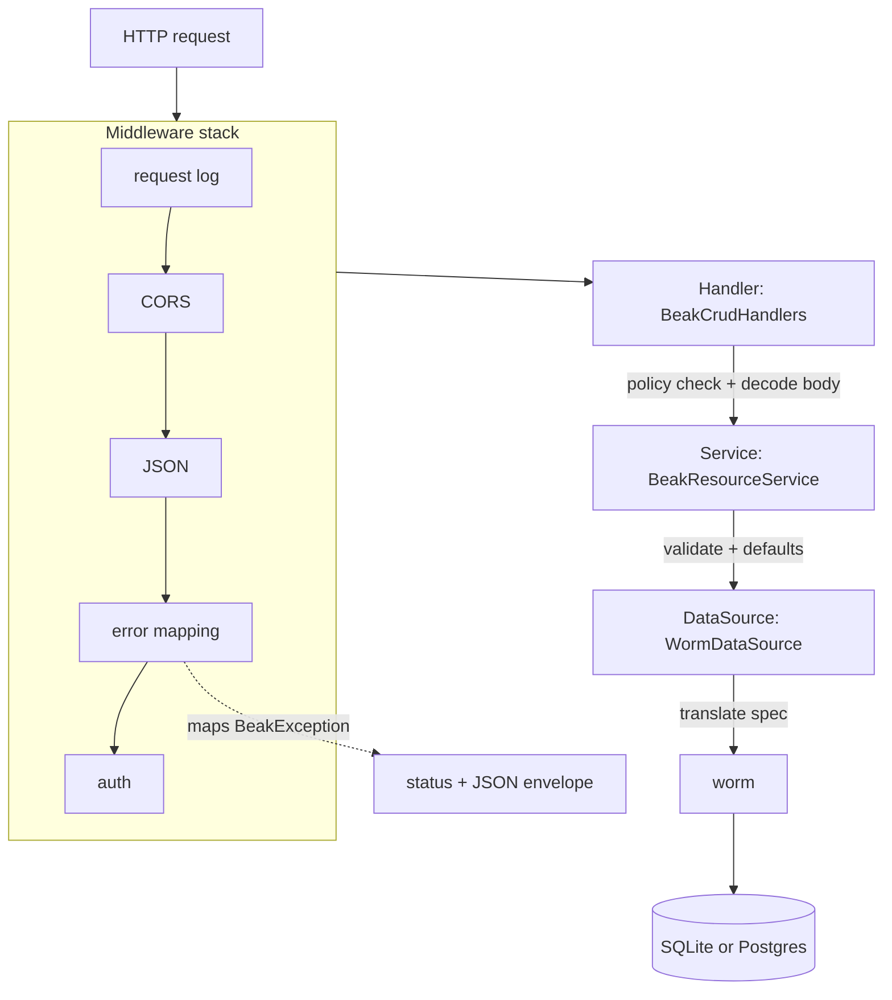

# Backend flow

> Follow a request through Handler, Service and DataSource and the single error catch boundary.

After this page you will be able to trace a request from the socket to the database and back, name which layer owns which job, and know exactly where an exception becomes an HTTP status code. This is the server side of Beak's [four layers](../concepts/the-four-layers.md).

The backend flow is `Handler (Shelf) -> Service -> DataSource`, wrapped in a middleware stack whose outermost concern is turning typed exceptions into JSON. No endpoint in the whole surface is hand-written: declaring a resource generates its routes.

## The path of a request



Each layer has one job and refuses the others.

## Where the server comes from

Before the first request there is a host. `bin/serve.dart` asks for it and binds it:

```dart title="examples/quickstart/bin/serve.dart"
/// Serves the API.
Future<void> main() async {
  final HttpServer server = await beakHost().serve();
  stderr.writeln('listening on http://${server.address.host}:${server.port}');
}
```

`beakHost()` lives in `lib/beak/server.g.dart`, where `beak prepare` wrote what it found on disk: the registry, the migrations under `lib/migrations/`, the seeders under `lib/seeders/`, and the `lib/server.dart` override if the project has one.

```dart title="examples/quickstart/lib/beak/server.g.dart"
BeakServeHost beakHost({Map<String, String>? environment}) => BeakServeHost(
  environment: environment,
  registry: buildBeakRegistry(),
  migrations: const [
    BeakCommitReceiptsMigration(),
    BeakOutboxMigration(),
    CreateNotesTable(),
  ],
  seeders: const [],
);
```

`BeakServeHost` owns the lifecycle: resolve the environment into a `BeakBackendConfig`, open the adapter the `DATABASE_URL` scheme names (SQLite for `sqlite:`, Postgres otherwise), resolve the upload driver, build the server, bind the port. The same host backs the migration CLI through `runCli`, so the schema and the API can never come from different registries. `serve()` and `runCli()` are the two ways in.

A project that needs more than the defaults writes `lib/server.dart`, and the generated host passes it through as `configure`. It receives everything Beak already resolved and returns the server to serve, which is where the canonical shop installs transactional business rules. Authentication and row/field policies can be configured through the same override. Everything below this point happens inside the handler that host built.

## The middleware stack

`BeakServer` composes the whole pipeline as a single Shelf `Handler`, outermost first.

```dart
Handler get handler => const Pipeline()
    .addMiddleware(beakRequestLogMiddleware(onRequest: _onRequest))
    .addMiddleware(beakCorsMiddleware())
    .addMiddleware(beakJsonMiddleware())
    .addMiddleware(
      beakErrorMappingMiddleware(onUnexpectedError: _onUnexpectedError),
    )
    .addMiddleware(beakAuthMiddleware(guard: _authGuard))
    .addHandler(_router);
```

The order matters. The request log wraps everything so every request is recorded whatever happens inside. CORS and JSON prepare the request. The error-mapping middleware sits just outside auth and the router, so any exception thrown by authorization, handlers, services, or the data source is caught in one place.

## The error-mapping middleware: the single catch boundary

This is the one place the backend turns a thrown value into a response. Everything below it throws; nothing below it formats an error.

```dart title="packages/beak_backend/lib/src/server/middleware/error_mapping_middleware.dart"
(Handler inner) => (Request request) async {
  try {
    return await inner(request);
  } on BeakException catch (exception) {
    return _exceptionResponse(exception, request);
  } catch (error, stackTrace) {
    onUnexpectedError?.call(error, stackTrace);
    return _jsonResponse(500, {
      'code': 'internal',
      'message': 'Internal server error.',
      ..._requestIdEntry(request),
    });
  }
};
```

A recognized `BeakException` maps to its status code; anything else becomes an opaque `500` whose body reveals nothing internal. The mapping is a single exhaustive switch over the sealed family:

```dart title="packages/beak_backend/lib/src/server/middleware/error_mapping_middleware.dart"
final int statusCode = switch (exception) {
  BeakValidationException() => 422,
  BeakNotFoundException() => 404,
  BeakAuthenticationException() => 401,
  BeakAuthorizationException() => 403,
  BeakConflictException() => 409,
  BeakConfigurationException() => 500,
  BeakStorageException() => 500,
};
```

The response body is a small envelope: `{code, message, fieldErrors?, requestId?}`. Validation failures carry their per-column `fieldErrors`, which is exactly what a form needs to light up the offending inputs. See [Exceptions](../reference/exceptions.md) for the full family and [Results and errors](../concepts/results-and-errors.md) for how the client consumes this envelope.

| Exception | Status | Meaning |
| --- | --- | --- |
| `BeakValidationException` | 422 | a rule failed, or the body was malformed |
| `BeakNotFoundException` | 404 | no such record, table, or relation |
| `BeakAuthenticationException` | 401 | not signed in |
| `BeakAuthorizationException` | 403 | signed in, not permitted |
| `BeakConflictException` | 409 | a uniqueness or state conflict |
| `BeakConfigurationException` / `BeakStorageException` | 500 | a server-side misconfiguration |
| anything else | 500 | opaque, reported to `onUnexpectedError` |

## The Handler: parse, authorize, route

`BeakCrudHandlers` are thin. Each handler consults the policy, decodes the request into typed `beak_core` values, calls the service, and encodes the result. No business logic lives here, and malformed input is a user error, never a `500`.

```dart title="packages/beak_backend/lib/src/endpoints/crud_handlers.dart"
Future<Response> create(Request request) async {
  _require(
    request,
    policy.canCreate(beakPrincipal(request), service.model),
    'create',
  );
  final record = await _readRecord(request);
  _fields(request).requireWrite(service.model, record.values.keys);
  await _requireForeignReferences(request, record);
  final created = await service.create(
    record,
    validationQuery: (spec) =>
        service.dataSource.query(_authorizer(request).authorizeQuery(spec)),
  );
  return _json(201, _recordJson(request, created));
}
```

Notice `_readRecord`: it parses a flat `{column: value}` body into a typed `BeakRecord`, and when a value is malformed it re-throws as a `BeakValidationException` so the client sees a `422`, not a `500`.

```dart title="packages/beak_backend/lib/src/endpoints/crud_handlers.dart"
try {
  return BeakRecord(
    values: {
      for (final MapEntry(:key, :value) in body.entries)
        key: BeakValue.fromJson(value),
    },
  );
} on BeakConfigurationException catch (exception) {
  throw BeakValidationException(
    'Malformed record body: ${exception.message}',
  );
}
```

## The Service: logic and typed exceptions

`BeakResourceService` is where the rules live. On create it mints a uuid for string-keyed models, stamps `created_at` and `updated_at` when the model declares them, and runs validation before anything touches the data source.

Server revision timestamps use UTC milliseconds so Dart and JavaScript clients
retain the same value. Updates advance by at least one millisecond even when the
clock has not advanced. Graph commits accept a browser's truncated view of a
legacy microsecond timestamp, then compare the exact stored timestamp in the SQL
update predicate. An older revision remains a conflict; rounding never replaces
the database's conditional write.

```dart title="packages/beak_backend/lib/src/service/beak_resource_service.dart"
  Future<BeakRecord> create(
    BeakRecord input, {
    BeakValidationQuery? validationQuery,
  }) async {
    final prepared = prepareCreate(input);
    await validateCandidate(prepared, validationQuery: validationQuery);
    return dataSource.create(model.table, prepared);
  }
```

It also guards that a posted spec targets its own model, so a query aimed at the wrong table is a `422` rather than a leak across resources:

```dart title="packages/beak_backend/lib/src/service/beak_resource_service.dart"
void _requireSpecTargets(String table, String specKind) {
  if (table != model.table) {
    throw BeakValidationException(
      '$specKind spec targets "$table" but this endpoint serves '
      '"${model.table}".',
    );
  }
}
```

Validation itself is a stateless boundary, `ValidationService`, that runs each column's declared `BeakRule` list, rejects unknown keys, enforces `BeakRequired` on create, and aggregates every violation under its column key into the `fieldErrors` map the middleware later serializes. The service never imports a Shelf type, and it never formats an error response; it throws.

## The DataSource: raw I/O, exceptions propagate

`WormDataSource` implements the `BeakDataSource` interface over the worm ORM. It does raw reads and writes and lets exceptions propagate up to the catch boundary. The one translation step here is `WormQueryTranslator`, which turns a `BeakQuerySpec` into a worm predicate tree. This is the only layer that knows worm exists, and worm types never travel above it. The full contract lives in [The data source seam](data-source-seam.md).

The adapter under it is injected, and the URL scheme picks it: a project with no `DATABASE_URL` runs on the SQLite file `sqlite:beak.db`, a `postgres://` URL runs on Postgres, and a test hands the host `sqlite::memory:`. Nothing above the data source can tell which.

## The whole surface is generated

There are no per-model endpoint files. `beakApiRouter` walks the `BeakModelRegistry` and mounts one resource router per model under `/api/{table}`, each backed by its own service.

```dart title="packages/beak_backend/lib/src/endpoints/beak_resource_router.dart"
Router beakResourceRouter(
  BeakResourceService service, {
  BeakPolicy policy = const BeakAllowAllPolicy(),
  BeakModelRegistry? registry,
  bool graphOnly = false,
}) {
  final handlers = BeakCrudHandlers(
    service,
    policy: policy,
    registry: registry,
  );
  Response requireGraph(Request request) => throw const BeakValidationException(
    'This resource must be saved through a graph commit.',
  );
  Response requireGraphId(Request request, String id) => requireGraph(request);
  Response requireGraphRelation(
    Request request,
    String id,
    String relationKey,
  ) => requireGraph(request);
  return Router()
    ..get('/capabilities', handlers.capabilities)
    ..post('/query', handlers.query)
    ..post('/validate', handlers.validateRecord)
    ..post('/aggregate', handlers.aggregate)
    ..post('/summary', handlers.summary)
    ..post('/batch', handlers.batch)
    ..post('/', graphOnly ? requireGraph : handlers.create)
    ..get('/<id>', handlers.getOne)
    ..patch('/<id>', graphOnly ? requireGraphId : handlers.update)
    ..delete('/<id>', graphOnly ? requireGraphId : handlers.delete)
    ..post('/<id>/restore', graphOnly ? requireGraphId : handlers.restore)
    ..post(
      '/<id>/relations/<relationKey>/attach',
      graphOnly ? requireGraphRelation : handlers.attach,
    )
    ..post(
      '/<id>/relations/<relationKey>/detach',
      graphOnly ? requireGraphRelation : handlers.detach,
    );
}
```

On top of these, `beakApiRouter` adds the global search endpoint (`GET /api/search`), the auth surface (mounted at `/api/auth` when auth is configured), CSV export routes, and per-column upload routes when storage is wired. Declaring a resource is all it takes to get its whole REST surface. See [The generated API](../reference/rest-api.md) for the endpoint list and payloads.

Two routes sit deliberately outside `/api`, mounted before everything else so the auth middleware cannot guard them:

- `GET /healthz` returns 200 as long as the process is serving, and never touches the database. A database outage must not trigger a restart loop.
- `GET /readyz` runs a `count` through the data source and returns 200 or a 503 carrying the real error. A database blip should move traffic away, not kill the process.

When the local-disk upload driver is in use, its file-serving route is mounted the same way, so an upload's URL resolves without a CDN or a proxy in front.

## Continue reading

- [Frontend flow](frontend-flow.md) the mirror image on the client, where the repository plays the role the middleware plays here.
- [The data source seam](data-source-seam.md) the `BeakDataSource` contract the service writes through.
- [The generated API](../reference/rest-api.md) the routes this flow produces, with request and response shapes.
- [Running the server](../backend/running-the-server.md) `BeakServeHost` from a project's point of view, including the `lib/server.dart` override.
