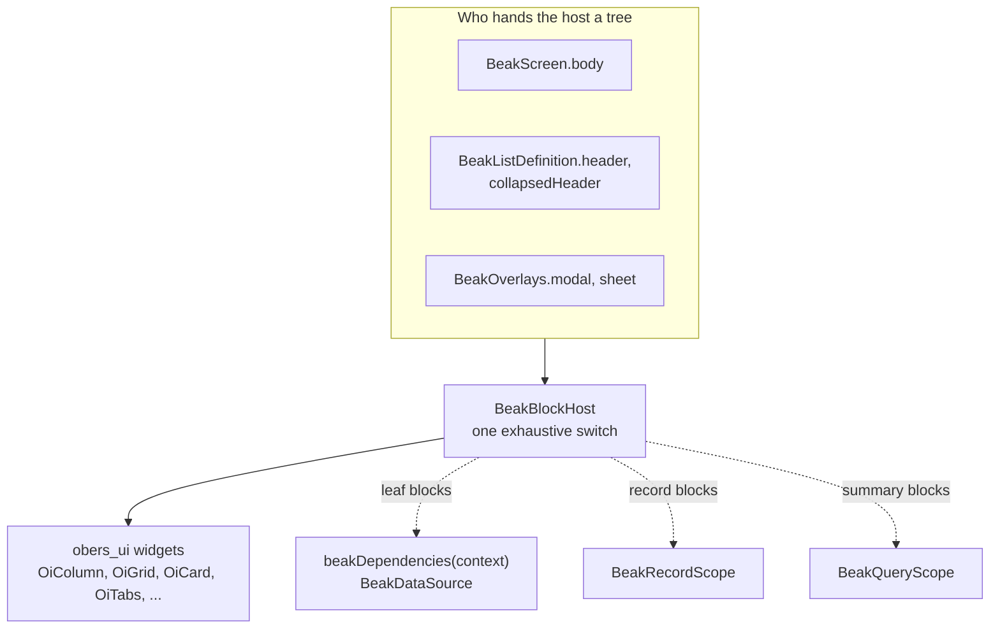

# Block system internals

> How one sealed block union and one host render custom screens, list headers and overlays, and how record blocks find their data.

A custom screen, the header of a composed list and the body of a dialog are all the same thing: a tree of `BeakBlock` values that one widget, `BeakBlockHost`, turns into obers_ui widgets. After this page you can explain how the host dispatches a block, how a grid child claims its span, and where a block that shows data gets that data from.

Forms are the exception. A read, create or edit form is not a block tree. It is a second, typed layout tree, and the last section explains why the two stay apart.

## The idea in one picture



Blocks are data. The host is the only code that decides how one looks, which is what makes the no-Material rule checkable: there is one mapping to keep obers-only.

## How it works

### One sealed union

`BeakBlock` is a sealed base class with one shared field, an optional `span`. Every concrete block extends it from a `part` file of the same library, because a sealed class has to live in one library. There are 47 of them, from layout (`BeakColumnBlock`, `BeakGridBlock`, `BeakTabsBlock`) through content and data (`BeakTextBlock`, `BeakTableBlock`, `BeakMetricBlock`, `BeakSummaryBlock`, charts, a kanban board, a calendar) to the record blocks.

```dart title="packages/beak_frontend/lib/src/blocks/beak_block.dart"
sealed class BeakBlock {
  /// Creates a block, optionally sized by [span] inside grid parents.
  const BeakBlock({this.span});

  /// Grid tracks occupied inside a [BeakGridBlock]. An expanded [BeakRowBlock]
  /// uses its columns as relative width weights instead; ignored elsewhere.
  final BeakSpan? span;
}
```

A block is `const` configuration. It carries no widget code and no callbacks, except where the interaction is the feature (a table's row tap, a kanban card move, a calendar event tap) or where it is the documented escape hatch, `BeakWidgetBlock`. A block describes what to show and a widget shows it.

### One exhaustive renderer

`BeakBlockHost` is a widget whose `build` is one `switch` over the union. Because the base class is sealed, a switch that misses a case does not compile, so a new block type is a compile error until the host renders it.

```dart title="packages/beak_frontend/lib/src/blocks/beak_block_host.dart"
  Widget build(BuildContext context) => switch (block) {
    final BeakColumnBlock column => _column(context, column),
    final BeakRowBlock row => _row(context, row),
    final BeakGridBlock grid => _grid(context, grid),
    final BeakCardBlock card => _card(card),
    final BeakSectionBlock section => _section(context, section),
    final BeakTabsBlock tabs => _BeakTabsHost(block: tabs),
    // ...
    final BeakTextBlock text => _text(text),
    final BeakImageBlock image => _image(image),
    final BeakMarkdownBlock markdown => OiMarkdown(data: markdown.source),
    final BeakDividerBlock divider => _divider(divider),
    final BeakSpacerBlock spacer => SizedBox(height: spacer.heightInPixels),
    final BeakWidgetBlock widget => Builder(builder: widget.builder),
  };
```

Every arm maps a block onto an obers_ui widget. Small blocks map inline (`OiCard`, `OiBanner`, `OiBadge`, `OiProgress`). Blocks that fetch, hold state or draw charts get a private view class in a `part` file under `blocks/views/`.

Composition is recursion. A layout block holds child blocks, and the host renders each child by building another `BeakBlockHost`:

```dart title="packages/beak_frontend/lib/src/blocks/beak_block_host.dart"
Widget _column(BuildContext context, BeakColumnBlock block) => OiColumn(
  breakpoint: context.breakpoint,
  gap: OiResponsive<double>(block.gapInPixels),
  crossAxisAlignment: CrossAxisAlignment.stretch,
  children: [for (final child in block.children) BeakBlockHost(block: child)],
);
```

Recursion stops at leaf blocks (text, image, divider). A whole screen is one root block that the host walks top down.

### Grids and spans

`span` sits on the base class because it means something to the parent, and the parent can be any of three. A `BeakGridBlock` reads it as the number of column and row tracks the child covers. An expanded `BeakRowBlock` reads its `columns` as a relative width weight. Anywhere else it is ignored, so a card can declare `span: BeakSpan(columns: 6)` and be laid out correctly whether or not it currently sits in a grid.

The grid wraps each child in `_spanned`:

```dart title="packages/beak_frontend/lib/src/blocks/beak_block_host.dart"
/// Wraps a grid child in its [BeakBlock.span] placement, when declared.
Widget _spanned(BeakBlock child) {
  final host = BeakBlockHost(block: child);
  final span = child.span;
  if (span == null) {
    return host;
  }
  return OiSpan(
    data: OiSpanData(
      columnSpan: OiResponsive<int>(span.columns),
      rowSpan: OiResponsive<int>(span.rows),
    ),
    child: host,
  );
}
```

A fixed grid also protects itself against narrow containers. If any child, at its declared span, would come out narrower than `minChildWidthInPixels` (240 by default), the whole grid becomes one column and the spans clamp to it. Setting the minimum to zero turns that off. An auto-fitting grid uses `minColumnWidthInPixels` instead and ignores this setting.

```dart title="packages/beak_frontend/lib/src/blocks/beak_block_host.dart"
final trackWidth =
    (constraints.maxWidth - block.gapInPixels * (columns - 1)) /
    columns;
final stack =
    constraints.hasBoundedWidth &&
    block.children.any((child) {
      final span = (child.span?.columns ?? 1).clamp(1, columns);
      final width = trackWidth * span + block.gapInPixels * (span - 1);
      return width < block.minChildWidthInPixels;
    });
return grid(stack ? 1 : columns);
```

### Where a block gets its data

A block has three ways to know something. Which one it uses is fixed by its type.

#### Its own configuration

Text, images, badges, alerts and layout blocks need nothing else.

#### The nearest record

`BeakFieldBlock`, `BeakFieldGroupBlock` and `BeakRelationBlock` show a value of one record and hold no query of their own. They read the record from the nearest `BeakRecordScope`. The value is drawn by `renderBeakCell`, the same renderer as a table cell, so a badge or a date looks the same in both places.

```dart title="packages/beak_frontend/lib/src/blocks/beak_block_host.dart"
/// Renders one read-only field from the surrounding record scope.
Widget _field(BuildContext context, BeakFieldBlock block) {
  final scope = BeakRecordScope.of(context);
  if (scope == null) {
    return const SizedBox.shrink();
  }
  final String label = block.label ?? block.column.label;
  final Widget value = renderBeakCell(
    context,
    column: block.column,
    record: scope.record,
    renderContext: BeakContext.detail,
  );
  return switch (block.layout) {
    BeakFieldLayout.stacked => OiColumn(
      breakpoint: context.breakpoint,
      gap: const OiResponsive<double>(4),
      crossAxisAlignment: CrossAxisAlignment.start,
      children: [OiLabel.caption(label), value],
    ),
    BeakFieldLayout.inline => OiRow(
      breakpoint: context.breakpoint,
      gap: const OiResponsive<double>(12),
      crossAxisAlignment: CrossAxisAlignment.start,
      children: [
        SizedBox(width: 160, child: OiLabel.smallStrong(label)),
        Expanded(child: value),
      ],
    ),
  };
}
```

Outside a scope these blocks render nothing and do not throw, so composing one in the wrong place degrades quietly. `BeakRelationBlock` takes the record's identity from the scope and the data source from the panel, and paints from the record's eager-loaded rows when the page loaded them.

Nothing in the framework provides that scope for you. A screen loads the record and provides it, so one block tree serves whichever record the route names:

```dart title="examples/showcase/lib/resources/keepers/keeper_sheet.dart"
final Widget body = switch (snapshot.data) {
  BeakOk<BeakRecord>(:final value) => BeakRecordScope(
    model: const KeeperModel(),
    record: value,
    child: BeakBlockHost(block: keeperSheetBlock()),
  ),
  BeakErr<BeakRecord>(:final error) => OiLabel.body(
    strings.errorMessage(error),
  ),
  null => OiProgress.linear(indeterminate: true, label: strings.loading),
};
```

```dart title="packages/beak_frontend/lib/src/detail/beak_record_scope.dart"
class BeakRecordScope extends InheritedWidget {
  /// Provides [record] (described by [model]) to [child]'s subtree.
  const BeakRecordScope({
    required this.model,
    required this.record,
    required super.child,
    super.key,
  });

  /// The model describing [record]'s columns and relations.
  final BeakModel model;

  /// The record on display.
  final BeakRecord record;

  /// The nearest record scope above [context], or `null` when there is none.
  static BeakRecordScope? of(BuildContext context) =>
      context.dependOnInheritedWidgetOfExactType<BeakRecordScope>();

  @override
  bool updateShouldNotify(BeakRecordScope oldWidget) =>
      oldWidget.record != record || oldWidget.model != model;
}
```

#### The panel's data source

Table, metric, chart, kanban, calendar and the other data blocks resolve `beakDependencies(context)<BeakDataSource>()` themselves and hold their loading and error state in hooks. The table refetches on its view model's change stream, and every other data block refetches when `useBeakDataRevision` reports a write to a table it reads. The board, calendar, chat, inbox, pricing, FAQ and file manager blocks share one hook, `_useModuleRows`, which also reports how many rows the query matched so the block can say it shows only the first page. The chart, map, gallery, carousel, timeline and video blocks share `_useBlockRead`, which maps each answer once. Both keep the last good data when a read fails and hand the failure to `_withFailure`, which draws the generic error line and Retry above the block. This is the metric block's state:

```dart title="packages/beak_frontend/lib/src/blocks/views/beak_metric_block_view.dart"
final dataSource = beakDependencies(context)<BeakDataSource>();
final loaded = useState<({num value, num? previous})?>(null);
final loading = useState(true);
final error = useState<BeakException?>(null);
final attempt = useState(0);
final revision = useBeakDataRevision(
  dataSource,
  table: block.aggregate.table,
);
```

Inside a composed list, `BeakSummaryBlock` can read the surrounding `BeakQueryScope`. Its `scope` (`BeakSummaryScope`) picks the active query (`active`, the default, so totals follow the filters the reader applies), the list's base query (`base`), or the block's own summary spec (`standalone`). Outside a composed list it runs its own spec too.

### Where interaction state lives

A block is stateless data, so state belongs to the host. A tab block is the clearest case. The host renders it through a small private `HookWidget` that owns the selected-tab hook, and `BeakTabsBlock` stays a `const` description.

```dart title="packages/beak_frontend/lib/src/blocks/beak_block_host.dart"
/// Owns the selected-tab state of a [BeakTabsBlock].
class _BeakTabsHost extends HookWidget {
  const _BeakTabsHost({required this.block});

  final BeakTabsBlock block;

  @override
  Widget build(BuildContext context) {
    final selected = useState(block.initialIndex);
    if (block.tabs.isEmpty) {
      return const SizedBox.shrink();
    }
    // A start index (or a tab list that shrank) past the end selects the last
    // tab instead of throwing.
    final index = selected.value.clamp(0, block.tabs.length - 1);
    final active = block.tabs[index];
    return OiTabs(
      tabs: [
        for (final tab in block.tabs)
          OiTabItem(label: tab.label, icon: tab.icon),
      ],
      selectedIndex: index,
      onSelected: (next) => selected.value = next,
      content: BeakBlockHost(block: active.content),
    );
  }
}
```

`StatefulWidget` never appears. Data-bound blocks follow the same pattern in their view classes.

### The escape hatch

`BeakWidgetBlock` embeds any widget where no block fits, mirroring `BeakCustomColumn` on the column side. It is the one block whose callback is not an interaction.

```dart title="packages/beak_frontend/lib/src/blocks/beak_widget_block.dart"
final class BeakWidgetBlock extends BeakBlock {
  /// Creates a block that renders whatever [builder] returns.
  const BeakWidgetBlock(this.builder, {super.span});

  /// Builds the embedded subtree.
  final WidgetBuilder builder;
}

```

The builder runs under the panel's scopes, so it can call `beakDependencies(context)` and read a `BeakRecordScope`. What it gives up is everything the union guarantees: nothing checks it, it cannot be inspected, and it does not appear in a block tree that a test walks.

### Forms are a different tree

A form has needs a block does not: a shared draft, live validation, visibility that depends on other fields, save and review. It is therefore a separate typed tree of `BeakFormNode`s (`BeakSection`, `BeakColumns`, `BeakTabs`, `BeakWizardStep`, `BeakInput`, relation editors, calculated values, `BeakFormWidget` and more), rendered by the configured form.

One layout serves the read, create and edit roles of a `BeakFormScreen`, and the renderer picks values or inputs from the current mode. `BeakFormSections` projects the same sections three ways, which is why a form can become tabs or a wizard without restating a field:

```dart title="packages/beak_frontend/lib/src/form/beak_form_layout.dart"
final class BeakFormSections {
  /// Creates a reusable presentation from ordinary typed layout nodes.
  const BeakFormSections({required this.sections});

  /// Ordered, titled sections shared by every projection.
  final List<BeakSection> sections;

  /// A stacked form suitable for compact screens and review views.
  BeakFormLayout get form => BeakFormLayout(children: sections);

  /// A tabbed presentation over the same field declarations.
  BeakTabs get tabs => BeakTabs(
    tabs: [
      for (final section in sections)
        BeakTab(
          title: section.title,
          visibleIf: section.visibleIf,
          enabledIf: section.enabledIf,
          children: [
            BeakSection(
              title: section.title,
              description: section.description,
              titleStyle: section.titleStyle,
              titleColor: section.titleColor,
              descriptionStyle: section.descriptionStyle,
              trailing: section.trailing,
              headingGapInPixels: section.headingGapInPixels,
              gapInPixels: section.gapInPixels,
              divider: section.divider,
              dividerAfterSpacingInPixels: section.dividerAfterSpacingInPixels,
              children: section.children,
            ),
          ],
        ),
    ],
  );

  /// Wizard steps sharing the same fields, rules, and editability conditions.
  List<BeakWizardStep> get steps => [
    for (final section in sections)
      BeakWizardStep(
        title: section.title,
        description: section.description,
        visibleIf: section.visibleIf,
        enabledIf: section.enabledIf,
        children: section.children,
      ),
  ];
}
```

Conditions stay attached to the section when the presentation changes. A custom widget inside a form (`BeakFormWidget`) receives the draft, and any widget below it can read the draft and its read-only and enabled state from `BeakDraftScope.of(context)`. Changes made through that draft take part in validation, review and the graph save. The two trees share the column formatting contract, so a value looks the same in a form, a table and a record block.

## Why it is shaped this way

- Exhaustiveness over registration. A sealed union and a `switch` mean the compiler guarantees that every block renders. There is no "unknown block" branch to forget.
- `const` configuration. A page layout is a literal you define once and reuse. Rendering, state and dependency lookup live in the host.
- Scopes over parameters. A record block that took its record as an argument could not be written once and reused across routes. An inherited scope is what lets `keeperSheetBlock()` be a plain function.
- Two trees, one formatting contract. Merging forms into blocks would put draft state and validation into a union that is otherwise pure data. Keeping them apart costs one shared renderer for values, and that is a fair price.

## What it means for you

- Prefer a typed block. Reach for `BeakWidgetBlock` only when none fits, and expect to test that part by hand.
- A record block needs a `BeakRecordScope` above it. If a field block renders nothing, the scope is missing.
- A data block needs no wiring. Every data block refetches on its own when a table it reads changes.
- Do not put state in a block. Put it in a `HookWidget` that builds blocks.
- Adding a block type touches three places: the block class, the `part` line in `beak_block.dart`, and the arm in `BeakBlockHost`. The compiler tells you about the last one.

## Continue reading

- [The block system](../concepts/the-block-system.md) the same idea at concept level, with the consumers.
- [Blocks overview](../blocks/index.md) the catalog of block types.
- [Record blocks](../blocks/record-blocks.md) the field, group and relation blocks in use.
- [Form screens](../forms/form-screens.md) the typed layout tree that renders read, create and edit.
- [Custom blocks and widgets](../extending/custom-blocks-and-widgets.md) dropping to a raw widget when a block will not do.
