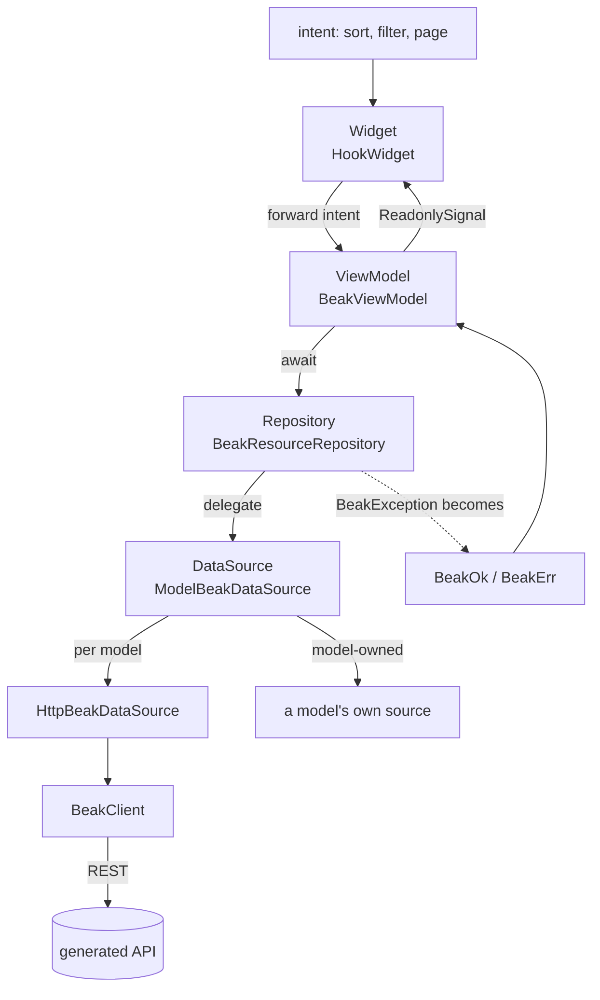

# Frontend flow

> Follow the Widget, ViewModel, Repository and DataSource path, and see where state lives and where failures become values.

The panel has four layers, `Widget -> ViewModel -> Repository -> DataSource`. State lives in Signals, failures are caught once and turned into values, and the whole thing hangs off a dependency container that belongs to one panel. After this page you can follow a tap from a widget to the network and back, and say which layer holds the state and which one holds the `try/catch`.

## The idea in one picture



State flows up as `ReadonlySignal`s and intent flows down as method calls. The repository is where an exception turns into a value.

## How it works

### Wiring above the widgets

`BeakPanel` is the root widget. On its first build it creates a `GetIt.asNewInstance()` container of its own, registers Beak's dependencies into it, and builds the go_router. All three are memoized on the configuration and the two transport seams (`dataSource:` and `httpClient:`), which a test replaces with fakes and a host with its own transport, such as the Serverpod admin, sets in production.

```dart title="packages/beak_frontend/lib/src/panel/beak_panel.dart"
final routing = useMemoized(() {
  final container = GetIt.asNewInstance();
  registerBeakDependencies(
    locator: container,
    config: config,
    dataSource: dataSource,
    httpClient: httpClient,
  );
  final authRefresh = config.auth == null
      ? null
      : BeakAuthRouterRefresh(
          config.auth?.adapter ?? container<BeakSessionStore>(),
        );
  return (
    container: container,
    router: createBeakRouter(config, authRefresh: authRefresh),
    authRefresh: authRefresh,
  );
  // The seams are part of the key: swapping a fake on rebuild used to
  // keep the previous one registered, so a test could not change source
  // mid-flight and never learned it had not.
}, [config, dataSource, httpClient]);
```

The container is exposed through an `InheritedWidget`. Two panels in one app do not share credentials, caches or data sources, and a custom widget reads its own panel's container with `beakDependencies(context)`:

```dart title="packages/beak_frontend/lib/src/di/beak_locator.dart"
/// The nearest panel's dependencies, falling back to the explicit host setup.
GetIt beakDependencies(BuildContext context) =>
    context
        .dependOnInheritedWidgetOfExactType<BeakDependencyScope>()
        ?.container ??
    beakLocator;

/// Keeps transports, references and authentication local to one panel tree.
class BeakDependencyScope extends InheritedWidget {
  /// Exposes [container] to the widgets below this scope.
  const BeakDependencyScope({
    required this.container,
    required super.child,
    super.key,
  });

  /// The dependency container owned by this panel.
  final GetIt container;

  @override
  bool updateShouldNotify(BeakDependencyScope oldWidget) =>
      container != oldWidget.container;
}
```

`beakLocator`, a package-level container, is the fallback for hosts that call `registerBeakDependencies` themselves and drive the router without a `BeakPanel`.

Registration is synchronous, because the router built right after it reads the container on its first frame. It runs in two halves. The first builds the REST client and the session store. They are created in that order for a reason: the client reads the store's token on every request, and the store mints one through the client when you sign in. Two halves of one session.

```dart title="packages/beak_frontend/lib/src/di/beak_locator.dart"
late final BeakSessionStore sessions;
final client = BeakClient(
  baseUrl: config.apiBaseUrl,
  httpClient: httpClient,
  tokenProvider: tokenProvider ?? () => sessions.token,
);
sessions = BeakSessionStore(client);
authority = sessions;
fallback = dataSource ?? HttpBeakDataSource(client);
container
  ..registerSingleton<BeakClient>(client)
  ..registerSingleton<BeakSessionStore>(sessions);
```

The second half registers what the widgets resolve:

```dart title="packages/beak_frontend/lib/src/di/beak_locator.dart"
final source = ModelBeakDataSource(
  registry: registry,
  fallback: fallback,
  overrideBindings: dataSource != null,
  mapException: config.mapException,
  onUnauthorized: authority == null ? null : _endSessionOf(authority),
  refreshPolicy: config.refreshPolicy,
);
container
  ..registerSingleton<BeakModelActionRunner>(
    BeakModelActionRunner(),
    dispose: (runner) => runner.dispose(),
  )
  ..registerSingleton<BeakPanelConfig>(config)
  ..registerSingleton<BeakModelRegistry>(registry)
  ..registerSingleton<BeakDataSource>(
    source,
    dispose: (_) => source.dispose(),
  )
  ..registerSingleton<BeakThemeController>(
    BeakThemeController(config.initialThemeMode),
  );
```

Note what `BeakDataSource` is here. It is not the HTTP source. It is `ModelBeakDataSource`, which wraps the HTTP source as a fallback. With an external authentication adapter (`BeakAuthConfig.adapter`, or `externalAuthentication: true`) no `BeakClient` and no session store are registered, and registration throws a `BeakConfigurationException` unless every model is bound to a source of its own or a `dataSource:` is supplied.

The API origin is a compile-time value. The panel is a Flutter web app with no environment to read at runtime, so `beak.yaml`'s `api.baseUrl` becomes a `String.fromEnvironment` default in `panel.g.dart`, overridable with `--dart-define=BEAK_API_BASE_URL=...`. Setting `baseUrl: auto` makes the generated expression resolve to the origin the panel was served from.

```dart title="examples/quickstart/lib/beak/panel.g.dart"
    apiBaseUrl: const String.fromEnvironment(
      'BEAK_API_BASE_URL',
      defaultValue: 'http://localhost:8080',
    ),
```

### The Widget: render Signals, forward intent

Panel widgets are `HookWidget`s. `StatefulWidget` is forbidden in Beak code. A widget owns its view model through hooks, refreshes it once and disposes it with the widget, and rebuilds through `Watch` when a signal changes.

```dart title="packages/beak_frontend/lib/src/table/beak_data_table.dart"
useEffect(() {
  onViewModel?.call(viewModel);
  viewModel.refresh();
  return viewModel.dispose;
}, [viewModel]);
```

```dart title="packages/beak_frontend/lib/src/table/beak_data_table.dart"
return Watch.builder(
  builder: (context) {
    final page = viewModel.page.value;
    final rows = page?.items ?? const <BeakRecord>[];
    final int total = page?.total ?? 0;
```

`BeakDataTable` is the generated list view. It renders a model's table columns as an `OiTable` with server-side sort, filter and pagination, per-row and bulk actions and optimistic delete with undo. Cells are read only. Every sort, filter or page change goes to its view model as a method call. There is no business logic in the widget and no `try/catch` around a data call.

### The ViewModel: owns Signals, never catches

Every view model extends `BeakViewModel`. It creates state with `ownedSignal`, which is released with the view model, and exposes it upward as `ReadonlySignal`, so widgets read and never write.

```dart title="packages/beak_frontend/lib/src/state/beak_view_model.dart"
abstract base class BeakViewModel {
  final List<void Function()> _cleanups = [];
  bool _isDisposed = false;

  /// Whether [dispose] has run.
  bool get isDisposed => _isDisposed;

  /// Creates a signal owned by this view model, disposed with it.
  ///
  /// Expose it upward as a [ReadonlySignal] field so widgets can read and
  /// watch — but never write — the state.
  @protected
  Signal<T> ownedSignal<T>(T value) {
    final owned = signal<T>(value);
    _cleanups.add(owned.dispose);
    return owned;
  }

  /// Releases every owned signal; further use is a programming error.
  @mustCallSuper
  void dispose() {
    for (final cleanup in _cleanups) {
      cleanup();
    }
    _cleanups.clear();
    _isDisposed = true;
  }
}
```

There are three concrete ones: `BeakTableViewModel` for a list, `BeakQueryController` for a list definition shared by several views, and `BeakAuthViewModel` for the sign-in flow. `BeakTableViewModel` owns the query spec, the current page, a loading flag and the last error. A sort, filter, search or page intent rewrites the spec and refetches. Repeating an unchanged intent sends no request, and an explicit `refresh()` always does. It also listens to the source's change stream, so a confirmed write to its table (or to a table that references it) refetches it without any wiring.

```dart title="packages/beak_frontend/lib/src/table/beak_table_view_model.dart"
Future<void> refresh() async {
  if (isDisposed) return;
  final int requestId = ++_latestRequestId;
  _loading.value = true;
  _error.value = null;
  final result = await _repository.query(_spec.value);
  if (isDisposed || requestId != _latestRequestId) {
    return;
  }
  switch (result) {
    case BeakOk(:final value):
      final int lastPage = math.max(
        1,
        (value.total + value.perPage - 1) ~/ value.perPage,
      );
      if (value.items.isEmpty && lastPage < _spec.value.pagination.page) {
        // Rows were deleted from under this page (here or elsewhere), so the
        // page no longer exists: show the last one that does, not a blank.
        goToPage(lastPage);
        return;
      }
      _page.value = value;
    case BeakErr(:final error):
      _error.value = error;
  }
  _loading.value = false;
}
```

It switches on a `BeakResult` and never catches. The `requestId` guard makes the fetch latest-wins: a slow response that lost the race to a newer one, or that arrives after `dispose`, writes nothing.

### The Repository: the catch boundary

`BeakResourceRepository` wraps a `BeakDataSource`. Each method mirrors a source operation and returns `BeakResult<T>` instead of throwing. A thrown `BeakException` becomes a `BeakErr`. Any other error still propagates, because a bug should crash where you can see it and not hide inside a value.

```dart title="packages/beak_frontend/lib/src/data/beak_resource_repository.dart"
Future<BeakResult<BeakPage<BeakRecord>>> query(BeakQuerySpec spec) {
  final queries = _queries;
  if (queries == null) return beakRun(() => dataSource.query(spec));
  return queries.putIfAbsent(spec, () {
    late final Future<BeakResult<BeakPage<BeakRecord>>> request;
    request = (() async {
      try {
        return await beakRun(() => dataSource.query(spec));
      } finally {
        queries.removeWhere(
          (key, pending) => key == spec && identical(pending, request),
        );
      }
    })();
    return request;
  });
}
```

The default repository is uncached. `BeakResourceRepository.coalescing` shares identical pending queries within one owner and forgets them when they complete, and `invalidateQueries()` stops a new read from joining a request that started before a write. The mechanism is `beakRun`, which is also public, so a custom workflow gets the same boundary without a repository:

```dart title="packages/beak_frontend/lib/src/data/beak_run.dart"
Future<BeakResult<T>> beakRun<T>(
  Future<T> Function() operation, {
  BeakException? Function(Exception exception, StackTrace stack)? mapException,
}) async {
  try {
    return BeakOk(await operation());
  } on BeakException catch (exception) {
    return BeakErr(exception);
  } on Exception catch (exception, stack) {
    final mapped = mapException?.call(exception, stack);
    if (mapped != null) return BeakErr(mapped);
    rethrow;
  }
}
```

This mirrors the backend's error-mapping middleware. There, exceptions become status codes at one point. Here, they become `BeakResult` values at one point. See [Results and errors](../concepts/results-and-errors.md) for the type.

The rule holds for data operations. It does not mean nothing else in the package contains a `catch`. The form runtime catches when it persists a local draft (`beak_form_draft_runtime.dart`), the upload field catches a failing file picker, and the configured form catches a failing URI launch. Each is a local, non-data failure with its own message. A view model never catches, and no data call is caught outside a repository, `beakRun`, or the data source itself.

### The DataSource: routing, mapping, commits

`ModelBeakDataSource` is what a panel holds as its `BeakDataSource`. It captures one source per model when it is built: the model's own `dataSource` if it has one, else the HTTP fallback. An explicit `dataSource:` on the panel replaces every binding, which is how tests run.

```dart title="packages/beak_frontend/lib/src/data/http_beak_data_source.dart"
final class HttpBeakDataSource
    implements
        BeakDataSource,
        BeakCapabilityDataSource,
        BeakSummaryDataSource,
        BeakExportDataSource,
        BeakValidationDataSource,
        BeakManagedUploadClient,
        BeakUploadUrlClient,
        BeakCommitDataSource {
```

`HttpBeakDataSource` implements the same `BeakDataSource` the backend does and then the optional capability interfaces, each of which a transport may skip. It forwards to `BeakClient`, so no widget and no view model sees a URL, a header or a JSON map.

The dispatcher adds four things on top of the source it picks.

#### One error mapper

Every call runs through `_run`. Typed `BeakException`s pass, and a host exception goes through the panel's `mapException` when there is one. A `BeakAuthenticationException`, whether the server sent it or `mapException` produced it, also calls `onUnauthorized` before it is rethrown. The panel wires that to the session authority: the request that finds the session dead signs the user out, and the router lands on `/login`.

```dart title="packages/beak_frontend/lib/src/data/model_beak_data_source.dart"
Future<T> _run<T>(Future<T> Function() operation) async {
  try {
    return await operation();
  } on BeakException catch (error) {
    _reportUnauthorized(error);
    rethrow;
  } on Exception catch (error, stack) {
    final mapped =
        mapException?.call(error, stack) ?? _transportFailure(error);
    if (mapped != null) {
      _reportUnauthorized(mapped);
      Error.throwWithStackTrace(mapped, stack);
    }
    rethrow;
  }
}

/// A failure to talk to the server at all, as a typed exception.
///
/// Without it a dropped connection would leave every list spinning and reach
/// no error state. The message is generic on purpose: the host and port in
/// the original exception describe the deployment, not the person's request.
static BeakTransportException? _transportFailure(Exception error) =>
    switch (error) {
      http.ClientException() || TimeoutException() =>
        const BeakTransportException('The server could not be reached.'),
      _ => null,
    };

void _reportUnauthorized(BeakException error) {
  if (error is BeakAuthenticationException) onUnauthorized?.call();
}
```

#### A change stream

It implements `BeakMutationSource`. A confirmed write, or an optional `BeakRefreshPolicy` tick, emits a `BeakDataChange` with the affected tables and the tables that reference them. Tables and `useBeakDataRevision` listen.

#### Commit routing

A form save is a `BeakSavePlan`. If every table in the plan resolves to one source that is a `BeakCommitDataSource`, the plan goes there. Otherwise `BeakStagedCommitDataSource` replays it as ordinary create, update and delete calls in dependency order. That path is not atomic, its receipts live in memory for the session, and an error after dispatch is recorded as unknown and never retried.

```dart title="packages/beak_frontend/lib/src/data/model_beak_data_source.dart"
Future<BeakSaveResult> commit(BeakSavePlan plan) => _run(() async {
  final encoded = jsonEncode(plan.toJson());
  if (_commitPlans[plan.saveId] case final String previous
      when previous != encoded) {
    throw const BeakConflictException(
      'Save identity was reused with different content.',
    );
  }
  plan.orderedOperations(_registry);
  final sources = <BeakDataSource>{
    _source(plan.root.table),
    for (final operation in plan.operations) ...[
      _source(operation.target.table),
      for (final ref in operation.requiredReferences) _source(ref.table),
    ],
  };
  final BeakCommitDataSource selected;
  if (sources.singleOrNull case final BeakCommitDataSource source) {
    selected = source;
  } else {
    selected = _staged;
  }
  _commitPlans[plan.saveId] = encoded;
  _commitSources[plan.saveId] = selected;
  _savePlans[plan.saveId] = plan;
  _commitDepth++;
  try {
    final result = await runZoned(
      () => selected.commit(plan),
      zoneValues: {_commitZoneKey: true},
    );
    _committed(plan, result);
    return result;
  } finally {
    _commitDepth--;
    _changed(const []);
  }
});
```

The same save id with different content is a `BeakConflictException` before anything is sent.

#### Single-record writes through the same door

A non-forced delete, and a create or an update made outside a form (a dragged board card, a chat message), against a commit-capable source is sent as a one-operation plan, so behavior, rules and `graphOnly` models apply to it. A repeated identical call after an unknown outcome recovers the pending receipt instead of submitting a second write (and sends the plan again under the same save identity when the server has no receipt, because the request never arrived). Identical writes made while the first is still in flight are separate writes. A receipt that is not complete becomes the typed exception its error code names. A forced delete uses the transport's own operation.

[Graph commits](graph-commits.md) covers what the server does with a plan.

## Why it is shaped this way

- Signals, not callbacks. A widget subscribes to exactly the values it reads. The view model can be tested without a widget, and the widget without a network.
- Failures as values. A list that fails to load is data (`error` is a signal), not an exception thrown through a build method.
- One container per panel. Credentials and caches that belong to a panel stay with it. Tests replace the source without touching a global.
- A dispatcher, not a source. Putting routing, error mapping and the change stream in one class means a model-owned transport gets all three without implementing them. That is how the Serverpod bridge plugs in.

## What it means for you

- Read state through `Watch` on a `ReadonlySignal`. Do not copy a signal's value into widget state.
- Custom widgets resolve dependencies with `beakDependencies(context)`, not `GetIt.instance`.
- Call `beakRun` when a custom workflow needs the result boundary. Do not catch `BeakException` in a view model.
- In a widget test pass `dataSource:` to `BeakPanel` with an `InMemoryBeakDataSource`. It implements no commit interface, so form saves go through the staged path.
- The panel does not poll. Set a `refreshPolicy` if the data changes without the panel writing it.

## Continue reading

- [Backend flow](backend-flow.md) the server side, where the error-mapping middleware plays the role the repository plays here.
- [The data source seam](data-source-seam.md) the interface every layer above the transport speaks.
- [Block system internals](block-system-internals.md) how the widgets that render a page are chosen.
- [The panel](../panel/index.md) the widgets this flow drives, from tables to forms to dashboards.
