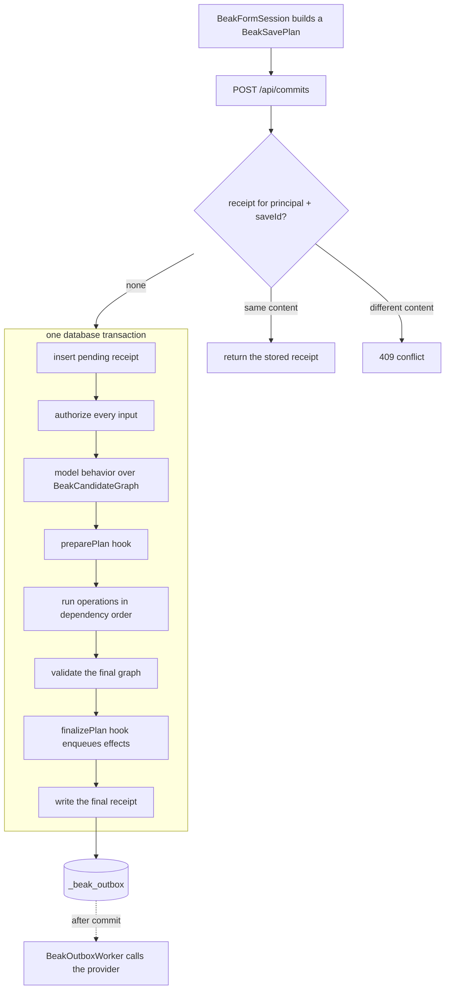

# Graph commits

> See how a graph save is planned, validated, committed in one transaction and receipted, and how its effects leave through the outbox.

After this page you can follow one form save from the plan the panel builds to the receipt the server stores, say what each guarantee costs, and pick the hook a business rule or an effect belongs in.

A form in Beak rarely edits one row. An order form edits the order, its items, maybe a new customer and a voucher link. Sent as separate REST calls, a failure on the fifth leaves four behind, and a lost response leaves you guessing which four. So the panel describes the whole change as one `BeakSavePlan`, posts it to `POST /api/commits`, and gets a receipt back. A delete from a table, an import row and a bulk edit use the same route. The per-record routes (`POST /api/{table}` and friends) stay for scripts and simple tables.

## The idea in one picture



One plan goes in, one receipt comes out, and between them the bird eats the worm in one bite or not at all. On an adapter that cannot transact, the bite is several, each checkpointed, and the receipt says `staged` instead of `atomic`.

The receipt is keyed by the signed-in principal and the plan's `saveId`. That key is what makes a retry safe and a lost response recoverable.

## How it works

### The plan is data

A plan lists operations, not rows. Each operation is a create, update, delete, attach or detach against a `BeakRecordRef`, which is either an existing id or a draft id (a name that only means something inside this plan). A create for draft `order` and an item that references `order` tell the server what it needs to insert the parent first and fill in the foreign key.

```dart title="packages/beak_core/lib/src/data/beak_commit.dart"
/// Stable retry identity.
final String saveId;

/// The form's root record.
final BeakRecordRef root;

/// Declared writes.
final List<BeakSaveOperation> operations;

/// Optional named command executed on the root in the same transaction.
final String? action;

/// Typed inputs validated against the named command input model.
final BeakRecord arguments;
```

```dart title="packages/beak_core/lib/src/data/beak_commit.dart"
/// Stable operation identity within this plan.
final String id;

/// Write kind.
final BeakSaveOperationKind kind;

/// Record receiving the write.
final BeakRecordRef target;

/// Scalar values; foreign references are represented separately.
final BeakRecord values;

/// Foreign-key column to referenced record.
final Map<String, BeakRecordRef> references;

/// Explicit ordering in addition to inferred draft dependencies.
final List<String> dependsOn;

/// Owner of a nested row; never inferred from client-supplied scalar keys.
final BeakRecordRef? owner;

/// Owner's relationship key, or link operation's relationship key.
final String? relationKey;

/// The single other endpoint of attach/detach.
final BeakRecordRef? related;

/// Optional write precondition; unsupported providers must reject it.
final DateTime? expectedUpdatedAt;
```

`plan.orderedOperations(registry)` is the first gate. It rejects an empty or duplicate operation id, a `saveId` over 200 characters, more than 1000 operations, a field the model does not have, a draft without a create, a relationship write against the wrong table and a dependency cycle. What is left comes back in a stable topological order, driven by draft references and `dependsOn`. The service runs the gate before it does anything else and reports a refusal as a `422` (`Invalid save plan: ...`), because a plan that cannot be ordered is the caller's mistake.

Who writes the plan:

- `BeakFormSession` in `beak_frontend` walks its drafts. It names each operation `<localId>:<kind>`, emits only drafts that are dirty, and mints a fresh `saveId` (`<sessionId>-<n>`) for every save attempt. For an edit it copies the loaded record's `updated_at` into `expectedUpdatedAt`.
- `ModelBeakDataSource` builds a one-operation delete plan when the source can commit, so a table delete keeps its receipt too.
- Server code appends operations with the typed `BeakSaveOperation.create` (`id`, `model`, `draftId`, `values`, `links`), so no column key is typed as a string.

A named command (`BeakModelAction`) travels in the same plan as `action` and `arguments`, and runs on the root record inside the same transaction.

### The receipt has three outcomes

```dart title="packages/beak_core/lib/src/data/beak_commit.dart"
/// Whether a write is confirmed saved, confirmed unsaved, or unresolved.
enum BeakWriteOutcome {
  /// The write completed.
  applied,

  /// The write did not take place.
  unapplied,

  /// The provider cannot yet prove whether it took place.
  unknown,
}

/// The actual execution guarantee of a save.
enum BeakSaveMode {
  /// All changes committed together.
  atomic,

  /// Changes committed individually.
  staged,
}
```

`unknown` exists because a lost response is neither a success nor a failure. A `BeakSaveResult` carries `saveId`, `mode`, one `BeakOperationResult` per operation (`status`, `draftId`, `resolvedId`, `table`, `record`, `error`, `reason`) and a `rootOperationId`. `complete` is true only when every operation is `applied`, `hasUnknown` blocks any replay, and `identities` maps draft ids to real ids, but only from applied writes.

This is what the server answers for a save that failed validation (reformatted, otherwise verbatim from the test registry). Nothing was written, and the receipt says so:

```json
{
  "saveId": "s3",
  "mode": "atomic",
  "outcomes": [
    {
      "id": "n",
      "status": "unapplied",
      "error": {
        "code": "validation",
        "message": "Validation failed for \"notes\".",
        "fieldErrors": { "title": ["This field is required."] }
      },
      "reason": "rejected"
    }
  ],
  "rootOperationId": "n"
}
```

The HTTP status describes the request, not the save. `401` comes from the auth middleware, `404` from recovering an id that has no receipt, `409` from a reused `saveId`, `422` from a body that is not a plan. A refused write, a denied permission or a stale version is a `200` whose receipt is not `complete`.

### One request, one transaction

`BeakGraphCommitService.commit` does the following inside `source.adapter.transaction`, in this order:

1. Insert a pending receipt. A second process racing on the same key hits the primary key and gets the winner's receipt back.
2. Authorize every operation before any app code runs: field write access for what the client sent, then the table policy (`canCreate`, `canUpdate`, `canDelete`) and the owner's `canUpdate`.
3. Run model behavior over a `BeakCandidateGraph` (when the plan has an action or any model has behavior), then the `preparePlan` hook. A `BeakException` here becomes a definite rejection, so the client can edit instead of locking its draft.
4. Check that preparation kept the `saveId`, the root, the action, the arguments and each original operation's id, kind and target. It may add operations and change values.
5. Run the operations in dependency order through `executeBeakSavePlan`. Each one is authorized again with resolved identities, checked for ownership and validated. The first one that does not apply stops the run.
6. Validate the final graph: record rules, unique columns and belongs-to targets on every record the plan touched, plus every record whose rules read from them.
7. Run `finalizePlan`, then write the final receipt.

```dart title="packages/beak_backend/lib/src/service/beak_graph_commit_service.dart"
return await worm.adapter.transaction((adapter) async {
  await _insertReceipt(adapter, key, encoded, hash, _pending(plan));
  late final WormDataSource transactional;
  transactional = WormDataSource(
    registry,
    adapter: adapter,
    authorizeRead: (ref) async {
      await _read(ref, const {}, transactional, principal);
    },
  );
  final prepared = await _prepare(plan, transactional, principal);
  final previousParents = await _validationParents(
    prepared.operations
        .map((operation) => operation.target)
        .where((ref) => ref.id != null),
    transactional,
  );
  _validatePreparedPlan(plan, prepared);
  if (preparePlan != null ||
      plan.action != null ||
      registry.all.any((model) => !model.behavior.isEmpty)) {
    await adapter.update(
      UpdateDescriptor(
        table: receipts.table,
        values: {
          receipts.requestJsonColumn: jsonEncode(prepared.toJson()),
        },
        where: StringField(receipts.keyColumn).eq(key),
      ),
    );
  }
  final result = await executeBeakSavePlan(
    plan: prepared,
    registry: registry,
    mode: BeakSaveMode.atomic,
    run: (op, ids) => _run(
      op,
      ids,
      transactional,
      principal,
      input: plan.operations
          .where((input) => input.id == op.id)
          .firstOrNull,
    ),
  );
  if (!result.complete) throw _Rollback(result);
  await _validateFinalGraph(
    prepared,
    result,
    transactional,
    principal,
    previousParents,
  );
  try {
    await finalizePlan?.call(prepared, result, transactional, principal);
  } on BeakException catch (error) {
    throw _Rollback(
      BeakSaveResult(
        saveId: plan.saveId,
        mode: BeakSaveMode.atomic,
        outcomes: [
          for (final operation in prepared.orderedOperations(registry))
            BeakOperationResult(
              id: operation.id,
              status: BeakWriteOutcome.unapplied,
              error: operation.id == prepared.operations.first.id
                  ? BeakSaveError.fromException(error)
                  : null,
            ),
        ],
      ),
    );
  }
  await _writeReceipt(adapter, key, result);
  return result;
});
```

If anything before the last line fails, the transaction rolls back, pending receipt included. The service then writes a second receipt outside the transaction, with every operation `unapplied`, `reason` set to `rejected` for the operation that carried the error and `rolledBack` for the rest:

```dart title="packages/beak_backend/lib/src/service/beak_graph_commit_service.dart"
final rolledBack = BeakSaveResult(
  saveId: plan.saveId,
  mode: BeakSaveMode.atomic,
  rootOperationId: abort.result.rootOperationId,
  outcomes: [
    for (final result in abort.result.outcomes)
      BeakOperationResult(
        id: result.id,
        status: BeakWriteOutcome.unapplied,
        error: result.error,
        reason: result.error == null ? 'rolledBack' : 'rejected',
      ),
  ],
);
await _insertReceipt(worm.adapter, key, encoded, hash, rolledBack);
return rolledBack;
```

Two smaller pieces of machinery sit around that. Calls on one adapter are serialized through an in-process queue, because snapshot-based transactions would otherwise interleave. Across processes the receipt's primary key does the same job.

### Preparing the graph on the server

A client-side form previews derived values. The server does not trust the preview. `BeakModelBehavior` (on the model) is shared code that runs in both places, and on the server it runs over a `BeakCandidateGraph`: the stored records, overlaid with every proposed write, readable without any write happening.

The graph loads each record once, checks read access for every existing record, and refuses a graph over `maxNodes` (default 10,000). Typed reads walk relationships with drafts and removals already applied: `linked`, `children`, `owners`, `parents`, `dependencies`, `materialize`. Typed writes (`write`, `writeAll`, `link`, `restore`, `patch`) do not touch the database. They replace an operation of the plan, or add one named `beak-derived-<n>`. `build()` returns the enriched plan.

```dart title="packages/beak_core/lib/src/data/beak_candidate_graph.dart"
/// Builds a new plan while preserving command, retry and operation identities.
BeakSavePlan build() => BeakSavePlan(
  saveId: plan.saveId,
  root: plan.root,
  action: plan.action,
  arguments: plan.arguments,
  operations: [
    for (final op in plan.operations) _replacements[op.id] ?? op,
    ..._additions.values,
  ],
);
```

The behavior pass rejects a locked record (`editableWhen`), a delete that `deletableWhen` refuses, and an action that is unavailable or has invalid inputs. It recomputes derived values (the client cannot author those), keeps suggested values the client overrode, and freezes snapshot values when their action runs. It also reaches inverse parents: when a record changes, the records whose derived values read from it are re-evaluated in the same pass.

Domain rules that span records go into the two hooks:

```dart title="packages/beak_backend/lib/src/service/beak_graph_commit_service.dart"
/// Validates and enriches a graph within its database transaction.
///
/// The callback may add derived writes, but must retain the request identity and
/// original operation identities. All resulting operations still pass normal
/// authorization and model validation. Successful replay never runs it again.
typedef BeakSavePlanPreparer =
    Future<BeakSavePlan> Function(
      BeakSavePlan plan,
      WormDataSource transaction,
      BeakPrincipal? principal,
    );

/// Enqueues durable effects or reserves shared capacity in the save transaction.
///
/// Runs once for a successful save, after graph validation and before its receipt.
/// Throwing a [BeakException] rolls back both the graph and finalizer writes.
/// Network effects belong in an outbox worker, never in this callback.
typedef BeakSavePlanFinalizer =
    Future<void> Function(
      BeakSavePlan plan,
      BeakSaveResult result,
      WormDataSource transaction,
      BeakPrincipal? principal,
    );
```

Field policies apply to what the client sent. Operations a preparer adds skip that one check, because a server-derived column is often one the client may not write, and every other check (table policy, ownership, validation, final graph) still applies to them. [Transactional business rules](../backend/graph-business-rules.md) shows a preparer in use.

### Closing the direct routes

A rule enforced in a graph is worthless if `PATCH /api/orders/<id>` writes around it. `beakApiRouter` therefore closes the mutating routes of a table (create, update, delete, restore, attach, detach) with a `422` that says to use a graph commit. Reads stay open.

```dart title="packages/beak_backend/lib/src/endpoints/beak_resource_router.dart"
final graphOnlyTables = {
  for (final model in graphOnly) registry.byTableOrThrow(model.table).table,
};
if ((preparePlan != null || finalizePlan != null) &&
    dataSource is! WormDataSource) {
  throw const BeakConfigurationException(
    'Graph preparation requires a Worm data source.',
  );
}
final constrainedTables = <String>{
  ...graphOnlyTables,
  for (final model in registry.all)
    if (!model.behavior.isEmpty) model.table,
};
```

A table is closed when any of these holds:

- It is in the `graphOnly` list of `BeakServerDefaults.build`.
- Its model has non-empty `behavior`.
- It is an owned child, at any depth, of a model with `editableWhen`.
- Its model has validation rules or behavior that load relations, or one of those loads reaches it.

`graphOnly` needs no `preparePlan`: a list on its own closes the direct routes and leaves the commit route as the only writer. Preparation, behavior and shared rules that load relations need a `WormDataSource`.

### Conditional writes

An update or delete can carry `expectedUpdatedAt`, the `updated_at` the editor loaded. The check happens twice, and only the second one counts:

```dart title="packages/beak_backend/lib/src/service/beak_graph_commit_service.dart"
final current = await data.getOne(model.table, id);
final stored = switch (current?['updated_at']) {
  BeakDateTimeValue(:final value) => value,
  _ => null,
};
if (stored == null || !beakRevisionMatches(expected, stored)) {
  throw const _UnappliedWrite(
    BeakConflictException('The record changed since it was loaded.'),
  );
}
return stored;
```

The first read gives a clean error and the stored stamp. The mutation itself then carries that stamp in its `WHERE` clause, so a concurrent writer between the read and the write changes zero rows instead of being overwritten:

```dart title="packages/beak_backend/lib/src/service/beak_graph_commit_service.dart"
// A no-op still checks the exact revision in SQL, so a concurrent change
// rejects the graph. Retaining the stamp avoids invalidating other editors.
values['updated_at'] = unchanged
    ? stored
    : beakRevisionTimestamp(_now(), previous: stored);
final affected = await data.adapter.update(
  UpdateDescriptor(
    table: model.table,
    values: values,
    where: Field<Object>(
      model.primaryKey.key,
    ).eq(id).and(const Field<DateTime>('updated_at').eq(stored)),
  ),
);
```

Zero affected rows is a conflict (a no-op update gets one more current read first, because some engines report zero for a matched row that did not change). So is a mismatch on the first read. Either way the operation is `unapplied` with error code `conflict`, and because it is a graph, the whole save rolls back. Here is the second of two edits made from the same stamp:

```json
{
  "saveId": "e2",
  "mode": "atomic",
  "outcomes": [
    {
      "id": "edit",
      "status": "unapplied",
      "error": {
        "code": "conflict",
        "message": "The record changed since it was loaded.",
        "fieldErrors": {}
      },
      "reason": "rejected"
    }
  ],
  "rootOperationId": "edit"
}
```

The revision is a UTC timestamp with millisecond precision, because a JavaScript `DateTime` holds nothing finer. Each update advances it by at least one millisecond, even when the clock has not moved:

```dart title="packages/beak_backend/lib/src/service/beak_revision_timestamp.dart"
/// A server revision that survives JavaScript DateTime serialization exactly.
DateTime beakRevisionTimestamp(DateTime now, {DateTime? previous}) {
  final millis = now.millisecondsSinceEpoch;
  final preceding = previous?.millisecondsSinceEpoch;
  return DateTime.fromMillisecondsSinceEpoch(
    preceding != null && millis <= preceding ? preceding + 1 : millis,
    isUtc: true,
  );
}

/// Accepts exact revisions and a browser's millisecond view of a legacy value.
/// The eventual conditional write must still compare the exact stored value.
bool beakRevisionMatches(DateTime expected, DateTime stored) =>
    expected.isAtSameMomentAs(stored) ||
    (expected.microsecond == 0 &&
        expected.millisecondsSinceEpoch == stored.millisecondsSinceEpoch);
```

A model needs a `BeakDateTimeColumn` keyed `updated_at` for this. Without one, an operation with `expectedUpdatedAt` is rejected with a validation error. Create, attach and detach reject the field outright.

### Receipts, replay and recovery

The receipt table has four columns, and the migration that creates it is part of every generated project's `migrations:` list:

```dart title="packages/beak_backend/lib/src/service/beak_commit_receipts_migration.dart"
import 'package:worm/worm.dart';

/// Internal durable receipts, registered alongside an application's migrations.
final class BeakCommitReceiptsMigration extends Migration {
  /// Creates the migration; applying it remains the migration runner's job.
  const BeakCommitReceiptsMigration();

  /// Private table storing the immutable request and its authoritative receipt.
  static const String table = '_beak_commit_receipts';

  @override
  String get name => '20260926_000000_beak_commit_receipts';

  @override
  Future<void> up(DatabaseAdapter adapter) => adapter.executeSchema(
    const SchemaDescriptor.createTable(
      table: table,
      ifNotExists: true,
      columns: [
        SchemaColumn(name: 'id', type: ColumnType.text, isPrimaryKey: true),
        SchemaColumn(name: 'request_hash', type: ColumnType.text),
        SchemaColumn(name: 'request_json', type: ColumnType.text),
        SchemaColumn(name: 'result_json', type: ColumnType.text),
      ],
    ),
  );

  @override
  Future<void> down(DatabaseAdapter adapter) => adapter.executeSchema(
    const SchemaDescriptor.dropTable(table: table, ifExists: true),
  );
}
```

The row key is a hash of the principal id and the `saveId`, so two users can both send `save-1`, and one user cannot read another's receipt:

```dart title="packages/beak_backend/lib/src/service/beak_graph_commit_service.dart"
String _key(String saveId, BeakPrincipal? principal) => sha256
    .convert(utf8.encode(jsonEncode([principal?.id, saveId])))
    .toString();
```

Every commit starts by comparing the canonical form of the plan (sorted keys, hashed) with what the receipt stored:

```dart title="packages/beak_backend/lib/src/service/beak_graph_commit_service.dart"
final key = _key(plan.saveId, principal);
final encoded = jsonEncode(_canonical(plan.toJson()));
final hash = sha256.convert(utf8.encode(encoded)).toString();
final existing = await _receipt(worm.adapter, key);
if (existing != null && existing[receipts.requestHashColumn] != hash) {
  throw const BeakConflictException(
    'Save identity was reused with different content.',
  );
}
plan.orderedOperations(registry);
if (existing != null) {
  final prior = _decodeReceipt(existing);
  if (prior.complete ||
      prior.hasUnknown ||
      prior.mode == BeakSaveMode.atomic) {
    await _authorizeReceipt(
      BeakSavePlan.fromJson(
        _decodeMap(existing[receipts.requestJsonColumn]),
      ),
      principal,
      prior,
    );
    return prior;
  }
}
```

| Situation | What the server does |
| --- | --- |
| Same key, same content, receipt is `complete` or `atomic` | Returns the stored receipt. No write, and neither hook runs again. |
| Same key, same content, receipt has an `unknown` operation | Returns the stored receipt. Never replays a write it cannot prove failed. |
| Same key, same content, `staged` receipt with only definite outcomes | Resumes the operations that are still `unapplied`. |
| Same key, different content | `BeakConflictException`, HTTP `409`. |
| Another principal, same `saveId` | A different key, so a fresh save. |

A rejected atomic save is final for its `saveId`: replaying it returns the same rejection. The panel handles that by minting a new `saveId` per attempt, and a caller that scripts the route has to do the same.

`GET /api/commits/<saveId>` is `recover`. It reads the stored receipt and repeats nothing. It answers `404` for an id the principal never used. Replays and recoveries both re-check access: the caller needs `canView` on every table in the plan, applied records must still be inside the caller's row scope, and the receipt goes through field redaction before it is sent.

```dart title="packages/beak_backend/lib/src/endpoints/commit_router.dart"
import 'dart:convert';

import 'package:beak_core/beak_core.dart';
import 'package:shelf/shelf.dart';
import 'package:shelf_router/shelf_router.dart';

import '../server/middleware/auth_middleware.dart';
import '../server/middleware/json_middleware.dart';
import '../service/beak_graph_commit_service.dart';

/// Mounts graph writes and durable receipt lookup before per-resource routes.
void registerBeakCommitRoutes(Router router, BeakGraphCommitService service) {
  router.post('/api/commits', (Request request) async {
    final plan = readBeakSpec(
      await readJsonObject(request),
      BeakSavePlan.fromJson,
    );
    final result = await service.commit(
      plan,
      principal: beakPrincipal(request),
    );
    return Response.ok(jsonEncode(result.toJson()));
  });
  router.get('/api/commits/<saveId>', (Request request, String saveId) async {
    final result = await service.recover(
      saveId,
      principal: beakPrincipal(request),
    );
    return Response.ok(jsonEncode(result.toJson()));
  });
}
```

On the panel, a thrown transport error that cannot prove the server wrote nothing (a dropped connection, a timeout, a 5xx) becomes a receipt with every operation `unknown` and reason `responseUnavailable`, while a typed refusal (422, 413, 401, 403, 404, 409) becomes `unapplied` with the reason `rejected`, and a receipt lookup that answers 404 resolves an unknown save to `unapplied` with the reason `notReceived`. `BeakFormSession.save` then returns that receipt instead of submitting again, until `recover()` has resolved the save. When drafts are configured, the session also stores a recovery snapshot of the pending plan, so a reload knows a save was in flight. The snapshot is metadata (arguments are left out, values are reduced to a safe draft record), not a request the session can replay.

Nothing deletes receipts or outbox rows on its own. `BeakGraphCommitService` says so in its own documentation: an old idempotency key never becomes a new write. `BeakOutbox.prune` and `BeakGraphCommitService.pruneReceipts` are the two calls that delete them, and both are yours to schedule.

A host that owns its schema can map the receipts onto its own table. `beakApiRouter(commitReceipts:)` takes a `BeakCommitReceiptTable`, and `BeakFrameworkTables` groups the mapping. The Serverpod engine passes `beakServerpodFrameworkTables`, which points at the `beak_commit_receipt` model that `serverpod create-migration` owns. See [The data source seam](data-source-seam.md) for that path.

### Staged mode: an adapter without transactions

`BeakCommitCapabilities` splits the guarantees into four flags, because they do not come as a bundle:

| Flag | Meaning |
| --- | --- |
| `atomicGraph` | All writes and their receipt commit together. |
| `durableReceipts` | Recovery survives a backend restart. |
| `idempotentReplay` | Resubmitting the same save identity cannot duplicate writes. |
| `conditionalWrites` | Expected versions are checked within mutations. |

`BeakGraphCommitService` reports `atomicGraph` and `idempotentReplay` from the adapter's `supportsTransactions`, and always reports `durableReceipts` and `conditionalWrites`. Postgres, SQLite, MySQL, the in-memory adapter and the Serverpod session adapter transact. `worm_mongodb` does not.

Without a transaction the service cannot roll back, so it stops pretending. It writes the receipt before each operation (as `unknown`, reason `inFlight`) and after it, and stops at the first operation that does not apply:

```dart title="packages/beak_core/lib/src/data/beak_staged_commit_data_source.dart"
for (final op in ordered) {
  if (results[op.id]!.status == BeakWriteOutcome.applied) continue;
  final identities = snapshot().identities;
  results[op.id] = BeakOperationResult(
    id: op.id,
    status: BeakWriteOutcome.unknown,
    reason: 'inFlight',
  );
  // Failure to write a pre-dispatch checkpoint must prevent the mutation.
  await checkpoint?.call(snapshot());
  try {
    results[op.id] = await run(op, identities);
  } on Object catch (error) {
    results[op.id] = BeakOperationResult(
      id: op.id,
      status: BeakWriteOutcome.unknown,
      error: BeakSaveError.fromException(error),
    );
  }
  await checkpoint?.call(snapshot());
  if (results[op.id]!.status != BeakWriteOutcome.applied) break;
}
```

If the process dies between the two receipts, the operation stays `unknown` and nothing replays it. The checkpoint write is a compare-and-set on the previous result, so two processes resuming the same save collide with `This save is already being resumed elsewhere.`

The price is everything that needs a transaction. A staged service refuses a plan with an `action`, any model with behavior, any validation rule that loads relations, and any `preparePlan` or `finalizePlan`, with `Graph preparation requires a transactional data source.`

### The client-side fallback

The panel does not know which server it talks to. `BeakFormSession` and `ModelBeakDataSource` use the data source as a `BeakCommitDataSource` when it is one:

```dart title="packages/beak_core/lib/src/data/beak_commit.dart"
/// A backend's independent guarantees for a submitted change graph.
final class BeakCommitCapabilities {
  /// Describes guarantees; ordinary CRUD alone implies none of them.
  const BeakCommitCapabilities({
    this.atomicGraph = false,
    this.durableReceipts = false,
    this.idempotentReplay = false,
    this.conditionalWrites = false,
  });

  /// All writes and their receipt commit together.
  final bool atomicGraph;

  /// Recovery survives a backend restart.
  final bool durableReceipts;

  /// Resubmitting the same save identity cannot duplicate writes.
  final bool idempotentReplay;

  /// Expected versions are checked within mutations.
  final bool conditionalWrites;
}

/// Optional transport capability for saving a declarative record graph.
abstract interface class BeakCommitDataSource {
  /// Guarantees this source actually implements.
  BeakCommitCapabilities get commitCapabilities;

  /// Saves, or resumes, the immutable plan identified by its save id.
  Future<BeakSaveResult> commit(BeakSavePlan plan);

  /// Reads a previous save's receipt without repeating any mutation.
  Future<BeakSaveResult> recover(String saveId);
}
```

`HttpBeakDataSource` is one, and advertises only `durableReceipts`. The receipt's `mode` is the truth about atomicity, not the client's flag. A source that is not one (a custom `BeakDataSource`, or a panel whose models use different sources) gets `BeakStagedCommitDataSource`, which runs the same plan as ordinary CRUD calls in dependency order.

That fallback is honest and small. Its receipts live in memory for the session, so `recover` only works until a reload. It answers `unsupportedBehavior` for any plan whose models have behavior, and rejects `expectedUpdatedAt` with `This provider does not support conditional graph writes.` An error after a call was dispatched stays `unknown`, because an arbitrary CRUD provider can throw after it stored the data.

Imports and bulk edits go through `BeakBatchRepository`, one plan per record. Each graph is atomic. The batch is not: records that saved stay saved when a later one fails.

### Effects: the finalizer and the outbox

Some saves need something to happen afterwards: a confirmation mail, a payment request. Doing that inside the transaction holds a database connection open on a network call and cannot be rolled back. Doing it after the response loses it when the process dies. Beak writes down the intention inside the transaction and delivers it later.

`finalizePlan` receives the prepared plan, the receipt with real ids, the transactional data source and the principal. It calls `BeakOutbox.enqueue(transaction.adapter, key:, kind:, payload:)`, which inserts a row into `_beak_outbox` in the same transaction. If the finalizer throws a `BeakException`, the graph and the row roll back together and the receipt is a definite rejection. A replayed save does not call the finalizer again. Enqueueing the same key with the same content twice is a no-op, and the same key with different content is a `BeakConflictException`.

Delivery is `BeakOutboxWorker.drain`, run on a timer by the `BeakOutboxSchedule` you pass as `outbox:` to `defaults.build`. `BeakServeHost.serve()` validates the schedule before it binds the port, starts the loop once the socket is bound, and stops it, letting the drain in flight finish, when the server closes. A host that only calls `buildServer` runs no loop.

A row moves through `pending`, `running`, and `delivered` or `failed`. The claim is a compare-and-set:

```dart title="packages/beak_backend/lib/src/service/beak_outbox.dart"
final lease = generateUuidV4();
final attempt = pending.attempt + 1;
final claimed = await adapter.update(
  UpdateDescriptor(
    table: table.table,
    where: StringField(table.idColumn)
        .eq(pending.key)
        .and(StringField(table.statusColumn).eq(pending.status))
        .and(StringField(table.leaseColumn).eq(pending.lease))
        .and(
          ComparableField<int>(
            table.availableAtColumn,
          ).eq(pending.availableAtInMilliseconds),
        ),
    values: {
      table.statusColumn: 'running',
      table.leaseColumn: lease,
      table.attemptColumn: attempt,
      table.availableAtColumn: now + leaseDuration.inMilliseconds,
    },
  ),
);
if (claimed != 1) continue;
```

The claim sets `available_at` to now plus `leaseDuration`. A worker that dies mid-delivery leaves a `running` row that becomes eligible again when the lease runs out. A provider error puts the row back to `pending` with a longer delay, or to `failed` on the last attempt:

```dart title="packages/beak_backend/lib/src/service/beak_outbox.dart"
// Persist a safe category, never arbitrary provider messages/secrets.
await adapter.update(
  UpdateDescriptor(
    table: table.table,
    where: owned,
    values: {
      table.statusColumn: attempt >= maxAttempts
          ? 'failed'
          : 'pending',
      table.availableAtColumn:
          _now().millisecondsSinceEpoch +
          retryDelay.inMilliseconds * attempt,
      table.lastErrorColumn: error is BeakException
          ? error.code
          : 'providerFailure',
    },
  ),
);
```

| Setting | Default |
| --- | --- |
| `interval` between drains | 1 second |
| `drainLimit` per drain | 100 (allowed 1 to 1000) |
| `leaseDuration` | 2 minutes |
| `retryDelay` | 10 seconds, multiplied by the attempt number |
| `maxAttempts` | 8 |

What this guarantees: an effect the finalizer enqueued exists if and only if its graph committed, and it is attempted until it is `delivered` or has used its attempts. What it does not: delivery is at least once. A provider can succeed and the process can die before the acknowledgement is stored, or a slow provider can outlive its lease while another worker claims the row. The `BeakOutboxEffect.key` stays the same across every attempt, and the provider has to use it as its idempotency key. Nothing orders effects, nothing requeues a `failed` row, and the stored error is only a category (`BeakException.code` or `providerFailure`), never the provider's message.

[Durable effects](../backend/durable-effects.md) covers the same finalizer and worker from the app author's side, with Foodio's payment and message providers as the example.

## Why it is shaped this way

### A plan instead of a sequence of calls

The alternative is what the staged fallback does: send each operation in turn and track progress on the client. It works against any source, and it is the only option when the source has no commit route. It also cannot roll back, cannot run business rules against the final state, and leaves the panel to work out what happened after a crash. One plan lets the server do all of that once, with all the rows in view.

### The receipt lives in the same transaction as the writes

If it lived anywhere else, a crash between the writes and the receipt would leave a save that happened and cannot be proven. Stored together, "did my save happen" has one answer. The cost is a table that grows by one row per save with no pruning, and a migration every project has to run (`beak prepare` adds it to the generated `server.g.dart`).

### Three outcomes instead of two

A boolean would have to call a lost response either a success or a failure, and either choice is sometimes wrong. `unknown` moves the decision to the receipt, where it can be settled by reading it. It also keeps the form honest: while a write is unknown, `BeakFormSession.save` hands back the stored receipt and submits nothing.

### Concurrency in the WHERE clause

A read-then-write version check has a gap you can drive a request through. Putting the stamp in the update predicate closes it in the database, where it is cheap. The cost is the `updated_at` requirement, and a conflict that rolls back the whole graph instead of one field.

### Hooks inside the transaction, network outside

A preparer can read and write anything the transaction can see, which is what business rules need. Nothing in there should call a provider, because a network call cannot be rolled back. The outbox is the bridge, and at-least-once is its price.

### Commit routes exist for every data source, atomic only over worm

`beakApiRouter` mounts `/api/commits` over any source, because the panel's HTTP source saves through it. What the route promises depends on the source:

| Source | Mode | Receipts | Preparers and behavior |
| --- | --- | --- | --- |
| `WormDataSource` on a transactional adapter | `atomic`: one transaction, rolled back as a whole | Durable, in `_beak_commit_receipts` | Yes |
| `WormDataSource` on an adapter without transactions | `staged` | Durable | Refused per commit |
| Any other `BeakDataSource` | `staged` | In the service's memory, the newest 1024 | Refused when the router is built |

A staged save authorizes every operation before the first write, so a refusal in operation four writes nothing. It then performs the writes through the source's ordinary CRUD calls in dependency order and stops at the first one that does not apply. There is no rollback, which is why the result says `staged`, and a rule failure in the second operation leaves the first one written. The in-memory receipts serve replay and `GET /api/commits/{saveId}` until the process restarts; after a restart the same `saveId` is a new save. A non-worm backend that wants the atomic path supplies a `DatabaseAdapter` instead (the Serverpod session adapter does, and gets the real service with real transactions).

## What it means for you

| You want to... | Use | Runs |
| --- | --- | --- |
| Compute totals or reconcile rows across records | `preparePlan` on `defaults.build` | In the transaction, before the writes |
| Reject a save that breaks a cross-record rule | Model `validationRules` (checked again on the final graph) or `preparePlan` (checked before the writes) | In the transaction |
| Send a mail or call a payment provider after a save | `finalizePlan` with `BeakOutbox.enqueue`, and `outbox:` with a handler | Enqueue in the transaction, delivery after it |
| Stop direct edits of a table | `graphOnly`, or give the model `behavior` | At router build time |
| Detect two editors on one record | An `updated_at` column, which forms send as `expectedUpdatedAt` | In the update's `WHERE` clause |
| Recover a save whose response was lost | `GET /api/commits/<saveId>`, or `BeakFormSession.recover()` | Reads the receipt only |
| Test a plan without a server | `BeakGraphCommitService` over an in-memory adapter and `BeakCommitReceiptsMigration().up(adapter)` | See [Testing](../shipping/testing.md) |

`examples/foodio-adminpanel/lib/server.dart` wires a preparer, a finalizer, an outbox schedule and a `graphOnly` list. `examples/clean_beak_config/lib/server.dart` wires a preparer and a `graphOnly` list.

### Rules and limits

- Migrations. `BeakCommitReceiptsMigration` (`_beak_commit_receipts`) and `BeakOutboxMigration` (`_beak_outbox`) must be applied before the first commit or the first enqueue. `beak prepare` lists both. Beak applies migrations to a `sqlite::memory:` database when it serves, and never to any other.
- Plan size. `saveId` up to 200 characters, up to 1000 operations, a candidate graph of up to 10,000 nodes.
- Preparation needs a transaction. Behavior, actions, `preparePlan` and `finalizePlan` are refused on a non-transactional adapter, and `preparePlan`, `finalizePlan` and closed tables need a `WormDataSource`.
- Field policy and derived operations. Field write access is checked for client-sent operations only.
- Version conflicts are receipts. They arrive as a `200` with `error.code == 'conflict'`. `409` means the `saveId` was reused with other content, or a staged save is being resumed elsewhere.
- Malformed plans. A plan the JSON decoder rejects is a `422`, and so is one that decodes but fails `orderedOperations` (unknown field or table, duplicate id, cycle).
- Retention. Nothing schedules a prune. `BeakOutbox.prune(adapter, olderThan:)` deletes delivered outbox rows (and failed ones with `includeFailed`). `pruneReceipts(olderThan:)` deletes receipts, but only from a table that names a `createdAtColumn`: Beak's own `_beak_commit_receipts` keeps no timestamp, so it throws for it. A pruned key is a new save or a new effect.
- Serverpod. Both tables map onto host models through `BeakFrameworkTables` (`receipts` and `outbox`). `beakServerpodFrameworkTables` does it for `beak_commit_receipt` and `beak_outbox`.

### Where the code is

| Piece | File |
| --- | --- |
| Plan, operation, receipt, capabilities | `packages/beak_core/lib/src/data/beak_commit.dart` |
| Candidate graph and node reads | `packages/beak_core/lib/src/data/beak_candidate_graph.dart` |
| Staged execution and client fallback | `packages/beak_core/lib/src/data/beak_staged_commit_data_source.dart` |
| Transactional service, hooks, conditional writes | `packages/beak_backend/lib/src/service/beak_graph_commit_service.dart` |
| Receipt table and its mapping | `packages/beak_backend/lib/src/service/beak_commit_receipts_migration.dart`, `packages/beak_backend/lib/src/service/beak_framework_tables.dart` |
| Outbox, worker, schedule | `packages/beak_backend/lib/src/service/beak_outbox.dart` |
| Routes and route closing | `packages/beak_backend/lib/src/endpoints/commit_router.dart`, `packages/beak_backend/lib/src/endpoints/beak_resource_router.dart` |
| Plan producer | `packages/beak_frontend/lib/src/form/beak_form_session.dart` |

## Continue reading

- [Transactional business rules](../backend/graph-business-rules.md) writing a `preparePlan` against the candidate graph.
- [Durable effects](../backend/durable-effects.md) the finalizer and the outbox worker from the app author's side.
- [The data source seam](data-source-seam.md) how `BeakCommitDataSource` sits next to `BeakDataSource`, and the Serverpod session adapter.
- [Drafts and review](../forms/drafts-and-review.md) what the panel keeps while a save is pending or unknown.
- [The generated API](../reference/rest-api.md) the commit routes among the rest of the surface.
