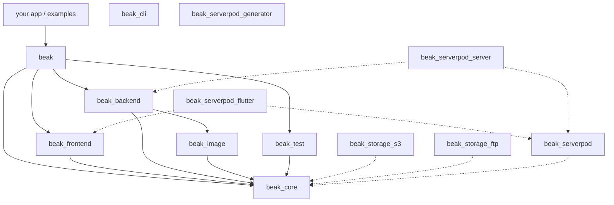

# Package graph

> Which Beak package depends on which, and where worm, obers_ui and dart:io are allowed to appear.

Your app depends on one package, `beak`. Behind it sit twelve more under `packages/`, and the edges between them decide where a piece of code has to live. After this page you can say which package may import worm, which may import obers_ui, and what stops either from leaking.

## The idea in one picture

The graph below is read from the `pubspec.yaml` files, not drawn from memory. Solid arrows are what the umbrella pulls in. Dotted arrows are packages your app adds itself, and the table further down lists the third-party packages each one brings.



Two packages float free of the Beak edges. `beak_cli` and `beak_serverpod_generator` write source as text and read your code with the analyzer, so neither imports a Beak package at runtime. The generator lists `beak_core` and `beak_serverpod` under `dev_dependencies`, for its tests.

## How it works

### What each package is

| Package | Runs on | Beak dependencies | Third-party of note |
| --- | --- | --- | --- |
| `beak` | Flutter | `beak_core`, `beak_frontend`, `beak_backend`, `beak_test` | `obers_ui`, `obers_ui_autoforms`, `obers_ui_charts`, `worm` |
| `beak_core` | pure Dart | none | `http`, `http_parser`, `intl`, `meta` |
| `beak_backend` | Dart VM (Shelf) | `beak_core`, `beak_image` | `shelf`, `shelf_router`, `shelf_multipart`, `worm`, `worm_postgres`, `worm_sqlite`, `crypto`, `mime` |
| `beak_frontend` | Flutter | `beak_core` | `obers_ui`, `obers_ui_autoforms`, `obers_ui_charts`, `signals`, `get_it`, `go_router`, `flutter_hooks` |
| `beak_test` | pure Dart | `beak_core` | `test` |
| `beak_image` | pure Dart | `beak_core` | `image` |
| `beak_storage_s3` | pure Dart | `beak_core` | `http`, `crypto` |
| `beak_storage_ftp` | pure Dart | `beak_core` | none, plain sockets |
| `beak_cli` | Dart CLI | none | `analyzer`, `args`, `dart_style`, `yaml`, `yaml_edit`, `worm`, `worm_postgres`, `worm_sqlite` |
| `beak_serverpod` | pure Dart | `beak_core` | `http`, `uuid` |
| `beak_serverpod_flutter` | Flutter | `beak_core`, `beak_frontend`, `beak_serverpod` | `serverpod_client`, `serverpod_auth_core_flutter`, `serverpod_auth_idp_client` |
| `beak_serverpod_server` | Dart VM (Serverpod 4) | `beak_backend`, `beak_core`, `beak_serverpod` | `serverpod`, `worm`, `worm_postgres` |
| `beak_serverpod_generator` | Dart CLI | none | `analyzer`, `args`, `dart_style`, `yaml` |

`worm`, its drivers, `worm_generator` and `worm_lints` are vendored under `packages/worm*`. They are consumed as path dependencies and stay out of the Melos gate, which only runs `melos run test-worm` over them.

### One dependency, eight libraries

`beak` contains no logic. Each file in it is a `library;` with a doc comment and a list of exports, and the split between the files is the point: which library a file imports says whether it is a model, a screen, a server or a test.

| Library | Exports | Reaches |
| --- | --- | --- |
| `package:beak/beak.dart` | `beak_core` | pure Dart |
| `package:beak/schema.dart` | the annotations (`@Resource`, `@Column`, ...) | pure Dart |
| `package:beak/panel.dart` | `beak_frontend` and `beak.dart` | Flutter |
| `package:beak/ui.dart` | `obers_ui`, `obers_ui_autoforms` | Flutter |
| `package:beak/charts.dart` | `obers_ui_charts` | Flutter |
| `package:beak/server.dart` | `beak_backend`, `beak.dart`, `beak_core/io.dart` | `dart:io`, Shelf, worm |
| `package:beak/migrations.dart` | worm and `server.dart` | `dart:io`, Shelf, worm |
| `package:beak/testing.dart` | `beak_test` | the `test` package |

The panel library is a two-line export, and that is all it takes:

```dart title="packages/beak/lib/panel.dart"
export 'package:beak_frontend/beak_frontend.dart';

export 'beak.dart';
```

`schema.dart` is separate because `Column` and `Image` are the natural names for the annotations and Flutter already owns both. `ui.dart` and `charts.dart` are separate because `obers_ui` and `obers_ui_charts` each declare an `OiAnnotationType`. See [Libraries](../reference/libraries.md) for the rule per folder.

The reason there is no single `beak.dart` that exports everything is the server. `bin/serve.dart` imports the generated host, which imports the registry, which imports your models. If any model reached `dart:ui`, `dart compile exe` would stop working.

### The rules the graph enforces

#### `beak_core` is pure Dart and sits at the bottom

It holds what both sides speak: columns, rules, relationships, the query spec, `BeakValue`, the storage abstraction, `BeakDataSource`, `BeakSavePlan` and `BeakClient`. It imports neither Flutter nor Shelf nor a database driver. The `dart:io` part, the local-disk storage driver, is a second library, `package:beak_core/io.dart`, kept out of the main barrel so `beak_frontend` never sees it.

#### Only `beak_backend` imports worm on the data path

`WormDataSource` turns a `BeakQuerySpec` into a worm predicate tree and runs it. The bird eats the worm in exactly one place. No widget and no other framework package sees a worm type, which is why `beak_serverpod` can implement `BeakDataSource` without a database. Three packages name worm for other reasons:

- `beak` re-exports it in `migrations.dart`, because a migration and a seeder are worm's own `Migration` and `Seeder`.
- `beak_cli` uses the drivers for `beak introspect` and the drift check in `beak doctor`, a build-time tool talking to a database.
- `beak_serverpod_server` writes a worm adapter over a Serverpod session, covered in [The data source seam](data-source-seam.md).

#### Only `beak_frontend` imports obers_ui

It never touches `dart:io` or Shelf. `beak` depends on the three obers_ui packages as well, only to re-export them from `ui.dart` and `charts.dart`, so an app composing its own screens does not add three dependencies and keep their versions in step. All three are pinned to one commit of the `obers_ui` repository.

#### Storage drivers are plug-ins

`beak_backend` depends on no driver. `beak_core` defines `BeakStorageConfig` and `BeakStorageDriver`, and a driver package implements one and registers itself. The S3 driver signs its own requests (AWS Signature Version 4, over `http` and `crypto`), so a project that never adds `beak_storage_s3` never resolves it, and one that does resolves it next to `beak` with no override. [Storage internals](storage-internals.md) has the registry.

#### The umbrella lists `beak_backend` as a dependency on purpose

A pubspec dependency costs nothing on its own, since only imports reach the compiler. That is what lets one package hold `lib/main.dart` for the browser and `bin/serve.dart` for the VM.

### The wall is checked, not trusted

Three guards run inside `melos run analyze`.

```console
$ dart run tool/check_no_material.dart
Material-import guard passed (1186 Dart files scanned).
$ dart run tool/check_hook_widgets.dart
Hook-widget guard passed (no StatefulWidget or State).
$ dart run tool/check_web_safe.dart
Web-safety guard passed (12 panel entrypoints walked).
```

`check_no_material.dart` fails on any `package:flutter/material.dart` or `cupertino.dart` import in Beak code. `check_hook_widgets.dart` fails on a class in any package's `lib/` that extends `StatefulWidget`, `State`, `StatefulHookWidget` or `HookState`. `check_web_safe.dart` walks the import graph from every panel-side entrypoint and fails on a web-unsafe URI:

```dart title="tool/check_web_safe.dart"
const List<String> webUnsafePackagePrefixes = [
  'package:beak_backend',
  'package:beak_image',
  'package:beak_storage_',
  'package:postgres',
  'package:shelf',
  'package:worm',
];
```

It also rejects `dart:io`, `dart:ffi` and `dart:mirrors`. The web guard earns its keep because `dart:io` is not a compile error on the web. dart2js ships a patched `dart:io` whose members throw when called, so a stray server import gives a green build and an exception in the browser. CI also builds the quickstart and the shop panel for web on every run, as the empirical half of the same check. For a project's own files the same rule is `beak doctor`'s "no panel file imports the server" check.

## Why it is shaped this way

- One dependency for the app. Version skew between `beak_core` and `beak_frontend` is a bug you never have to diagnose, because you cannot pin them apart.
- A pure base. Everything the two halves share is in a package that neither half's runtime can pollute. A type that pulled Flutter or worm into `beak_core` would poison every dependent, so it gets the strictest review in the repository.
- Edges instead of conventions. "The frontend does not know worm" is an absence of an edge and an import guard, not a sentence in a style guide.
- Adapters at the leaves. Storage drivers and the Serverpod packages hang off `beak_core` or one framework package, so adding one never edits a package below it.

## What it means for you

- Depend on `beak` and import the library you need. Add `beak_storage_s3` or `beak_storage_ftp` only when you upload there.
- A model file imports `beak.dart` and `schema.dart` and nothing else. It is shared with the server.
- A screen imports `panel.dart`, and `ui.dart` or `charts.dart` when it composes widgets itself.
- `lib/server.dart`, `lib/migrations/` and `lib/seeders/` may import `server.dart` and `migrations.dart`. A panel file may not.
- In a Serverpod workspace the same split shows up as three packages: a model package on `beak_core`, a server on `beak_backend` and `beak_serverpod_server`, and a panel on `beak` and `beak_serverpod_flutter`. See [The Serverpod admin app](../serverpod/admin-app/how-it-works.md).

## Continue reading

- [Backend flow](backend-flow.md) what `beak_backend` does with `beak_core` types once a request arrives.
- [Frontend flow](frontend-flow.md) the same walk on the panel side, ending at `beak_core`.
- [The data source seam](data-source-seam.md) the interface that keeps worm on one side of the wall.
- [Libraries](../reference/libraries.md) the eight libraries of `package:beak`, folder by folder.
- [Packages](../reference/packages.md) the public barrel of every package.
