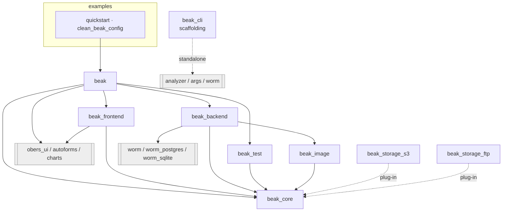

# Package graph

> See which package depends on which and where worm and obers_ui may appear.

After this page you will know what each package is allowed to import, and therefore where a given piece of code has to live. The dependency edges are not incidental: they are how Beak keeps the ORM out of the frontend and the UI toolkit out of the backend.

Your project depends on exactly one package, `beak`. Inside the repo, `beak` is a thin facade over four framework packages, alongside a handful of opt-in ones, all under `packages/`, with the two example projects under `examples/` sitting on top. The whole design rests on one package at the base.

## The graph



Read it top to bottom: an example depends on `beak`, `beak` depends on the framework packages, the framework packages depend on `beak_core`, and only `beak_core` depends on nothing Beak-specific.

## What each package is

| Package | Runtime | Depends on (Beak) | Third-party of note |
| --- | --- | --- | --- |
| `beak` | Flutter | `beak_core`, `beak_frontend`, `beak_backend`, `beak_test`, `worm` | `obers_ui`, `obers_ui_autoforms`, `obers_ui_charts` |
| `beak_core` | pure Dart | nothing | `http`, `http_parser`, `meta` |
| `beak_backend` | Shelf server | `beak_core`, `beak_image` | `worm`, `worm_postgres`, `worm_sqlite`, `shelf` |
| `beak_frontend` | Flutter | `beak_core` | `obers_ui`, `obers_ui_autoforms`, `obers_ui_charts`, `signals`, `get_it`, `go_router`, `flutter_hooks` |
| `beak_test` | pure Dart | `beak_core` | `test` |
| `beak_image` | pure Dart | `beak_core` | `image` |
| `beak_storage_s3` | pure Dart | `beak_core` | `minio` |
| `beak_storage_ftp` | pure Dart | `beak_core` | (sockets only) |
| `beak_cli` | Dart CLI | none | `analyzer`, `args`, `dart_style`, `yaml`, `worm_postgres` |

## The umbrella is one dependency and eight libraries

`beak` contains no logic of its own. Every file in it is a `library;` with a doc comment and a list of exports, and the split between them is the point: which library a file imports is what says whether that file is a model, a screen, a server or a test.

```dart title="packages/beak/lib/panel.dart"
export 'package:beak_frontend/beak_frontend.dart';

export 'beak.dart';
```

`beak.dart` re-exports `beak_core` and nothing else, so it reaches neither Flutter nor `dart:io`. `panel.dart` adds the widgets, `server.dart` adds the Shelf host, `testing.dart` adds `beak_test`. See [Libraries](../reference/libraries.md) for the full table and the rule of thumb per folder.

The reason the umbrella cannot export everything from one library is the same reason `beak_core` is pure: `bin/serve.dart` imports the generated server host, which imports the registry, which imports your models. Anything on that path that reached `dart:ui` would stop `dart compile exe` working.

## The rules the graph enforces

### beak_core is pure Dart at the base

`beak_core` is the shared vocabulary both sides speak: columns, rules, relationships, the `BeakQuerySpec` query contract, the `BeakValue` family, the storage abstraction, `BeakDataSource`, and `BeakClient`. It depends on `http` (for the client) and `meta`, and on nothing else in Beak. It imports neither Flutter nor Shelf nor any database driver. Everything else in the graph points down at it.

Because it is pure and central, `beak_core` is the package with the strictest review bar. A type that leaks Flutter or worm into `beak_core` would poison every dependent, so it does not happen.

### Only beak_backend imports worm at runtime

The worm ORM (with the `worm_postgres` and `worm_sqlite` drivers) appears in exactly one runtime package: `beak_backend`. That is where `WormDataSource` translates a `BeakQuerySpec` into a worm predicate tree and runs it. No other package, and no app widget, ever sees a worm type. This is what lets the `beak_serverpod` transport implement the same `BeakDataSource` interface without disturbing anything above or below.

`beak` re-exports worm through `package:beak/migrations.dart`, because migrations and seeders are worm's own `Migration` and `Seeder` and there is no value in wrapping them. That export sits on the server side of the wall, not the panel side.

> **Note: beak_cli names worm too**
>
> The scaffolding CLI depends on `worm_postgres` and `worm_sqlite` for the commands that read a live schema: `beak introspect`, which writes schema classes from it, and `beak doctor`'s drift check. That is a build-time tool talking to a database, not the framework's data path, and nothing it generates depends on worm.

### Only beak_frontend imports obers_ui

`beak_frontend` is the framework's only widget package, and the only one whose code imports `obers_ui`, `obers_ui_autoforms`, and `obers_ui_charts` (all pinned to one commit of the `obers_ui` repo). It never imports `dart:io` or Shelf. The panel, table, form, detail view, actions, and dashboard all live here, built entirely on obers_ui widgets.

`beak` depends on the three obers_ui packages directly as well, but only to re-export them from `package:beak/ui.dart` and `package:beak/charts.dart`, so a project composing its own screens does not have to add three more dependencies and keep their versions in step. The two chart and UI barrels stay separate libraries because `obers_ui` and `obers_ui_charts` both declare an `OiAnnotationType`.

### Storage drivers are plug-ins, not dependencies

`beak_backend` depends on neither storage driver. `beak_core` defines `BeakStorageConfig` and the `BeakStorageDriver` interface; a driver package implements one and registers itself. An app that uploads to S3 declares `beak_storage_s3` in its own pubspec and names the drivers it can resolve in `lib/server.dart`, which the generated host picks up:

The optional registration is described in [custom storage drivers](../extending/custom-storage-drivers.md).

That is why `beak_storage_s3` hangs off the graph on a dotted line, and why a project that never names the S3 driver never resolves `minio` at all. Uploads still work on that project: with `BEAK_STORAGE_DRIVER` unset the host falls back to a local-disk driver from `beak_core`. The canonical shop uses local storage unless its host is configured otherwise.

### The wall is checked, not trusted

Two tools in `tool/` run on every `melos run analyze`.

- `check_no_material.dart` (`melos run guard-material`) fails on any `package:flutter/material.dart` or `cupertino.dart` import in Beak code.
- `check_web_safe.dart` (`melos run guard-web`) walks the import graph from every panel-side entrypoint (`packages/beak/lib/beak.dart`, `panel.dart`, `ui.dart`, `charts.dart`, plus the two package barrels) and fails on `dart:io`, `dart:ffi`, `dart:mirrors`, or any of `package:beak_backend`, `package:beak_image`, `package:beak_storage_`, `package:minio`, `package:postgres`, `package:shelf`, `package:worm`.

The second one earns its keep because `dart:io` is not a compile error on the web. dart2js ships a patched `dart:io` whose members throw at runtime, so a stray server import produces a green build and a browser exception. CI also builds a panel for web on every run, as the empirical half of the same check.

## Where the examples fit

Two projects remain under `examples/`, each a single package containing authored
models, generated wiring, Flutter UI and the Shelf host.

| Example | Purpose |
| --- | --- |
| `quickstart` | Minimal generated project with one Note model. |
| `clean_beak_config` | Canonical shop, including declarative workflows, semantic fields, custom screens, embedded widgets, imports and variant generation. |

Model libraries import only shared Dart contracts; server and panel code import
separate barrels. The web import guard enforces that separation.

## Continue reading

- [Libraries](../reference/libraries.md) the eight libraries `beak` is made of, and which one each file imports.
- [The data source seam](data-source-seam.md) the interface that keeps worm on one side and obers_ui on the other.
- [Backend flow](backend-flow.md) what `beak_backend` does with `beak_core` types once a request lands.
- [Packages](../reference/packages.md) the public barrel of every package, member by member.
