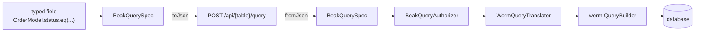

# The query contract

> How a BeakQuerySpec is built from typed fields, travels as JSON, gets authorized and becomes a worm query.

The panel and the server never share a process, so everything one asks the other about a list has to fit into one JSON object. That object is a `BeakQuerySpec`. After this page you can read one off the wire, say why a timestamp travels tagged while a string travels raw, and know which file to touch when a new operator or filter node is needed.

## The idea in one picture



The spec names tables and columns by key and nothing else, which is why it needs no ORM and no Flutter. It lives in `packages/beak_core/lib/src/query/`, so both halves decode it with the same code. The server-side steps are `packages/beak_backend/lib/src/auth/beak_query_authorizer.dart` and `packages/beak_backend/lib/src/data/worm/query_translator.dart`.

## How it works

### What a spec carries

A spec is an immutable value with seven fields. Application code never fills them by hand.

| Field | Type | Wire key | Meaning |
| --- | --- | --- | --- |
| `table` | `String` | `table` | Stored name of the queried model. The only key `fromJson` insists on. |
| `filter` | `BeakFilter?` | `filter` | The predicate a record has to satisfy. |
| `sorts` | `List<BeakSort>` | `sorts` | Ordering, applied in order. |
| `search` | `BeakSearch?` | `search` | A term and the column keys to look for it in. |
| `relationLoads` | `List<BeakRelationLoad>` | `relations` | Relations to load with the page. Beak never lazy-loads. |
| `pagination` | `BeakPagination` | `pagination` | 1-based `page` and `perPage`, defaults `1` and `25`. |
| `withTrashed` | `bool` | `withTrashed` | Whether soft-deleted rows are included. |

### Building one

A spec starts at its model (`const OrderModel().query(...)`) and grows through the copy-builders `withFilter`, `orderBy`, `withRelation`, `searching` and `paginate`. Each returns a new spec. The keys come from the generated field references, so a renamed column is a compile error and not a filter that quietly matches nothing.

A field reference reached through a relationship carries the relationship in its key. The test below reads a customer's name off an eagerly loaded order record, then shows what the same field turns into as a filter: a dotted key, `customer.name`.

```dart title="packages/beak_core/test/src/model/beak_field_ref_test.dart"
test('typed nested references read eager data and preserve query paths', () {
  const field = BeakScalarField<String>(
    model: _Model('orders'),
    column: _name,
    path: [_customer],
  );
  final record = BeakRecord(
    values: const {},
    relations: {
      'customer': [
        BeakRecord.fromRow({'name': 'Ada'}),
      ],
    },
  );
  final String? name = field.readFrom(record);
  expect(name, 'Ada');
  expect(field.readFrom(BeakRecord.fromRow({})), isNull);
  expect(field.eq('Ada').toJson(), {
    'type': 'field',
    'column': 'customer.name',
    'operator': 'eq',
    'value': const BeakStringValue('Ada').toJson(),
  });
});
```

`withFilter` does not nest. The first filter is taken as it is, and every later one joins one flat conjunction:

```dart title="packages/beak_core/lib/src/query/beak_query_spec.dart"
/// Returns a copy with [filter] AND-merged into the existing predicate:
/// the first filter is taken as-is, later ones join an ever-growing
/// conjunction.
BeakQuerySpec withFilter(BeakFilter filter) => _copy(
  filter: switch (this.filter) {
    null => filter,
    final BeakAndFilter existing => BeakAndFilter([
      ...existing.filters,
      filter,
    ]),
    final BeakFilter existing => BeakAndFilter([existing, filter]),
  },
);
```

A status filter, a date filter and a third condition therefore produce one `BeakAndFilter` with three children, not a right-leaning tower of them. A search is not a filter: it travels in its own `search` key.

### On the wire

`toJson` writes every key, always. `fromJson` requires `table` and falls back to the constructor defaults for the rest, in the nested objects too (a sort without `descending` sorts ascending, a relation load without `nested` loads the bare relation, empty pagination is page 1 of 25), so `{"table": "products"}` is a valid request body for someone poking at the API with curl, while a spec that made the round trip is exactly the spec that left. The fixture below is the one Beak's golden test pins byte for byte:

```dart title="packages/beak_core/test/src/query/beak_query_spec_test.dart"
BeakQuerySpec richSpec() => const BeakQuerySpec(table: 'posts')
    .withRelation(author)
    .withFilter(
      BeakFieldFilter(
        column: status,
        operator: BeakOperator.eq,
        value: BeakValue.of('active'),
      ),
    )
    .withFilter(
      BeakFieldFilter(
        column: lastActive,
        operator: BeakOperator.lt,
        value: BeakValue.of(cutoff),
      ),
    )
    .orderBy(createdAtField, descending: true)
    .searching('ada', const [nameField, emailField])
    .paginate(page: 2, perPage: 50);
```

It serializes to the body of a `POST /api/posts/query`:

```json title="packages/beak_core/test/golden/rich_query_spec.json"
{
  "table": "posts",
  "filter": {
    "type": "and",
    "filters": [
      {
        "type": "field",
        "column": "status",
        "operator": "eq",
        "value": "active"
      },
      {
        "type": "field",
        "column": "last_active",
        "operator": "lt",
        "value": {
          "type": "dateTime",
          "value": "2026-06-01T00:00:00.000Z"
        }
      }
    ]
  },
  "sorts": [
    {
      "column": "created_at",
      "descending": true
    }
  ],
  "search": {
    "term": "ada",
    "columns": [
      "name",
      "email"
    ]
  },
  "relations": [
    {
      "relation": "author",
      "filter": null,
      "nested": []
    }
  ],
  "pagination": {
    "page": 2,
    "perPage": 50
  },
  "withTrashed": false
}
```

The two `withFilter` calls became one `type: "and"` node. The string operand went out as a bare JSON string, the `DateTime` as a tagged object. That tag is the whole trick of the value layer.

### The value layer

An operand is a `BeakValue`, a sealed family, so both sides know its type without a `dynamic` anywhere. `BeakValue.of` wraps plain Dart into the matching variant and throws on anything else instead of serializing an untyped blob.

```dart title="packages/beak_core/lib/src/query/beak_value.dart"
static BeakValue of(Object? raw) => switch (raw) {
  null => const BeakNullValue(),
  final BeakValue value => value,
  final bool value => BeakBoolValue(value),
  final int value => BeakIntValue(value),
  final double value => BeakDoubleValue(value),
  final String value => BeakStringValue(value),
  final DateTime value => BeakDateTimeValue(value),
  final List<Object?> values => BeakListValue([
    for (final value in values) BeakValue.of(value),
  ]),
  _ => throw BeakConfigurationException(
    'BeakValue does not support ${raw.runtimeType} values (got $raw).',
  ),
};
```

| Variant | Dart `raw` | Wire JSON |
| --- | --- | --- |
| `BeakStringValue` | `String` | the string |
| `BeakIntValue` | `int` | the number |
| `BeakDoubleValue` | `double` | the number |
| `BeakBoolValue` | `bool` | the boolean |
| `BeakDateTimeValue` | `DateTime` | `{"type": "dateTime", "value": "<ISO-8601, UTC>"}` |
| `BeakNullValue` | `null` | `null` |
| `BeakListValue` | `List` | an array, elements encoded recursively |

Decoding reads the table backwards:

```dart title="packages/beak_core/lib/src/query/beak_value.dart"
static BeakValue _decode(Object? json, int depth) => switch (json) {
  null => const BeakNullValue(),
  final bool value => BeakBoolValue(value),
  final int value => BeakIntValue(value),
  final double value => BeakDoubleValue(value),
  final String value => BeakStringValue(value),
  final List<Object?> _ when depth >= _maxListNesting =>
    throw const BeakConfigurationException(
      'BeakValue JSON is nested more than $_maxListNesting lists deep.',
    ),
  final List<Object?> values => BeakListValue([
    for (final value in values) _decode(value, depth + 1),
  ]),
  {'type': 'dateTime', 'value': final String iso} => BeakDateTimeValue(
    _parseInstant(iso),
  ),
  _ => throw BeakConfigurationException('Malformed BeakValue JSON: $json.'),
};
```

The `dateTime` tag is the only map-shaped value, so a string is never guessed to be a timestamp. `raw` unwraps a `BeakDateTimeValue` to a real `DateTime`, `toJson` produces the tagged object, and the translator reads `raw` while the wire carries `toJson`. The wire always carries the UTC instant, so a local `DateTime` gets its `Z` and names the same moment on the server, and two values are equal when they name the same instant. A hand-written timestamp with no offset (`2026-06-01T12:30:45`, or a bare date) is read as UTC, not in the zone of the machine that decodes it, and a list nested more than 16 levels deep is refused.

Money, calendar dates and durations have no variant of their own. A field with a semantic codec encodes them into these same primitives before they reach a filter (exact decimals become integer units), so the contract does not grow when a column kind is added.

### The filter tree

Predicates form a sealed tree. Each node tags itself with a `type` on the wire and `fromJson` switches on it:

```dart title="packages/beak_core/lib/src/query/beak_filter.dart"
static BeakFilter _decode(Map<String, Object?> json, int depth) {
  if (depth >= _maxNesting) {
    throw const BeakConfigurationException(
      'BeakFilter JSON is nested more than $_maxNesting levels deep.',
    );
  }
  return switch (json) {
    {'type': 'field'} => _fieldFromJson(json),
    {'type': 'and'} => BeakAndFilter(
      _childrenFromJson(json, 'BeakAndFilter', depth),
    ),
    {'type': 'or'} => BeakOrFilter(
      _childrenFromJson(json, 'BeakOrFilter', depth),
    ),
    {'type': 'relation'} => BeakRelationFilter(
      requireJsonString(json, 'relation', 'BeakRelationFilter'),
      _decode(
        requireJsonMap(json, 'filter', 'BeakRelationFilter'),
        depth + 1,
      ),
    ),
    _ => throw BeakConfigurationException(
      'Malformed BeakFilter JSON: $json.',
    ),
  };
}
```

| Node | `type` | Holds | Matches |
| --- | --- | --- | --- |
| `BeakFieldFilter` | `field` | a column key, a `BeakOperator`, a `BeakValue` | one column compared with one operand |
| `BeakAndFilter` | `and` | `filters` | every child |
| `BeakOrFilter` | `or` | `filters` | at least one child |
| `BeakRelationFilter` | `relation` | a relationship key and a child filter | one related record that satisfies the whole child |

`BeakRelationFilter` exists for a reason that is easy to miss. "An order with an item that is expensive and an item that is red" and "an order with one item that is expensive and red" are different questions. Grouping the child conditions makes the second one expressible, and the typed `matches` and `any` on relationship fields build it for you.

`BeakFieldFilter` has two constructors. The default one takes a `BeakColumn` and reads its key, so code never types a string. `.forKey` takes the raw key and exists for decoding and for the typed field references. Both are `const`, because a screen's base filter, a dashboard metric and a resource scope are all constant expressions.

```dart title="packages/beak_core/lib/src/query/beak_filter.dart"
const BeakFieldFilter({
  required BeakColumn column,
  required this.operator,
  this.value = const BeakNullValue(),
}) : _column = column,
     _columnKey = null;

/// Creates a predicate on a raw [columnKey] — the deserialization path
/// used by [BeakFilter.fromJson]; prefer the default constructor in user
/// code.
const BeakFieldFilter.forKey(
  String columnKey,
  this.operator, [
  this.value = const BeakNullValue(),
]) : _columnKey = columnKey,
     _column = null;
```

### Operators

`BeakOperator` is Beak's own vocabulary and travels by `name`. Most operators map to the worm operator of the same name. The three substring operators have no worm counterpart and become `ilike` with a pattern built from the operand (all three are shown, and they differ only in where the `%` goes):

```dart title="packages/beak_backend/lib/src/data/worm/query_translator.dart"
BeakOperator.contains => pattern(
  Operator.ilike,
  '%${beakEscapeLike(_stringOperand(filter))}%',
),
BeakOperator.startsWith => pattern(
  Operator.ilike,
  '${beakEscapeLike(_stringOperand(filter))}%',
),
BeakOperator.endsWith => pattern(
  Operator.ilike,
  '%${beakEscapeLike(_stringOperand(filter))}',
),
```

| Operator | Operand | Becomes |
| --- | --- | --- |
| `eq`, `neq`, `gt`, `gte`, `lt`, `lte` | any scalar | the comparison of the same name |
| `like`, `ilike` | string | the raw pattern, with a backslash as its escape character |
| `contains`, `startsWith`, `endsWith` | string | `ilike` with `%v%`, `v%`, `%v`, where `v` is escaped |
| `isNull`, `isNotNull` | none | `IS NULL`, `IS NOT NULL` |
| `inList`, `notInList` | `BeakListValue` | list membership |
| `between`, `notBetween` | `BeakListValue` of exactly two | an inclusive range |

`v` is the operand run through `beakEscapeLike`, so `%`, `_` and a backslash in it match themselves, and every pattern names its escape character in the SQL (`ESCAPE '\'`): SQLite has no default one and the other databases do not agree on theirs. An operand of the wrong shape is a `BeakValidationException` from the translator, a 422 on the wire. The translator's `switch` over `BeakOperator` is exhaustive, so an operator without a translation does not compile.

### On the server

Two steps sit between the decoded spec and the database.

The authorizer rewrites the spec before anything runs. It checks that the principal may view the table, that every sort, filter and search path names a real, readable field, and that every relationship it traverses is readable. It ANDs in the row scope of the model and of each related model, and it folds a search into the filter, so the spec the translator sees has no `search` left. A dotted key such as `customer.name` becomes a nested `BeakRelationFilter` with the related model's row scope inside it. An unknown table, field or relationship is a `BeakValidationException`, which is a 422, and so is a sort, aggregate or summary column reached through a relationship. The authorizer is also where the server's limits apply: a page size above the ceiling (200 by default, `BeakPagination.maxPerPage`, set per server with `maxPerPage`) is served at the ceiling, and the envelope reports the size used.

```dart title="packages/beak_backend/lib/src/data/worm/query_translator.dart"
QueryBuilder<WormRecordModel> builderFor(
  BeakQuerySpec spec,
  DatabaseAdapter adapter,
) {
  final model = registry.byTableOrThrow(spec.table);
  var builder = projectedBuilder(model, adapter);
  if (spec.withTrashed) {
    builder = builder.withTrashed();
  }
  final PredicateTree? filter = predicateFor(spec.filter, model);
  if (filter != null) {
    builder = builder.where(filter);
  }
  final PredicateTree? search = _searchPredicate(spec.search, model);
  if (search != null) {
    builder = builder.where(search);
  }
  for (final sort in spec.sorts) {
    builder = builder.orderBy(
      wormFieldForColumn(columnOrThrow(model, sort.columnKey)),
      descending: sort.descending,
    );
  }
  // Rows that tie on the sort key have no order of their own, so two pages
  // of one query could each hold a row, or neither: the key breaks the tie.
  if (spec.sorts.isNotEmpty &&
      !spec.sorts.any((sort) => sort.columnKey == model.primaryKey.key)) {
    builder = builder.orderBy(wormFieldForColumn(model.primaryKey));
  }
  builder = _applyRelationLoads(builder, model, spec.relationLoads);
  builder = builder.limit(spec.pagination.perPage);
  final int offsetRows = (spec.pagination.page - 1) * spec.pagination.perPage;
  if (offsetRows > 0) {
    builder = builder.offset(offsetRows);
  }
  return builder;
}
```

`WormQueryTranslator.builderFor` is generic. It works from `BeakModel` metadata and the registry, so one code path serves every model and nothing per model exists. It starts from a projected select of the declared columns and foreign keys, never `SELECT *`, and applies the soft-delete scope unless `withTrashed` lifts it. Filters translate through an exhaustive switch over the sealed tree:

```dart title="packages/beak_backend/lib/src/data/worm/query_translator.dart"
PredicateTree? predicateFor(
  BeakFilter? filter,
  BeakModel model, {
  String? qualifier,
  int depth = 0,
}) => switch (filter) {
  null => null,
  final BeakFieldFilter field => _leafFor(field, model, qualifier, depth),
  final BeakAndFilter and => _composite(
    and.filters,
    model,
    isAnd: true,
    qualifier: qualifier,
    depth: depth,
  ),
  final BeakOrFilter or => _composite(
    or.filters,
    model,
    isAnd: false,
    qualifier: qualifier,
    depth: depth,
  ),
  BeakRelationFilter(:final relationKey, :final filter) => _relationPredicate(
    model,
    relationKey,
    filter,
    qualifier,
    depth,
  ),
};
```

Predicates on related records become correlated `EXISTS` subqueries, not joins. That is why an order with three matching items counts once, and why the total and the page agree. Relation loads become batched eager loads. `WormDataSource.query` then runs `count()` for the total and `get()` for the page.

```dart title="packages/beak_backend/lib/src/data/worm/worm_data_source.dart"
Future<BeakPage<BeakRecord>> query(BeakQuerySpec spec) => _read(() async {
  final BeakModel beakModel = registry.byTableOrThrow(spec.table);
  final builder = _translator.builderFor(spec, _adapter);
  final int total = await builder.count();
  final rows = await builder.get();
  return BeakPage(
    items: [
      for (final row in rows)
        row.toBeakRecord(
          loads: spec.relationLoads,
          model: beakModel,
          registry: registry,
        ),
    ],
    total: total,
    page: spec.pagination.page,
    perPage: spec.pagination.perPage,
  );
});
```

Search is typed by the field, not by the database. Text columns match with a case-insensitive contains, and `%`, `_` and a backslash in the term match themselves. Numbers, booleans and timestamps match by typed equality, so a term that is not a number cannot match a number column and a `SQLite` implicit cast cannot make it match. A term that fits none of the chosen columns matches no rows.

## Why it is shaped this way

- Lossless. Every `toJson` writes every key, `fromJson` restores what the constructor would have defaulted, and the `dateTime` tag removes the one real ambiguity. A golden test pins the bytes.
- No `dynamic`. `BeakValue` is the place an untyped operand would have sneaked in. Operands are typed on both ends, so a filter cannot carry one past the type system.
- ORM-neutral. The spec speaks keys. `WormQueryTranslator` is the only code that knows worm, so a data source over something else consumes the same spec without touching it. See [The data source seam](data-source-seam.md).
- Authorization lives in one rewrite. Because the authorizer returns a spec, the translator and the data source stay ignorant of who is asking. A row policy cannot be forgotten by a new endpoint that already goes through `authorizeQuery`.

## What it means for you

- Build specs from the model and its generated fields. `BeakFieldFilter.forKey` is for decoders and adapters.
- Load what you render. A relation you did not put in `relationLoads` is not on the record, and reading it gives `null`.
- Sort on the model's own columns. `orderBy` throws for a field reached through a relationship, and a hand-written spec that sorts on a dotted key is refused by the authorizer with a 422.
- Timestamps are safe to build in local time. `BeakDateTimeValue.toJson` writes the UTC instant, and the server reads a hand-written value with no offset as UTC, never in its own zone.
- Match the operand to the column. `rating > 'abc'` is a `422` that names the field, on SQLite as on Postgres, because the translator checks an operand against what the column stores before the database sees it. A pattern operator (`contains`, `like`) applies to text columns only.
- Sorting ends with the primary key. Rows that tie on the sort column keep one order across pages, so a row is never on two pages or on none.
- Ask for at most 200 rows a page. The server serves 200 for a bigger request and says so in the envelope's `perPage`; page through the rest, or ask a summary for the totals.
- A user who searches for `50%` finds the text `50%`. In a `like` or `ilike` operand, which is a pattern, `%` and `_` are still wildcards and a backslash escapes the next character.
- Relationship filters stop at 16 levels in the translator and at 64 in the authorizer. Nothing in a real screen comes close.

## Continue reading

- [The data source seam](data-source-seam.md) the interface that takes a spec on either side of the wire.
- [Backend flow](backend-flow.md) where the authorizer sits in a request and what the handler does before it.
- [How data flows](../concepts/how-data-flows.md) the same contract from the panel's point of view.
- [Queries](../reference/queries.md) the spec, filters and operators as a lookup table.
