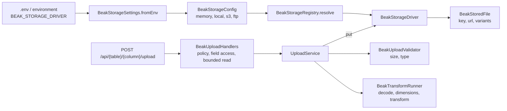

# Storage internals

> How a storage config resolves to a driver, and how an upload is validated, transformed and stored on the way to a key.

Beak stores files through a pluggable driver. `beak_core` owns the abstraction (the config, the driver interface, the registry, the key rules, the validator and the transform spec) and ships two drivers, `memory` and `local`. Driver packages add the rest. After this page you can trace an upload from a `BeakStorageConfig` to a stored key with a URL, say why the S3 and FTP drivers are testable without a server, and name the checks every upload passes.

## The idea in one picture



The abstraction is in `packages/beak_core/lib/src/storage/`. The drivers are in `packages/beak_storage_s3`, `packages/beak_storage_ftp` and, for the pixel work, `packages/beak_image`. Nothing about S3 or FTP is wired into core. They plug in at startup.

## How it works

### A config resolves to a driver

Selecting storage is pure data. `BeakStorageConfig` is a sealed family, one variant per driver, each carrying that driver's settings and a `driverId`. Variants that hold secrets redact them in `toString`.

```dart title="packages/beak_core/lib/src/storage/beak_storage_config.dart"
@immutable
sealed class BeakStorageConfig {
  const BeakStorageConfig();

  /// Identifier of the driver this config is consumed by
  /// (`'memory'`, `'local'`, `'s3'`, `'ftp'`).
  String get driverId;
}
```

A `BeakStorageRegistry` maps each `driverId` to a factory. Only `memory` is pre-registered, because it is the only one that is safe on the web. Everything else is added at startup, and `resolve` builds the driver a config selects:

```dart title="packages/beak_core/lib/src/storage/beak_storage_registry.dart"
BeakStorageDriver resolve(BeakStorageConfig config) {
  final BeakStorageDriverFactory? factory =
      _factoriesByDriverId[config.driverId];
  if (factory == null) {
    throw BeakConfigurationException(
      'No storage driver is registered for "${config.driverId}". '
      'Registered drivers: ${driverIds.join(', ')}.',
    );
  }
  return factory(config);
}
```

The backend adds `local`, which needs `dart:io`, on top:

```dart title="packages/beak_backend/lib/src/server/storage_wiring.dart"
BeakStorageRegistry createDefaultStorageRegistry() {
  final registry = BeakStorageRegistry();
  registry.register('local', BeakLocalDiskStorageDriver.fromConfig);
  return registry;
}
```

Driver packages are deliberately absent. If `beak_backend` depended on `beak_storage_s3`, the S3 driver and its HTTP and signing code would ship with every Beak server, uploads or not. Your app adds the driver it uses in `lib/server.dart` by returning a registry from `beakStorageRegistry()`, which the generated host passes on as `storageRegistry`:

```dart title="packages/beak_storage_s3/lib/src/s3_storage_driver.dart"
void registerS3Storage(BeakStorageRegistry registry) {
  registry.register('s3', S3StorageDriver.fromConfig);
}
```

A driver that is selected but not registered fails at boot, by name, with the list of registered drivers.

### Which driver a server picks

`BeakServeHost.resolveStorageDriver` reads the environment. With nothing configured the answer is local disk under `storage/uploads`, served by the same server at `/uploads`, the same posture as the database, which is a SQLite file until `DATABASE_URL` says otherwise. An upload column works on a fresh project with no setup, and a deployment changes it with one variable.

```dart title="packages/beak_backend/lib/src/server/beak_serve_host.dart"
BeakStorageDriver? resolveStorageDriver() {
  final BeakStorageConfig? storageConfig = BeakStorageSettings.fromEnv(
    _environment,
  );
  if (storageConfig == null) {
    return _environment[BeakStorageSettings.driverKey] == 'none'
        ? null
        : BeakLocalDiskStorageDriver(
            rootDir: defaultUploadDir,
            publicBaseUrl: Uri.parse(
              'http://$_reachableHost:${config.port}$defaultUploadPath',
            ),
          );
  }
  return resolveStorage(
    storageConfig,
    registry: storageRegistry?.call() ?? createDefaultStorageRegistry(),
  );
}
```

`BEAK_STORAGE_DRIVER` accepts:

```dart title="packages/beak_backend/lib/src/server/beak_storage_settings.dart"
static const Set<String> supportedDrivers = {
  's3',
  'ftp',
  'memory',
  'local',
  'none',
};
```

`none` turns the upload endpoints off outright. `s3` and `ftp` each require their own variables (`BEAK_S3_ENDPOINT`, `BEAK_S3_BUCKET`, `BEAK_FTP_HOST` and so on), and a missing one fails at boot with the variable named. [Uploads and storage wiring](../backend/uploads-and-storage-wiring.md) lists all of them.

### The driver interface

Every driver does five things: put a file, read it, delete it, mint a URL, check existence. Keys are relative, `/`-separated paths.

```dart title="packages/beak_core/lib/src/storage/beak_storage_driver.dart"
abstract interface class BeakStorageDriver {
  /// Stable driver identifier matching `BeakStorageConfig.driverId`
  /// (`'s3'`, `'ftp'`, `'memory'`, `'local'`).
  String get id;

  /// Stores [upload] under the [path] prefix and returns its description.
  ///
  /// The key is `path/filename`; putting to an existing key overwrites it.
  Future<BeakStoredFile> put(BeakUpload upload, {required String path});

  /// Reads the content stored under [key].
  Future<Uint8List> get(String key);

  /// Deletes the file stored under [key].
  Future<void> delete(String key);

  /// A URL serving [key], valid for [expiresIn] where the backend supports
  /// expiring links (drivers without link expiry ignore it).
  Future<Uri> url(String key, {Duration? expiresIn});

  /// Whether a file is stored under [key].
  Future<bool> exists(String key);
}

```

`url` builds an address without probing storage, and `exists` returns a boolean for a missing file instead of throwing, so both are cheap to ask. `get` and `delete` throw a `BeakStorageException` for a missing file, and every method throws one for a malformed key.

### Drivers sit on a transport seam

The S3 and FTP drivers do not talk to the network directly. Each delegates raw I/O to a narrow interface, so the driver's own logic (key building, URL shaping, error mapping) can be tested against a fake with no server.

For S3 the seam is `S3ObjectClient`, five raw object operations:

```dart title="packages/beak_storage_s3/lib/src/s3_object_client.dart"
abstract interface class S3ObjectClient {
  /// Uploads [bytes] to [bucket] under [key] with [contentType] set.
  Future<void> putObject({
    required String bucket,
    required String key,
    required Uint8List bytes,
    required String contentType,
  });

  /// Downloads the object stored in [bucket] under [key], or `null` when no
  /// such object exists.
  Future<Uint8List?> getObject({required String bucket, required String key});

  /// Deletes the object stored in [bucket] under [key] (a no-op when it does
  /// not exist — S3 deletes are idempotent).
  Future<void> removeObject({required String bucket, required String key});

  /// Whether an object is stored in [bucket] under [key].
  Future<bool> objectExists({required String bucket, required String key});

  /// A presigned GET URL for the object in [bucket] under [key], valid for
  /// [expiresIn].
  Future<Uri> presignedGetUrl({
    required String bucket,
    required String key,
    required Duration expiresIn,
  });
}
```

The driver builds itself from a config and takes the production client by default. A test injects its own:

```dart title="packages/beak_storage_s3/lib/src/s3_storage_driver.dart"
S3StorageDriver(BeakS3Config config, {S3ObjectClient? client})
  : _config = config,
    _client = client ?? HttpS3ObjectClient(config);

/// Creates the driver from its [BeakS3Config].
///
/// Throws a [BeakConfigurationException] for any other config type; the
/// signature matches [BeakStorageRegistry.register] on purpose, which is how
/// [registerS3Storage] wires this factory in.
factory S3StorageDriver.fromConfig(BeakStorageConfig config) =>
    switch (config) {
      BeakS3Config() => S3StorageDriver(config),
      _ => throw BeakConfigurationException(
        'S3StorageDriver requires a BeakS3Config, '
        'got ${config.runtimeType}.',
      ),
    };
```

Every operation runs inside a `_guard` that lets Beak's own exceptions through and wraps any client or transport error in a `BeakStorageException`, so no raw S3 error crosses the driver boundary:

```dart title="packages/beak_storage_s3/lib/src/s3_storage_driver.dart"
Future<T> _guard<T>(
  String operationName,
  String key,
  Future<T> Function() operation,
) async {
  try {
    return await operation();
  } on BeakException {
    rethrow;
  } on Object catch (error) {
    throw BeakStorageException('S3 $operationName failed for "$key": $error');
  }
}
```

The FTP driver mirrors this with a four-method `FtpTransport` (`SocketFtpTransport` speaks plain FTP over a socket, and the package's tests run against a small in-process FTP server), an `FtpProtocolException` that carries the reply code, and a guard that reads a `550` reply as "no such file". FTP has no expiring links, so its `url` ignores `expiresIn` and serves from the configured public base. A driver is therefore the same small exercise each time: implement five methods, hide the wire behind an interface, map every failure to `BeakStorageException`.

### Keys are validated, and never chosen by the client

Storage keys are the security surface, so `BeakStorageKeys.validate` is strict. It rejects empty keys, backslashes, absolute paths, and any empty, `.` or `..` segment, which closes path traversal:

```dart title="packages/beak_core/lib/src/storage/beak_storage_key.dart"
static void validate(String key) {
  if (key.isEmpty) {
    throw const BeakStorageException('Storage keys must not be empty.');
  }
  if (key.contains(r'\')) {
    throw BeakStorageException(
      'Storage key "$key" must use "/" separators, not backslashes.',
    );
  }
  if (key.startsWith('/')) {
    throw BeakStorageException(
      'Storage key "$key" must be relative, not absolute.',
    );
  }
  for (final String segment in key.split('/')) {
    if (segment.isEmpty || segment == '.' || segment == '..') {
      throw BeakStorageException(
        'Storage key "$key" contains the invalid segment "$segment".',
      );
    }
  }
}
```

Every driver calls it on every operation, and `BeakStorageKeys.join` and `appendToBaseUrl` are the one way a path, a filename and a base URL become a key and a public URL.

The upload service never trusts the filename for the key. It mints a fresh uuid-based name and derives the extension from the MIME type it accepted, falling back to the extension of the uploaded name. A client cannot choose where its bytes land. The service also checks that a key it is asked to resolve or delete starts with the `storagePath` of the column named in the route, so a key from one column cannot be used against another.

### The upload path

An upload is a `POST` of `multipart/form-data` with one field named `file`. `BeakUploadHandlers` first runs the same gates as any write: the field policy for that column, the resource's `canCreate`, and the size limit while the body is still streaming. The handler stops reading as soon as the part passes `maxSizeInBytes` and answers `422` with a `size` field error, so an oversize file is never buffered whole.

```dart title="packages/beak_backend/lib/src/uploads/upload_handler.dart"
Future<Response> upload(Request request, String columnKey) async {
  final column = _uploadColumn(columnKey);
  _fields(request).requireWrite(model, [column.key]);
  enforcePolicyDecision(
    allowed: policy.canCreate(beakPrincipal(request), model),
    principal: beakPrincipal(request),
    action: 'upload to',
    model: model,
  );
  final upload = await _readUpload(request, column.maxSizeInBytes);
  final stored = await service.handle(
    table: model.table,
    columnKey: column.key,
    upload: upload,
  );
  return Response(201, body: jsonEncode(stored.toJson()));
}
```

`UploadService` then works from the column, not from the request. It looks up the file or image column by table and key (an unknown one is a `404`, a column that stores no file a `422`), applies the column's rules, and stores the result.

`BeakUploadValidator` is pure logic. The panel runs the same validator before it uploads, so the browser and the server reject a too-large or wrong-type file with the same words. The client checks size and type only. Decoding to get dimensions stays on the server.

```dart title="packages/beak_core/lib/src/storage/beak_upload_validator.dart"
BeakResult<BeakUpload> validate(
  BeakUpload upload, {
  int? maxSizeInBytes,
  List<BeakFileType> allowedTypes = const [],
  BeakDimensions? maxDimensions,
  double? aspectRatio,
  BeakDimensions? actualDimensions,
}) {
```

Violations aggregate into one `BeakValidationException` keyed by aspect (`size`, `type`, `dimensions`, `aspectRatio`), so a form shows each problem next to its cause. For a plain file column the MIME type and the extension are both what the client declared, and nothing inspects the bytes. An image column reads the size from the header and then decodes the bytes, which is a real check.

For an image column the service asks the runner for the size the header declares (`BeakTransformRunner.inspect`, no pixel is decoded), validates against it, decodes once through the column's transforms, and stores the main image plus every thumbnail variant:

```dart title="packages/beak_backend/lib/src/uploads/upload_service.dart"
final BeakDimensions declared = await transformRunner.inspect(upload.bytes);
_validator
    .validate(
      upload,
      maxSizeInBytes: column.maxSizeInBytes,
      allowedTypes: column.allowedTypes,
      maxDimensions: column.maxDimensions,
      aspectRatio: column.aspectRatio,
      actualDimensions: declared,
    )
    .valueOrThrow;
final transformed = await transformRunner.run(
  upload.bytes,
  column.transforms,
);
```

An empty pipeline is a decoding pass-through: it yields the source bytes, or a validation error for bytes that are not a decodable raster image. `ImageTransformRunner` also refuses a file whose header declares more than `maxPixelCount` pixels (50 million by default) before it decodes, so a few bytes cannot ask for gigabytes. If storing a rendition fails, the service deletes the main image and the renditions already written before it rethrows, so a failed upload does not leave orphans behind it.

### Transform spec and runner are split on purpose

The pipeline is a sealed, JSON-serializable spec. Its execution is a separate interface, because `beak_core` ships no pixel codec.

```dart title="packages/beak_core/lib/src/storage/transforms/beak_image_transform.dart"
const factory BeakImageTransform.resize({
  int? widthInPixels,
  int? heightInPixels,
  BeakImageFit fit,
}) = BeakResizeTransform;

/// Re-encodes as [format] at [quality] (0–100).
const factory BeakImageTransform.format({
  required BeakImageFormat format,
  int quality,
}) = BeakFormatTransform;

/// Re-encodes as WebP at [quality] (0–100).
const factory BeakImageTransform.webp({int quality}) =
    BeakFormatTransform.webp;

/// Produces an additional [name]d rendition of [size].
const factory BeakImageTransform.thumbnail({
  required BeakDimensions size,
  String name,
}) = BeakThumbnailTransform;
```

```dart title="packages/beak_core/lib/src/storage/transforms/beak_transform_runner.dart"
abstract interface class BeakTransformRunner {
  /// Reads the pixel size [source] declares without decoding a pixel.
  ///
  /// This is what makes a dimension rule enforceable before memory is spent:
  /// a few dozen bytes can declare a bitmap of gigabytes. Throws a
  /// `BeakValidationException` when [source] is not a readable supported
  /// image.
  Future<BeakDimensions> inspect(Uint8List source);

  /// Runs [pipeline] over [source] in order and returns the transformed
  /// primary image plus any named variants (e.g. thumbnails).
  ///
  /// Decodes [source] once, and refuses one whose declared size is beyond
  /// what the implementation is willing to hold in memory.
  Future<BeakTransformedImage> run(
    Uint8List source,
    List<BeakImageTransform> pipeline,
  );
}
```

The concrete runner is `ImageTransformRunner` in `beak_image`, built on `package:image`. It accepts PNG, JPEG, WebP and GIF, runs the steps in declaration order, cover-crops thumbnails to their exact size, encodes each thumbnail in the format the pipeline has reached at that point, and rejects two thumbnails with the same name. WebP output uses the lossless encoder, so a quality setting applies to JPEG only. A GIF keeps its first frame.

### Reading a file back

`GET /api/{table}/{column}/upload?key=` resolves a stored key to a URL after the read policy, the field policy and, when the model has a row scope, a check that a record the principal can see references that key. `DELETE` on the same path removes a stored file, gated by `canDeleteUpload`. The local-disk driver's files are served by a public route with no policy, so their protection is that the names are unguessable.

## Why it is shaped this way

- Config is data, drivers are plug-ins. A sealed config plus a registry means an app selects storage without importing a driver package, and a new driver registers a factory and does not edit core.
- Seams make drivers testable. Each driver talks to a narrow transport interface, so its logic is proven against a fake and only `BeakStorageException` can escape.
- One validator, two runtimes. The client and the server share `BeakUploadValidator`, so what the browser accepts for size and type is what the server accepts.
- The codec is a leaf. `beak_core` stays pure Dart and light, and a different runner could replace `beak_image` without changing the spec.
- Keys are never client-chosen. Validation rejects traversal, and the service mints the names.

## What it means for you

- Declare rules on the column (`maxSizeInBytes`, `allowedTypes`, `maxDimensions`, `aspectRatio`, `transforms`). They run on the client for size and type and on the server for everything. [Files and storage columns](../models/files-and-storage-columns.md) has the column side.
- Add `registerS3Storage` or `registerFtpStorage` to your `beakStorageRegistry()` before you set `BEAK_STORAGE_DRIVER=s3` or `ftp`.
- Put a real limit on image columns. The size limit counts compressed bytes, and the dimension limit is checked from the header, so a small file that declares a very large bitmap is refused before it is decoded. Without `maxDimensions` the runner's pixel ceiling is the only guard.
- `UploadService.url` asks the driver for a link that expires after `signedUrlLifetime` (one hour by default), so `S3StorageDriver.url` returns a presigned URL and a private bucket is readable through `GET .../upload?key=`. Drivers with public links, and an S3 driver with a `publicBaseUrl`, ignore the expiry.
- A test injects a fake `S3ObjectClient` or `FtpTransport`, or uses the `memory` driver, and needs no server.
- A storage failure reaches the client as a `500` with the driver's message. Keep endpoints and credentials out of exceptions you raise from a custom driver.

## Continue reading

- [Uploads and storage wiring](../backend/uploads-and-storage-wiring.md) configuring storage on the server, variable by variable.
- [Custom storage drivers](../extending/custom-storage-drivers.md) writing a driver behind its own transport seam.
- [Files and storage columns](../models/files-and-storage-columns.md) declaring image and file columns with rules and transforms.
- [Security](../shipping/security.md) the upload and key-validation surface in context.
