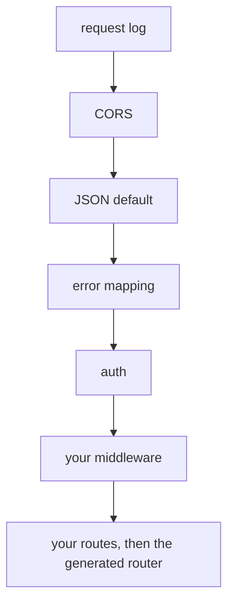

# Middleware

> Read the Shelf pipeline around the generated router, know where errors become responses, and add middleware, routes, a maintenance switch or a rate limit.

`BeakServer` does not hand the router to Shelf raw. It wraps it in a fixed pipeline, and your own middleware joins that pipeline at one defined spot. After this page you can say which layer answers what, throw a typed exception from your own code and get the right status, and add a header, a route, a maintenance switch or a rate limit.

## At a glance

Outermost first. A request falls through this list on the way in and climbs back out on the way to the response.

| Layer | Job | Configure with |
| --- | --- | --- |
| Request log | Tags the request with an id, times it, reports one entry | `onRequest:` |
| CORS | Adds the cross-origin headers, answers `OPTIONS` with `204` | `corsOrigin:` |
| JSON default | Sets `content-type: application/json` when a handler set none | nothing |
| Error mapping | Turns every thrown `BeakException` into a status and a JSON body, and anything else into an opaque `500` | `onUnexpectedError:` |
| Auth | Runs the guard and stores the principal in the request | `authSessions:`, `authGuard:` |
| Your middleware | Runs with the principal available | `middleware:` |
| Your routes | Tried before the generated API, and the API answers what they do not match | `routes:` |
| The generated router | `/api/...`, the probes, the file route | `policy:` and the rest of `build` |

The order is the design. It is built once, in `BeakServer.handler`:

```dart title="packages/beak_backend/lib/src/server/beak_server.dart"
late final Handler handler = _middleware
    .fold(
      const Pipeline()
          .addMiddleware(beakRequestLogMiddleware(onRequest: _onRequest))
          .addMiddleware(beakCorsMiddleware(allowedOrigin: _corsOrigin))
          .addMiddleware(beakJsonMiddleware())
          .addMiddleware(
            beakErrorMappingMiddleware(onUnexpectedError: onUnexpectedError),
          )
          .addMiddleware(beakAuthMiddleware(guard: _authGuard)),
      (Pipeline pipeline, Middleware next) => pipeline.addMiddleware(next),
    )
    .addHandler(_router);
```



Logging is outermost, so it times and tags everything, errors included. Error mapping sits below CORS and JSON, so a mapped error still gets its content type and its CORS headers on the way out. Auth is inside error mapping, so a bad token that throws becomes a `401` and not a crash. Your middleware is inside all of it: it sees the principal, and what it throws is mapped like anything else.

## The layers

### Request log and request ids

The outermost layer tags every request with an id, reusing an incoming `x-request-id` when there is one, and reports the served request with its timing:

```dart title="packages/beak_backend/lib/src/server/middleware/request_log_middleware.dart"
Middleware beakRequestLogMiddleware({
  required BeakRequestLogger onRequest,
  BeakRequestIdFactory? requestIdFactory,
}) {
  final BeakRequestIdFactory nextRequestId =
      requestIdFactory ?? _randomRequestId;
  return (Handler inner) => (Request request) async {
    final stopwatch = Stopwatch()..start();
    final String requestId = request.headers['x-request-id'] ?? nextRequestId();
    final Response response = await inner(
      request.change(context: {_requestIdContextKey: requestId}),
    );
    stopwatch.stop();
    onRequest(
      BeakRequestLogEntry(
        requestId: requestId,
        method: request.method,
        path: request.url.path,
        statusCode: response.statusCode,
        duration: stopwatch.elapsed,
      ),
    );
    return response.change(headers: {'x-request-id': requestId});
  };
}
```

The id is stored in the request context (read it downstream with `beakRequestId(request)`), echoed as the `x-request-id` response header, and stamped into every error body as `requestId`. One string then finds the log line, the header and the JSON error a client reports. Because a client can send its own id, treat it as a label, not as proof of anything.

The default `onRequest` writes one line per request to stderr. `beakJsonRequestLogger()` writes one JSON object per line, which is what a log aggregator can index:

```console
$ dart run bin/serve.dart
[781a5f186f4c00c9] POST /api/products/query -> 200 (11ms)
```

```console
{"requestId":"c8c30fbbe2faa4ce","method":"POST","path":"/api/products/query","statusCode":429,"durationMs":0}
```

The path is logged without its query string, and bodies and tokens are never logged. Pass the JSON logger the way you pass any option:

```dart
  onRequest: beakJsonRequestLogger(),
```

### CORS

`beakCorsMiddleware` adds the cross-origin headers to every response and answers `OPTIONS` with `204` without calling the rest of the pipeline:

```dart title="packages/beak_backend/lib/src/server/middleware/cors_middleware.dart"
Middleware beakCorsMiddleware({String allowedOrigin = '*'}) {
  final headers = <String, String>{
    'access-control-allow-origin': allowedOrigin,
    'access-control-allow-methods': 'GET, POST, PATCH, DELETE, OPTIONS',
    'access-control-allow-headers':
        'authorization, content-type, if-unmodified-since, x-request-id',
  };
  return (Handler inner) => (Request request) async {
    if (request.method == 'OPTIONS') {
      return Response(204, headers: headers);
    }
    final Response response = await inner(request);
    return response.change(headers: headers);
  };
}

```

The default origin is `*`. `corsOrigin: 'https://admin.example.com'` pins it, and it takes one origin, not a list. The headers land on every response, including errors and the `503` of a maintenance switch, because the middleware is outermost but for the log. That matters: a browser hides a response from a page when its CORS headers are missing, so an error without them shows up as "network error". The allowed methods are `GET`, `POST`, `PATCH`, `DELETE` and `OPTIONS`, the ones the generated routes use. If the panel and the API share an origin behind your proxy, no cross-origin call happens at all, see [Going to production](../shipping/going-to-production.md).

### JSON defaulting

`beakJsonMiddleware` sets the content type to JSON when a handler set none, and leaves explicit content types alone. That is what lets the CRUD handlers return `jsonEncode(...)` without a header while the CSV export and file downloads keep theirs:

```dart title="packages/beak_backend/lib/src/server/middleware/json_middleware.dart"
Middleware beakJsonMiddleware() =>
    (Handler inner) => (Request request) async {
      final Response response = await inner(request);
      if (response.headers.containsKey('content-type')) {
        return response;
      }
      return response.change(
        headers: {'content-type': 'application/json; charset=utf-8'},
      );
    };
```

The flip side applies to your own responses. Anything you return without a content type goes out labelled JSON, a plain-text `Response.ok('pong')` included. Set the content type yourself when the body is not JSON.

The same file has the request-side helpers handlers use, `readJsonObject` and `readBeakSpec`. A body that is not valid JSON, or a spec that fails to decode, becomes a `BeakValidationException` right there, and the next layer maps it to a `422`. Use them in your own routes.

### Error mapping: the one catch boundary

This is the only place in the backend that catches. It maps every `BeakException` to a status and a JSON body, and every other failure to an opaque `500`, reported to `onUnexpectedError`, so internals never leak:

```dart title="packages/beak_backend/lib/src/server/middleware/error_mapping_middleware.dart"
Middleware beakErrorMappingMiddleware({
  BeakUnexpectedErrorListener? onUnexpectedError,
}) =>
    (Handler inner) => (Request request) async {
      try {
        return await inner(request);
      } on BeakException catch (exception, stackTrace) {
        if (exception is BeakStorageException) {
          // A driver's message quotes the failure of the system behind it
          // (an endpoint, a bucket, a host). The operator gets all of it; the
          // caller learns only that storage failed.
          onUnexpectedError?.call(exception, stackTrace);
          return _jsonResponse(500, {
            'code': exception.code,
            'message': 'File storage failed.',
            ..._requestIdEntry(request),
          });
        }
        return _exceptionResponse(exception, request);
      } catch (error, stackTrace) {
        onUnexpectedError?.call(error, stackTrace);
        return _jsonResponse(500, {
          'code': 'internal',
          'message': 'Internal server error.',
          ..._requestIdEntry(request),
        });
      }
    };
```

Because the boundary exists, handlers and services do not `try/catch` for their own errors. They throw a typed exception, and the mapping is an exhaustive switch over the sealed family, so a new exception type cannot ship without a status:

```dart title="packages/beak_backend/lib/src/server/middleware/error_mapping_middleware.dart"
final int statusCode = switch (exception) {
  BeakValidationException() => 422,
  BeakNotFoundException() => 404,
  BeakAuthenticationException() => 401,
  BeakAuthorizationException() => 403,
  BeakConflictException() => 409,
  BeakConfigurationException() => 500,
  BeakStorageException() => 500,
  BeakInternalException() => 500,
  BeakPayloadTooLargeException() => 413,
  BeakTransportException() => 502,
};
```

Every body carries `code`, `message`, `requestId` and, for validation, `fieldErrors`. The table of what raises each one is in [Exceptions](../reference/exceptions.md), and how the client rebuilds them is [Results and errors](../concepts/results-and-errors.md).

Untyped failures are opaque, and so is one typed failure: a `BeakStorageException`. A driver's message quotes the system behind it (an endpoint, a bucket, a host), so the caller gets `File storage failed.` and `onUnexpectedError` gets the exception with its full message. The other typed `500`, `BeakConfigurationException`, goes out as written, which is convenient for a misconfiguration.

`onUnexpectedError` receives the error and its stack trace and defaults to printing both to stderr. It also receives the failure a `503` from `/readyz` hides. Point it at your error tracker:

```dart
  onUnexpectedError: (error, stackTrace) => tracker.capture(error, stackTrace),
```

### Auth: resolve the principal

The auth layer runs the `BeakAuthGuard` and stores what it returns in the request context. Handlers and policies read it with `beakPrincipal(request)`. With no guard, every request is anonymous:

```dart title="packages/beak_backend/lib/src/server/middleware/auth_middleware.dart"
Middleware beakAuthMiddleware({BeakAuthGuard? guard}) =>
    (Handler inner) => (Request request) async {
      if (guard == null || beakProbePaths.contains(request.url.path)) {
        return inner(request);
      }
      final principal = await guard.authenticate(request);
      if (principal == null) {
        return inner(request);
      }
      return inner(request.change(context: {_principalContextKey: principal}));
    };

```

A guard that finds invalid credentials throws, error mapping sits above it, and the throw becomes a `401`. Guards, sessions and policies are [Auth and policies](auth-and-policies.md).

## Add your own

`defaults.build(middleware: [...])` takes Shelf middleware. It runs after authentication and inside error mapping, the first one listed outermost. Two consequences follow. It can read `beakPrincipal(request)`. And it can throw a typed exception and get a proper JSON response:

```dart
// Illustrative: a middleware in lib/server.dart, using real Beak names.
Middleware failOnHeader() => (Handler inner) => (Request request) {
  if (request.headers['x-fail'] == 'typed') {
    throw const BeakAuthorizationException('Blocked by the gateway rule.');
  }
  return inner(request);
};
```

```console
$ curl -s -w ' [%{http_code}]\n' localhost:8392/api/products/x -H 'x-fail: typed'
{"code":"authorization","message":"Blocked by the gateway rule.","requestId":"7ad2bbd040c719c3"} [403]
```

There is no exception for "try again later" or "not available", so a middleware that wants a `429` or a `503` returns a `Response` itself, and the JSON default labels it. The two recipes below do, and both were run against a scratch server.

### A maintenance switch

Your middleware sees every request, the probes included. Let the probes through, so the orchestrator still sees a live process, and answer the rest with `503` and `retry-after` while a flag file exists:

```dart
// Illustrative: lib/server.dart, with `dart:io` and `package:beak/server.dart` imported.
// Touch MAINTENANCE to switch it on, remove it to switch it off.
Middleware maintenanceMode(bool Function() isOn) =>
    (Handler inner) => (Request request) {
      final bool probe =
          request.url.path == 'healthz' || request.url.path == 'readyz';
      if (probe || !isOn()) {
        return inner(request);
      }
      return Response(
        503,
        headers: {'retry-after': '120'},
        body: '{"code":"maintenance","message":"Back soon."}',
      );
    };

BeakServer beakServer(BeakServerDefaults defaults) => defaults.build(
  middleware: [maintenanceMode(() => File('MAINTENANCE').existsSync())],
);
```

```console
$ touch MAINTENANCE
$ curl -s -i -X POST localhost:8392/api/products/query -H 'content-type: application/json' -d '{"table":"products"}' | grep -i '^HTTP\|retry-after'
HTTP/1.1 503 Service Unavailable
retry-after: 120
$ curl -s -w ' [%{http_code}]\n' localhost:8392/healthz
{"status":"ok"} [200]
```

The response carries the CORS headers, so the panel can read it. What the panel does with a `503` is a presentation question: [Maintenance and coming soon](../panel/maintenance-and-coming-soon.md) is its half, and it does not redirect on its own. The check costs one file lookup per request, which is fine for a switch and wrong for anything hotter.

### A rate limit

Beak has none. A proxy rule is better when you have a proxy. Without one, a middleware keyed by client address is a start:

```dart
// Illustrative: lib/server.dart, with `dart:io` and `package:beak/server.dart` imported.
// In-memory and per process.
Middleware rateLimit({required int perMinute}) {
  final Map<String, List<DateTime>> hits = {};
  return (Handler inner) => (Request request) {
    final String client = switch (request.context['shelf.io.connection_info']) {
      final HttpConnectionInfo info => info.remoteAddress.address,
      _ => 'unknown',
    };
    final DateTime now = DateTime.now();
    final List<DateTime> recent = (hits[client] ?? [])
        .where((at) => now.difference(at) < const Duration(minutes: 1))
        .toList();
    if (recent.length >= perMinute) {
      return Response(
        429,
        headers: {'retry-after': '60'},
        body: '{"code":"rate_limited","message":"Too many requests."}',
      );
    }
    hits[client] = [...recent, now];
    return inner(request);
  };
}
```

With `perMinute: 5`, the sixth request in a minute answers `429` and `retry-after: 60`. Behind a reverse proxy every request arrives from the proxy's address, so key by `x-forwarded-for` only if the proxy sets it and strips the client's own. The state lives in one process and is never pruned by key, so this protects a login route from a script, not a fleet from an attack.

### Extra routes

`routes:` takes a Shelf `Handler`, tried before the generated API. A route of yours wins on the same path, and a `404` or `405` from it falls through to the generated one:

```dart
  routes: Router()..get('/api/ping', (Request request) => Response.ok('pong')),
```

The response still passes through your middleware, error mapping and CORS. `Router`, `Request`, `Response`, `Handler`, `Middleware` and `Pipeline` come from `package:beak/server.dart`, so a project needs no direct `shelf` dependency.

## Rules and limits

| Rule | Consequence |
| --- | --- |
| Project middleware runs after auth and inside error mapping | It cannot see a request the guard rejected, and it cannot wrap the CORS or logging layers |
| No exception maps to `429` or `503` | Return a `Response` yourself |
| A response of yours with no content type is labelled JSON | Set `content-type` yourself when the body is plain text or a file |
| Your middleware also sees `/healthz` and `/readyz` | Beak's own guard skips them, but a guard or a switch of yours can still take the probes down. Let them through |
| `corsOrigin` is one origin | Several front ends need a proxy or a middleware that reflects an allowed origin |
| A client-supplied `x-request-id` is reused | Fine for correlation, useless for trust |
| A `BeakConfigurationException` sends its message | The body is visible to the caller. A `BeakStorageException` does not: the caller gets `File storage failed.` |
| The pipeline is built once, on first use | You cannot reorder the built-in layers, only add to them |
| Unexpected errors go to stderr by default | Set `onUnexpectedError` in production, or an incident leaves a stack trace nowhere you look |

## Verify it

Check the layers by their side effects. Every response has an `x-request-id`, an error is JSON with the same id in its body, and a preflight answers `204` with your origin:

```console
$ curl -s -i localhost:8392/nope | grep -i '^HTTP\|^x-request-id\|^{'
HTTP/1.1 404 Not Found
x-request-id: 49de7dfd08e82bf4
{"code":"not_found","message":"No handler for GET /nope.","requestId":"49de7dfd08e82bf4"}
$ curl -s -i -X OPTIONS localhost:8392/api/products/query -H 'origin: https://admin.example.com' | grep -i '^HTTP\|allow-origin'
HTTP/1.1 204 No Content
access-control-allow-origin: https://admin.example.com
```

Then trip your own middleware on purpose: a typed exception should come back as its status with a `requestId`, and an untyped one as `500` `Internal server error.` with the real error on stderr.

## Reference

- `packages/beak_backend/lib/src/server/beak_server.dart`: `BeakServer`, `BeakServer.handler`.
- `packages/beak_backend/lib/src/server/middleware/`: `request_log_middleware.dart`, `cors_middleware.dart`, `json_middleware.dart`, `error_mapping_middleware.dart`, `auth_middleware.dart`.
- [Backend flow](../architecture/backend-flow.md) follows one request through the whole stack.
- [REST API](../reference/rest-api.md#the-error-envelope) lists the error envelope and its codes.

## Continue reading

- [Auth and policies](auth-and-policies.md) the guard and the policy this pipeline feeds.
- [The generated API](../reference/rest-api.md) the router at the bottom of the stack.
- [Exceptions](../reference/exceptions.md) the sealed family the error mapper switches on.
- [Security](../shipping/security.md) CORS, headers and the limits a proxy should cover.
