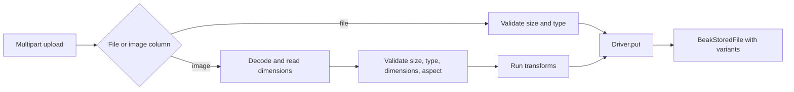

# Uploads and storage wiring

> Turn a file column into an upload endpoint and choose a storage driver with one environment variable.

By the end of this page you can turn on file uploads for a model's image or file
columns, understand the validate-transform-store pipeline each upload runs, and
point storage at memory, local disk, S3, or FTP by setting one environment
variable. No upload endpoint is hand-written: declare a file column, configure a
driver, and the route appears.

Uploads build on the [file and storage columns](../models/files-and-storage-columns.md)
you already defined. The reference store's product declares one `@Image` field,
and that is what wires into an endpoint here.

The canonical shop declares its upload in `resources/products/models/product_image.dart`
and places the owned collection with `ProductModel.images.galleryForm(...)`.
See [uploads and galleries](../forms/uploads-and-galleries.md) for the complete example.

`beak prepare` turns that into a `BeakImageColumn` on the generated model, which
is what the upload service reads its rules from.

## The pipeline: validate, transform, store

`UploadService` is the logic layer behind the upload routes. It resolves the
target column, enforces that column's file rules, runs the image transform
pipeline, and stores every result through the configured driver. Handlers stay
thin; the service throws only typed exceptions.



The entry point is `handle`, which pattern-matches on the resolved column. A file
column takes the plain path; an image column takes the transform path; anything
else is a validation error, because you cannot upload to a string column.

```dart title="packages/beak_backend/lib/src/uploads/upload_service.dart"
Future<BeakStoredFile> handle({
  required String table,
  required String columnKey,
  required BeakUpload upload,
}) async {
  switch (_columnOf(table, columnKey)) {
    case final BeakFileColumn fileColumn:
      return _storeFile(fileColumn, upload);
    case final BeakImageColumn imageColumn:
      return _storeImage(imageColumn, upload);
    case final BeakColumn other:
      throw BeakValidationException(
        'Column "$columnKey" of "$table" is a ${other.runtimeType}; '
        'uploads need a file or image column.',
      );
  }
}
```

For an image, the service first decodes the bytes (an empty transform pipeline is
a decode pass-through that also yields the real dimensions), validates size, type,
dimensions, and aspect ratio against the column, then runs the column's
transforms. The reference product's transforms produce a WebP main file plus a
160x160 thumbnail, and both come back as a `BeakStoredFile` with its `variants`
map populated. Client filenames are never trusted for storage keys; the service
mints its own.

## The upload routes

Registering a model adds two routes under its mount point, so the full paths are
`POST` and `DELETE /api/{table}/{columnKey}/upload`.

```dart title="packages/beak_backend/lib/src/uploads/upload_router.dart"
void registerUploadRoutes(
  Router router, {
  required BeakModel model,
  required UploadService service,
  BeakPolicy policy = const BeakAllowAllPolicy(),
  BeakDataSource? dataSource,
}) {
  final handlers = BeakUploadHandlers(
    model: model,
    service: service,
    policy: policy,
    dataSource: dataSource,
  );
  router
    ..post('/<columnKey>/upload', handlers.upload)
    ..get('/<columnKey>/upload', handlers.url)
    ..delete('/<columnKey>/upload', handlers.remove);
}

```

The upload handler checks `canCreate` (uploading a file is creating one), then
reads the multipart body into a typed `BeakUpload` and delegates to the service.

Upload creation checks the table policy and upload field capability before
accepting multipart content. The upload service validates the file and cleans up
partially stored variants when a transform or storage operation fails. URL reads
also verify visible row ownership, and key-aware policy can further restrict them.

The size limit is enforced *while reading*, not after. `_readBounded` fails the
moment the buffered part grows past the column's `maxSizeInBytes`, so an oversize
upload never buffers fully into memory.

```dart title="packages/beak_backend/lib/src/uploads/upload_handler.dart"
Future<Uint8List> _readBounded(
  Stream<List<int>> source,
  int? maxSizeInBytes,
) async {
  final builder = BytesBuilder(copy: false);
  await for (final chunk in source) {
    builder.add(chunk);
    if (maxSizeInBytes != null && builder.length > maxSizeInBytes) {
      throw BeakValidationException(
        'Upload rejected.',
        fieldErrors: {
          'size': ['The file exceeds the limit of $maxSizeInBytes bytes.'],
        },
      );
    }
  }
  return builder.takeBytes();
}
```

Deletion is gated by the dedicated `canDeleteUpload` hook, because a stored file
is named by its storage key, not by a record id. The service also guards that the
key belongs to the column's storage path before it touches the driver, so a
request cannot delete an arbitrary object by guessing keys.

```dart title="packages/beak_backend/lib/src/uploads/upload_service.dart"
    if (!key.startsWith('$storagePath/') ||
        key.split('/').any((segment) => segment == '..' || segment == '.') ||
        key.contains('\\')) {
      throw BeakValidationException(
        'Key "$key" does not belong to column "$columnKey" '
        '(expected the "$storagePath/" prefix).',
      );
    }
```

Uploading a product image against the reference store on port 8080:

```bash
curl -sX POST http://localhost:8080/api/products/image/upload \
  -F 'file=@house-roast.png;type=image/png'
# 201 {"key":"products/...webp","url":"...","variants":{"thumbnail":{...}}}
```

| Method and path | Body | Success | Gated by |
| --- | --- | --- | --- |
| `POST /api/{table}/{columnKey}/upload` | multipart, field `file` | `201` `BeakStoredFile` | `canCreate` |
| `DELETE /api/{table}/{columnKey}/upload` | `{"key": ...}` | `204` | `canDeleteUpload` |

See [Auth and policies](auth-and-policies.md) for the two gates, and
[Files and storage columns](../models/files-and-storage-columns.md) for the file
rules the service enforces.

## Choosing a driver

A `BeakStorageDriver` is where bytes actually land. Beak keeps drivers behind a
`BeakStorageRegistry`. `createDefaultStorageRegistry` builds one with the two
drivers Beak ships in-box: `memory` (registered by the registry itself) and
`local`, added here because it needs `dart:io`.

```dart title="packages/beak_backend/lib/src/server/storage_wiring.dart"
BeakStorageRegistry createDefaultStorageRegistry() {
  final registry = BeakStorageRegistry();
  registry.register('local', BeakLocalDiskStorageDriver.fromConfig);
  return registry;
}
```

Driver packages are deliberately left out. Depending on `beak_storage_s3` here
would put `minio` in the dependency graph of every Beak backend, whether or not
it uploads anything. A project declares the drivers it wants in a
`beakStorageRegistry` function in `lib/server.dart`, which `beak prepare` hands
to the generated host:

Register optional driver packages in a `beakStorageRegistry()` function in
`lib/server.dart`. See [custom storage drivers](../extending/custom-storage-drivers.md)
for the explicit registration contract.

`resolveStorage` takes a `BeakStorageConfig` and returns the driver it selects.
The server resolves once at startup and injects the driver into the upload
service.

```dart title="packages/beak_backend/lib/src/server/storage_wiring.dart"
BeakStorageDriver resolveStorage(
  BeakStorageConfig config, {
  BeakStorageRegistry? registry,
}) => (registry ?? createDefaultStorageRegistry()).resolve(config);

```

To add a driver of your own, register it on the registry before you resolve, and
pass that registry to `resolveStorage`. See
[Custom storage drivers](../extending/custom-storage-drivers.md) for the driver
interface.

### One environment variable picks the driver

You do not write that parsing. `BeakStorageSettings.fromEnv` reads
`BEAK_STORAGE_DRIVER` and turns it into a `BeakStorageConfig?`: `s3` builds a
`BeakS3Config` from the `BEAK_S3_*` variables, `ftp` and `local` do the same for
their own sets, `memory` selects the in-memory driver (tests), and `none` says
this deployment wants no upload surface at all.

```dart title="packages/beak_backend/lib/src/server/beak_storage_settings.dart"
static BeakStorageConfig? fromEnv(Map<String, String> environment) {
  String require(String key) {
    final String? value = environment[key];
    if (value == null || value.isEmpty) {
      throw BeakConfigurationException(
        '$key is required when $driverKey=${environment[driverKey]}.',
      );
    }
    return value;
  }

  switch (environment[driverKey]) {
    case 's3':
      return BeakS3Config(
        endpoint: Uri.parse(require('BEAK_S3_ENDPOINT')),
        bucket: require('BEAK_S3_BUCKET'),
        accessKey: require('BEAK_S3_ACCESS_KEY'),
        secretKey: require('BEAK_S3_SECRET_KEY'),
        region: require('BEAK_S3_REGION'),
        usePathStyle: environment['BEAK_S3_USE_PATH_STYLE'] == 'true',
      );
    // ...the ftp, local and memory cases...
    case 'none' || null || '':
      return null;
    case final String other:
      throw BeakConfigurationException(
        'Unsupported $driverKey "$other" — use one of '
        '${supportedDrivers.join(', ')}.',
      );
  }
}
```

The `require` closure is why an incomplete config fails loudly at startup instead
of surfacing as a mysterious 500 on the first upload. Selecting `s3` with a
missing `BEAK_S3_BUCKET` throws a `BeakConfigurationException` before the server
binds, and a typo in the driver name fails the same way, with the supported names
in the message.

| Variable | Meaning |
| --- | --- |
| `BEAK_STORAGE_DRIVER` | `s3`, `ftp`, `local`, `memory`, `none`, or unset (local disk) |
| `BEAK_S3_ENDPOINT` | the object-store endpoint URL |
| `BEAK_S3_BUCKET` | the bucket uploads land in |
| `BEAK_S3_ACCESS_KEY` / `BEAK_S3_SECRET_KEY` | credentials |
| `BEAK_S3_REGION` | the region string |
| `BEAK_S3_USE_PATH_STYLE` | `true` for MinIO and path-style hosts |
| `BEAK_LOCAL_ROOT_DIR` / `BEAK_LOCAL_PUBLIC_BASE_URL` | where local-disk files live and how they are served |
| `BEAK_FTP_HOST` / `BEAK_FTP_USER` / `BEAK_FTP_PASSWORD` | FTP credentials |
| `BEAK_FTP_BASE_DIR` / `BEAK_FTP_PUBLIC_BASE_URL` / `BEAK_FTP_PORT` | FTP path, public URL, and port (default `21`) |

The repo's docker-compose stack ships a MinIO container, and the committed
`.env.example` points at it with path-style on, so `melos run up` plus the sample
values gives you a working S3-compatible target locally. See
[Environment and config](../shipping/environment-and-config.md) for the full
variable list.

## Turning uploads on

There is nothing to turn on. The generated host resolves the driver for you in
`resolveStorageDriver`. With nothing configured it falls back to local disk under
`storage/uploads`, served by the same server at `/uploads`, so a file column works
on a fresh project with no setup. `BEAK_STORAGE_DRIVER=none` is how you switch the
upload endpoints off outright.

```dart title="packages/beak_backend/lib/src/server/beak_serve_host.dart"
BeakStorageDriver? resolveStorageDriver() {
  final BeakStorageConfig? storageConfig = BeakStorageSettings.fromEnv(
    _environment,
  );
  if (storageConfig == null) {
    return _environment[BeakStorageSettings.driverKey] == 'none'
        ? null
        : BeakLocalDiskStorageDriver(
            rootDir: defaultUploadDir,
            publicBaseUrl: Uri.parse(
              'http://$_reachableHost:${config.port}$defaultUploadPath',
            ),
          );
  }
  return resolveStorage(
    storageConfig,
    registry: storageRegistry?.call() ?? createDefaultStorageRegistry(),
  );
}
```

The driver goes into `BeakServer`, which builds the `UploadService` and registers
the upload routes for every model with a file column. A `null` driver means no
upload endpoints at all.

```dart
Future<HttpServer> serve() async {
  await initializeWormPostgres(config);
  final server = buildServer(
    adapter: Worm.adapter(),
    storage: resolveStorageDriver(),
  );
  return server.start();
}
```

That is the whole loop: an environment variable becomes a config, the config
resolves to a driver, the driver goes into the server, and every image column in
the registry gains a validated, transforming upload endpoint. A driver from a
plug-in package joins the loop through the `beakStorageRegistry` function above,
which the host reads as `storageRegistry`.

## Continue reading

- [Files and storage columns](../models/files-and-storage-columns.md) the column
  side: file rules, dimensions, and transforms.
- [Running the server](running-the-server.md) the `BeakServer` constructor that
  ties the driver in.
- [Custom storage drivers](../extending/custom-storage-drivers.md) writing a
  driver for a backend Beak does not ship.
- [Environment and config](../shipping/environment-and-config.md) every
  `BEAK_*` variable, including the storage set.
- [Auth and policies](auth-and-policies.md) the `canCreate` and
  `canDeleteUpload` gates on the upload routes.
