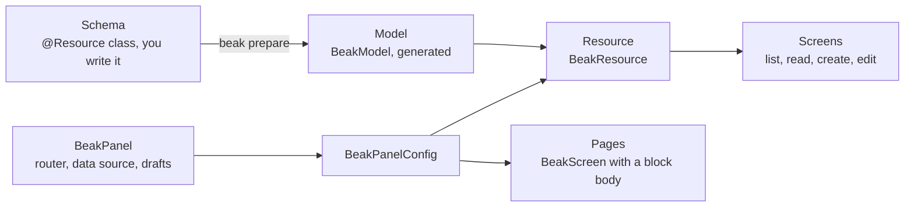

# Declarative resources

> Schema, model, resource, screen and page: what each one decides, what Beak's runtime does with them, and why you write no fetching code.

You describe what your data is once, then what the panel shows. Everything in between (fetching, drafts, validation, saving, refreshing) is Beak's job. This page names the five things you write or generate and says where each one stops.

## The idea in one picture



Each piece decides one thing and nothing else.

| Piece | Class | Who writes it | Decides |
| --- | --- | --- | --- |
| Schema | your class, `extends BeakSchema`, annotated `@Resource` | you | What the data is: types, nullability, rules, relationships, behavior. |
| Model | a `BeakModel` subclass such as `NoteModel` | `beak prepare` | The same facts as runtime metadata, plus typed field references. |
| Resource | `BeakResource` | a generated default, or you | How the model shows up in the panel: sidebar entry, filters, actions. |
| Screen | a `BeakResourceScreen`: `BeakTableScreen`, `BeakFormScreen`, `BeakWizardScreen`, `BeakCustomResourceScreen` | you, optional | What one route of a resource looks like. |
| Page | `BeakScreen`, listed in `BeakPanelConfig.pages` | you, optional | What is on a route that belongs to no resource. |

The class names don't follow this vocabulary perfectly: a page is a `BeakScreen`, and a screen is a `BeakResourceScreen`. Beak's own error messages say "page" for the first, and these docs do too. (`BeakPage<T>` is something else: one page of query results.)

## How it works

Code first. Here is the smallest complete path, from the quickstart scaffold.

### The schema says what the data is

```dart title="examples/quickstart/lib/resources/notes/models/note.dart"
@Resource(timestamps: true)
final class Note extends BeakSchema {
  @Display()
  @Column(searchable: true, sortable: true, rules: [BeakMaxLength(255)])
  late final String title;

  @Column(visibleOn: {BeakContext.form, BeakContext.detail})
  late final BeakText? body;

  @Column(filterable: true)
  late final bool pinned;
}
```

The Dart type picks the column kind, nullability decides whether a value is required, and `@Column` carries what a type cannot say: a label, rules, whether the table may sort or search the field. A class annotated with `@Resource` anywhere under `lib/` is found by `beak prepare`, so there is no registry to edit.

### The model is generated

`beak prepare` writes `note.beak.dart` next to the schema. The model in it is what the rest of Beak actually holds.

```dart title="examples/quickstart/lib/resources/notes/models/note.beak.dart"
final class NoteModel extends BeakModel {
  const NoteModel();
  // ...
  @override
  String get table => 'notes';

  @override
  String get displayColumnKey => 'title';

  @override
  List<BeakColumn> get columns => NoteColumns.values;
  // ...
}
```

The model is `const`, pure Dart and free of Flutter, because the server loads it too. That is why model and resource are two things. In the Serverpod example, `bookshop_beak` depends on `beak_core` alone, so the Serverpod server can register the models without pulling in a UI toolkit (see `examples/serverpod/README.md`).

### A resource puts the model in the panel

Every model gets a default resource, unless `beak.yaml` hides it (a hidden resource keeps its model and its API). The quickstart's is generated into `lib/beak/panel.g.dart`.

```dart title="examples/quickstart/lib/beak/panel.g.dart"
      BeakResource(
        model: const NoteModel(),
        icon: BeakIconToken(OiIcons.fileText),
        navigationGroup: 'Content',
      ),
```

The icon and the group came from `beak.yaml`. Everything else is a default: a list, a show page, a create page and an edit page, all built from the model.

To configure more, write a resource of your own. It replaces the default for its model. Filters and screens are the two parameters you will reach for first.

```dart title="examples/serverpod/bookshop_admin/lib/resources/book_resource.dart"
/// The Books section, in Beak's golden-path style.
///
/// Every reference is a typed ref of the `Book` model in `bookshop_beak`: a
/// renamed or retyped field stops this file compiling where it used the field.
final class BookResource extends BeakResource {
  /// Creates the Books section.
  BookResource()
    : super(
        model: const BookModel(),
        title: 'Books',
        filters: [
          BookModel.title.textFilter(),
          BookModel.author.relationFilter(),
          BookModel.format.selectFilter(),
          BookModel.priceInCents.numberRangeFilter(label: 'Price'),
        ],
        screens: [
          BeakTableScreen(
            fields: [
              BookModel.title,
              BookModel.author.name,
              BookModel.format,
              BookModel.priceInCents,
              BookModel.stock,
            ],
          ),
          BeakFormScreen(
            roles: const {
              BeakScreenRole.read,
              BeakScreenRole.create,
              BeakScreenRole.edit,
            },
            layout: BeakFormLayout(
              children: [
                BookModel.title.inputText(),
                BookModel.isbn.inputText(),
                BookModel.author.inputCombobox(),
                BookModel.format.inputSelect(),
                BookModel.priceInCents.inputNumber(),
                BookModel.stock.inputNumber(),
              ],
            ),
          ),
        ],
      );
}
```

Every reference in it is a generated one (`BookModel.title`, `BookModel.author.name`). Rename the field in the schema and this file stops compiling where it used it.

### Screens fill the route roles of a resource

A resource has four routes. A screen fills one or more of them, and a role without a screen keeps its generated default.

| Role | Route | Filled by |
| --- | --- | --- |
| `BeakScreenRole.list` | `/{table}` | `BeakTableScreen`, or `BeakCustomResourceScreen` |
| `BeakScreenRole.read` | `/{table}/{id}` | `BeakFormScreen` with `read` in its roles, or a custom screen |
| `BeakScreenRole.create` | `/{table}/create` | `BeakFormScreen`, `BeakWizardScreen` |
| `BeakScreenRole.edit` | `/{table}/{id}/edit` | `BeakFormScreen`, `BeakWizardScreen` |

A `BeakFormScreen` serves `create` and `edit` unless you say otherwise. The bookshop widens it to `read` as well, so one layout serves all three modes and the read view can't drift from the form.

### A page owns a route that has no resource

A dashboard, a printable document or a settings screen belongs to no model. That is a `BeakScreen`.

```dart title="packages/beak_frontend/lib/src/panel/beak_screen.dart"
/// Creates a custom screen routed at [path].
const BeakScreen({
  required this.path,
  required this.title,
  required this.icon,
  required this.body,
  this.navigationTitle,
  this.navigationGroup,
  this.showInNav = true,
  this.framed = true,
});
```

A page has a path, a title, an icon and a `BeakBlock` body. The data blocks query through the panel's data source themselves, so a dashboard needs no view model of yours. [The block system](the-block-system.md) covers what goes in the body.

### The runtime is not yours

Nothing above fetches, paginates or saves. `BeakPanel` does, and it does it inside a scope of its own.

```dart title="packages/beak_frontend/lib/src/panel/beak_panel.dart"
final routing = useMemoized(() {
  final container = GetIt.asNewInstance();
  registerBeakDependencies(
    locator: container,
    config: config,
    dataSource: dataSource,
    httpClient: httpClient,
  );
  final authRefresh = config.auth == null
      ? null
      : BeakAuthRouterRefresh(
          config.auth?.adapter ?? container<BeakSessionStore>(),
        );
  return (
    container: container,
    router: createBeakRouter(config, authRefresh: authRefresh),
    authRefresh: authRefresh,
  );
  // The seams are part of the key: swapping a fake on rebuild used to
  // keep the previous one registered, so a test could not change source
  // mid-flight and never learned it had not.
}, [config, dataSource, httpClient]);
```

`GetIt.asNewInstance()` is a fresh container, not the global one, so two panels (or a panel and your own app) never share registrations. `registerBeakDependencies` puts the model registry, the HTTP client, the session store and the data source into it, and `createBeakRouter` builds flat go_router routes from the resources' `BeakRoutes` paths. A custom widget reaches the container with `beakDependencies(context)`, and rarely needs to.

Above that, two objects own the state you would otherwise write by hand. A list keeps its query spec, current page and error in a `BeakTableViewModel`. A form keeps a `BeakFormSession`: a local copy of the record and its nested rows, validation, conflict detection and save state. You configure both; you don't subclass either.

## Why it is shaped this way

Configuration is checked before anything renders. Everything you write above is a plain object. That has a price: to change how a form looks you change an object graph, not a `build` method. In return Beak can check it once. `BeakPanelConfig.buildRegistry` runs when the panel first builds and throws a `BeakConfigurationException` for a table registered twice, two screens claiming one role, a form screen on the list route, a table-screen query aimed at another table, a home destination that isn't in the panel, and a panel with nothing to show. A broken resource fails on startup, not on the third click.

The split follows the dependency line. The model must load on a server that has never heard of Flutter, and the resource needs `obers_ui`. Putting facts about the data on one side of that line and presentation on the other is why the schema never mentions a sidebar icon, and why the same `bookshop_beak` package serves a Serverpod server and a Flutter admin.

Writing widgets instead is possible, and it is the cheaper option for one odd screen. Three doors exist: `BeakCustomResourceScreen` replaces the routes of a resource with your widget, `BeakWidgetBlock` embeds one in a page, `BeakFormWidget` embeds one in a form. They cost you what the declarative path gives for free: the startup checks, draft handling and the shared look. Use them last, and keep the widget small.

There are also two ways to boot the panel around these objects, a generated `BeakApp` and an authored `BeakPanel(resources: [...])`. Both are supported; [Two ways to boot a panel](../start-here/generated-or-authored.md) helps you pick.

## What it means for you

| You want | Put it on | Not on |
| --- | --- | --- |
| A rule every caller must obey (required, length, uniqueness, a derived total) | the schema class: `@Column(rules:)`, `validationRules`, `behavior` | a `BeakInput` in a screen |
| A sidebar entry, filters, row actions | the `BeakResource` | the schema |
| A different form or table layout | a `BeakFormScreen` or `BeakTableScreen` | a new widget |
| A dashboard or a document view | a `BeakScreen` with blocks | a resource |
| A widget with logic of its own | `BeakCustomResourceScreen`, `BeakWidgetBlock` or `BeakFormWidget` | anywhere else |

Three smaller things:

- A model reached only through a relationship needs no resource. It is registered through `relatedModels`, keeps its API, and gets no sidebar entry.
- `canCreate`, `canEdit` and `canDelete` on a resource, and `BeakModel.permissions`, decide what the panel offers. They don't decide what the server accepts. [Where authority lives](where-authority-lives.md) draws that line.
- `@Resource` is the annotation on a schema class, `BeakResource` is the panel class. They are unrelated. The annotation has no `Beak` prefix so both fit in one import.

## Continue reading

- [Defining models](../models/defining-models.md) every annotation a schema class takes.
- [Resources](../panel/resources.md) the parameters of `BeakResource`, one by one.
- [Form screens](../forms/form-screens.md) layouts, roles and sections for `BeakFormScreen`.
- [Custom screens](../panel/custom-screens.md) pages, blocks and the widget escape hatches.
- [Two ways to boot a panel](../start-here/generated-or-authored.md) the generated `BeakApp` and the authored `BeakPanel`.
