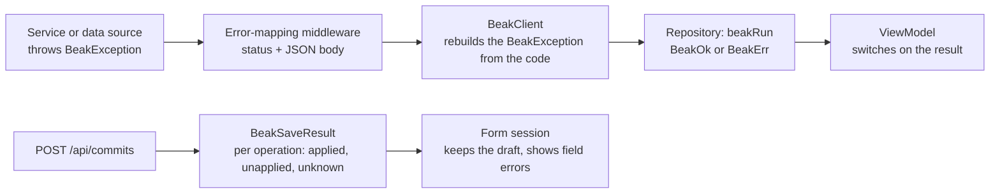

# Results and errors

> Keep typed failures, field feedback and uncertain writes distinct: BeakException on the server, BeakResult in the panel, a receipt for every save.

Beak reports a problem in three different ways, and they are not interchangeable. A thrown `BeakException` crosses a layer. A `BeakResult` carries a failure through the panel as a value. A save receipt says, per operation, whether a write happened, did not, or can't be proven either way. After this page you can tell which one you are looking at and what the panel does with it.

## The idea in one picture



The top row is the ordinary path for reads and single-record writes. The bottom row is the save path, where a failure is data inside a successful HTTP response.

## How it works

### The server throws, one place answers

Every failure Beak raises is a `BeakException`. The family is sealed, and each variant carries a stable `code` for the wire and a human-readable `message`.

```dart title="packages/beak_core/lib/src/common/beak_exception.dart"
@immutable
sealed class BeakException implements Exception {
  /// Creates an exception carrying a stable [code] and a [message].
  const BeakException({required this.code, required this.message});

  /// Stable machine-readable identifier of the failure category.
  final String code;

  /// Human-readable description of what went wrong.
  final String message;

  @override
  String toString() => '$runtimeType($code): $message';
}
```

| Exception | `code` | HTTP | Raised when |
| --- | --- | --- | --- |
| `BeakValidationException` | `validation` | 422 | input violates a rule; carries `fieldErrors` |
| `BeakNotFoundException` | `not_found` | 404 | a record, route or receipt does not exist, or is outside the caller's row scope |
| `BeakAuthenticationException` | `authentication` | 401 | no valid identity |
| `BeakAuthorizationException` | `authorization` | 403 | the identity may not do this |
| `BeakConflictException` | `conflict` | 409 | a concurrent change, or a save id reused with different content |
| `BeakConfigurationException` | `configuration` | 500 | Beak is set up wrong; a developer error |
| `BeakStorageException` | `storage` | 500 | a storage driver failed |
| `BeakInternalException` | `internal` | 500 | the server failed unexpectedly, or a proxy answered with a 5xx |
| `BeakPayloadTooLargeException` | `payload_too_large` | 413 | a request body is larger than the host accepts |
| `BeakTransportException` | `transport` | 502 | a fault outside Beak's API that no other type fits |

Services and data sources throw and stay short. One middleware turns the exception into a response:

```dart title="packages/beak_backend/lib/src/server/middleware/error_mapping_middleware.dart"
final int statusCode = switch (exception) {
  BeakValidationException() => 422,
  BeakNotFoundException() => 404,
  BeakAuthenticationException() => 401,
  BeakAuthorizationException() => 403,
  BeakConflictException() => 409,
  BeakConfigurationException() => 500,
  BeakStorageException() => 500,
  BeakInternalException() => 500,
  BeakPayloadTooLargeException() => 413,
  BeakTransportException() => 502,
};
```

Anything that isn't a `BeakException` becomes `{"code":"internal","message":"Internal server error."}` with a 500, and the real error goes to `onUnexpectedError`. The client never sees it. Here is what a caller gets for a missing receipt, a spec that names a table nobody registered and a body that isn't JSON:

```console
$ curl -s localhost:8080/api/commits/nope
{"code":"not_found","message":"No receipt for save \"nope\".","requestId":"b68cac8d1c399273"}
$ curl -s -XPOST localhost:8080/api/notes/query -d '{"table":"orders"}'
{"code":"validation","message":"Unknown table \"orders\".","requestId":"ecc6eaef760e06cb"}
$ curl -s -XPOST localhost:8080/api/notes/query -d 'not json'
{"code":"validation","message":"Request body is not valid JSON: Unexpected character.","requestId":"40f1b3481447cc1f"}
```

The `requestId` also tags the server's request log line, so a bug report can be matched to the request that caused it.

### The client rebuilds the type

`BeakClient` turns the response body back into the exception the server threw, so a `BeakValidationException` in a service arrives in the panel as a `BeakValidationException` with the same `fieldErrors`.

```dart title="packages/beak_core/lib/src/client/beak_client.dart"
void _ensureSuccess(http.Response response) {
  if (response.statusCode >= 200 && response.statusCode < 300) {
    return;
  }
  final Map<String, Object?> body = _errorBody(response);
  final String message = switch (body['message']) {
    final String text => text,
    _ => 'HTTP ${response.statusCode}.',
  };
  throw switch (body['code']) {
    'validation' => BeakValidationException(
      message,
      fieldErrors: _fieldErrors(body),
    ),
    'not_found' => BeakNotFoundException(message),
    'authentication' => BeakAuthenticationException(message),
    'authorization' => BeakAuthorizationException(message),
    'conflict' => BeakConflictException(message),
    'storage' => BeakStorageException(message),
    'configuration' => BeakConfigurationException(message),
    'internal' => BeakInternalException(message),
    'payload_too_large' => BeakPayloadTooLargeException(message),
    'transport' => BeakTransportException(message),
    _ => _exceptionForStatus(response.statusCode, message, body),
  };
}

/// The exception a status alone implies, for a response that carries no
/// Beak error code: a proxy's HTML page, an empty body, a code from a newer
/// server.
BeakException _exceptionForStatus(
  int statusCode,
  String message,
  Map<String, Object?> body,
) => switch (statusCode) {
  401 => BeakAuthenticationException(message),
  403 => BeakAuthorizationException(message),
  404 => BeakNotFoundException(message),
  409 => BeakConflictException(message),
  413 => BeakPayloadTooLargeException(message),
  422 => BeakValidationException(message, fieldErrors: _fieldErrors(body)),
  >= 500 => BeakInternalException(message),
  _ => BeakTransportException(message),
};
```

The last arm is worth knowing. A code it doesn't recognise, or none at all, falls back to the HTTP status: `401`, `403`, `404`, `409`, `413` and `422` map to their types, every `5xx` to `BeakInternalException` and anything else to `BeakTransportException`. So a server failure is never reported as a configuration problem, and a proxy's HTML error page is a `BeakInternalException` with the message `HTTP 502.`. The panel's `BeakLocalizations.errorMessage` treats `BeakConfigurationException`, `BeakStorageException`, `BeakInternalException` and `BeakTransportException` as infrastructure detail and shows a generic "The operation could not be completed." instead of the message:

```dart title="packages/beak_frontend/lib/src/localization/beak_localizations.dart"
/// Displays already mapped domain failures while hiding infrastructure details.
///
/// A configuration, storage, internal or transport failure describes the
/// deployment rather than the user's request, so it shows the generic
/// [operationFailed] text and never the message.
String errorMessage(BeakException error) => switch (error) {
  BeakConfigurationException() ||
  BeakStorageException() ||
  BeakInternalException() ||
  BeakTransportException() => operationFailed,
  _ => error.message,
};
```

So a configuration, storage, internal or transport message never leaks into the UI, and a validation message always does. An untyped failure on the server reaches the panel as a `BeakInternalException` whose message is the fixed `Internal server error.`.

### The repository turns it into a value

`beakRun` is the panel's catch boundary. A `BeakException` becomes a `BeakErr`, success a `BeakOk`, and anything else is either mapped by `mapException` or rethrown:

```dart title="packages/beak_frontend/lib/src/data/beak_run.dart"
Future<BeakResult<T>> beakRun<T>(
  Future<T> Function() operation, {
  BeakException? Function(Exception exception, StackTrace stack)? mapException,
}) async {
  try {
    return BeakOk(await operation());
  } on BeakException catch (exception) {
    return BeakErr(exception);
  } on Exception catch (exception, stack) {
    final mapped = mapException?.call(exception, stack);
    if (mapped != null) return BeakErr(mapped);
    rethrow;
  }
}
```

`BeakResult<T>` is the sealed pair a view model switches on. Collapse both cases with `fold`, or rework only the success with `map`:

```dart title="packages/beak_core/lib/src/common/beak_result.dart"
sealed class BeakResult<T> {
  const BeakResult();

  /// Whether this result is a [BeakOk].
  bool get isOk;

  /// The success value; throws the wrapped [BeakException] on a [BeakErr].
  T get valueOrThrow;

  /// Reduces both cases into a single value of type [R].
  R fold<R>({
    required R Function(T value) onOk,
    required R Function(BeakException error) onErr,
  });

  /// Transforms the success value with [transform], leaving errors untouched.
  BeakResult<R> map<R>(R Function(T value) transform);
}
```

Programming errors (`Error`s, and exceptions nobody mapped) are not results. They propagate, on purpose. A widget that loads its own data reports failure the way `BeakMetricBlock` does: it keeps the error in state next to the loading flag and offers a retry, and it never renders a zero it invented (`packages/beak_frontend/lib/src/blocks/views/beak_metric_block_view.dart`).

```dart title="packages/beak_frontend/lib/src/blocks/views/beak_metric_block_view.dart"
final dataSource = beakDependencies(context)<BeakDataSource>();
final loaded = useState<({num value, num? previous})?>(null);
final loading = useState(true);
final error = useState<BeakException?>(null);
final attempt = useState(0);
final revision = useBeakDataRevision(
  dataSource,
  table: block.aggregate.table,
);
```

### Field errors name the field

A validation failure says which inputs are wrong. `fieldErrors` maps a column key to its messages, and the form puts each message under its input.

```dart title="packages/beak_core/lib/src/common/beak_exception.dart"
/// Raised when user-supplied data violates one or more column rules.
///
/// [fieldErrors] maps a column key to its messages, so a form can highlight
/// the offending inputs individually:
///
/// ```dart
/// throw const BeakValidationException(
///   'The product could not be saved.',
///   fieldErrors: {
///     'price': ['Must be greater than 0'],
///     'sku': ['Already taken'],
///   },
/// );
/// ```
final class BeakValidationException extends BeakException {
  /// Creates a validation failure with an overall [message] and optional
  /// per-field [fieldErrors].
  const BeakValidationException(String message, {this.fieldErrors = const {}})
    : super(code: 'validation', message: message);

  /// Validation messages aggregated per column key.
  final Map<String, List<String>> fieldErrors;

  @override
  String toString() => fieldErrors.isEmpty
      ? super.toString()
      : '${super.toString()} $fieldErrors';
}
```

The keys are strings on the wire, so a rule you write on the server doesn't spell one. It raises the error from the typed field:

```dart title="packages/beak_core/lib/src/model/beak_field_ref.dart"
/// A validation failure attached to this field.
///
/// A server-side rule throws it so the form highlights the field, without
/// the rule ever spelling a column key:
///
/// ```dart
/// if (quantity < 1) throw OrderItemModel.quantity.invalid('Order one.');
/// ```
BeakValidationException invalid(String message) => BeakValidationException(
  message,
  fieldErrors: {
    key: [message],
  },
);
```

For a belongs-to field the key is the foreign key that backs it, so the message lands on the picker.

### A save has three outcomes

A form save is not one call that either throws or doesn't. Each operation in the plan gets a status:

```dart title="packages/beak_core/lib/src/data/beak_commit.dart"
/// Whether a write is confirmed saved, confirmed unsaved, or unresolved.
enum BeakWriteOutcome {
  /// The write completed.
  applied,

  /// The write did not take place.
  unapplied,

  /// The provider cannot yet prove whether it took place.
  unknown,
}

/// The actual execution guarantee of a save.
enum BeakSaveMode {
  /// All changes committed together.
  atomic,

  /// Changes committed individually.
  staged,
}
```

| Status | Means | The form does |
| --- | --- | --- |
| `applied` | the write is confirmed | adopts the server's values as the new baseline and clears its errors |
| `unapplied` | it did not happen; may carry an `error` with `fieldErrors` and a `reason` | keeps the draft, shows the errors on the inputs, lets the user fix and save again under a new save id |
| `unknown` | nothing proves either way | locks editing and offers "Check save status" |

`BeakSaveResult.complete` is true only when every operation is `applied`, so a partial success never looks like a rollback or like completion. `hasUnknown` is true when any operation is `unknown`.

A rejection the server processes, such as a validation error, an authorization failure or a locked record, comes back as HTTP 200 with the operation `unapplied`, `reason` `rejected` or `rolledBack`, and the error inside the receipt. The whole transaction is rolled back, so nothing partial remains.

Unknown is what the panel reports when it cannot tell. It comes from one place:

```dart title="packages/beak_frontend/lib/src/data/beak_form_commit_repository.dart"
/// Turns a failed commit into a receipt that says exactly what is known.
///
/// A response the server never sent cannot prove that nothing was written, so
/// a lost connection, a timeout or an opaque 5xx becomes an `unknown` outcome
/// that only receipt recovery may resolve. A typed rejection (validation, size
/// limit, authentication, authorization, missing route, conflict) means the
/// server refused the request before running any write, so it becomes an
/// `unapplied` outcome and the form stays editable. The same save identity
/// remains available to the transport's recovery API.
final class BeakFormCommitRepository {
  /// Wraps a commit-capable source at the exception boundary.
  const BeakFormCommitRepository(this.source);

  /// Transport owning the save receipt.
  final BeakCommitDataSource source;

  /// Commits [plan], describing a failure as a receipt instead of throwing.
  ///
  /// The receipt of a failure the transport cannot classify claims
  /// [BeakSaveMode.staged] unless the source declares an atomic graph: it is
  /// the weaker guarantee, and the recovered receipt carries the real one.
  Future<BeakSaveResult> commit(BeakSavePlan plan) async {
    try {
      return await source.commit(plan);
    } on Exception catch (error) {
      final rejected = error is BeakException && _isDefiniteRejection(error);
      return BeakSaveResult(
        saveId: plan.saveId,
        mode: source.commitCapabilities.atomicGraph
            ? BeakSaveMode.atomic
            : BeakSaveMode.staged,
        outcomes: [
          for (final operation in plan.operations)
            BeakOperationResult(
              id: operation.id,
              status: rejected
                  ? BeakWriteOutcome.unapplied
                  : BeakWriteOutcome.unknown,
              reason: rejected ? 'rejected' : 'responseUnavailable',
              error: _failureFor(error, isRoot: operation.target == plan.root),
            ),
        ],
      );
    }
  }

  /// Reads the receipt of [saveId] without repeating any mutation.
  ///
  /// A missing receipt proves the server never received the plan, so every id
  /// in [operationIds] is reported `unapplied` with the reason `notReceived`
  /// and the form may save again. Any other failure is rethrown: the outcome
  /// is still unknown.
  Future<BeakSaveResult> recover(
    String saveId, {
    required Iterable<String> operationIds,
  }) async {
    try {
      return await source.recover(saveId);
    } on BeakNotFoundException {
      return BeakSaveResult(
        saveId: saveId,
        mode: source.commitCapabilities.atomicGraph
            ? BeakSaveMode.atomic
            : BeakSaveMode.staged,
        outcomes: [
          for (final id in operationIds)
            BeakOperationResult(
              id: id,
              status: BeakWriteOutcome.unapplied,
              reason: 'notReceived',
            ),
        ],
      );
    }
  }

  /// The failure recorded on one operation.
  ///
  /// A rejection of the whole plan cannot say which record a field error
  /// belongs to, so only the form root keeps them.
  static BeakSaveError _failureFor(Object error, {required bool isRoot}) {
    final failure = BeakSaveError.fromException(error);
    return isRoot
        ? failure
        : BeakSaveError(code: failure.code, message: failure.message);
  }

  /// Whether the server refused the request before it ran any write.
  static bool _isDefiniteRejection(BeakException error) => switch (error) {
    BeakValidationException() ||
    BeakPayloadTooLargeException() ||
    BeakAuthenticationException() ||
    BeakAuthorizationException() ||
    BeakNotFoundException() ||
    BeakConflictException() => true,
    BeakConfigurationException() ||
    BeakStorageException() ||
    BeakInternalException() ||
    BeakTransportException() => false,
  };
}
```

An exception thrown while sending a plan is sorted into one of two receipts. A typed refusal that the server states before it runs any write (`BeakValidationException` for a 422, `BeakPayloadTooLargeException`, `BeakAuthenticationException`, `BeakAuthorizationException`, `BeakNotFoundException` and `BeakConflictException`) produces an `unapplied` receipt with the reason `rejected`, and the form stays editable. Everything that cannot prove that nothing was written (a dropped connection, a timeout, a `BeakInternalException`, a `BeakTransportException`, a storage or configuration failure) produces an `unknown` receipt with the reason `responseUnavailable`. The panel does not resend an unknown save. It asks the server what it recorded for that save id:

```console
GET /api/commits/{saveId}
```

If the server stored a receipt, the answer resolves every operation to `applied` or `unapplied`, and the form carries on from there. Replaying the same plan is also safe when the source reports `idempotentReplay`, because the same save id returns the stored receipt without writing again. What is not safe is a blind resend under a new id, and the form never does that while a save is unknown.

If the server never stored a receipt for that id, the lookup answers 404. The panel reads that as "never received": every operation becomes `unapplied` with the reason `notReceived`, the form is editable again and a new save goes out under a new id. That covers a proxy that dropped the request or an unexpected error in your preparer before the server wrote its pending receipt. A failed lookup for any other reason (the network is still down, the server answers 5xx) leaves the save unknown, and the form keeps refusing to discard its changes until a lookup succeeds.

## Why it is shaped this way

Exceptions inside, values at the edge. Throwing keeps services and data sources short, and one catch per side keeps error shaping in one file. But a view model that had to `try/catch` would hide the failure path in control flow. `BeakResult` puts it in the type, and the sealed pair makes a caller handle both.

A receipt, because a network can lie. After a dropped connection you can't know whether the server wrote anything. Reporting that as success loses data quietly, and reporting it as failure invites a second insert. So the answer has a third value, `unknown`, and the only way out of it is to ask under the same identity.

A sealed exception family with a string `code`. The types give the server an exhaustive status switch and give a caller something to pattern-match. The `code` is the wire form and the fallback for a client that meets a code it doesn't know. It is also a string where an enum would do: `BeakOperationResult.reason` is a free string too (`rejected`, `rolledBack`, `notStarted`, `inFlight`, `responseUnavailable`), so compare against those values with care.

## What it means for you

- Throw a `BeakException` from your services and preparers. Let the middleware answer. Don't build HTTP responses by hand.
- Attach a validation message to a field with `Model.field.invalid('...')`, not with a hand-written `fieldErrors` map.
- Switch on `BeakResult` in a view model or widget. Handle `BeakErr` with a visible error and a retry, never with a default value that looks real.
- Wrap your own async workflows in `beakRun`, passing `mapException` for the host's exceptions, so they fail the same way the built-in ones do.
- When you call the API by hand, look for two shapes of failure: a 4xx with `code` for a direct write, and a 200 with `unapplied` operations for a commit.
- Never treat `unknown` as failure or as success. Ask for the receipt.

## Continue reading

- [Exceptions](../reference/exceptions.md) every variant, its code and its status.
- [Drafts, review and conflicts](../forms/drafts-and-review.md) how a form keeps its draft while errors are corrected.
- [Middleware](../backend/middleware.md) the server stack the error-mapping boundary sits in.
- [Graph commits](../architecture/graph-commits.md) receipts, replay and recovery in contributor detail.
