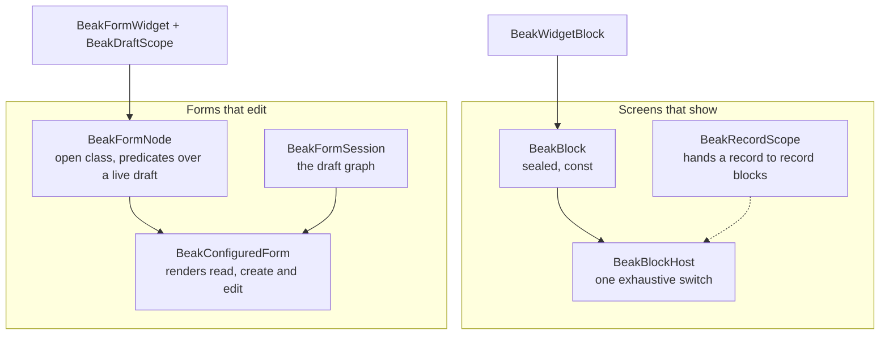

# The block system

> Blocks describe pages that read, form nodes describe forms that edit. Which one to use, why they are two systems, and how record and draft scopes connect them.

Two systems describe what is on a screen. Blocks describe screens that show things: dashboards, record sheets, list headers, dialogs. Form nodes describe forms that edit a record. This page tells you which one to reach for, and why Beak keeps them apart.

## The idea in one picture



A block is stateless. A form node always belongs to a draft. The record scope and the two widget doors are where they meet.

## How it works

### A block is data that shows

`BeakBlock` is a sealed class. A block carries configuration, no widget code, and no callbacks except where an interaction is the whole feature.

```dart title="packages/beak_frontend/lib/src/blocks/beak_block.dart"
sealed class BeakBlock {
  /// Creates a block, optionally sized by [span] inside grid parents.
  const BeakBlock({this.span});

  /// Grid tracks occupied inside a [BeakGridBlock]. An expanded [BeakRowBlock]
  /// uses its columns as relative width weights instead; ignored elsewhere.
  final BeakSpan? span;
}
```

Every concrete block (about fifty: layout, content, data, chart, record and module blocks) extends it. `BeakBlockHost` renders the tree, and its `build` is a single `switch` with no default arm, so adding a block type without teaching the host about it is a compile error.

```dart title="packages/beak_frontend/lib/src/blocks/beak_block_host.dart"
  Widget build(BuildContext context) => switch (block) {
    final BeakColumnBlock column => _column(context, column),
    final BeakRowBlock row => _row(context, row),
    // ... about fifty more arms, one per block type ...
    final BeakSpacerBlock spacer => SizedBox(height: spacer.heightInPixels),
    final BeakWidgetBlock widget => Builder(builder: widget.builder),
  };
```

The host is the one place that decides what a block looks like, and every arm maps to an obers_ui widget. That is also why the no-Material rule can be enforced: there is one file to keep obers-only.

Blocks appear wherever content has no form to edit:

- a page's body (`BeakScreen.body`),
- a composed list's `header` and `collapsedHeader` (`BeakListDefinition`),
- a dialog or side sheet (`BeakOverlays.modal(body:)` and `BeakOverlays.sheet(body:)`).

Data blocks fetch for themselves. A metric or table block runs its own query through the panel's data source, shows a loading and an error state with a retry, and refetches when a write touches its table.

Three interactive blocks write, and it helps to know how. The kanban board saves the new column of a dropped card, the calendar saves a rescheduled event, and the chat block creates the record its `composeRecord` builds. Each is a single request through the repository, like any per-record call. A model that has to be saved through a graph commit refuses those (see [How data flows](how-data-flows.md)), so a kanban over such a model can't move its cards.

### Record blocks read a scope

Some blocks show a field of one record: `BeakFieldBlock`, `BeakFieldGroupBlock`, `BeakRelationBlock`. They have no query. They read the record from the nearest `BeakRecordScope`, which whoever builds the screen mounts.

```dart title="packages/beak_frontend/lib/src/detail/beak_record_scope.dart"
class BeakRecordScope extends InheritedWidget {
  /// Provides [record] (described by [model]) to [child]'s subtree.
  const BeakRecordScope({
    required this.model,
    required this.record,
    required super.child,
    super.key,
  });

  /// The model describing [record]'s columns and relations.
  final BeakModel model;

  /// The record on display.
  final BeakRecord record;

  /// The nearest record scope above [context], or `null` when there is none.
  static BeakRecordScope? of(BuildContext context) =>
      context.dependOnInheritedWidgetOfExactType<BeakRecordScope>();

  @override
  bool updateShouldNotify(BeakRecordScope oldWidget) =>
      oldWidget.record != record || oldWidget.model != model;
}
```

The panel does not mount this scope for you. The generated show page is not a block tree at all (see below); a record sheet built from blocks is a screen you write, which loads the record and wraps the tree. That is the shape of the showcase's keeper sheet: one tree that shows whichever keeper the route names.

```dart title="examples/showcase/lib/resources/keepers/keeper_sheet.dart"
BeakBlock keeperSheetBlock() => BeakColumnBlock(
  children: [
    BeakCardBlock(
      title: 'Keeper',
      child: BeakFieldGroupBlock([
        KeeperModel.name.column,
        KeeperModel.email.column,
        KeeperModel.role.column,
      ], columnCount: 3),
    ),
    BeakCardBlock(
      title: 'About',
      child: BeakFieldBlock(
        KeeperModel.bio.column,
        layout: BeakFieldLayout.inline,
      ),
    ),
    BeakRelationBlock(KeeperModel.habitats.relation, title: 'Habitats'),
  ],
);
```

Outside a scope, a record block renders nothing rather than throwing. If a sheet comes up blank, look for the missing `BeakRecordScope` first.

### A form node is bound to a draft

Editing is a different problem. A form has live state: what the user typed, which nested rows were added or removed, which validators are pending, whether the record changed on the server meanwhile. That state is a `BeakFormSession`, and a form node is a description of a piece of the form that reads it.

```dart title="packages/beak_frontend/lib/src/form/beak_form_layout.dart"
/// A pure node in a reusable form and detail layout.
abstract class BeakFormNode {
  /// Creates a layout node with an optional visibility condition.
  const BeakFormNode({this.visibleIf, this.enabledIf});

  /// Whether this node and its descendants are shown in the current draft.
  final BeakVisibility? visibleIf;

  /// Whether this node and its descendants accept edits in the current draft.
  final BeakVisibility? enabledIf;
}
```

`visibleIf` and `enabledIf` are predicates over the live draft, `bool Function(BeakFormReader)`. They are usually lambdas, and the reader tracks which fields they read so the form re-evaluates them when those change. Inputs, relation inputs, nested-row tables, cards, tabs, wizard steps and calculated lines are all form nodes.

The same tree serves three modes. `BeakFormMode` is `read`, `create` or `edit`, so a read screen is a read-mode `BeakConfiguredForm` over the same layout as the edit form, and the form's fields and the read view can't disagree. The generated show page builds its own layout from the columns marked for the detail surface.

### Where a widget of your own fits

Both systems have a door for arbitrary Flutter, and they are different doors.

`BeakWidgetBlock` embeds a widget in a page. It gets normal Flutter context and no draft:

```dart title="packages/beak_frontend/lib/src/blocks/beak_widget_block.dart"
final class BeakWidgetBlock extends BeakBlock {
  /// Creates a block that renders whatever [builder] returns.
  const BeakWidgetBlock(this.builder, {super.span});

  /// Builds the embedded subtree.
  final WidgetBuilder builder;
}

```

`BeakFormWidget` embeds a widget in a form. It receives the draft, and inside it `BeakDraftScope` exposes the same draft, whether the form is reading, and whether editing is allowed right now:

```dart title="packages/beak_frontend/lib/src/form/beak_form_layout.dart"
/// A custom widget with access to the same tracked form state.
class BeakFormWidget extends BeakFormNode {
  /// Inserts custom content into a configured form.
  const BeakFormWidget({
    required this.builder,
    this.showOnRead = true,
    super.visibleIf,
    super.enabledIf,
  });

  /// Whether this custom content is useful on a record's read surface.
  final bool showOnRead;

  /// Custom content builder with access to the same local draft.
  final Widget Function(BuildContext context, BeakDraftRecord draft) builder;
}
```

```dart title="packages/beak_frontend/lib/src/form/beak_form_layout.dart"
/// Presentation and editability of custom widgets inside an automatic form.
class BeakDraftScope extends InheritedWidget {
  /// Exposes the existing draft without introducing a second controller.
  const BeakDraftScope({
    required this.draft,
    required this.readOnly,
    required this.enabled,
    required super.child,
    super.key,
  });

  /// Live record shared by surrounding configured inputs.
  final BeakDraftRecord draft;

  /// Whether the enclosing screen displays values rather than editing controls.
  final bool readOnly;

  /// Whether the custom widget may offer editing actions now.
  final bool enabled;

  /// Reads the nearest automatic form presentation.
  static BeakDraftScope of(BuildContext context) {
    final scope = context.dependOnInheritedWidgetOfExactType<BeakDraftScope>();
    if (scope == null) {
      throw const BeakConfigurationException('No BeakDraftScope is mounted.');
    }
    return scope;
  }

  @override
  bool updateShouldNotify(BeakDraftScope oldWidget) =>
      draft != oldWidget.draft ||
      readOnly != oldWidget.readOnly ||
      enabled != oldWidget.enabled;
}
```

A custom input built this way stages typed changes into the draft, so Beak still validates and saves them. Reading the scope with no form above it throws, unlike the record scope, because a draft widget with no draft has nothing to do.

## Why it is shaped this way

They carry different things. A block holds configuration only, so a block tree can be `const`, compared, and rendered by one exhaustive switch. A form node holds field dependencies, validators, relationship drafts and predicates over a draft that doesn't exist until the form opens. Those are usually closures, so a form tree is usually not `const`. One union for both would have to give up the `const` guarantee or the live reads.

The cost is a closed set on one side and an open one on the other. `BeakBlock` is sealed and the host is exhaustive. `BeakFormNode` is an ordinary abstract class, so you can write your own node, and the form host renders a node type it doesn't know as nothing (`_ => SizedBox.shrink()`). If you add a node type and it never shows, that is why. A sealed form family would catch it at compile time and forbid your own nodes; Beak chose the open one.

Editing a record graph has one runtime. A form saves through the form session and becomes a `BeakSavePlan`, with drafts, validation, conflicts and a receipt. The three blocks above skip all of that on purpose: a card move is one field on one record. Anything bigger than that belongs in a form, and [Where authority lives](where-authority-lives.md) explains what the server does with either.

## What it means for you

| You are building | Use | Because |
| --- | --- | --- |
| A dashboard, KPI row, chart or calendar | a `BeakScreen` with blocks | it shows, and data blocks fetch for themselves |
| A read-only record sheet outside a resource | blocks inside a `BeakRecordScope` you mount | record blocks have no query |
| A summary above a list | `BeakListDefinition.header` | it shares the list's query scope |
| A dialog or side sheet | `BeakOverlays.modal` or `BeakOverlays.sheet` with a block body | same host, same look |
| A form to read, create or edit a record | `BeakFormScreen` with form nodes | drafts, validation, conflicts, save plan |
| A custom control inside a form | `BeakFormWidget` reading `BeakDraftScope` | it edits the shared draft |
| An independent widget on a page | `BeakWidgetBlock` | plain Flutter, no draft |

Prefer a typed block or node whenever one exists. The two widget doors give up the guarantees the rest of the system keeps.

## Continue reading

- [Block catalog](../blocks/index.md) every block type, grouped.
- [Record blocks](../blocks/record-blocks.md) field, field group and relation blocks in detail.
- [Form screens](../forms/form-screens.md) layouts, sections and roles for `BeakFormScreen`.
- [Custom blocks and widgets](../extending/custom-blocks-and-widgets.md) the escape hatches, with compiling examples.
