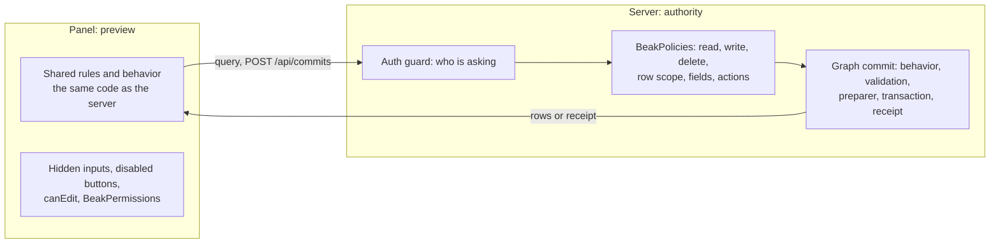

# Where authority lives

> The panel previews, the server decides. Which checks run on both sides, why hiding a button is not authorization, and how this maps onto Serverpod.

The panel previews. The server decides. When the panel validates a field, hides an input, disables a button or computes a total, it does that for the person at the keyboard. The same rule runs again on the server, and only that run counts. This page draws the line, so you know which side a rule belongs on.

## The idea in one picture



Anyone can send a request to the API with `curl`. So a check that lives only in the panel is a hint, and a check that lives on the server is a rule. Beak shares code between the two where that is safe, so a hint and a rule don't drift apart.

## How it works

### Who decides what

| Concern | Panel (preview) | Server (authority) |
| --- | --- | --- |
| Value validity | The form runs the column rules with `BeakValidation` as you type. | `ValidationService` runs the same rules before every write. A graph commit runs them again on the final state. |
| Uniqueness, existence of a parent | An advisory preflight through `POST /api/{table}/validate`. | Checked again inside the commit. Under concurrency, the database index has the last word. |
| Totals, statuses, snapshots | `behavior` previews suggestions and derived values while you type. | The commit recomputes derived values in the transaction. A value the client sent for a derived field is ignored. |
| Changing a record in a given state | `editableWhen` and `availableWhen` hide inputs and buttons. | The same predicates run against the stored record. A locked record answers 422, "The record cannot be edited in this state." |
| Use of a resource by an account | `canCreate`, `canEdit`, `canDelete` on the `BeakResource`, and `BeakModel.permissions`. | `BeakPolicies` with `BeakModelRules`: read, write and delete per model. |
| Row visibility | Nothing. | `rowScope`, folded into the filter of every query, aggregate, update, delete, export and commit. |
| Field reads and writes | `GET /api/{table}/capabilities` tells the form what to offer. | Responses are redacted per field. A write to a read-only field answers 422. |
| Commands | Buttons appear when the capabilities list the command. | `BeakModelRules.actions` is checked before the command runs. |

The left column is convenience. Nothing in it can grant anything the right column refuses.

### A save is re-run, not trusted

A form save is a `POST /api/commits`, and `BeakGraphCommitService` treats the plan as a request, not a fact. In order:

1. A receipt for the same save id and principal short-circuits a replay. The same id with different content is a 409.
2. A pending receipt is written inside the transaction.
3. Every operation is authorized, before any of your code runs.
4. Model behavior runs on a candidate graph: derived values, locked states, commands.
5. Your `BeakSavePlanPreparer`, if you wrote one, adds derived writes.
6. Each operation executes, authorized again with resolved identities and validated.
7. The final graph is validated, including parents whose derived values depend on the change.
8. Your `BeakSavePlanFinalizer`, if any, enqueues effects in the same transaction.
9. The receipt is written. Any `BeakException` before this point rolls everything back.

Steps 3 and 5 are the two worth reading. The authorization comes first on purpose, so application code never runs for a write the principal may not make:

```dart title="packages/beak_backend/lib/src/service/beak_graph_commit_service.dart"
Future<BeakSavePlan> _prepare(
  BeakSavePlan plan,
  WormDataSource transactional,
  BeakPrincipal? principal,
) async {
  try {
    for (final operation in plan.operations) {
      _authorizeInput(operation, principal);
      _authorizeTable(operation, principal);
    }
    final prepared = await _prepareBehavior(plan, transactional, principal);
    return await preparePlan?.call(prepared, transactional, principal) ??
        prepared;
  } on BeakException catch (error) {
    // The transaction has not dispatched the prepared graph. Persist a
    // definite rejection so the client can edit instead of treating it as an
    // ambiguous network write and locking its draft for recovery.
    throw _Rollback(
      BeakSaveResult(
        saveId: plan.saveId,
        mode: BeakSaveMode.atomic,
        outcomes: [
          for (final operation in plan.orderedOperations(registry))
            BeakOperationResult(
              id: operation.id,
              status: BeakWriteOutcome.unapplied,
              error: operation.id == plan.operations.first.id
                  ? BeakSaveError.fromException(error)
                  : null,
            ),
        ],
      ),
    );
  }
}
```

And the two hooks you can supply:

```dart title="packages/beak_backend/lib/src/service/beak_graph_commit_service.dart"
/// Validates and enriches a graph within its database transaction.
///
/// The callback may add derived writes, but must retain the request identity and
/// original operation identities. All resulting operations still pass normal
/// authorization and model validation. Successful replay never runs it again.
typedef BeakSavePlanPreparer =
    Future<BeakSavePlan> Function(
      BeakSavePlan plan,
      WormDataSource transaction,
      BeakPrincipal? principal,
    );

/// Enqueues durable effects or reserves shared capacity in the save transaction.
///
/// Runs once for a successful save, after graph validation and before its receipt.
/// Throwing a [BeakException] rolls back both the graph and finalizer writes.
/// Network effects belong in an outbox worker, never in this callback.
typedef BeakSavePlanFinalizer =
    Future<void> Function(
      BeakSavePlan plan,
      BeakSaveResult result,
      WormDataSource transaction,
      BeakPrincipal? principal,
    );
```

A model that declares behavior, or whose validation rules read related rows, is closed to the per-record routes. The plain `POST` and `PATCH` answer with "This resource must be saved through a graph commit." so there is no side door around the behavior:

```dart title="packages/beak_backend/lib/src/endpoints/beak_resource_router.dart"
final graphOnlyTables = {
  for (final model in graphOnly) registry.byTableOrThrow(model.table).table,
};
if ((preparePlan != null || finalizePlan != null) &&
    dataSource is! WormDataSource) {
  throw const BeakConfigurationException(
    'Graph preparation requires a Worm data source.',
  );
}
final constrainedTables = <String>{
  ...graphOnlyTables,
  for (final model in registry.all)
    if (!model.behavior.isEmpty) model.table,
};
```

### A query is client input too

The panel sends a `BeakQuerySpec`, and the server treats every part of it as untrusted. Without that, a rule like "a customer sees only their own orders" is bypassed by posting a query with whatever filter the caller likes, because the filter comes from the client. The handler rewrites the spec before the service sees it:

```dart title="packages/beak_backend/lib/src/endpoints/crud_handlers.dart"
Future<Response> query(Request request) async {
  _requireView(request);
  final spec = readBeakSpec(
    await readJsonObject(request),
    BeakQuerySpec.fromJson,
  );
  final page = await service.query(_authorizer(request).authorizeQuery(spec));
  return _json(200, page.toJson((record) => _recordJson(request, record)));
}
```

`authorizeQuery` adds the row scope, checks every filter, sort, search and eager-loaded path against the field policy, and `_recordJson` redacts the response the same way. A record outside the scope answers 404, not 403, so the response doesn't confirm it exists.

### The policy is where you write authority

`BeakPolicies` is a typed rule set. Everything you don't list is denied, and a model with no rule is invisible: its endpoints answer 401 to an anonymous request and 403 to anyone else. This is the whole policy of the Serverpod bookshop:

```dart title="examples/serverpod/bookshop_server/lib/src/beak/bookshop_policy.dart"
/// Who may do what in the bookshop admin.
///
/// Deny by default: holding `beak.admin` opens the tunnel and grants nothing.
/// Staff (the `bookshop.staff` scope) read and write authors and books.
/// Nobody may delete: a rule that is not written is a rule that is closed, so
/// removing an author (and, by cascade, their books) needs a deliberate rule.
final BeakPolicies bookshopPolicy = BeakPolicies(
  rules: [
    BeakModelRules(const AuthorModel(), read: _staff, write: _staff),
    BeakModelRules(const BookModel(), read: _staff, write: _staff),
  ],
);

final BeakAccess _staff = BeakAccess.role(BookshopScopes.staff.name!);
```

Nobody can delete, because nobody was given `delete`. `BeakModelRules` also takes `rowScope`, `readOnlyFields` and `actions`, each written with typed references, never a column name.

A fresh scaffold has no policy, and that is worth knowing before you deploy. `BeakServer` defaults to `BeakAllowAllPolicy`, and a project starts with no auth guard. Here is the quickstart API, unmodified:

```console
$ curl -s -o /dev/null -w 'DELETE -> HTTP %{http_code}\n' -XDELETE localhost:8080/api/notes/b37d3182-fa4d-4075-9b25-b7e656bbeafc
DELETE -> HTTP 204
```

Anonymous, no token, deleted. That is right for a first run and wrong for a server anyone can reach. Pass a `BeakPolicies` to `defaults.build(policy: ...)` in `lib/server.dart` before you expose it.

### Hiding is presentation

`BeakModel.permissions` is the panel's own switch, and its documentation says so plainly:

```dart title="packages/beak_core/lib/src/model/beak_permissions.dart"
/// Live model-level presentation permissions.
///
/// Callbacks read the host's current account each time an action or route is
/// evaluated. Missing rules deny access. These checks never replace backend
/// authorization: every endpoint must still enforce its own policy.
@immutable
final class BeakPermissions {
  /// Uses [rules], denying operations without an explicit rule.
  const BeakPermissions(Map<BeakOperation, bool Function()> rules)
    : _rules = rules;

  /// Preserves unrestricted presentation for models without a host policy.
  const BeakPermissions.allowAll() : _rules = null;

  final Map<BeakOperation, bool Function()>? _rules;

  /// Whether [operation] is allowed for the current account.
  bool allows(BeakOperation operation) =>
      _rules == null || (_rules[operation]?.call() ?? false);
}
```

The same holds for `canCreate`, `canEdit`, `canDelete`, `visibleIf`, `enabledIf`, `visibleOn` and `readOnly` on an input. A hidden field is still in the API response unless a field policy removes it. The capabilities the form asks for are advice with the same status:

```dart title="packages/beak_core/lib/src/data/beak_access_capabilities.dart"
/// Server-resolved access for one resource and current identity: the fields
/// it may read and write, the actions it may run, and whether it may create
/// and delete records.
///
/// Null sets allow every field; empty sets allow none. These values guide
/// presentation. The server rechecks its policy on every read and write.
final class BeakAccessCapabilities {
  /// Creates an access description, unrestricted unless a set is supplied.
  const BeakAccessCapabilities({
    this.readableFields,
    this.writableFields,
    this.executableActions,
    this.canCreate = true,
    this.canDelete = true,
  });

  /// Fields the current identity may read, or null for all fields.
  final Set<String>? readableFields;

  /// Fields the current identity may write, or null for all fields.
  final Set<String>? writableFields;

  /// Named model actions permitted for this account, or null when unspecified.
  final Set<String>? executableActions;

  /// Whether this identity may create records, so a screen can leave the
  /// create button out instead of offering a save the server will refuse.
  final bool canCreate;

  /// Whether this identity may delete records, so a table can leave the
  /// delete action out.
  ///
  /// Asked without a record, this is the policy's answer for a record that
  /// has no id yet: exact for role rules, a lower bound for a policy that
  /// decides per record. Ask with a record id for those.
  final bool canDelete;

  /// Whether a named model action may be offered to this identity.
  bool canExecuteAction(String name) =>
      executableActions?.contains(name) ?? true;

  /// Whether [key] may be displayed or queried.
  bool canRead(String key) => readableFields?.contains(key) ?? true;

  /// Whether [key] may be submitted by this identity.
  bool canWrite(String key) => writableFields?.contains(key) ?? true;

  /// Encodes the access description at the transport boundary.
  Map<String, Object?> toJson() => {
    'readableFields': readableFields?.toList(),
    'writableFields': writableFields?.toList(),
    'executableActions': executableActions?.toList(),
    'canCreate': canCreate,
    'canDelete': canDelete,
  };

  /// Decodes a server access description, rejecting malformed allowlists.
  factory BeakAccessCapabilities.fromJson(Map<String, Object?> json) =>
      BeakAccessCapabilities(
        readableFields: _fields(json['readableFields']),
        writableFields: _fields(json['writableFields']),
        executableActions: _fields(json['executableActions']),
        canCreate: _permission(json['canCreate']),
        canDelete: _permission(json['canDelete']),
      );

  // An older server reports nothing, which allows the operation.
  static bool _permission(Object? value) => switch (value) {
    null => true,
    final bool allowed => allowed,
    _ => throw const FormatException('Create and delete must be booleans.'),
  };

  static Set<String>? _fields(Object? value) {
    if (value == null) return null;
    if (value is! List<Object?> || value.any((key) => key is! String)) {
      throw const FormatException('Field capabilities must be string lists.');
    }
    return Set.unmodifiable(value.whereType<String>());
  }
}
```

### On Serverpod

Serverpod owns identity, and Beak's policy still owns the decision. Which of the two integrations you use changes where the gate is.

**The admin app in your workspace.** Beak's API runs inside the Serverpod server behind one endpoint method. Serverpod refuses the request before any Beak code runs unless the caller is signed in and holds the `beak.admin` scope:

```dart title="examples/serverpod/bookshop_server/lib/src/beak/beak_admin_endpoint.dart"
/// The Beak admin tunnel: one method, gated by [BeakAdminGate] (a signed-in
/// user holding the `beak.admin` scope) before any Beak code runs.
class BeakAdminEndpoint extends Endpoint with BeakAdminGate {
  /// Runs one Beak request (envelope v1) and returns the response envelope.
  Future<String> dispatch(Session session, String request) =>
      bookshopBeak.dispatch(session, request);
}
```

Past the gate, the engine builds the principal from `session.authenticated` alone, with every scope name as a role, and hands it to the `BeakPolicies` above. `BeakServerpodEngine` requires a `policy` argument. There is no allow-all default there. The scope that opens the tunnel grants nothing by itself; `bookshop.staff` does. The panel side checks the scope too, and its comment is honest about what that is for:

```dart title="examples/serverpod/bookshop_admin/lib/src/bookshop_admin.dart"
/// Maps the signed-in Serverpod user to Beak's identity: only an account
/// holding [beakAdminScopeName] may open the panel.
///
/// The scopes come from the token Serverpod issued at sign-in, so a grant
/// takes effect on the next sign-in. The server's endpoint gate and Beak's
/// policy still decide every request; this only keeps a signed-in customer on
/// the sign-in screen instead of an empty shell of 403s.
ServerpodIdentityResolver bookshopAdminIdentity(
  FlutterAuthSessionManager sessionManager,
) => (signedIn) async {
  final AuthSuccess? auth = sessionManager.authInfo;
  if (!signedIn || auth == null) return null;
  return BeakAuthIdentity(
    id: auth.authUserId,
    canAccessPanel: auth.scopeNames.contains(beakAdminScopeName),
  );
};
```

**The client bridge.** With `ServerpodResource` bindings, the panel calls your own typed endpoints and Beak has no database access. Authority then lives in those endpoints. The binding's `ServerpodOperation` values say which operations exist, and the source describes them as "not authorization". `BeakModel.permissions` remains a courtesy for the UI.

## Why it is shaped this way

Shared code, so the hint can't drift from the rule. Validation and behavior are pure Dart in `beak_core`, so the panel and the server run the same functions. That is cheaper than two implementations and safer, and it has a price: a shared rule has to be pure. It can't do I/O, and `behavior` callbacks must be side-effect free. Anything that needs the database (unique, exists) is preflight on the client, authority on the server, and the index at the bottom.

Presentation refinements stay on one side. A `BeakInput`'s `validate`, `validators`, `visibleIf` and `derive` are callbacks in a layout. They can't cross the wire, so they can't become server rules. The model-level equivalents can: `rules:` on the column, `validationRules`, `behavior`. When a check must hold for every caller, write it there.

Some limits are deliberate, and worth stating. Database indexes give the final uniqueness guarantee under concurrency, and the async preflight is advisory. A password column doesn't replace authentication or hashing. Storage cleanup after a crash needs a reference-aware storage policy of your own.

## What it means for you

| Never | Always |
| --- | --- |
| Treat `canEdit: false`, `visibleIf`, `visibleOn`, `readOnly` or `BeakPermissions` as security | Enforce with `BeakPolicies` and `BeakModelRules` on the server |
| Ship a server with the default policy | Pass a policy to `defaults.build(policy: ...)` before anyone else can reach the port |
| Put a rule every caller must obey in a `BeakInput` | Put it on the column, in `validationRules` or in `behavior` |
| Let the panel compute a total the server will trust | Declare it `derived` in `behavior`, or compute it in a `BeakSavePlanPreparer` |
| Assume a hidden column is private | Use a field policy, a `readOnlyFields` entry, or leave it out of the Beak model |

To check a server, call it the way an attacker would: with `curl`, without the panel, without a token. If it answers, the policy has a hole.

## Continue reading

- [Auth and policies](../backend/auth-and-policies.md) `BeakPolicies`, guards, sessions and row scopes in full.
- [Transactional business rules](../backend/graph-business-rules.md) writing a `BeakSavePlanPreparer`.
- [Security](../shipping/security.md) the checklist before you expose a server.
- [Choosing an integration](../serverpod/choosing-an-integration.md) the admin app or the bridge.
