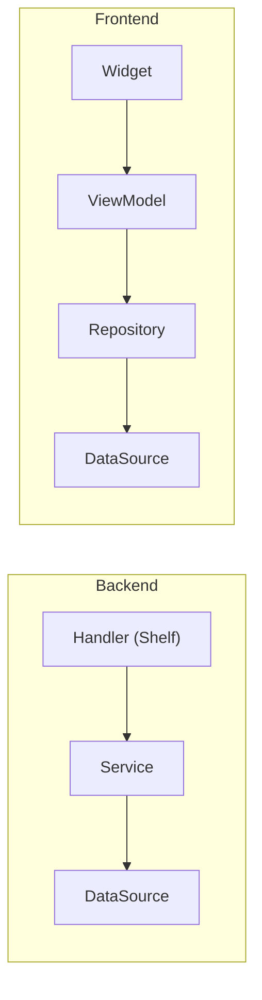

# Code guardrails

> Read the hard rules a change must satisfy: no Material, no type escape hatches and the layering.

After this page you know the rules a Beak change has to satisfy before it can
merge: which imports are banned, which type escape hatches are refused, the
widget stack every screen uses, and the layer boundaries that keep the packages
apart. Some are enforced by tooling, the rest by review.

## No Material, ever

Beak's UI is `obers_ui` only. Two imports are forbidden anywhere in gated code:

```dart title="tool/check_no_material.dart"
/// Import URIs that must never appear in Beak code.
const List<String> forbiddenImportUris = [
  'package:flutter/material.dart',
  'package:flutter/cupertino.dart',
];
```

This is not a convention you have to remember. The `guard-material` step of
`melos run analyze` runs `tool/check_no_material.dart`, which scans every Dart
file under `packages/` and `examples/` (the vendored `worm*` packages excluded)
and exits non-zero listing each offending file:

```yaml title="melos.yaml"
  guard-material:
    run: dart run tool/check_no_material.dart
    description: >-
      FAIL on any package:flutter/material.dart or package:flutter/cupertino.dart
      import in Beak code.
```

Flutter's `widgets.dart` and `foundation.dart` stay allowed, but only for core
types (`BuildContext`, `Widget`, `Key`, `ValueChanged`, `EdgeInsets`, `Color`),
never for Material or Cupertino components. Reach for `obers_ui`,
`obers_ui_autoforms`, and `obers_ui_charts` for everything visual.

## The fixed widget stack

Every panel screen is built from the same building blocks:

| Concern  | The one choice        | Never                        |
| -------- | --------------------- | ---------------------------- |
| Widgets  | `HookWidget`          | `StatefulWidget` (forbidden) |
| State    | Signals               | ad-hoc mutable fields        |
| DI       | GetIt (`beakLocator`) | global singletons            |
| Routing  | go_router             | hand-rolled navigators       |

`beakLocator` is a package-scoped GetIt instance, not the global one, so a host
app's container and Beak's stay separate. View models expose `ReadonlySignal`s
and hold no build context. App authors rarely touch this stack directly; they
configure resources and Beak wires the widgets from that config.

## No type escape hatches

Beak's promise to its users is zero `dynamic` and zero string field references,
so the framework itself holds the same line:

- **No `dynamic`.** The one exception is genuine interop, and it carries a
  `// interop:` comment so a reviewer can see the boundary. The coverage tool has
  exactly one such line, over `ProcessResult.stderr`.
- **No `as` casts.** Narrow with pattern matching instead. A `switch` over a
  sealed type is exhaustive and the compiler proves it; an `as` cast just defers
  the failure to runtime.
- **No `Map<String, dynamic>`** as a domain, presentation, or public API type.
  Use typed DTOs, sealed classes, generics, or enums. Values on the wire travel
  as the sealed `BeakValue` family, not raw maps.
- **Prefer enums and sealed classes** over stringly-typed values for any known
  value set. Numeric fields carry their unit in the name (`maxSizeInBytes`,
  `timeoutInSeconds`).

The [type-safety promise](../concepts/the-type-safety-promise.md) explains why
this matters to users; the guardrail is that the framework never forces them to
break it.

### Every public member is documented

`public_member_api_docs` is on. Every public class, method, getter, and top-level
function carries a doc comment. `dart analyze --fatal-infos --fatal-warnings`
(what `melos run analyze` runs) treats a missing doc as a build failure, so this
is checked, not hoped for.

## The layering

Two flows, four layers, and no `UseCase` layer in either.



- **Backend: `Handler → Service → DataSource`.** The handler is the single catch
  boundary; the error-mapping middleware turns the sealed `BeakException` family
  into an HTTP status plus JSON. Services hold the logic and throw typed
  exceptions. DataSources do raw I/O and let exceptions propagate.
- **Frontend: `Widget → ViewModel → Repository → DataSource`.** Widgets render
  state and forward intent. ViewModels expose `ReadonlySignal`s and never
  `try/catch`. The Repository is the catch boundary and returns a `BeakResult<T>`
  so the failure is a value, not a thrown exception the UI has to guard.

The [four layers](../concepts/the-four-layers.md) concept page walks both flows
end to end.

## The source-agnostic seam

`BeakDataSource` (in `beak_core`) is an interface with a small, typed surface:

```dart title="packages/beak_core/lib/src/data/beak_data_source.dart"
Future<BeakPage<BeakRecord>> query(BeakQuerySpec spec);
Future<BeakRecord?> getOne(String table, Object id);
Future<BeakRecord> create(String table, BeakRecord data);
Future<BeakRecord> update(String table, Object id, BeakRecord data);
Future<void> delete(String table, Object id, {bool force = false});
```

`WormDataSource` (backend, over the worm ORM) and `HttpBeakDataSource`
(frontend, over REST) both implement it. Keep the seam clean: worm types never
leak past `beak_backend`, obers types never leak past `beak_frontend`, and
`beak_core` depends on neither. The `beak_serverpod` integration supplies a
`ServerpodDataSource` without touching `beak_core` or `beak_backend`. The
[data source seam](../architecture/data-source-seam.md) page has the full story.

## Continue reading

- [Conventions](conventions.md) commits, reuse-first, and typed exceptions.
- [Writing tests](writing-tests.md) how these rules get proven per package.
- [The four layers](../concepts/the-four-layers.md) the two flows in depth.
- [The data source seam](../architecture/data-source-seam.md) the interface both sides implement.
