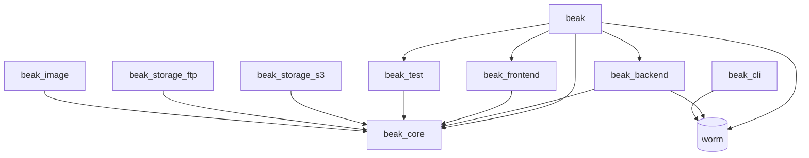

# Packages

> Look up the packages behind Beak, what each owns and which ones an app installs.

After this page you can point to the package that owns any Beak type, decide
which ones a given app depends on, and find the example that exercises them.

An app depends on **one** package, `beak`. It re-exports each layer as its own
library, so a project never keeps five version constraints in step by hand.
Everything else on this page is either behind that umbrella or an opt-in extra.

[See the maintained shop configuration](https://github.com/SimonErich/beak/tree/v0.9.0/examples/clean_beak_config).

## `beak`, the umbrella

`beak` is the package you install and the eight libraries you import. It depends
on `beak_core`, `beak_backend`, `beak_frontend`, `beak_test`, the obers_ui
family, and `worm`, and adds no code of its own beyond the library split.

| Library | Backed by |
| --- | --- |
| `package:beak/beak.dart` | `beak_core` |
| `package:beak/schema.dart` | `beak_core` (its `schema.dart` library) |
| `package:beak/panel.dart` | `beak_frontend` |
| `package:beak/server.dart` | `beak_backend` |
| `package:beak/migrations.dart` | `worm`, plus `BeakBlueprint` from `beak_backend` |
| `package:beak/testing.dart` | `beak_test` |
| `package:beak/ui.dart` | `obers_ui`, `obers_ui_autoforms` |
| `package:beak/charts.dart` | `obers_ui_charts` |

Which library a file imports is the load-bearing decision, not which package:
see [Libraries](libraries.md) for why `beak.dart` must never reach Flutter.

## The packages behind it

| Package | What it owns | You depend on it directly when |
| --- | --- | --- |
| `beak_core` | Pure Dart. The schema annotations and authoring types, typed columns, rules, relationships, the serializable `BeakQuerySpec` wire contract, `BeakRecord`/`BeakValue`, the storage abstraction, the `BeakDataSource` seam, and the raw `BeakClient`. The shared vocabulary every other package speaks. | Never, in an app. A pure-Dart package that only declares models can depend on it instead of the umbrella. |
| `beak_backend` | The Shelf server. Generated CRUD, query, batch, relations and aggregate endpoints, plus uploads, auth, search, CSV export, the health probes, `BeakServeHost`, and `WormDataSource`. The only package that imports worm. | Never, in an app. See [The backend](../backend/index.md). |
| `beak_frontend` | The Flutter admin panel. `BeakPanel` plus generated tables, forms, detail views, actions, filters, view modes and dashboards, all built on obers_ui (no Material). | Never, in an app. See [The panel](../panel/index.md). |
| `beak_test` | The testing toolkit: `InMemoryBeakDataSource` (a complete data source over maps that honours the query spec), `BeakRecordingDataSource`, the executable `runBeakDataSourceContract`, `beakFakeRecord`, and `expectSchemaParity`. | Only from a pure-Dart package that cannot use `package:beak/testing.dart`. |
| `beak_cli` | The `beak` command: project scaffolding, discovery, generation, schema introspection (Postgres and SQLite), and `doctor`. Pure Dart. | Never as a dependency. Install it once with `dart pub global activate`. See [CLI commands](cli-commands.md). |
| `beak_storage_s3` | An S3/MinIO [storage driver](../models/files-and-storage-columns.md). Register it once and any `BeakS3Config` resolves to it. Server-side. | When uploads live in S3 or MinIO. |
| `beak_storage_ftp` | An FTP storage driver. Same registry pattern; files are served from a configured public base URL, because FTP has no expiring links. Server-side. | When uploads live on an FTP host. |
| `beak_image` | The image transform runner. `beak_core` defines the image column and its `BeakImageTransform` steps but ships no pixel codec; `beak_image` executes them with `package:image` (resize, re-encode, thumbnails). | When you want real image processing behind image columns. |

The `memory` and `local` storage drivers are in `beak_core`, so a project gets
working uploads with no extra dependency at all. The two driver packages and
`beak_image` are the opt-ins:

[See the maintained shop configuration](https://github.com/SimonErich/beak/tree/v0.9.0/examples/clean_beak_config).

> **Note: Server-only versus panel-only**
>
> `beak_backend`, the two storage drivers, and `beak_image` are pure
> server-side Dart. `beak_frontend` is Flutter. `beak_core`, `beak_test` and
> `beak_cli` are plain Dart with no Flutter and no server dependency, which is
> why the panel and the server can both depend on `beak_core` without dragging
> one into the other. `melos run guard-web` checks that the seam holds.

## How they depend on each other

Everything points at `beak_core`, and nothing points back. The two sides of the
stack, server and panel, never depend on each other; they meet only at the
`BeakQuerySpec` and REST contract that `beak_core` defines.



`beak_cli` stands apart: it generates source files rather than linking against
Beak, so it depends on no Beak package. It reaches for `worm` and
`worm_postgres` and `worm_sqlite` only so `beak introspect` and the drift
check can read a live schema, and for
`analyzer`, `args`, `dart_style`, `path`, `pub_semver` and `yaml` to do its own
job.

## The vendored worm ORM

worm is the Dart ORM Beak's default storage runs on. It is vendored under
`packages/worm` (with driver packages like `worm_postgres` and `worm_sqlite`
alongside) and imported only by `beak_backend` and the CLI. That containment is
deliberate: worm types never leak past the backend, which is what lets
`beak_core` stay source-agnostic and a future non-worm data source drop in
without touching core.

You never add worm to a pubspec. It reaches you through
`package:beak/migrations.dart`, and you touch it in exactly two places:

- [Migrations](../backend/migrations.md), which `extend Migration` and are
  discovered from `lib/migrations/`.
- [Seeders and factories](../backend/seeding.md), which insert demo and test
  data and are discovered from `lib/seeders/`.

Everything else about worm, the query building and record mapping, happens
inside `WormDataSource` and you never see it.

## The examples

Four runnable projects live under `examples/`. Each one is a real Beak project,
not a fixture, and the docs quote them rather than inventing code.

| Example | What it is |
| --- | --- |
| `examples/quickstart` | Exactly what `beak create` produces: one `Note` resource, nothing else. The floor. |
| `examples/clean_beak_config` | The teaching example, and the one this documentation quotes: a coffee roastery with every column kind, all four relationship kinds, soft deletes, timestamps, a policy, a wizard, a custom screen, and seeders. API on port `8080`. |
| `examples/clean_beak_config` | 49 models at scale: a whole admin theme built from seeded data, every block and view mode, on port `8180`. |
| `examples/clean_beak_config` | Beak inside an application that already exists: mounted under `/admin` in someone else's Shelf pipeline, with Beak blocks on a screen that is not a panel. |

## Versioning

Every package shares one pre-1.0 version line and moves together. Each barrel
exports its own version constant, so you can assert against it at runtime:

```dart
const String beakCoreVersion = '0.0.1';
```

The matching constants are `beakBackendVersion`, `beakFrontendVersion`,
`beakStorageS3Version`, `beakStorageFtpVersion`, and `beakImageVersion`.

> **Note: Browsing the API reference**
>
> Every public symbol in these packages carries dartdoc. The generated
> reference is published per package under the site's `/api/` path, so
> `BeakColumn`, `BeakServer`, `BeakPanelConfig`, and the rest each have a full
> page with their members and examples.

## Continue reading

- [Libraries](libraries.md) the eight libraries of `package:beak`, and the rule the split enforces.
- [Project structure](../start-here/project-structure.md) how a project's folders map onto these packages.
- [The package graph](../architecture/package-graph.md) the same dependencies, read as an architecture.
- [Installation](../start-here/installation.md) the pubspec entry that pulls Beak in.
