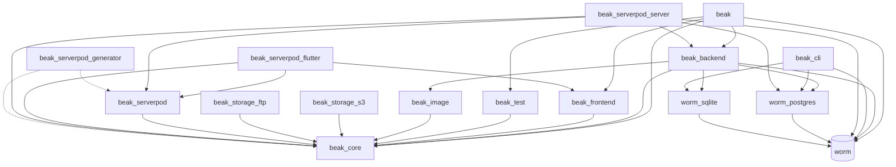

# Packages

> Look up every package in the Beak repository, its version, what it owns and depends on, plus the examples, the obers_ui pin and the repo tooling.

Twenty packages live under `packages/`: thirteen Beak packages and seven vendored worm packages. An app installs one of them, `beak`. This page says what the others are, what they depend on, and which you add yourself.

## Import

Packages are depended on, not imported. The umbrella line is what `beak create` writes (see [Libraries](libraries.md) for the imports it opens up):

```yaml
dependencies:
  beak:
    git:
      url: https://github.com/SimonErich/beak.git
      ref: v0.9.0
      path: packages/beak
```

An opt-in package takes the same shape with its own `path`. Illustrative, with a real package name:

```yaml
dependencies:
  beak_storage_s3:
    git:
      url: https://github.com/SimonErich/beak.git
      ref: v0.9.0
      path: packages/beak_storage_s3
```

Every package has `publish_to: none`. Nothing is on pub.dev yet, so a git dependency (or `--beak-path` for a local checkout) is the only way in. A `ref` that names a tag that has not been pushed fails at `flutter pub get`.

## Summary

| Package | Version | Runs on | Where it may appear | You depend on it |
| --- | --- | --- | --- | --- |
| `beak` | 0.9.0 | Flutter | both | always: the umbrella |
| `beak_core` | 0.9.0 | pure Dart | both | never in an app; a models-only package depends on it instead of `beak` |
| `beak_backend` | 0.9.0 | Dart VM | server | never; it comes with `beak` |
| `beak_frontend` | 0.9.0 | Flutter | panel | never; it comes with `beak` |
| `beak_test` | 0.9.0 | pure Dart | tests | never in an app; it comes with `beak` as `testing.dart` |
| `beak_cli` | 0.9.0 | Dart VM | dev machine | never as a dependency; `dart pub global activate` |
| `beak_image` | 0.9.0 | pure Dart | server | never; `beak_backend` depends on it |
| `beak_storage_s3` | 0.9.0 | pure Dart | server | when uploads live in S3 or MinIO |
| `beak_storage_ftp` | 0.9.0 | pure Dart | server | when uploads live on an FTP host |
| `beak_serverpod` | 0.9.0 | pure Dart | both | for the client bridge |
| `beak_serverpod_flutter` | 0.9.0 | Flutter | panel | in a Serverpod admin app or bridge panel |
| `beak_serverpod_server` | 0.9.0 | Dart VM, Serverpod 4 | server | in a Serverpod server that hosts the admin |
| `beak_serverpod_generator` | 0.9.0 | Dart VM | dev machine | for the client bridge generator |
| `worm` | 0.1.0 | Dart VM | server | never; reaches you through `migrations.dart` |
| `worm_postgres`, `worm_sqlite` | 0.1.0 | Dart VM | server | never; `beak_backend` depends on both |
| `worm_mysql`, `worm_mongodb` | 0.1.0 | Dart VM | server | no Beak package uses them |
| `worm_generator`, `worm_lints` | 0.1.0 | build time | dev machine | no Beak package uses them |

"Where it may appear" is the web-safety rule: the panel's import graph may hold `both` and `panel` packages, never a `server` one. `melos run guard-web` checks it, see [Libraries](libraries.md#rules-and-limits).

## The umbrella

`beak` is the one dependency. It holds no logic: eight `library;` files of exports, and `skills/` for coding agents.

| Depends on | Why |
| --- | --- |
| `beak_core`, `beak_frontend`, `beak_backend`, `beak_test`, `worm` | The libraries it re-exports |
| `obers_ui`, `obers_ui_autoforms`, `obers_ui_charts` | Re-exported by `ui.dart` and `charts.dart` |
| `flutter` | The panel half |

A pubspec dependency costs nothing on its own, since only imports reach the compiler. That is what lets one package hold `lib/main.dart` for the browser and `bin/serve.dart` for the VM. See [The package graph](../architecture/package-graph.md).

## Layers

| Package | Owns | Beak dependencies | Third-party of note |
| --- | --- | --- | --- |
| `beak_core` | Schema annotations and authoring types, typed columns, rules, relationships, `BeakQuerySpec`, `BeakRecord`, `BeakValue`, the `BeakDataSource` seam, the graph-commit plan and receipt types, the storage abstraction, `BeakClient`, the exception family | none | `http`, `http_parser`, `intl`, `meta` |
| `beak_backend` | The Shelf server: generated CRUD, query, commit, upload, auth, search and export routes, `BeakServeHost`, `WormDataSource`, policies, the outbox | `beak_core`, `beak_image` | `shelf`, `shelf_router`, `shelf_multipart`, `crypto`, `mime`, `worm`, `worm_postgres`, `worm_sqlite` |
| `beak_frontend` | The Flutter panel: `BeakPanel`, tables, forms, detail views, blocks, actions, filters, auth screens, `HttpBeakDataSource`. No Material, obers_ui only. | `beak_core` | `obers_ui`, `obers_ui_autoforms`, `obers_ui_charts`, `signals`, `get_it`, `go_router`, `flutter_hooks`, `http`, `intl`, `file_selector`, `url_launcher` |
| `beak_test` | `InMemoryBeakDataSource`, `BeakRecordingDataSource`, `runBeakDataSourceContract`, record factories, schema parity assertions | `beak_core` | `test` |

## Tooling and opt-ins

| Package | Owns | Beak dependencies | Third-party of note |
| --- | --- | --- | --- |
| `beak_cli` | The `beak` executable: scaffolding, `prepare`, `dev`, `migrate`, `seed`, `introspect`, `eject`, `docs`, `agents`, `doctor`. Generates source as text and reads yours with the analyzer, so it imports no Beak package. See [CLI commands](cli-commands.md). | none | `analyzer`, `args`, `dart_style`, `yaml`, `yaml_edit`, `pub_semver`, `crypto`, `worm`, `worm_postgres`, `worm_sqlite` (to read a live schema) |
| `beak_image` | `ImageTransformRunner`: executes the resize, re-encode and thumbnail steps of an image column. `beak_core` defines the steps and ships no codec. | `beak_core` | `image` |
| `beak_storage_s3` | `S3StorageDriver` for AWS S3 and MinIO, `registerS3Storage`. It signs its own requests (SigV4) over `http` and `crypto`, so it drags in no S3 SDK | `beak_core` | `http`, `crypto` |
| `beak_storage_ftp` | `FtpStorageDriver` over plain sockets, `registerFtpStorage`. FTP has no expiring links, so files are served from a configured public base URL. | `beak_core` | none |

The `memory` and `local` storage drivers are in `beak_core`, so uploads work with no extra dependency. `beak_backend` depends on no driver package; an S3 or FTP project adds the package and registers it, see [Configuration and environment](configuration.md).

## Serverpod

Two supported paths, four packages. See [Choosing an integration](../serverpod/choosing-an-integration.md).

| Package | Path | Owns | Beak dependencies | Third-party of note |
| --- | --- | --- | --- | --- |
| `beak_serverpod` | bridge, admin app | `ServerpodResource`, `ServerpodDataSource`, the codecs, and the tunnel wire types (`wire.dart`) | `beak_core` | `http`, `uuid` |
| `beak_serverpod_flutter` | bridge, admin app | `ServerpodAuthAdapter`, `serverpodBeakDataSource`, the panel side of the tunnel | `beak_core`, `beak_frontend`, `beak_serverpod` | `serverpod_client`, `serverpod_auth_core_flutter`, `serverpod_auth_idp_client` (each `>=4.0.3 <5.0.0`), `signals` |
| `beak_serverpod_server` | admin app | `BeakServerpodEngine`, `BeakAdminGate`, `ServerpodSessionAdapter`; runs Beak inside a Serverpod 4 server. Needs Dart ^3.12.2. | `beak_backend`, `beak_core`, `beak_serverpod` | `serverpod` (`>=4.0.3 <5.0.0`), `shelf`, `worm`, `worm_postgres` |
| `beak_serverpod_generator` | bridge | `generateServerpodCompanions` and `bin/generate.dart`, which turn a generated Serverpod client into typed Beak companions. Imports no Beak package at run time; `beak_core` and `beak_serverpod` are dev dependencies for its tests. | none | `analyzer`, `args`, `dart_style`, `path`, `yaml` |

The pinned Serverpod CLI is `tool/serverpod_cli_4`: a package that depends on `serverpod_cli: 4.0.3`, with a `serverpod` wrapper beside it, so a globally activated older CLI cannot generate the wrong code. Version rules are on [Version compatibility](../serverpod/versions.md).

## Dependency graph

Read from each `pubspec.yaml`'s `dependencies:` section. Third-party packages are left out. Dotted arrows are `dev_dependencies`.



`worm_mysql`, `worm_mongodb` and `worm_generator` each depend on `worm` and are depended on by nothing in Beak; `worm_lints` depends on no other package of this repository.

## Worm

worm is the Dart ORM under Beak's default data source. It is vendored under `packages/worm*` and consumed as path dependencies. `melos.yaml` ignores it, so the gate does not analyze or test it; `melos run test-worm` runs its suites. Its docs live in `packages/worm/docs`.

| Package | Role |
| --- | --- |
| `worm` | Core ORM: models, queries, relations, migrations, seeding, the `worm` CLI that `bin/migrate.dart` runs |
| `worm_postgres` | PostgreSQL driver |
| `worm_sqlite` | SQLite driver, the zero-setup default |
| `worm_mysql` | MySQL driver |
| `worm_mongodb` | MongoDB driver |
| `worm_generator` | `build_runner` generator for typed companions |
| `worm_lints` | Custom lint rules for worm projects |

`beak_backend` builds an adapter from `DATABASE_URL` for SQLite and Postgres only (`adapterFromUrl`). worm types reach application code in two places: migrations and seeders, through `package:beak/migrations.dart`. Everything else happens inside `WormDataSource`.

## Examples

Five runnable projects under `examples/`. The docs quote them instead of inventing code.

| Example | Purpose | API port | Web port | Melos |
| --- | --- | --- | --- | --- |
| `examples/quickstart` | Byte-for-byte what `beak create` writes: one `Note` resource. The floor. | 8080 | any (`beak dev` prints the run line) | in the gate |
| `examples/clean_beak_config` | The shop: schema classes with semantic fields and exact money, resources, form screens, named actions, graph preparer, custom screens. The main teaching source. | 8080 | 3000 | in the gate |
| `examples/foodio-adminpanel` | Gabel food-ordering admin: composed lists, wizard, record templates, summaries, printable documents, durable effects, custom navigation and theme. | 8081 | 3002 | in the gate |
| `examples/showcase` | The Aviary: every block, every column kind, every relation kind, soft deletes. Exists to fill the gaps the others leave. | 8082 | 3003 | in the gate |
| `examples/serverpod` | Bookshop: a Serverpod 4.0.3 workspace with an admin app. Beak's API runs inside the Serverpod server behind one endpoint, so there is no separate Beak port; Serverpod's API is on 8080. | 8080 (Serverpod) | 8095 (admin) | ignored: its own pub workspace |

The quickstart and the shop both use API port 8080; run one at a time or change `server.port` in `beak.yaml`. Ports come from each example's `beak.yaml` and README.

## The obers_ui pin

Beak pins `obers_ui`, `obers_ui_autoforms` and `obers_ui_charts` by git commit, never by a path outside the repository:

```yaml title="packages/beak/pubspec.yaml"
  obers_ui:
    git:
      url: https://github.com/SimonErich/obers_ui
      ref: c956d25634c93e23847ec5a4150c1d62fe3a7c90
```

Two pubspecs declare the three dependencies: `packages/beak/pubspec.yaml` and `packages/beak_frontend/pubspec.yaml`. Examples and apps get them through `beak`. `test/obers_ui_pin_test.dart` fails if a pubspec under `packages/` or `examples/` points at a path above the repo root, or if the SHA differs anywhere. To work against a local checkout run `melos run link-obers-ui`, see [Working with obers_ui](../contributing/working-with-obers-ui.md).

## Versions

All Beak packages share one version and move together. Each barrel that has a constant exports it:

| Constant | Value | Defined in |
| --- | --- | --- |
| `beakCoreVersion` | `'0.9.0'` | `packages/beak_core/lib/beak_core.dart` |
| `beakBackendVersion` | `'0.9.0'` | `packages/beak_backend/lib/beak_backend.dart` |
| `beakFrontendVersion` | `'0.9.0'` | `packages/beak_frontend/lib/beak_frontend.dart` |
| `beakImageVersion` | `'0.9.0'` | `packages/beak_image/lib/beak_image.dart` |
| `beakStorageS3Version` | `'0.9.0'` | `packages/beak_storage_s3/lib/beak_storage_s3.dart` |
| `beakStorageFtpVersion` | `'0.9.0'` | `packages/beak_storage_ftp/lib/beak_storage_ftp.dart` |
| `beakCliVersion` | `'0.9.0'` | `packages/beak_cli/lib/src/version.dart`, not exported by `beak_cli.dart` |
| `beakReleaseRef` | `'v0.9.0'` | same file: the git ref `beak create` and `beak init` pin |

`beak`, `beak_test` and the four Serverpod packages export no version constant. `beak_cli` keeps its constant equal to its pubspec with `packages/beak_cli/test/src/version_test.dart`. The worm packages are at 0.1.0. `beak --version` prints `beak 0.9.0`, and `beak doctor` warns when the CLI and the project's resolved Beak differ in major or minor version.

## Skills

Packages ship workflows for coding agents as `packages/<package>/skills/<name>/SKILL.md`. `beak agents` installs those of the packages a project resolves. `tool/published_skills.dart` validates them: the folder equals the `name`, the name starts with the package name, the description is at most 1024 characters, the body is at most 150 lines.

| Package | Skills |
| --- | --- |
| `beak` | `beak-add-business-rule`, `beak-add-resource`, `beak-adopt-database`, `beak-evolve-schema`, `beak-secure-api`, `beak-upgrade` |
| `beak_frontend` | `beak-frontend-build-screens` |
| `beak_serverpod` | `beak-serverpod-setup` |

## Repository tooling

The workspace root is `beak_workspace` (`pubspec.yaml`), which holds no product code. Melos is pinned to 6.3.3 in its `dev_dependencies`; `melos.yaml` covers `packages/**` and `examples/**`.

| Script | Runs | Fails when |
| --- | --- | --- |
| `melos run analyze` | `dart analyze` and `flutter analyze` per package, then the guards and checks below | any issue |
| `melos run test` | every package's tests, then the workspace tests under `test/` | any failure |
| `melos run coverage` | `tool/check_coverage.dart` | a package is under its line-coverage threshold (85 percent by default) |
| `melos run format-check` | `dart format --output=none --set-exit-if-changed .` | a file needs formatting |
| `melos run guard-material` | `tool/check_no_material.dart` | a Material or Cupertino import |
| `melos run guard-hooks` | `tool/check_hook_widgets.dart` | a `StatefulWidget` or `State` in a package's `lib/` |
| `melos run guard-web` | `tool/check_web_safe.dart` | a server import in the panel graph |
| `melos run check-examples` | `tool/check_examples.dart`, which runs `beak doctor --json` in each example | stale generated code, a model without a migration, a panel file reaching the server |
| `melos run check-docs` | `tool/check_docs.dart` | a docs page breaks the style or structure rules |
| `melos run agent-docs`, `check-agent-docs` | `tool/build_agent_docs.dart` | the committed bundle in `packages/beak_core/doc/agent-docs` differs from `docs/` |
| `melos run link-obers-ui` | `tool/link_obers_ui.dart`, then `melos bootstrap` | not a check; links a local obers_ui |
| `melos run up`, `down` | `docker compose` for Postgres and MinIO | not a check |

Contributor detail is in [Dev infrastructure](../contributing/dev-infrastructure.md) and [Releasing](../contributing/releasing.md).

## Rules and limits

- An app depends on `beak` and, when it needs one, an opt-in package from the tables above. It never lists `beak_core`, `beak_backend` or `beak_frontend` next to `beak`.
- A pure-Dart package that only declares models depends on `beak_core` and runs `beak prepare`; it gets the `*.beak.dart` parts and the registry and nothing else. See [Generated files and symbols](generated-files.md).
- Only `beak_backend` imports worm on the data path. `beak_cli` and `beak_serverpod_server` name worm for their own reasons, and `beak` re-exports it in `migrations.dart`.
- `beak_frontend` is the only package that imports obers_ui for widgets. `beak` depends on the three obers_ui packages only to re-export them.
- Storage drivers are plug-ins. A project that never adds `beak_storage_s3` never resolves it, and adding it next to `beak` needs no `dependency_overrides`.
- Dart ^3.11.0 everywhere, Flutter `>=3.41.0` for the Flutter packages, Dart ^3.12.2 for `beak_serverpod_server` because Serverpod 4.0.3 requires it.

## Source

- `packages/*/pubspec.yaml` are the source of every version, description and dependency above.
- `packages/beak/pubspec.yaml` and `packages/beak_frontend/pubspec.yaml` hold the obers_ui pin.
- `melos.yaml` and the root `pubspec.yaml` define the workspace and the scripts.
- `tool/` holds the scripts the table above names; `test/` holds their tests and `test/obers_ui_pin_test.dart`.
- `examples/*/beak.yaml` and `examples/*/README.md` give the ports.

## Continue reading

- [Libraries](libraries.md) the eight libraries these packages sit behind.
- [The package graph](../architecture/package-graph.md) the same edges read as an architecture.
- [Installation](../start-here/installation.md) the pubspec entry and the CLI install.
- [Choosing an integration](../serverpod/choosing-an-integration.md) which Serverpod packages a project needs.
