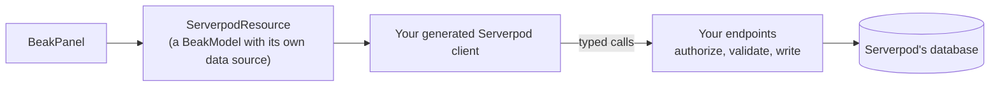

# Client bridge

> Put a Beak panel over the typed Serverpod endpoints you already have, with no server change and a smaller feature set, using three packages.

Your Serverpod project already has endpoints that return DTOs, check permissions and hold the business rules. The client bridge lets a Beak panel call them through your generated client. Nothing changes on the server, and Beak never opens a database connection. The price is the feature list, and this section is upfront about it.

## What the bridge is

A `ServerpodResource` is a Beak model that brings its own data source. The panel finds that source on the model and routes every operation to it, so a resource needs no repository, no registry entry and no HTTP client. Each operation is a call on your client: `list`, `getById`, `create`, `update`, `delete`.

Three packages implement it:

| Package | What it does | Depends on Flutter |
| --- | --- | --- |
| `beak_serverpod` | `ServerpodResource`, `ServerpodModel`, `ServerpodField`, the codecs and the query reader | No |
| `beak_serverpod_generator` | Reads your generated client's Dart types and writes a resource, field descriptors and codecs for each model | No (a dev dependency) |
| `beak_serverpod_flutter` | Beak's login, registration and recovery screens over Serverpod's email sign-in | Yes |

The third package is shared with the [admin app](../admin-app/index.md); the first two are the bridge.

## What it does not do

The bridge can only ask your endpoints, so it cannot build what needs a database. It supports an AND of equality filters, one sort and one search term. It refuses relation loads, has no summaries, no CSV export and no server-side field permissions, and its form saves are staged calls, not one transaction. [Bridge resources](resources.md) has the full table, and [Choosing an integration](../choosing-an-integration.md) compares it with the admin app.

`beak init` refuses to run inside a Serverpod workspace, and its message names both ways in: the admin app, and this bridge. The bridge is wired by hand: add the dependencies, build the resources and mount a `BeakPanel` (see [Bridge resources](resources.md)).

## Which page to read

| You want to... | Read | For that |
| --- | --- | --- |
| Bind an endpoint set to a resource by hand, or know the bridge's limits | [Bridge resources](resources.md) | `ServerpodResource`, columns, permissions, codecs, the hard limits |
| Have that binding written for you | [Generating bridge resources](generator.md) | `beak_serverpod.yaml`, the generate command, what it writes |
| Check that your endpoints fit the generator | [Endpoint conventions](endpoint-conventions.md) | Exact signatures, the query vocabulary, the type limits |

## Continue reading

- [Bridge resources](resources.md): the runtime side, and what the bridge refuses.
- [Authentication and scopes](../authentication.md): the sign-in adapter the bridge shares with the admin app.
- [Model-owned transports](../../extending/model-transports.md): the general mechanism a `ServerpodResource` is one case of.
