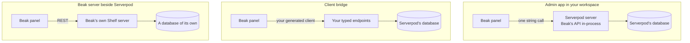

# Choosing an integration

> Compare the admin app, the client bridge and a separate Beak server next to Serverpod, row by row, and pick the one that fits your project.

After this page you can say which of the three ways to run Beak next to Serverpod fits your project, and which features you give up by choosing it. You have a Serverpod 4 project, you need an admin panel, and the three options look alike from a distance.

## The idea in one picture

Only the first two touch your Serverpod data. The third is an ordinary Beak app that happens to live next to a Serverpod one, and it never sees Serverpod's tables.

## How it works

The rows are the questions that decide a project. "Admin app" means the [admin app in your workspace](admin-app/index.md), "bridge" means the [client bridge](bridge/index.md).

| | Admin app | Bridge | Beak server beside Serverpod |
| --- | --- | --- | --- |
| Where Beak's code runs | Inside the Serverpod server, behind `BeakAdminEndpoint.dispatch` | Nowhere new: the panel calls your generated client | Its own Shelf process (`beak_backend`) |
| Who owns the database | Serverpod (`.spy.yaml`, `serverpod create-migration`); Beak schema classes say `managesSchema: false` | Serverpod; Beak never sees a table | Beak, on a database of its own |
| Server changes | One endpoint, one policy, one engine, one receipts model and its migration | None | None |
| What you write | A `<name>_beak` schema class per table, a policy, a panel | A resource per endpoint set, generated or by hand | Schema classes and resources, as in any Beak app |
| Typed refs such as `BookModel.title.inputText()` | Yes | No: generated `Fields` descriptors and default screens | Yes |
| Relations loaded with the rows | Yes | No: a query with relation loads is refused | Yes |
| Form save | Graph commit on one Serverpod transaction, with a receipt | Staged: one create or update call per operation, atomic only if your endpoint is | Graph commit |
| Summaries and CSV export | Yes | No: an explicit error | Yes |
| Server-side field permissions | Yes | No: `BeakPermissions` hides controls, your endpoints decide | Yes |
| Filters, sorts, search | Beak's full query spec | AND of equality filters, one sort, one search | Beak's full query spec |
| Who authorizes | `BeakPolicies` (deny by default) behind the `beak.admin` gate | Your endpoints | `BeakPolicies` |
| Sign-in | Serverpod's email sign-in through `ServerpodAuthAdapter` | The same adapter, or your own | Beak's own auth routes |
| Your endpoint logic on admin writes | Does not run: Beak writes rows directly | Runs: every write is one of your endpoint calls | Not applicable |
| Uploads | Not available | Not available | Yes, with a storage driver |
| Version constraints | Serverpod 4.0.3 pinned exactly, one Beak ref | None on Serverpod for the bridge itself; the sign-in adapter needs 4.0.3 or newer within 4.x | None |
| Codegen input | `.spy.yaml`, mirrored by hand, then `beak prepare` | The generated Serverpod client, read by `beak_serverpod_generator` | `beak prepare` |

Two rows deserve a second look. "Your endpoint logic on admin writes" is the cost of the admin app: a `Book` saved through the panel skips whatever your `book.create` endpoint would have done (an audit row, a cache flush, a webhook).

Beak's answer is a `preparePlan` hook or model behavior on the Beak side, and the [limits page](admin-app/limits-and-next-steps.md) says how much of that is proven.

"Form save" is the cost of the bridge: without a server-side commit, a form that edits several rows is a sequence of calls.

## Why it is shaped this way

The admin app runs inside the server because that is where the database already is. Beak's API needs SQL, transactions and a policy. Serverpod holds the pool, the transaction machinery and the migration history. Running Beak on the request's `session.db` means one pool, one set of logs and no second credential to deploy.

The alternative, a Beak server pointed at Serverpod's database, is one the CLI refuses on purpose: `beak introspect` stops at the first `serverpod_` table and `beak init` stops inside a Serverpod workspace, and both point you at the admin app. Two tools that each believe they own a schema do not stay friends.

The bridge stays out of the way because your endpoints know things Beak does not. Refunds, notifications and permission checks live there. The bridge has no database access by design, so it can only ask, and every endpoint stays the authority. That is also why it is the smaller feature set: Beak cannot build a transaction or a summary out of calls it does not control.

One panel takes one path. A `BeakPanel` given a `dataSource:` (the admin path) routes every resource to it and replaces the sources that models bring along. Bridge resources bring their own source and need no `dataSource:`. Mixing them in one panel would need both, so use two panels or pick one.

A separate Beak server is not a Serverpod integration. It is listed because people ask. It is the normal Beak app from [Two ways to boot a panel](../start-here/generated-or-authored.md), on its own database, and it works fine when the admin has data of its own that Serverpod does not need to see.

## What it means for you

| Your situation | Take | Because |
| --- | --- | --- |
| Plain tables, no admin yet, endpoint logic is thin | Admin app | You get relations, atomic saves and export without writing an endpoint per table |
| Endpoints hold rules the admin must not bypass | Bridge | Every write goes through the endpoint that owns the rule |
| You need atomic multi-row form saves or CSV export | Admin app | Only the Beak API on a database session can do both |
| You cannot change or redeploy the server | Bridge | It needs no server change |
| The admin needs data Serverpod should never see | Beak server beside Serverpod | It is a separate app with a separate database |
| You need uploads on Serverpod-owned tables | Neither yet | The tunnel mounts no upload routes and the bridge has no upload client. Use Serverpod's own file handling |

If two rows fit equally well, the bridge is the cheaper one to try: it changes nothing on the server, so backing out is deleting a package. The admin app changes your server and your migration history, which is a bigger step to undo.

## Continue reading

- [Setting up the admin app](admin-app/setup.md): the tutorial for the first path.
- [Bridge resources](bridge/resources.md): what a `ServerpodResource` binds and where it stops.
- [Where authority lives](../concepts/where-authority-lives.md): why the server, not the panel, decides who may do what.
