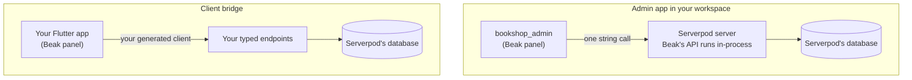

# Serverpod

> Two ways to put a Beak panel on a Serverpod 4 project, an admin app in your workspace or a client bridge over your endpoints, and where each one stops.

You have a Serverpod 4 project, and sooner or later someone asks for an admin panel. Beak has two ways onto that project. This section says which one fits, how each works, and where each stops.

## The two paths

Serverpod keeps owning what it owns: tables, migrations, sign-in, scopes. Beak only perches on top and adds the panel. The paths differ in where the perch is.

**The admin app** adds a `<name>_admin` Flutter web app and a pure Dart `<name>_beak` package to your pub workspace. Beak's stock REST API runs inside the Serverpod server, behind one gated endpoint method, on the request's own database session. You get relations, atomic form saves, summaries and CSV export, and you write no endpoint per table. The price: Beak writes rows directly, so logic that lives in your endpoint methods does not run for admin writes.

**The client bridge** is for a project whose endpoints already return DTOs, check permissions and hold the business rules. A Beak panel calls those endpoints through your generated client, and nothing changes on the server. The price is the feature list: AND-equality filters, one sort, one search, no relations, no atomic saves, no summaries, no export.

Both paths share one piece: Beak's login, registration and password-recovery screens over Serverpod's email sign-in ([Authentication and scopes](authentication.md)).

## What is proven and what is not

The admin app path is a proof, not a product. It is one example workspace (`examples/serverpod`, two tables, server tests on a real database and widget tests for the panel) plus the packages under it. Uploads, a drift check between your `.spy.yaml` files and the Beak schema classes, and a tested deployment are missing. [Limits and next steps](admin-app/limits-and-next-steps.md) lists every gap with its workaround.

The bridge is older and narrower. It is covered by unit tests and a generator that runs against fixtures, not by a running Serverpod server.

## Versions in one box

| Part | Version |
| --- | --- |
| Beak packages | 0.9.0, all in lockstep, from a git ref or a path (not on pub.dev yet) |
| Serverpod | 4.0.3, pinned exactly in the app |
| Dart | 3.12.2 or newer (Serverpod 4.0.3's own floor) |
| Flutter | 3.44.4 or newer for the admin app |

The details, including the break between the 4.0 beta and 4.0.x, are on [Version compatibility](versions.md).

## Which page to read

| You want to... | Read | For that |
| --- | --- | --- |
| Pick between the admin app, the bridge and a separate Beak server | [Choosing an integration](choosing-an-integration.md) | A comparison matrix and a decision table |
| See what the admin app is made of and what it needs | [Admin app in your workspace](admin-app/index.md) | The section overview |
| Understand the request path from panel to database | [How the admin app works](admin-app/how-it-works.md) | The gated endpoint, the envelope, the session adapter |
| Add the admin app to your workspace, step by step | [Setting up the admin app](admin-app/setup.md) | A tutorial that ends on a running panel |
| Know what the admin app does not do yet | [Limits and next steps](admin-app/limits-and-next-steps.md) | Every gap, its reason and its workaround |
| Put a Beak panel over endpoints you already have | [Client bridge](bridge/index.md) | The section overview |
| Bind one endpoint set to a Beak resource | [Bridge resources](bridge/resources.md) | `ServerpodResource`, its options and hard limits |
| Generate that binding instead of writing it | [Generating bridge resources](bridge/generator.md) | `beak_serverpod.yaml` and the generate command |
| Check whether your endpoints fit the generator | [Endpoint conventions](bridge/endpoint-conventions.md) | Exact signatures and the query vocabulary |
| Wire sign-in, scopes and revocation | [Authentication and scopes](authentication.md) | `beak.admin`, the auth adapter, token lifetimes |
| Look up which versions go together | [Version compatibility](versions.md) | Pins, floors and the 4.0 beta break |
| Fix an error message | [Troubleshooting](troubleshooting.md) | Symptom, cause and fix |

## Continue reading

- [Choosing an integration](choosing-an-integration.md): compare the three ways to run Beak next to Serverpod, row by row.
- [Setting up the admin app](admin-app/setup.md): the shortest route to a running panel on your workspace.
- [Client bridge](bridge/index.md): the frontend-only path over endpoints you already have.
