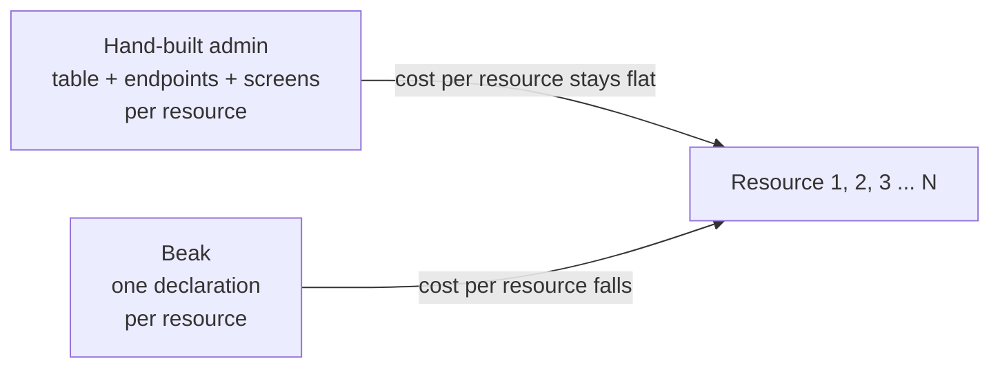

# Why Beak?

> When declaring an admin panel beats hand-writing one, what it costs, and the cases where a hand-built admin or another tool is the better choice.

Beak is worth using when you have many resources of the same shape and a team that writes Dart, and not worth using for one screen or a public UI. This page gives the mechanism behind that sentence, so you can decide for your project and not for ours.

## The idea in one picture

A hand-built admin costs about the same for the tenth resource as for the second, because each one repeats field binding, validation, loading, query controls, relationship editing and save handling. With Beak the first resource pays for learning the vocabulary and the later ones are mostly a schema class. The crossover depends on your team and your resources, so treat it as a shape and not a number.

## How it works

The saving comes from two places.

**One declaration, read from every side.** The quickstart's `Note` is 28 lines, doc comments included. `beak prepare` writes about 430 lines from it in six files: typed field references, the model, a typed record view, the migration and the wiring. The table cell, the form input, the read view, the filter, the API's validation, the CSV column and the migration all read the same field, so a rule tightened in one place changes in all seven. [The one-definition promise](../concepts/the-one-definition-promise.md) walks through it.

**A shared runtime for the hard parts.** Loading, drafts, nested relationship editing, review before save, conflict detection and recovery from a lost response are written once and shared by every form. A save is a graph commit: one request with a receipt, atomic, replayable by its id and re-checked on the server. Writing that by hand for one resource is a project. Writing it for twelve is the reason admin panels rot.

What stays yours is what differs. A form laid out in steps, a calculation that spans records, an operational page: each has a named extension point (screens, blocks, `preparePlan`, custom widgets), and a screen can be plain Flutter when nothing else fits. The shop example has invoices with taxes and vouchers, variants, imports and a custom operations page, all inside those points.

## Why it is shaped this way

Beak chose Dart classes as the declaration, which has a price. Someone has to learn the vocabulary (annotations, semantic fields, resources, screens, blocks), and that is real work before the first useful screen. In return the compiler checks the declaration, your review process sees it, and a coding agent can edit it. The choice against a YAML file or a UI builder is deliberate: those cannot hold a business rule, and the rule always ends up somewhere.

The panel is built on obers_ui, not Material. That keeps the admin one consistent system with its own theme, density and overlay scopes, and it means Beak widgets need an `OiApp` above them when you mix them into a Material app. It also means you cannot restyle the panel by swapping a Material theme.

The backend is a default and not a requirement. The panel talks to a `BeakDataSource`, an interface, so a Shelf server over the worm ORM is one implementation and your own REST API or a Serverpod client is another. Tools tied to one backend can go deeper on that backend. Beak trades that depth for portability, and says where the trade shows: the [Serverpod comparison](../serverpod/choosing-an-integration.md) lists the features each path gives up.

## What it means for you

| Your situation | Use Beak? | Because |
| --- | --- | --- |
| Ten or more tables staff maintain, with the same kind of screens | Yes | The per-resource cost falls, and the rules stay in one place |
| Recurring workflows with approvals, invoices, fulfilment | Yes | Graph commits and model behavior are built for them |
| A Dart or Flutter team that owns the backend or can change it | Yes | You get the API, the validation and the panel from one class |
| A Serverpod project that needs an admin | Yes, with a path to choose | [An existing Serverpod project](paths/existing-serverpod-project.md) |
| One or two admin screens | No | A hand-built page is cheaper than learning the vocabulary |
| A customer-facing or heavily branded UI | No | Beak's panel is an admin. Use Flutter directly |
| A team with no Dart | No | The declaration is Dart |
| A backend you cannot touch, where you need server-side validation from Beak | Partly | The panel can talk to it, but Beak's validation and atomic saves run on Beak's server only ([An existing backend](paths/existing-backend.md)) |
| You need a frozen API today | Not yet | Beak is pre-1.0, `0.9.0` is not tagged, and breaking changes are listed in [Upgrading](upgrading.md) |

Three costs to weigh honestly:

- **Pre-1.0.** Breaking changes are normal until `1.0.0`. The changelog says so at the top, and this release removed and renamed a lot.
- **A rough start today.** A plain `beak create` cannot resolve until the tag exists, and the panel needs a working obers_ui checkout until the pinned commit catches up. [Installation](installation.md) has the workaround. Both go away at release.
- **Known gaps.** The changelog carries a known-issues list. [An existing database](paths/existing-database.md) adds what to expect from a legacy Postgres schema: a `numeric` column arrives as a `double` until you convert it.

The cheapest test is small: create the quickstart project, add the one table you care about most, and see whether the default screens are close enough to shape.

## Continue reading

- [What is Beak?](what-is-beak.md): the four things you write and everything Beak writes.
- [Quickstart](quickstart.md): run the smallest project in ten minutes.
- [Examples](../examples/index.md): the shop, the food-ordering admin and the showcase at full size.
- [Choose your path](paths/index.md): start from what you already have.
