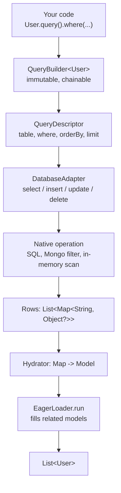
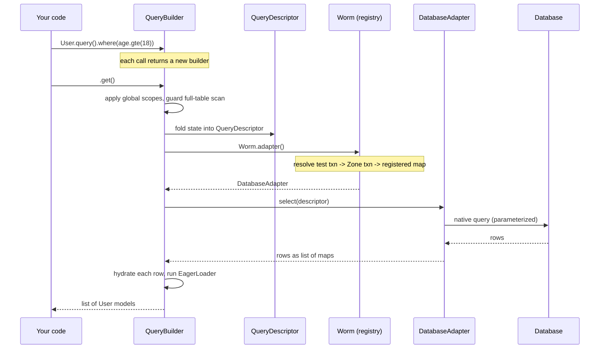

Worm is descriptor-first. The fluent API you write never talks to a database. It builds an immutable value object, and an adapter turns that value into native operations. This page traces one request end to end and states the boundary rules that keep the core portable.

## The one-way pipeline

Every read and write follows the same path. The user API accumulates state into a descriptor. The descriptor is a plain, backend-agnostic value. An adapter compiles it into a dialect. Execution returns raw rows. Hydration turns rows back into typed models.



**User API.** `QueryBuilder<T>` is immutable. Every chainable method (`where`, `orderBy`, `limit`) returns a fresh builder holding a new `QueryDescriptor`. Nothing runs until you call a terminal like `get`, `first`, `count`, or `paginate`. Typed fields (`User$.age`, a `ComparableField<int>`) produce a sealed `PredicateTree`, so invalid comparisons are compile errors rather than runtime surprises.

**Descriptor.** A terminal folds the builder state into one of a small set of immutable descriptors: `QueryDescriptor`, `InsertDescriptor`, `InsertManyDescriptor`, `UpdateDescriptor`, `DeleteDescriptor`, `AggregateDescriptor`, and `SchemaDescriptor`. These carry no dialect. A `QueryDescriptor` is just a `table`, an optional `where` tree, `orderBy`, `limit`, `offset`, `distinct`, and the SQL-only extras (`joins`, `groupBy`, `having`) that non-SQL adapters ignore.

**Adapter compilation and execution.** The builder calls `context.adapter.select(descriptor)`. Each adapter owns its own parameterized renderer. The SQLite, Postgres, and MySQL drivers build real SQL. The Mongo driver builds a filter document. The `InMemoryAdapter` runs a `PredicateEvaluator` over its store. Rows cross the boundary as `List<Map<String, Object?>>`, the one shape every backend agrees on.

**Hydration.** Back in the builder, `context.hydrate(row)` runs the model's generated `fromRow`, which pattern-matches each column into a typed attribute. Then `EagerLoader.run` resolves any `withRelations` / `withCount` requests and populates related models before the list is returned.

Here is the terminal that ties it together, from `query_builder.dart`:

```dart
Future<List<T>> get() async {
  final scoped = _applyGlobalScopes()
    .._guardFullTableScan(destructive: false);
  final rows = await context.adapter.select(scoped.descriptor);
  final items = <T>[for (final row in rows) context.hydrate(row)];
  await EagerLoader.run(/* ... */);
  return items;
}
```

Global scopes (soft deletes, tenancy) are applied at execution time, not when you write the query. That is why `toSql()` shows them too.

## Request lifecycle

The sequence below shows a single `get()`, including how the adapter is resolved through ambient state before execution.



The key point: the builder asks `Worm.adapter()` for the adapter at execution time. That call is where ambient state enters the picture.

## Package boundaries

Two rules keep the design honest. Both are verifiable in source.

**The executable core has zero SQL.** `package:worm` compiles queries into descriptors and nothing more. No adapter shipped in the core emits SQL: the `InMemoryAdapter` evaluates predicates in Dart. Executable SQL lives entirely in the driver packages (`worm_sqlite`, `worm_postgres`, `worm_mysql`), and the Mongo filter lives in `worm_mongodb`. The one piece of SQL text inside the core is `SqlCompiler`, and its own doc comment scopes it to "query inspection," not execution. It renders inline literals for `toSql()` and golden snapshots. `MongoFilterCompiler` plays the same inspection-only role for `toMongoFilter()`. So the core knows how to describe a query for a human, never how to run one against a specific engine.

**Analyzer types never leak into codegen descriptors.** Code generation is split in two. The pure core (`worm/lib/src/codegen/`) emits strings from plain descriptors: `ModelDescriptor`, `ColumnDescriptor`, `RelationDescriptor`, `ScopeDescriptor`. Every field on those types is a plain Dart value (a `String`, a `bool`, an enum like `FieldKind`, or a nested descriptor), never an analyzer type. The core imports no `package:analyzer`, no `package:build`, no `package:source_gen`. You can build a descriptor as a `const` value in a test and get identical output to a real build. The analyzer front end lives in a separate package, `worm_generator`. It reads `ClassElement` and `DartType` from the analyzer, then flattens each one to a string with `getDisplayString(...)` before constructing a descriptor:

```dart
ColumnDescriptor(
  dartName: field.name,
  dbName: dbName,                                  // snake_cased String
  dartType: field.type.getDisplayString(/* ... */), // String, not DartType
);
```

The conversion happens at the boundary. Downstream, the string-emitting generators never see an analyzer type. This split is what makes the codegen core unit-testable without a build, and it keeps the emitters immune to analyzer API churn.

## Ambient state through Zones

Three cross-cutting concerns thread themselves through async code without being passed as arguments: the active transaction, the unsafe escape hatch, and event muting. All three use Dart `Zone` values, so the state survives every `await` inside the callback and restores itself when the callback returns.

- `Worm.transaction(action)` runs `action` inside a zone keyed by `#worm.transaction` that carries the live `TransactionContext`. A `model.save()` deep inside the callback enlists automatically because `Worm.adapter()` reads that zone.
- `Worm.unsafe(body)` sets a `#worm.unsafe` flag zone that disables strictness guards for one-off full scans. Nesting is a no-op.
- `Worm.withoutEvents(body)` sets a `#worm.mutedEvents` zone that suppresses lifecycle events (but never validation).

Adapter resolution reads this state in a fixed order. `Worm.adapter()` returns the active test-transaction handle first, then any ambient zone transaction on the same connection, and finally the registered adapter for the named connection. That ordering is why a save inside a transaction, or inside a test transaction, quietly joins the right context with no explicit `transaction:` argument.

## Golden-snapshot testing of descriptors

Descriptors are the compiler-facing contract, so their serialized shape is frozen. Every descriptor and predicate node implements `toMap()`. The golden suite writes that map as indented JSON and compares it to a checked-in `.golden` file. A `02_select_where_eq.golden` looks like this:

```json
{
  "type": "query",
  "table": "users",
  "where": {
    "type": "leaf",
    "field": "name",
    "operator": "eq",
    "value": "Alice"
  }
}
```

The `test/goldens/` directory holds the descriptor snapshots, a `qb/` set for the fluent builder, and an `inspection/` set that pins the `toSql()` and `toMongoFilter()` output. A change to how a builder folds into a descriptor, or how a compiler renders one, shows up as a golden diff on the next run. Regenerate them deliberately with `UPDATE_GOLDENS=true dart test` from the package directory. This is the safety net for the whole pipeline: if the descriptor shape is stable, every adapter downstream can trust it.

## Continue reading

- [Code generation](../models/code-generation.md) covers the analyzer front end and what it emits.
- [How drivers work](../drivers/how-drivers-work.md) explains the compile-and-execute pattern the shipped adapters share.
- [Writing a database driver](./writing-a-database-driver.md) walks the `DatabaseAdapter` contract and the shared test kit.
