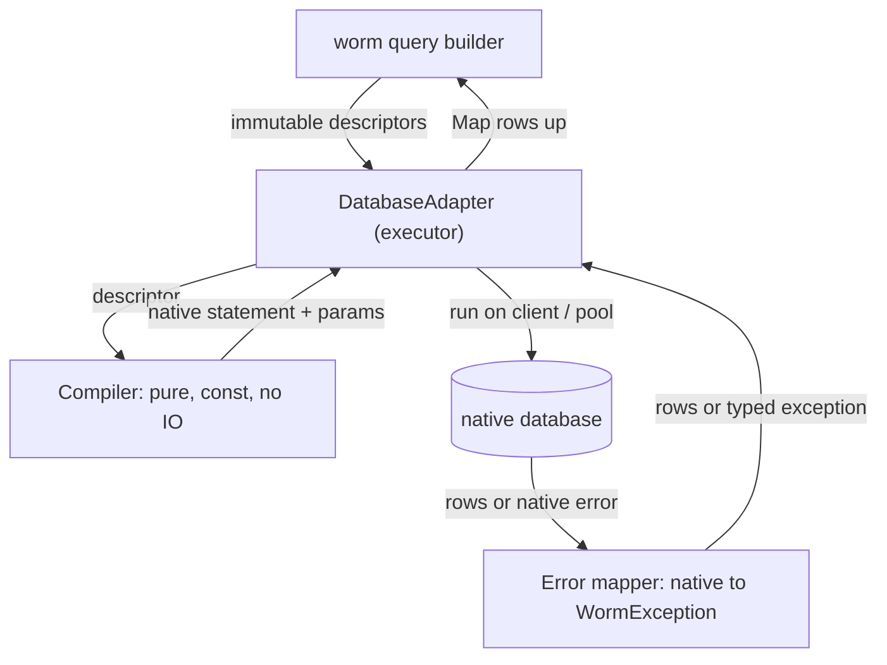

A worm driver is a package that implements one class: `DatabaseAdapter`. This guide takes you from an empty adapter to a green contract suite, using the four shipped drivers (`worm_sqlite`, `worm_postgres`, `worm_mysql`, `worm_mongodb`) as prior art.

## The three-part shape

Every shipped driver splits into the same three pieces. Copy the split; it keeps compilation pure, execution testable, and error handling in one place.

- A **compiler**: a `const`, I/O-free class that turns a descriptor into dialect output. `SqliteCompiler` and `PostgresCompiler` emit SQL with positional parameters. `MongoFilterCompiler` emits filter documents. It never touches the network, so you can unit-test it with golden strings.
- An **executor**: the adapter class itself. It runs compiled statements on the native client, manages the connection or pool, and implements `transaction()`.
- An **error mapper**: a stateless class whose `wrap` helper catches native driver errors and rethrows them as typed `WormException`s.



Descriptors go down, `Map<String, Object?>` rows come up. The model layer hydrates those maps into typed instances. Your driver never sees a model. For the app-developer view of this boundary, read [how drivers work](../drivers/how-drivers-work.md).

## Implement the contract, method by method

`DatabaseAdapter` is `abstract` (not `sealed`), so any package can implement it. The base constructor takes your declared capabilities:

```dart title="lib/src/my_adapter.dart"
final class MyAdapter extends DatabaseAdapter {
  MyAdapter(this._client) : super(capabilities: _capabilities);

  final MyClient _client;
  static const MyCompiler _compiler = MyCompiler();

  static const AdapterCapabilities _capabilities = AdapterCapabilities(
    supportsTransactions: true,
    supportsStreaming: true,
    supportsAggregations: true,
    supportsSchemaIntrospection: true,
  );

  @override
  AdapterType get adapterType => AdapterType.sql;

  @override
  Future<List<Map<String, Object?>>> select(QueryDescriptor d) =>
      MyErrorMapper.wrap(() async {
        final compiled = _compiler.compileSelect(d);
        return _client.query(compiled.sql, compiled.parameters);
      }, table: d.table);

  // ... every other method delegates the same way.
}
```

Here is the full method surface you must fill in. Every method below is abstract except `aggregateGrouped`, which ships a concrete in-memory default you may keep or override.

| Method | Returns | Contract |
| --- | --- | --- |
| `connect()` | `Future<void>` | Open the store. Safe to call repeatedly. |
| `disconnect()` | `Future<void>` | Close connections, release resources. |
| `select(QueryDescriptor)` | rows | Every matching row. |
| `selectOne(QueryDescriptor)` | row or `null` | First match, or `null`. |
| `stream(QueryDescriptor)` | `Stream` of rows | Same rows as `select`, bounded memory. |
| `insert(InsertDescriptor)` | the row | Insert one, return it. |
| `insertMany(InsertManyDescriptor)` | the rows | Insert many, return them. |
| `update(UpdateDescriptor)` | `Future<int>` | Affected row count. |
| `delete(DeleteDescriptor)` | `Future<int>` | Affected row count. |
| `count(AggregateDescriptor)` | `Future<int>` | Total matching rows. |
| `sum(AggregateDescriptor)` | `Future<num?>` | `null` when nothing matches. |
| `avg(AggregateDescriptor)` | `Future<double?>` | `null` when nothing matches. |
| `min` / `max(AggregateDescriptor)` | `Future<Object?>` | Column extreme over matches. |
| `aggregateGrouped(AggregateDescriptor)` | `Map<Object?, num>` | One entry per `groupBy` value. Has a default. |
| `rawQuery(String, List<Object?>)` | rows | Native read pass-through. |
| `rawExecute(String, List<Object?>)` | `Future<int>` | Native write, affected count. |
| `transaction<T>(...)` | `Future<T>` | Run an action in a transaction. |
| `executeSchema(SchemaDescriptor)` | `Future<void>` | Apply one DDL operation. |
| `introspectSchema()` | `Map<String, List<String>>` | Table name to column names. |
| `compileToString(Object)` | `String` | Debug render. Never executes. |

Two getters have defaults you can keep or override:

- `capabilities` is a getter, not a field. Adapters with a static profile pass the matrix through `super(...)`. Adapters whose support depends on runtime state override it. `MongoAdapter` does this to compute the matrix after a connection opens.
- `adapterType` defaults to `AdapterType.custom`. Override it to `AdapterType.sql` or `AdapterType.mongodb` to unlock the `.sql()` / `.mongo()` query contexts.

Keep `aggregateGrouped`'s default only if a per-group rollup in Dart is acceptable. SQL and document drivers override it to push `GROUP BY` into the database, so one row per group crosses the wire instead of all of them.

## Bind values, never interpolate

Compilers emit positional placeholders and a parameter list. PostgreSQL uses `$1, $2, ...`; SQLite and MySQL use `?`. User values ride in the parameter list, not the statement text. Normalise types your driver cannot bind at the boundary. The SQLite runner converts `bool` to `0/1` and `DateTime` to ISO-8601 text before binding, because `sqlite3` accepts only `int`, `double`, `String`, `Uint8List`, and `null`.

## Declare honest capabilities

`AdapterCapabilities` has 11 flags, all defaulting to `false`. Turn on only what you truly deliver:

`supportsTransactions`, `supportsSavepoints`, `supportsStreaming`, `supportsRawQuery`, `supportsReturning`, `supportsJoins`, `supportsPreparedStatements`, `supportsPartialIndexes`, `supportsAggregations`, `supportsSchemaIntrospection`, `supportsExplain`.

The matrix only describes. It never blocks a call. Enforcement is your job: if a caller reaches an operation you do not support, throw. The runtime reads these flags before it acts. `Worm.transaction` checks `supportsTransactions`, `TransactionContext.savepoint` checks `supportsSavepoints`, and the missing-index warner checks `supportsExplain`. Lying here means the runtime routes work to a method that then fails.

:::caution
The contract suite verifies that your declared flags match the profile you pass to it, and that unsupported operations throw. A flag you flip on but cannot honour fails the suite.
:::

## Map native errors to typed exceptions

Never let a raw driver error escape. Every worm exception extends `WormException`, and callers catch typed subclasses. A stateless mapper with a `wrap` helper does the translation once, at the executor boundary.

`SqliteErrorMapper` is the model to copy:

```dart title="lib/src/my_error_mapper.dart"
static WormException map(Object error, {String table = 'unknown', String query = ''}) {
  if (error is WormException) return error; // already typed, pass through.
  if (error is SqliteException) {
    final code = error.extendedResultCode;
    if (code == constraintUnique || code == constraintPrimaryKey) {
      return UniqueConstraintException(table: table, column: '', message: error.message);
    }
    if (code == constraintForeignKey) {
      return ForeignKeyException(table: table, column: '', message: error.message);
    }
    return QueryException(query: query, message: error.message);
  }
  return QueryException(query: query, message: error.toString());
}

static Future<T> wrap<T>(Future<T> Function() action, {String table = 'unknown', String query = ''}) async {
  try {
    return await action();
  } on WormException {
    rethrow;
  } catch (error) {
    throw map(error, table: table, query: query);
  }
}
```

Wrap the native call in every executor method, as the skeleton above does. Recognise your driver's own codes and map them to the right worm type:

| Signal | worm exception |
| --- | --- |
| Unique / primary key violation | `UniqueConstraintException` |
| Foreign key violation | `ForeignKeyException` |
| Deadlock or serialization failure | `TransactionException` |
| Connection loss | `ConnectionException` |
| Anything else | `QueryException` |

`PostgresErrorMapper` shows the SQLSTATE version: `23505` to `UniqueConstraintException`, `23503` to `ForeignKeyException`, `23514` and `23502` to `CheckConstraintException`, the class `22` codes to `DataException`, `40001` / `40P01` to `TransactionException`, the `08xxx` family to `ConnectionException`, and every unrecognised code to `QueryException`. Always let an existing `WormException` pass through untouched so your own guard clauses are not re-wrapped.

## Transactions and savepoints, or throw

`transaction<T>(action)` runs `action` and hands it a nested `DatabaseAdapter` bound to the transactional scope. Return commits. Throw rolls back and rethrows the original exception.

`SqliteRunner` wraps the body in `BEGIN ... COMMIT` and rolls back quietly on any error, letting the caller's own exception propagate unchanged. A separate `SqliteTransactionAdapter` shares the same runner, so reads and writes inside the transaction hit the same connection. When `supportsSavepoints` is on, a nested `transaction()` call opens a real `SAVEPOINT` and rolls back only its own slice.

If your backend cannot deliver atomic transactions, do not fake them. Throw `TransactionException` from `transaction()`, exactly as `MongoAdapter` does because `mongo_dart` exposes no session API. This is not optional: the contract's capability-gating test asserts that `transaction()` throws `TransactionException` whenever `supportsTransactions` is `false`.

:::note
Unsupported reasons differ by method. `transaction()` throws `TransactionException`. An unsupported `rawQuery` throws `UnsupportedOperationException` (both are `WormException`s). `TransactionContext.savepoint` throws `UnsupportedOperationException` when `supportsSavepoints` is off.
:::

## Optional: EXPLAIN via ExplainCapable

`explain` is not on the contract. It lives on the `ExplainCapable` mixin. Mix it in, set `supportsExplain: true`, and return an `ExplainResult` describing the plan:

```dart
final class MyAdapter extends DatabaseAdapter with ExplainCapable {
  @override
  Future<ExplainResult> explain(QueryDescriptor descriptor) async {
    // Run the native EXPLAIN, then report whether the plan used an index.
    return const ExplainResult(usesIndex: true);
  }
}
```

The strictness layer probes adapters with `is ExplainCapable` and the `supportsExplain` flag before calling `explain`, so the `MissingIndexWarner` stays a no-op against drivers that cannot produce a plan. Both guards must be true for it to fire.

## Reuse PredicateEvaluator for memory-style stores

If your backend holds rows in Dart (a mock, an embedded cache, a file store), do not hand-roll `WHERE` semantics. Delegate to the shared `const PredicateEvaluator()`. Its `matches(row, tree)` walks a `PredicateTree` with the same rules the whole ORM expects: `LIKE` to regex, inclusive `BETWEEN`, and NULLS-first comparisons. A `null` tree matches every row. Pass an `existsResolver` if you support subquery `EXISTS`. This is exactly how `InMemoryStore` filters, so your driver inherits identical behaviour for free.

## Run the contract test suite

The shared suite is the acceptance gate. Every shipped driver runs it, so passing means your driver behaves like the others.

Import it directly from its testing path. It is deliberately **not** exported from `package:worm/worm.dart`, so it never leaks into production builds:

```dart title="test/my_adapter_contract_test.dart"
@TestOn('vm')
library;

import 'package:test/test.dart';
import 'package:worm/testing/adapter_contract.dart';
import 'package:worm/worm.dart';
import 'package:worm_my/worm_my.dart';

void main() {
  runAdapterContractTests(
    name: 'MyAdapter contract',
    capabilities: const AdapterCapabilities(
      supportsTransactions: true,
      supportsStreaming: true,
      supportsAggregations: true,
      supportsSchemaIntrospection: true,
    ),
    adapterFactory: () => MyAdapter(MyClient()),
  );
}
```

`runAdapterContractTests` takes three arguments:

- `adapterFactory`: a function returning a **fresh, unconnected** adapter per test. The suite calls `connect()` for you. A `const` constructor tear-off like `SqliteAdapter.memory` works, or an `async` closure that builds and returns the adapter.
- `capabilities`: the profile the suite exercises. It must match your adapter's real capabilities. The transaction-rollback group runs only when `supportsTransactions` is true, and the raw-query group asserts a `WormException` when `supportsRawQuery` is false.
- `name`: an optional group label.

### What the fixture gives every test

Around each test the suite drops, recreates, and reseeds a `users` table:

| id | name | age | email | score |
| --- | --- | --- | --- | --- |
| 1 | Alice | 30 | `alice@example.com` | 100 |
| 2 | Bob | 25 | `bob@example.com` | 200 |
| 3 | Carol | 40 | `carol@example.com` | 150 |
| 4 | Dave | 35 | `null` | 200 |
| 5 | Eve | 28 | `eve@example.com` | 50 |

The schema is `id` integer primary key, `name` text, `age` integer, `email` nullable text, `score` integer. Your `executeSchema` must create it, your writes must persist against it, and your `introspectSchema` must report it. The null `email` on Dave and the repeated `score` of `200` are there on purpose: they drive the `isNull` / `isNotNull` operators and the `aggregateGrouped` assertions.

### The groups it runs

CRUD, every operator (`eq`, `neq`, `gt`, `gte`, `lt`, `lte`, `like`, `isNull`, `isNotNull`, `inList`, `notInList`, `between`, `notBetween`), `AND` / `OR` / `NOT` composition, sorting and pagination, aggregations including `aggregateGrouped`, schema create/drop plus introspection, streaming parity with `select`, `compileToString`, capability gating, and raw query. The transaction-rollback group is added only when you declare `supportsTransactions`.

### Gating a live-server suite

SQLite runs in-process, so its suite runs unconditionally. Server drivers gate on an environment variable and skip with a placeholder test when it is unset, so `dart test` stays green without a live server. The Postgres suite follows this pattern with `PG_DB`:

```dart title="test/postgres_adapter_contract_test.dart"
final url = Platform.environment['PG_DB'];
if (url == null || url.isEmpty) {
  test('Postgres contract suite skipped', () {}, skip: 'Set PG_DB to run it.');
  return;
}
runAdapterContractTests(/* ... build the adapter from url in adapterFactory ... */);
```

## Register your driver

An adapter reaches an app through `Worm.initialize`. Users construct your adapter, then pass it keyed by connection name:

```dart
final adapter = MyAdapter(myClient);
await adapter.connect();
await Worm.initialize(
  config: const WormConfig(),
  adapters: <String, DatabaseAdapter>{'default': adapter},
);
```

`Worm.initialize` connects every adapter it is given and throws `ConfigurationException` if no adapter matches the default connection. There are no `Worm.sqlite()` or `Worm.postgres()` convenience constructors: the adapter map is the one registration path. Document your factory constructors (`MyAdapter.open`, `MyAdapter.memory`) and your `driver` string id so users can wire your package into their config.

## Ship-it checklist

- [ ] Package splits into compiler, executor, and error mapper.
- [ ] Every abstract `DatabaseAdapter` method is implemented.
- [ ] `AdapterCapabilities` flips on only what you deliver.
- [ ] `adapterType` is set if you support the `.sql()` / `.mongo()` contexts.
- [ ] Every native error routes through a `wrap` helper into a typed `WormException`.
- [ ] `transaction()` commits on return, rolls back on throw, or throws `TransactionException` if unsupported.
- [ ] `ExplainCapable` is mixed in only when `supportsExplain` is true.
- [ ] Compilers use positional parameters and never interpolate user values.
- [ ] `runAdapterContractTests` passes with a capability profile matching your adapter.
- [ ] A live-server suite is env-gated so `dart test` is green offline.

Ship it, run the contract tests, and your database is officially edible.

## Continue reading

- [How drivers work](../drivers/how-drivers-work.md) for the app-developer view of the boundary.
- [Adapter API](../reference/adapter-api.md) for every signature, flag, and descriptor type.
- [Choosing a database](../drivers/choosing-a-database.mdx) to add your driver to the comparison.
