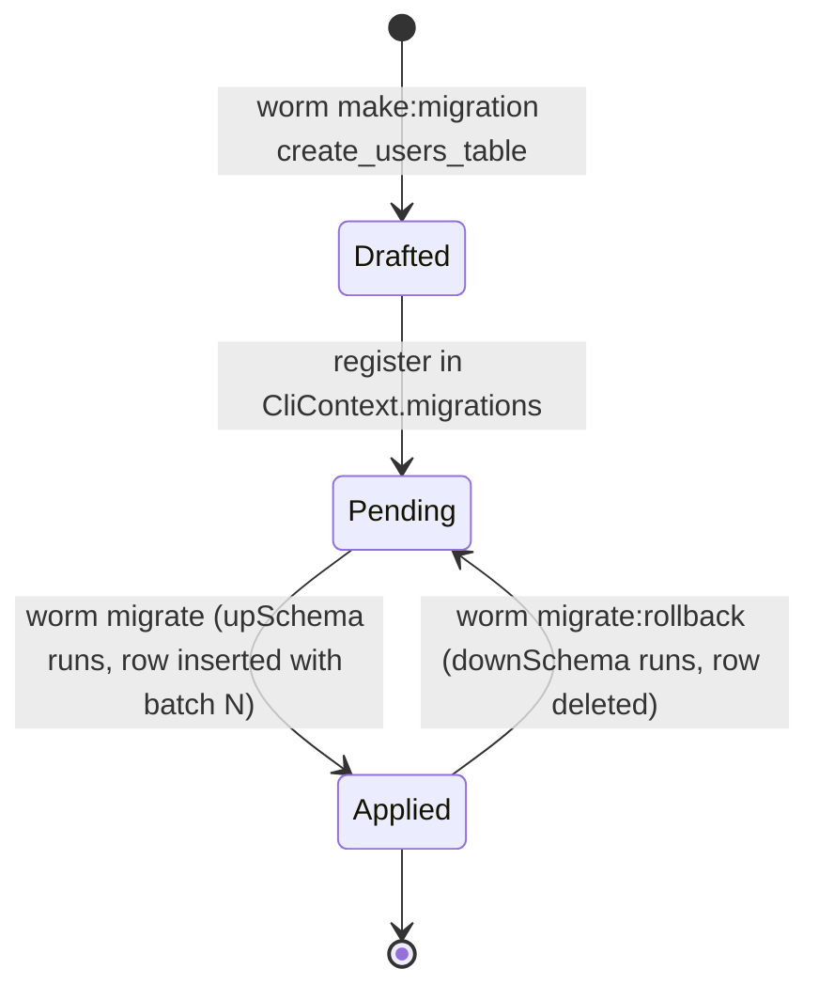

Migrations are versioned Dart classes that evolve your database schema one step at a time. This page covers writing a `Migration`, the essential column surface, and the full run/rollback lifecycle. For every column type and modifier, see [the schema builder](./schema-builder.md).

## The migration lifecycle

A migration moves through three states: drafted on disk, registered with your CLI, and applied to the database. Worm records every applied migration in a tracking table named `worm_migrations`, so it always knows what still needs to run.



Rollback works on whole batches: every migration applied by one `migrate` call shares a batch number, and `migrate:rollback` pops the most recent batch in one go.

## Writing a migration

Scaffold a file with the CLI:

```bash
dart run worm make:migration create_users_table
```

This writes `migrations/<timestamp>_create_users_table.dart`. The timestamp is UTC in `YYYYMMDD_HHMMSS` format, so files sort in creation order. The class name comes from the snake_case name you passed (`CreateUsersTable`).

A migration extends `Migration` and overrides three members:

- `name`: the file name without extension. This exact string is stored in `worm_migrations`, so treat it as immutable once applied.
- `upSchema(Schema schema)`: applies the change.
- `downSchema(Schema schema)`: reverts it.

```dart title="migrations/20260101_000000_create_users_table.dart"
import 'package:worm/worm.dart';

final class CreateUsersTable extends Migration {
  const CreateUsersTable();

  @override
  String get name => '20260101_000000_create_users_table';

  @override
  Future<void> upSchema(Schema schema) async {
    await schema.create('users', (table) {
      table.idUuid();
      table.string('email').makeUnique();
      table.string('name');
      table.integer('age').makeNullable();
      table.timestamps();
    });
  }

  @override
  Future<void> downSchema(Schema schema) async {
    await schema.drop('users', ifExists: true);
  }
}
```

The `Schema` object gives you `create`, `alter`, and `drop`. You never construct it yourself; the runner hands it to you.

:::note[Legacy surface]
Older migrations override `up(DatabaseAdapter adapter)` and `down(DatabaseAdapter adapter)` instead. The base class forwards `upSchema` to `up` by default, so both styles keep working. If a migration overrides neither pair, running it throws `UnimplementedError`. Prefer `upSchema`/`downSchema` for new code.
:::

## The essential column surface

Inside the `create` or `alter` callback you get a `BlueprintTable`. The methods you'll reach for most:

| Call | What it declares |
| --- | --- |
| `table.idUuid()` | UUID primary key named `id` |
| `table.idIncrements()` | Auto-incrementing integer primary key named `id` |
| `table.string('email')` | `VARCHAR(255)` column, NOT NULL |
| `table.integer('age')` | Integer column, NOT NULL |
| `table.boolean('active')` | Boolean column, NOT NULL |
| `table.dateTime('published_at')` | Timestamp with time zone, NOT NULL |
| `table.timestamps()` | Nullable `created_at` and `updated_at` |
| `table.softDeletes()` | Nullable `deleted_at` for [soft deletes](../models/soft-deletes.md) |

Columns are NOT NULL unless you call `.makeNullable()`. Chain modifiers with Dart cascades: `table.string('bio')..makeNullable()..withDefault('')`. The [schema builder page](./schema-builder.md) documents all 27 column types, indexes, and foreign keys.

## Registering migrations

Worm does not scan your `migrations/` directory. Every migration must be listed explicitly in the `CliContext` you build in your own `bin/worm.dart` (see [installation](../start-here/installation.md)):

```dart title="bin/worm.dart (excerpt)"
final context = CliContext(
  out: stdout,
  err: stderr,
  projectRoot: Directory.current,
  environment: Worm.environment,
  now: DateTime.now,
  adapterFactory: () async {
    final adapter = InMemoryAdapter();
    await adapter.connect();
    return adapter;
  },
  migrations: const [CreateUsersTable(), CreatePostsTable()],
);
```

Registration order is execution order, unless a migration declares [dependencies](./migrations-in-depth.md#ordering-with-dependson).

## Running migrations

```bash
dart run worm migrate              # apply every pending migration
dart run worm migrate --step=1     # apply only the first pending one
dart run worm migrate --pretend    # print compiled SQL, change nothing
dart run worm migrate:status       # applied vs pending table
dart run worm migrate:rollback     # revert the last batch
dart run worm migrate:rollback --steps=2
dart run worm migrate:refresh      # roll back everything, re-apply all
dart run worm migrate:fresh --seed # rebuild the migration log, then seed
```

`migrate` prints one `migrated  <name>` line per applied migration, or `Nothing to migrate.` when everything already ran. Running it twice is safe: applied names are skipped.

`migrate:status` prints a `Migration | Batch | Status` table with `[x]` and `[ ]` markers. `migrate:fresh` and `migrate:refresh` refuse to run in production without `--force` (see [production gating](./migrations-in-depth.md#production-gating)).

You can also drive the same machinery programmatically. This is what the CLI does under the hood:

```dart
final runner = MigrationRunner(
  adapter: adapter,
  migrations: const [CreateUsersTable(), CreatePostsTable()],
);

final applied = await runner.migrate();     // names of newly applied migrations
await runner.migrate();                     // [] on the second call
final reverted = await runner.rollback();   // last batch, reverse order
await runner.rollback(steps: 2);            // last two batches
await runner.refresh();                     // down everything, then up everything
final statuses = await runner.status();     // List<MigrationStatus>
```

`runner.run(step: n)` is an alias for `runner.migrate(step: n)` that mirrors the CLI naming.

## Batches and the tracking table

Every applied migration is one row in `worm_migrations`:

| Column | Type | Meaning |
| --- | --- | --- |
| `name` | text (primary key) | The migration's `name` string |
| `batch` | integer | Batch the migration was applied in |
| `applied_at` | dateTime | ISO 8601 instant of application |

One `migrate` call assigns all newly applied migrations the same batch number: `max(batch) + 1`. Rollback reads the highest batch, runs `downSchema` for each of its migrations in descending name order, and deletes the rows. `migrate:fresh` drops the tracking table itself and re-applies everything as batch 1.

The tracking row is inserted only after a migration's `upSchema` completes. Early-bird tip: run `migrate:status` before `migrate` on a shared database, so you know exactly which worms the early process already caught.

## Gotchas

- A migration that overrides neither `upSchema`/`downSchema` nor `up`/`down` throws `UnimplementedError` when it runs, which the runner then wraps in `MigrationException` like any other failure.
- Any failure inside `upSchema` or `downSchema` is wrapped in a `MigrationException` with the message prefix `up() failed:` or `down() failed:`.
- Rolling back requires the migration class to still be registered. A recorded name missing from the runner's list throws `MigrationException` with the message `Recorded migration not present in registered list`. Never delete a migration file that has been applied somewhere.
- Migrations are not wrapped in a transaction. A failure mid-migration can leave partial DDL behind, and no tracking row is written. See [failure semantics](./migrations-in-depth.md#failure-semantics).
- `migrate:fresh` drops only the `worm_migrations` tracking table, not your data tables. If the tables a migration creates still exist, re-applying will fail on the create statements. Drop the schema yourself first, or use `migrate:refresh`, which runs every `downSchema` before re-applying.
- The `name` string is the identity of a migration. Renaming an applied migration makes Worm treat it as new and pending.
- `worm_migrations` is created on demand with `IF NOT EXISTS` semantics; you never migrate the tracking table yourself.

## Continue reading

- [Schema builder](./schema-builder.md): every column type, modifier, index, and foreign key, plus what actually reaches each adapter.
- [Migrations in depth](./migrations-in-depth.md): dependency ordering, pretend mode, auto-generation, squashing, and production gates.
- [Seeding](./seeding.md): fill freshly migrated tables with data, including `migrate:fresh --seed`.
- [CLI commands](../reference/cli-commands.md): the full `worm` command reference with flags and exit codes.
