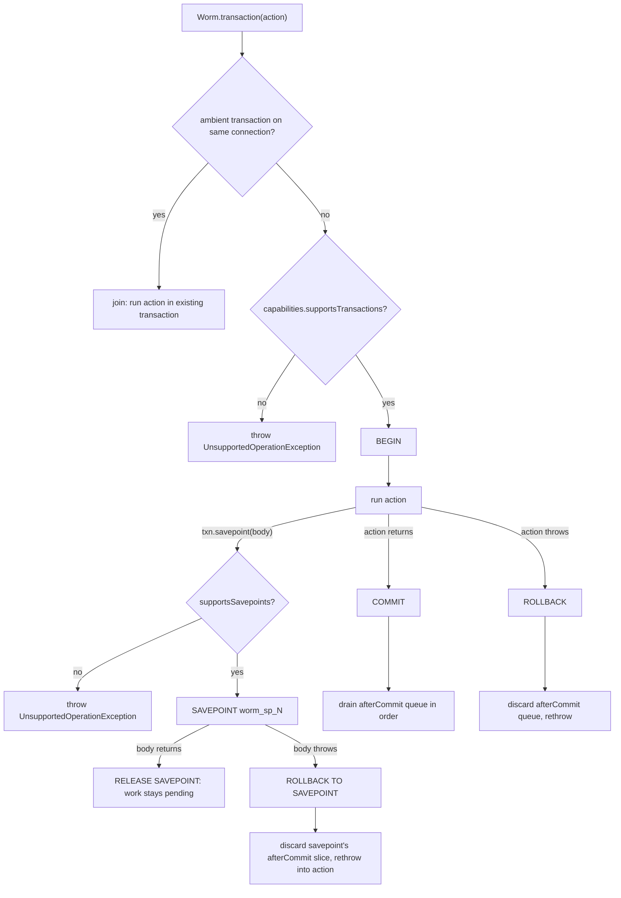

Transactions make a group of writes succeed or fail together. This page covers `Worm.transaction`, ambient enlistment, savepoints, `afterCommit` callbacks, and which adapters support what. It builds on [saving and updating](../models/saving-and-updating.md).

## The basics

Wrap your writes in `Worm.transaction`. Returning from the callback commits. Throwing rolls everything back and rethrows the exception:

```dart
final result = await Worm.transaction((txn) async {
  final user = User(name: 'Alice');
  await user.save();

  final post = Post(userId: user.id, title: 'Hello');
  await post.save();

  return 'created'; // returning commits
});
```

```dart
try {
  await Worm.transaction((txn) async {
    await user.save();
    throw StateError('boom'); // rolls back the save, then rethrows
  });
} on StateError {
  // The user row was never committed.
}
```

The callback receives a `TransactionContext`. It carries the transactional `adapter`, the `connectionName`, and the `savepoint` method. By default the transaction opens on the default connection; pass `connection:` to target another one (see [multiple connections](./multiple-connections.md)).

## Ambient enlistment

You rarely need to pass the transaction around. `Worm.transaction` propagates the context through a Dart Zone, so it survives `await`s. Any `save()` or `delete()` inside the callback (including in functions the callback calls) enlists automatically:

```dart
Future<void> registerUser(User user) => user.save(); // no transaction parameter

await Worm.transaction((txn) async {
  await registerUser(user); // still inside the transaction
});
```

You can also be explicit. `save`, `delete`, and `update` accept a `transaction:` parameter, and `Worm.currentTransaction` returns the ambient context (or `null`):

```dart
await Worm.transaction((txn) async {
  await user.save(transaction: txn);
});
```

Both forms route to the same place. Explicit passing helps when a helper must work with a specific transaction rather than whatever is ambient.

:::note
Enlistment matches by connection. A model whose `connectionName` differs from the transaction's connection saves outside the transaction. Details on [multiple connections](./multiple-connections.md).
:::

## Nesting joins, savepoints divide

A nested `Worm.transaction` on the same connection does not open a second transaction. It joins the enclosing one: the inner callback runs against the same context, and only the outermost commit or rollback counts.

```dart
await Worm.transaction((outer) async {
  await a.save();
  await Worm.transaction((inner) async {
    await b.save(); // same transaction as a
  });
  // Nothing committed yet. One COMMIT at the end covers both.
});
```

When you need a real inner rollback boundary, use `txn.savepoint`. On success the savepoint is released and its work stays part of the transaction. When the body throws, only the savepoint's own work rolls back, the exception propagates, and the outer transaction survives if you catch it:

```dart
await Worm.transaction((txn) async {
  await a.save();
  try {
    await txn.savepoint(() async {
      await b.save();
      throw StateError('undo b only');
    });
  } on StateError {
    // b is rolled back; a is still pending in the outer transaction.
  }
}); // commits: a persists, b does not
```

`savepoint` throws `UnsupportedOperationException` when the adapter's `capabilities.supportsSavepoints` is `false`, even if the outer transaction itself works. The SQL drivers name their savepoints `worm_sp_1`, `worm_sp_2`, and so on.



## afterCommit

`model.afterCommit(callback)` defers side effects (notifications, cache busts) until the data is actually durable:

- Outside a transaction, the callback fires immediately after the save or delete completes.
- Inside a transaction, callbacks queue on the `TransactionContext` and drain, in registration order, only after the outermost transaction commits.
- If the transaction rolls back, queued callbacks are discarded without firing.
- Callbacks registered inside a savepoint that rolls back are discarded too; the rest of the queue survives.

```dart
await Worm.transaction((txn) async {
  final user = User(name: 'Alice');
  user.afterCommit(() => notifySignup(user));
  await user.save();
  // notifySignup has not run yet.
});
// Transaction committed: notifySignup runs now.
```

The queue lives on the transaction context, not on the model, so callbacks from every model saved in the transaction drain together after the single commit. How `afterCommit` interleaves with hooks is covered in [lifecycle hooks and observers](../models/lifecycle-hooks-and-observers.md).

## Capability gating

`Worm.transaction` checks the resolved adapter's `capabilities.supportsTransactions` before opening anything and throws `UnsupportedOperationException` when it is `false`. `TransactionContext.savepoint` performs the same check against `supportsSavepoints`.

| Adapter | Transactions | Savepoints | Notes |
| --- | --- | --- | --- |
| `InMemoryAdapter` | yes | yes | Snapshot and restore of the whole store; nested calls act as savepoints. |
| `SqliteAdapter` | yes | yes | `SAVEPOINT` statements; single connection, so no overlapping queries inside a transaction. |
| `PostgresAdapter` | yes | yes | Native transactions, savepoints named `worm_sp_N`. |
| `MysqlAdapter` | yes | yes | Native transactions, savepoints named `worm_sp_N`. |
| `MongoAdapter` | no | no | See below. |

### MongoDB: TransactionException by design

The MongoDB adapter does not support transactions, and it refuses loudly rather than pretending. Its `capabilities` report `supportsTransactions: false`, so `Worm.transaction` on a Mongo connection throws `UnsupportedOperationException` at the capability gate. Calling `MongoAdapter.transaction()` directly throws `TransactionException`.

This is deliberate. The underlying `mongo_dart` driver exposes no client-session or transaction API, so atomic multi-document commit and rollback cannot be guaranteed, even against a replica set. The adapter throws instead of silently running your writes without isolation. Perform Mongo writes individually, or design them to be independently valid. The [MongoDB driver page](../drivers/mongodb.md) covers the full capability profile.

## Test transactions

For test isolation, `Worm.beginTestTransaction()` opens a transaction on the default connection and keeps it open across the whole test; `Worm.rollbackTestTransaction()` unwinds it, discarding every write (and every queued `afterCommit` callback). While active, `Worm.adapter()` returns the transactional handle for the default connection, so all code under test participates automatically.

```dart
setUp(Worm.beginTestTransaction);
tearDown(Worm.rollbackTestTransaction);
```

A second `beginTestTransaction` without a rollback throws `ConfigurationException` (key `test_transaction.duplicate`). `Worm.reset()` rolls back any active test transaction for you. The full recipe lives in the [testing guide](../guides/testing.md).

## Gotchas

- Nested `Worm.transaction` on the same connection joins the outer one. There is no inner commit; only the outermost boundary commits or rolls back.
- A nested `Worm.transaction` on a different connection opens its own independent transaction. Nothing coordinates the two.
- `savepoint` rethrows the body's exception after rolling back. Catch it inside the outer callback if the outer transaction should continue.
- `savepoint` can throw `UnsupportedOperationException` even where `Worm.transaction` works: the two capabilities are separate flags.
- `afterCommit` callbacks are discarded on rollback, including the slice registered inside a rolled-back savepoint.
- Outside any transaction, `afterCommit` fires immediately after the operation, not at some later flush point.
- A model whose `connectionName` differs from the transaction's connection does not enlist; its save commits independently.
- Test transactions cover the default connection only.

## Continue reading

- [Testing guide](../guides/testing.md): test transactions, fresh adapters, and rollback-per-test patterns.
- [MongoDB driver](../drivers/mongodb.md): the full story on what the Mongo adapter can and cannot do.
- [Lifecycle hooks and observers](../models/lifecycle-hooks-and-observers.md): where `afterCommit` sits in the save pipeline.
- [Multiple connections](./multiple-connections.md): transactions and adapter resolution across named connections.
