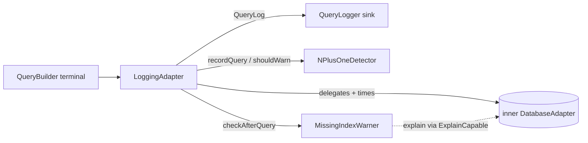

This page shows you how to see every query worm runs: timings, parameters, slow-query flags, N+1 detection, and missing-index warnings. It builds on [how drivers work](../drivers/how-drivers-work.md) and pairs with [strict mode](./strict-mode.md).

## Opt in by wrapping your adapter

Logging is an explicit decorator, not a config flag. You wrap your real adapter in a `LoggingAdapter` and hand the wrapped adapter to `Worm.initialize`. There is no auto-wiring: if you don't wrap, nothing is logged.

```dart
final logger = ConsoleQueryLogger();
final adapter = LoggingAdapter(
  inner: InMemoryAdapter(),          // any DatabaseAdapter works here
  logger: logger,
  strictness: const StrictnessConfig(
    warnOnN1Queries: true,
    warnOnMissingIndex: true,
  ),
  adapterName: 'InMemory',
);

await Worm.initialize(
  config: const WormConfig(),
  adapters: {'default': adapter},
);
```

`LoggingAdapter` is itself a `DatabaseAdapter`. It times every call with a stopwatch, asks the inner adapter to do the real work, and emits one `QueryLog` record per operation. It carries its own `StrictnessConfig`, which powers the N+1 and missing-index checks below.



Inside `transaction()` callbacks, `LoggingAdapter` wraps the transactional adapter with a new decorator that shares the same logger, detector, and warner instances. Queries inside transactions are logged like any other.

## Choosing a sink

Three `QueryLogger` implementations ship with worm, plus a factory that picks one from config:

```dart
final console = ConsoleQueryLogger();                  // stdout
final memory = InMemoryQueryLogger();                  // tests and diagnostics
final file = FileLogger('/var/log/worm.log');          // appends to a file

// From config: file != null -> FileLogger, file == null -> ConsoleQueryLogger
final fromConfig = QueryLogger.fromConfig(
  const LogConfig(file: 'worm.log'),
);
```

`FileLogger` holds an open `IOSink`. Call `await fileLogger.close()` on shutdown to flush; otherwise trailing lines may be lost. `InMemoryQueryLogger` retains everything forever, so keep it out of long-running processes.

To build your own sink (syslog, OpenTelemetry, a ring buffer), extend `QueryLogger` and implement the single primitive `emitLine(String line)`. The base class handles formatting and enforces `LogConfig.enabled` before your sink ever sees a line.

## The line format

Every line starts with a UTC timestamp in `[yyyy-MM-dd HH:mm:ss.SSS]` form, followed by a tag:

```text
[2026-07-02 10:15:42.123] [QUERY] SELECT * FROM users WHERE name = ? | params: [Alice] | 3ms
[2026-07-02 10:15:42.512] [SLOW QUERY] SELECT * FROM posts | params: [] | 240ms (threshold: 200ms)
[2026-07-02 10:15:43.007] [WARNING] N+1: 5+ same-table queries on "posts" within 100ms. Consider eager loading.
[2026-07-02 10:15:43.442] [ERROR] connection lost :: SocketException
```

To keep sensitive values out of logs, set `LogConfig(logQueryParameters: false)`; the params section then reads `params: [REDACTED]`. The [security guide](./security.md) covers when you should.

## Two slow-query thresholds

Worm has two independent slow-query thresholds. They look similar but drive different machinery:

| Setting | Default | Consumed by | Effect |
| --- | --- | --- | --- |
| `LogConfig.slowQueryThreshold` | 200 ms | `QueryLogger.log` formatting | The line is rendered with the `[SLOW QUERY]` prefix and a `(threshold: Nms)` suffix instead of `[QUERY]`. |
| `StrictnessConfig.slowQueryThreshold` | 500 ms | `LoggingAdapter` | Fires the `QueryLogger.slowQuery(entry, threshold)` callback. `InMemoryQueryLogger` collects these into its `slowQueries` list; the console and file loggers ignore the callback by default. |

A 300 ms query with default settings therefore gets a `[SLOW QUERY]` line (over 200 ms) but does not land in `InMemoryQueryLogger.slowQueries` (under 500 ms). Set both if you want one consistent definition of "slow".

## N+1 detection

The `NPlusOneDetector` is a sliding-window counter that `LoggingAdapter` consults after each `select`/`selectOne`. Its mechanics, straight from the source:

1. The detector is armed when either `warnOnN1Queries` or `throwOnN1Queries` is set on the `LoggingAdapter`'s `StrictnessConfig`.
2. Only queries that look like single-row lookups count: `limit == 1`, or a query that returned at most one row and filters on `id` or any column ending in `_id`. Multi-row selects never contribute.
3. Each counted query records a timestamp for its table. Entries older than the window are evicted before every check, so memory stays bounded.
4. When one table accumulates `threshold` lookups (default 5) within `window` (default 100 ms), the detector fires and its counter for that table resets, so you get one diagnostic per burst instead of a warning per query.
5. What "fires" means depends on the flags: `warnOnN1Queries` writes a `[WARNING]` line; `throwOnN1Queries` throws `DangerousQueryException` from inside the query call instead, without emitting the warning line first. The two flags are orthogonal; the throw wins when both are set.

The detector itself never throws; escalation is `LoggingAdapter`'s job. Tune it by passing your own instance:

```dart
LoggingAdapter(
  inner: adapter,
  logger: logger,
  strictness: const StrictnessConfig(warnOnN1Queries: true),
  detector: NPlusOneDetector(threshold: 10, window: Duration(milliseconds: 250)),
);
```

An N+1 pattern is one bird making N+1 trips for N worms. The fix is [eager loading](../relations/eager-loading.md); the detector just tells you which table the bird keeps flying back to.

## Missing-index warnings

With `warnOnMissingIndex: true`, `LoggingAdapter` runs the `MissingIndexWarner` after each select. The warner asks the adapter for an EXPLAIN plan and writes a `[WARNING]` line when the plan uses no index for a filtered query:

```text
[WARNING] missing-index: query on "users" filters by (email) without an index. Plan: SCAN users
```

The warner is a hard no-op unless all of these hold, so it's safe to enable unconditionally:

- The adapter's `AdapterCapabilities.supportsExplain` is `true`.
- The adapter mixes in `ExplainCapable` (Postgres, SQLite, and the in-memory adapter do).
- The query has a `where` clause (no predicates means nothing to index).

`InMemoryAdapter` always reports `usesIndex: true`, so you won't see these warnings in in-memory tests. Point a staging run at Postgres or SQLite to get real plans.

## Inspecting a query without running it

Four tools show you what a query will do before (or without) execution:

```dart
final query = User.query().where(User$.age, Operator.gte, 18);

query.toSql();          // "SELECT * FROM users WHERE age >= 18"
query.toMongoFilter();  // '{"age":{"$gte":18}}'
query.debug().get();    // logs a builder summary via dart:developer, then runs
final plan = await query.explain();  // ExplainResult from the adapter
```

- `toSql()` and `toMongoFilter()` compile through reference compilers with literals inlined. The output is deterministic and golden-test friendly, but it is not executable; adapters parameterize their real statements.
- `debug()` is a pure observer: it logs the builder state (table, where tree, sort, limit, eager loads) under the `worm.query` logger name and returns the same builder for chaining. It never throws.
- `explain()` returns the adapter's `ExplainResult` (index use, estimated cost and rows, raw plan text). It throws `UnsupportedOperationException` when the adapter doesn't mix in `ExplainCapable`.
- Every adapter also exposes `compileToString(descriptor)`, the synchronous compile hook `LoggingAdapter` uses to render statements. It never executes anything.

## What escapes logging

`LoggingAdapter` covers selects, writes, aggregates, raw calls, and schema execution, but not everything:

- `stream()` and `introspectSchema()` pass straight through to the inner adapter, unlogged.
- `rawQuery`/`rawExecute` are logged, but their entries carry no `table`, so they bypass N+1 detection and missing-index checks entirely.
- `connect()`, `disconnect()`, and `compileToString()` are pass-through and produce no entries.

## Gotchas

- No auto-wiring: `LogConfig` alone does nothing. You must construct a `LoggingAdapter` and register it with `Worm.initialize`.
- `LogConfig.level` and `LogConfig.formatQueries` are reserved and currently have no effect; the logger does not yet filter by severity or pretty-print SQL.
- The N+1 and missing-index diagnostics are emitted via `logWarning`, so on `InMemoryQueryLogger` they appear in `lines`, not in the structured `warnings` list (that list is filled only by direct `warning(code: ...)` calls).
- `throwOnN1Queries` throws without logging a warning line first; don't wait for a log entry that will never come.
- Remember the two thresholds: `[SLOW QUERY]` lines follow `LogConfig` (200 ms default), the `slowQueries` capture list follows `StrictnessConfig` (500 ms default).
- `FileLogger` needs `close()`; `InMemoryQueryLogger` grows unboundedly.
- Timestamps are UTC, not local time.

## API summary

### Configuration and sinks

| Symbol | Signature sketch | What it does |
| --- | --- | --- |
| `LogLevel` | enum `debug, info, warning, error`; `int get severity` | Severity levels. Filtering by level is reserved, not yet enforced. |
| `LogConfig` | `const LogConfig({enabled = true, level = LogLevel.debug, file, slowQueryThreshold = 200ms, logQueryParameters = true, formatQueries = true})` + `copyWith` | Runtime logger configuration; `file` is consumed only by `QueryLogger.fromConfig`. |
| `QueryLogger` | abstract; `factory QueryLogger.fromConfig(LogConfig)`; `log`, `warning({code, message, entry})`, `logWarning`, `logError`, `slowQuery`; primitive `emitLine(String)` | Sink base class; enforces `config.enabled` uniformly. |
| `ConsoleQueryLogger` | `ConsoleQueryLogger({config, StringSink? sink})` | Writes formatted lines to stdout or an injected sink. |
| `InMemoryQueryLogger` | `entries`, `slowQueries`, `warnings`, `lines`, `clear()` | Captures everything in memory for tests and diagnostics. |
| `FileLogger` | `FileLogger(String path, {config})`; `Future<void> close()` | Appends one line per event to a file; `close()` flushes. |
| `LoggedWarning` | `{String code, String message, QueryLog? entry}` | One structured warning captured by `InMemoryQueryLogger`. |
| `QueryLog` | `const QueryLog({statement, parameters, duration, rowCount, adapter, table})` | One captured query execution record. |

### Decorator and detectors

| Symbol | Signature sketch | What it does |
| --- | --- | --- |
| `LoggingAdapter` | `LoggingAdapter({required inner, required logger, required strictness, adapterName = 'DatabaseAdapter', detector, missingIndexWarner})` | `DatabaseAdapter` decorator: times calls, emits `QueryLog`s, runs N+1 and missing-index checks, propagates into transactions. |
| `NPlusOneDetector` | `NPlusOneDetector({threshold = 5, window = 100ms, clock})`; `recordQuery(table)`, `shouldWarn(table, {threshold, window})`, `resetTable(table)`, `reset()` | Sliding-window same-table query counter. Warns only; never throws itself. |
| `ExplainCapable` | mixin; `Future<ExplainResult> explain(QueryDescriptor)` | Adapter opt-in for exposing query plans. |
| `ExplainResult` | `const ExplainResult({required usesIndex, raw = '', indexName, estimatedCost = 0, estimatedRows = 0, scannedTables = []})` | Adapter-agnostic EXPLAIN output. |
| `MissingIndexWarner` | `const MissingIndexWarner()`; `checkAfterQuery({descriptor, capabilities, adapter, logger})` | Warns when a filtered query's plan uses no index; no-op without `supportsExplain` + `ExplainCapable`. |

### Formatters and inspection

| Symbol | Signature sketch | What it does |
| --- | --- | --- |
| `formatQueryLine` | `String formatQueryLine(QueryLog, LogConfig)` | Renders a `[QUERY]` or `[SLOW QUERY]` line. |
| `formatWarningLine` | `String formatWarningLine(String message)` | Renders a `[WARNING]` line. |
| `formatErrorLine` | `String formatErrorLine(String message, [Object? error])` | Renders an `[ERROR]` line with optional error tail. |
| `formatStructuredWarning` | `String formatStructuredWarning(String code, String message, QueryLog? entry)` | Renders `[WARNING] [code] message`. |
| `formatTimestamp` | `String formatTimestamp()` | Current UTC timestamp as `[yyyy-MM-dd HH:mm:ss.SSS]`. |
| `QueryBuilder.debug` | `QueryBuilder<T> debug()` | Logs a builder summary via `dart:developer` (`worm.query`); chainable, never throws. |
| `QueryBuilder.toSql` / `toMongoFilter` | `String toSql()` / `String toMongoFilter()` | Deterministic inspection compiles; not executable. |
| `QueryBuilder.explain` | `Future<ExplainResult> explain()` | Runs EXPLAIN through the adapter; throws `UnsupportedOperationException` if unsupported. |
| `DatabaseAdapter.compileToString` | `String compileToString(Object descriptor)` | Synchronous statement rendering; never executes. |

## Continue reading

- [Performance](./performance.md): turn what the logs tell you into faster queries.
- [Strict mode](./strict-mode.md): the full `StrictnessConfig` flag catalog and `Worm.unsafe`.
- [Eager loading](../relations/eager-loading.md): the fix for every N+1 warning.
- [Exceptions](../reference/exceptions.md): `DangerousQueryException` and friends in detail.
