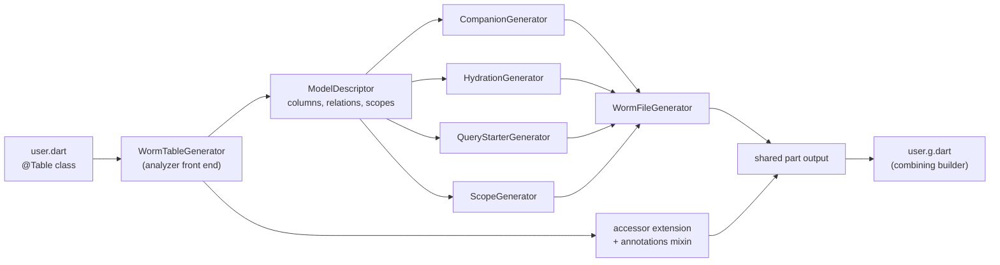

This page explains what the worm code generator produces from an annotated model, the three ways to run it, and the escape hatch of driving the generator core directly. It builds on [defining models](./defining-models.md).

## What gets generated

For every class annotated with `@Table`, the generator emits five artifacts plus one opt-in mixin:

| Artifact | Shape | What it gives you |
|---|---|---|
| Companion class | `class User$` | `tableName` constant plus one typed field constant per `@Column` (`User$.name`, `User$.age`) and one `RelationField<User, Post>` constant per relation annotation (`User$.posts`). |
| Hydration extension | `extension UserHydration on User` | `static User fromRow(Map<String, Object?> row)` built from pattern matching, and a `toRow()` projection of the `@Column` fields. |
| Query starter | `extension UserQuery on User` | `static QueryBuilder<User> query()` wired with the adapter, table, hydrator, and any `@GlobalScope` classes. |
| Scope metadata | `extension UserWormScopes on User$` | `scopeNames` and `globalScopes` constants. |
| Accessor extension | `extension UserAccessors on User` | One `posts$`-style getter per `@HasMany`, `@HasOne`, and `@BelongsToMany` field, returning a runtime relation accessor. Omitted when the model has none. |
| Annotations mixin | `mixin _$UserAnnotations on Model` | Overrides generated from `@Hidden`, `@Fillable`, `@Guarded`, `@CastAs`, and a non-default `@Table(connection:)`. Opt-in: you must add `with _$UserAnnotations` yourself. Omitted when none apply. |

The generated source contains zero `as` casts. That is a tested design guarantee, not an accident: hydration uses `switch` pattern matching and throws `FormatException('Expected <type> for User.<field>')` when a row value has the wrong type. Nullable columns accept `null` but still reject wrong non-null types.

## Running the generator

Three front doors, all driving the same build_runner pipeline:

```sh
dart run worm:worm gen                 # recommended: the worm CLI
dart run worm_generator:worm_gen      # thin wrapper, forwards args to build_runner
dart run build_runner build           # raw build_runner
```

`worm gen` flags:

| Flag | Effect |
|---|---|
| (default) | `dart run build_runner build --delete-conflicting-outputs` |
| `--watch` | `build_runner watch` with streamed output |
| `--clean` | `build_runner clean`, then build |
| `--no-delete-conflicting-outputs` | Opt out of the flag the default build forwards |

The `worm_generator:worm_gen` wrapper propagates the build_runner exit code, so CI pipelines detect generation failures.

`build.yaml` facts: the builder is registered as `worm_generator` with factory `wormBuilder`, `auto_apply: dependents`, and `build_to: source`. There are no user-tunable builder options; `BuilderOptions` is ignored, and all configuration lives in the annotations.

## The pipeline



The pipeline has two layers. The core (`ModelDescriptor` and the five generators, exported from `package:worm/worm.dart`) is pure string emission over plain data and never touches the analyzer. `worm_generator` is the analyzer front end: `WormTableGenerator` reads the annotated class, builds a `ModelDescriptor`, runs the core, and appends the accessor extension and annotations mixin. `readRelations` maps the relation annotations to `RelationDescriptor` entries; `@MorphTo` is skipped by design because its child type is dynamic.

## The generated file on disk

The builder is a `SharedPartBuilder`, so through build_runner the output for `lib/models/user.dart` lands in `lib/models/user.g.dart`, and the model file must declare the part:

```dart
part 'user.g.dart';
```

:::caution[Known limitation: an import inside the part]
The current generator writes an `import 'package:worm/worm.dart';` line into the shared part. Part files cannot declare imports, so the analyzer reports `non_part_of_directive_in_part` inside `user.g.dart` until you delete that one line. Generation itself succeeds; only the emitted file needs the fix after each run. Driving the core by hand with `partOfImport` set (below) produces a clean part file without this issue.
:::

Every generated file starts with a `// GENERATED CODE - DO NOT MODIFY BY HAND.` header and carries `ignore_for_file: directives_ordering, lines_longer_than_80_chars`.

## Using the generated API

```dart
// Typed fields on the companion.
final adults = await UserQuery.query()
    .where(User$.age.gte(18))
    .get();

// Hydration.
final user = UserHydration.fromRow(row);
final map = user.toRow(); // via the model's own override

// Relation accessor (generated for @HasMany / @HasOne / @BelongsToMany).
await user.posts$.add(post);
final posts = await user.posts$.get();

// Annotations mixin: opt in on the class declaration.
// final class User extends Model with _$UserAnnotations { ... }
```

Note the call form: `query()` and `fromRow` are static members of extensions, and Dart resolves static extension members through the extension name. You write `UserQuery.query()`, not `User.query()`.

The field constants gate operators by type. `User$.name` is a `StringField` with text operators, `User$.age` is a `ComparableField<int>` with ordering operators, and everything else is a plain `Field<T>` with equality only. A typo in a field name, or a `gt` on a boolean column, is a compile-time error. See [query basics](../queries/query-basics.md) and the [operators reference](../reference/operators-and-fields.md).

### Field kind inference

| Dart field type | Generated constant |
|---|---|
| `String` | `StringField` |
| `int`, `double`, `num`, `DateTime` | `ComparableField<T>` |
| anything else | `Field<T>` |

### The annotations mixin

When a model carries `@Hidden`, `@Fillable`, `@Guarded`, `@CastAs`, or a non-default `@Table(connection:)`, the generator emits a `mixin _$UserAnnotations on Model` with the matching `Model` overrides (`hiddenFromSerialization`, `fillable`, `guarded`, `castManager`, `connectionName`) plus an explicit `describe()` override. Generation alone does nothing: the mixin only takes effect once you write `class User extends Model with _$UserAnnotations`.

The `Model` overrides remain the canonical mechanism, and they are what the mixin emits. `@Appended`, `@Attribute`, and `@Computed` are not read by the generator at all; see the [annotations reference](../reference/annotations.md) for the stable-versus-experimental breakdown.

## Scopes and codegen

`@Scope` methods are recorded in the generated `scopeNames` metadata list, and `@GlobalScope(MyScope)` types are instantiated in the query starter's `globalScopes` list. Typed local-scope extension methods (for example `query.published()` calling `scope(const PublishedScope())`) are only emitted when a `ScopeDescriptor` carries a `className`, and the build_runner front end never sets one. To apply a local scope today, call `scope(...)` on the builder directly:

```dart
final published = await PostQuery.query().scope(const PublishedScope()).get();
```

`scopeNames` is inert metadata; there is no runtime method that applies a scope by name string. See [scopes](../queries/scopes.md) for `LocalScope`, `CallableLocalScope`, and `GlobalScope`.

## Driving the core by hand

The descriptors and generators are public, so you can generate without build_runner: useful for hermetic tests, custom tooling, or avoiding the shared-part import limitation. Set `partOfImport` to get a proper part file:

```dart title="tool/generate_tag.dart"
import 'dart:io';

import 'package:worm/worm.dart';

void main() {
  const descriptor = ModelDescriptor(
    className: 'Tag',
    tableName: 'tags',
    partOfImport: 'tag.dart',
    columns: [
      ColumnDescriptor(
        dartName: 'id',
        dbName: 'id',
        dartType: 'String',
        isPrimaryKey: true,
        fieldKind: FieldKind.string,
      ),
      ColumnDescriptor(
        dartName: 'label',
        dbName: 'label',
        dartType: 'String',
        fieldKind: FieldKind.string,
      ),
    ],
  );
  File('lib/models/tag.g.dart')
      .writeAsStringSync(const WormFileGenerator(descriptor).generate());
}
```

`tag.dart` then declares `part 'tag.g.dart';` and the output compiles as-is. With `partOfImport: null` the core emits a standalone library header instead. The hand-driven path is also the only way to get typed scope methods today, by supplying `ScopeDescriptor(name: 'published', className: 'PublishedScope')`.

## Gotchas

- Only `@Column`-annotated fields become columns. A bare `@PrimaryKey()` field is not hydrated and gets no field constant. Annotate the key with both.
- The model's constructor must accept a named parameter per `@Column` field; relation fields must be optional (for example `this.posts = const []`), because `fromRow` passes only columns.
- `UserQuery.query()` is the call form. `User.query()` does not compile; static extension members resolve through the extension name.
- The generated `fromRow` constructs a fresh instance. It does not seed the attribute store and does not call `markPersisted()`, so models loaded through the generated query starter report `exists == false` and a subsequent `save()` inserts a new row. Call `markPersisted()` yourself (or use a [repository](./repository-pattern.md), which does it for you) before treating a loaded model as persisted.
- The generated query starter does not register the model's relations in its `QueryContext`, so `withRelations` / `withRelationPaths` on it currently throw `ConfigurationException` with key `relation.unknown`. See [eager loading](../relations/eager-loading.md) for the working setup.
- The shared part currently contains an illegal `import` line; delete it after generation or hand-drive the core (see the caution above).
- `@MorphTo` fields are skipped by the relation reader by design.
- `@Table` on anything but a class throws `InvalidGenerationSourceError('@Table can only be applied to classes.')`.
- The build verifies that `package:worm/worm.dart` resolves and exports `QueryBuilder`; if not, it logs a warning because the generated starters would not compile.
- The annotations mixin does nothing until you add `with _$UserAnnotations` to the class.

## API summary

### Codegen descriptors (exported from `package:worm/worm.dart`)

| Symbol | Signature | Description |
|---|---|---|
| `FieldKind` | `enum FieldKind { string, comparable, plain }` | Which field flavor a column gets. |
| `ColumnDescriptor` | `const ColumnDescriptor({required String dartName, required String dbName, required String dartType, bool isPrimaryKey = false, bool isNullable = false, FieldKind fieldKind = FieldKind.plain})` | One column. `nullableDartType` appends `?` when nullable. |
| `RelationDescriptorKind` | `enum RelationDescriptorKind { one, many }` | Relation cardinality; the emitted constant shape is identical. |
| `RelationDescriptor` | `const RelationDescriptor({required String dartName, required String relatedClassName, required RelationDescriptorKind kind, required String foreignKey, String localKey = 'id'})` | One relation to emit as a `RelationField` constant. |
| `ScopeParameter` | `const ScopeParameter({required String name, required String type})` | One positional parameter of a scope method. |
| `ScopeDescriptor` | `const ScopeDescriptor({required String name, List<ScopeParameter> parameters = const [], String? className})` | A local scope. With `className`, a typed builder method is generated; without, only `scopeNames` metadata. |
| `ModelDescriptor` | `const ModelDescriptor({required String className, required String tableName, required List<ColumnDescriptor> columns, List<ScopeDescriptor> scopes = const [], List<String> globalScopes = const [], List<RelationDescriptor> relations = const [], String? partOfImport})` | Full generator input. `companionName` yields `'User$'`. |

### Generators (each exposes `String generate()`)

| Symbol | Emits |
|---|---|
| `CompanionGenerator` | The `User$` companion class with `tableName`, field constants, and relation constants. |
| `HydrationGenerator` | `extension UserHydration on User` with pattern-matched `fromRow` and `toRow`. |
| `QueryStarterGenerator` | `extension UserQuery on User` with `static query()`, plus the typed `UserQueryScopes` extension when any scope has a `className`. |
| `ScopeGenerator` | `extension UserWormScopes on User$` with `scopeNames` and `globalScopes` constants. |
| `WormFileGenerator` | Header, `part of` directive (or standalone import when `partOfImport` is null), and all four sections combined. |

### worm_generator package

| Symbol | Signature | Description |
|---|---|---|
| `wormBuilder` | `Builder wormBuilder(BuilderOptions options)` | build.yaml factory; returns `SharedPartBuilder([WormTableGenerator()], 'worm')`. Options are ignored. |
| `WormTableGenerator` | `class WormTableGenerator extends GeneratorForAnnotation<Table>` | Reads the annotated class, builds the descriptor, emits the worm file plus accessors and the annotations mixin. |
| `readRelations` | `List<RelationDescriptor> readRelations(ClassElement element)` | Maps the nine supported relation annotations to descriptors; skips `@MorphTo`. |
| `worm_gen` | `dart run worm_generator:worm_gen [args]` | Executable wrapper around `dart run build_runner build`; propagates the exit code. |

## Continue reading

- [Query basics](../queries/query-basics.md): what to do with the typed fields the generator gives you.
- [Defining relations](../relations/defining-relations.md): the annotations behind `RelationField` constants and accessors.
- [Annotations reference](../reference/annotations.md): the full catalog with stability status.
- [Architecture](../contributing/architecture.md): why the codegen core is analyzer-free.
