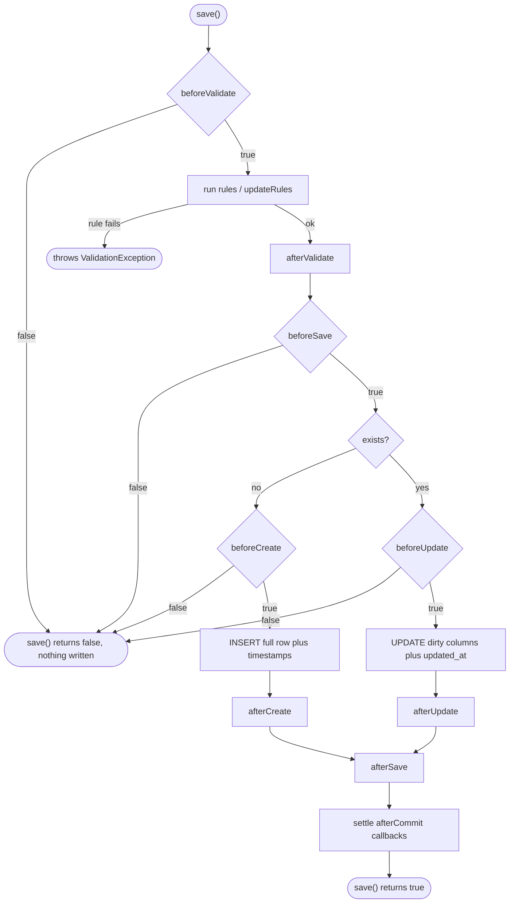

Every save, delete, and restore in worm passes through a fixed sequence of lifecycle events. You can hook them on the model itself or in registered observers, cancel writes from `before*` hooks, and mute events for bulk work. This page builds on [saving and updating](./saving-and-updating.md).

## The 13 events

The `LifecycleEvent` enum defines every event the dispatcher can fire:

| Event | Fires | Cancelable |
| --- | --- | --- |
| `beforeValidate` | Before validation runs | Yes |
| `afterValidate` | After validation succeeds | No |
| `beforeSave` | Before any save, insert or update | Yes |
| `beforeCreate` | Immediately before an INSERT | Yes |
| `afterCreate` | Immediately after an INSERT | No |
| `beforeUpdate` | Immediately before an UPDATE | Yes |
| `afterUpdate` | Immediately after an UPDATE | No |
| `afterSave` | After any save, insert or update | No |
| `beforeDelete` | Immediately before a DELETE | Yes |
| `afterDelete` | Immediately after a DELETE | No |
| `afterHydrate` | After a model is hydrated from a row | No |
| `beforeRestore` | Before a soft-deleted model is restored | Yes |
| `afterRestore` | After a soft-deleted model is restored | No |

The top-level function `isCancelable(event)` returns `true` for exactly the six `before*` events. Cancelable hooks return `Future<bool>`; returning `false` aborts the operation. Non-cancelable hooks return `Future<void>`.

## The save lifecycle

This is the canonical sequence `save()` walks. Other pages link here instead of redrawing it.



The other operations are shorter:

| Operation | Sequence |
| --- | --- |
| Insert | `beforeValidate`, validation, `afterValidate`, `beforeSave`, `beforeCreate`, INSERT, `afterCreate`, `afterSave`, afterCommit settle |
| Update | `beforeValidate`, validation (dirty fields only), `afterValidate`, `beforeSave`, `beforeUpdate`, UPDATE, `afterUpdate`, `afterSave`, afterCommit settle |
| Delete | `beforeDelete`, ORM-cascade children (each with its own full delete sequence), DELETE, `afterDelete`, afterCommit settle |
| Restore (`SoftDeletes`) | `beforeRestore`, UPDATE clearing `deleted_at`, `afterRestore` |
| Refresh | row re-read, attributes hydrated, `afterHydrate` |

Validation is part of the pipeline but is not an event: it cannot be muted, and its failure throws instead of returning `false`. See [validation](./validation.md).

## Hooks on the model

`Model` mixes in `ModelHooks`, which gives every model no-op defaults for all 13 hooks. Override only the ones you need:

```dart title="lib/models/post.dart"
final class Post extends Model {
  // ... constructor, id, toRow ...

  @override
  Future<bool> beforeCreate() async {
    if (getAttribute('published_at') == null) {
      setAttribute('published_at', DateTime.now().toUtc().toIso8601String());
    }
    return true; // false would cancel the INSERT
  }

  @override
  Future<void> afterSave() async {
    // e.g. invalidate a cache entry
  }
}
```

Model hooks take no arguments; you are already inside the instance.

## Observers

An observer moves the same hooks out of the model class. Extend `ModelObserver<T>` and override the events you care about; each hook receives the model instance:

```dart title="lib/observers/user_observer.dart"
final class UserObserver extends ModelObserver<User> {
  const UserObserver();

  @override
  Future<bool> beforeDelete(User model) async =>
      model.getAttribute('role') != 'admin'; // admins are not deletable

  @override
  Future<void> afterCreate(User model) async {
    // send a welcome email
  }
}
```

Observers register once, at startup:

```dart
await Worm.initialize(
  config: const WormConfig(),
  adapters: {'default': adapter},
  observers: const [UserObserver()],
);
```

Observer lookup is keyed by the **exact runtime type** of the model. `Worm.observersFor(model.runtimeType)` matches the observer's `T` exactly, so an observer declared on a base class does not fire for its subclasses. Register one observer per concrete model type.

## Dispatch order

For each event, the model's own hook runs first, then every observer in registration order. The interleaving is per event, not per phase. An insert with one observer produces exactly this trace:

```text
beforeValidate   (model)
beforeValidate   (observer)
afterValidate    (model)
afterValidate    (observer)
beforeSave       (model)
beforeSave       (observer)
beforeCreate     (model)
beforeCreate     (observer)
-- INSERT --
afterCreate      (model)
afterCreate      (observer)
afterSave        (model)
afterSave        (observer)
```

## Cancellation

Any `before*` hook that returns `false` cancels the operation:

- Remaining handlers for that event are skipped.
- The database call never happens.
- All later hooks for the operation are skipped.
- `save()` or `delete()` returns `false`. No exception is thrown.

```dart
final saved = await user.save();
if (!saved) {
  // a beforeValidate / beforeSave / beforeCreate hook said no
}
```

`OperationCancelledException` exists in the exception catalog, but the runtime does not currently throw it: hook cancellation always surfaces as a `false` return value. Check the bool; do not write a `catch` for it.

`after*` hooks cannot cancel; the write already happened. If one throws, the exception propagates to the caller and the remaining handlers for that event are skipped, but the row stays written.

During an ORM-cascade delete, each child is deleted through the full pipeline, so a child's `beforeDelete` returning `false` aborts the whole cascade, parent included. See [working with relations](../relations/working-with-relations.md).

## Muting events

`Worm.withoutEvents` runs a callback with lifecycle events muted. The write still happens; hooks and observers stay quiet:

```dart
await Worm.withoutEvents(() async {
  await user.save(); // no hooks, no observers
});

await Worm.withoutEvents(
  () => user.save(),
  events: [LifecycleEvent.afterCreate], // mute only this event
);
```

Muting is Zone-based: it survives `await`s inside the callback and resets when it returns. Nested selective calls **union** their event lists; nesting inside a mute-all region stays mute-all. Three helpers inspect the current region: `Worm.mutedEvents`, `Worm.isMutingAll`, and `Worm.isEventMuted(event)`.

Two rules to remember:

- A muted `before*` hook cannot cancel. The operation proceeds as if the hook returned `true`.
- Muting never disables validation. Rules run on every `save()`, muted or not.

Seeders get a shortcut: override `muteEvents => true` on a `Seeder` and the runner wraps its whole `run` in `Worm.withoutEvents`, so a bulk seed does not wake every observer in the nest. See [seeding](../database/seeding.md).

## afterCommit

`model.afterCommit(callback)` queues work that should only run once the write is durable:

```dart
user.afterCommit(() => mailer.sendWelcome(user));
await user.save();
```

Outside a transaction, queued callbacks fire right after the save or delete completes. Inside `Worm.transaction`, they defer to the commit and are discarded on rollback. Details live in [transactions](../database/transactions.md).

## Custom handlers

`ModelObserver` is the canonical observer, but the dispatcher works against the type-erased `LifecycleHandler` interface: `dispatchBefore(event, model)` and `dispatchAfter(event, model)`. Implement it directly for cross-cutting pipelines such as metrics or audit logging that want every event for every model. A handler must return `true` from `dispatchBefore` (and do nothing in `dispatchAfter`) for models it does not care about.

`EventDispatcher` is the fan-out machine behind all of this. `ActiveRecord.dispatcherFor(model)` builds one from the registered observers; it is public so `SoftDeletes.restore()` can fire `beforeRestore`/`afterRestore` through the same chain. Calling `dispatchBefore` with an `after*` event, or `dispatchAfter` with a `before*` event, throws `ArgumentError`.

## Gotchas

- Observer lookup matches the exact runtime type. A `ModelObserver<Model>` or base-class observer never fires for subclasses.
- Hook cancellation returns `false` from `save()`/`delete()`; it does not throw. `OperationCancelledException` is not currently thrown by the runtime.
- A muted `before*` hook cannot cancel; the operation proceeds.
- `Worm.withoutEvents` never mutes validation.
- A throw inside an `after*` hook propagates after the row is already written.
- Bulk query-builder `update`/`delete` bypass hooks and observers entirely; see [advanced queries](../queries/advanced-queries.md).
- `SoftDeletes` bypasses hooks on its `save`, `delete`, and `forceDelete`; only `restore()` fires events. See [soft deletes](./soft-deletes.md).
- `afterHydrate` currently fires from `refresh()`, when a model is re-read and re-seeded from the database.
- Observers only register through `Worm.initialize(observers:)`. There is no runtime add/remove API; use `Worm.reset()` plus a fresh `initialize` in tests.

## API summary

| Symbol | Signature | Purpose |
| --- | --- | --- |
| `LifecycleEvent` | enum with 13 values, `beforeValidate` through `afterRestore` | Every event the dispatcher can fire |
| `isCancelable` | `bool isCancelable(LifecycleEvent event)` | `true` for the six `before*` events |
| `ModelHooks` | mixin included by `Model`; 13 overridable hooks, `before*` return `Future<bool>`, `after*` return `Future<void>` | Lifecycle hooks directly on the model class |
| `ModelObserver<T>` | `abstract class ModelObserver<T extends Model> extends Observer<T> implements LifecycleHandler`; 13 typed hooks receiving `T model` | External observer for one model type |
| `Observer<T>` | `abstract class Observer<T>`; `Type get modelType` | Marker base `Worm.initialize` accepts |
| `LifecycleHandler` | `abstract interface`; `dispatchBefore(event, model)`, `dispatchAfter(event, model)` | Type-erased handler for custom pipelines |
| `EventDispatcher` | `const EventDispatcher(List<LifecycleHandler> handlers)`; `dispatchBefore`, `dispatchAfter` | Fans one event out to the model hook, then handlers in order |
| `ActiveRecord.dispatcherFor` | `static EventDispatcher dispatcherFor(Model model)` | Builds the dispatcher from registered observers |
| `Model.afterCommit` | `void afterCommit(void Function() callback)` | Queue work for after the surrounding operation commits |
| `Worm.withoutEvents` | `static Future<T> withoutEvents<T>(Future<T> Function() body, {List<LifecycleEvent>? events})` | Mute all or selected events for a Zone-scoped region |
| `Worm.mutedEvents` | `static Set<LifecycleEvent>? get mutedEvents` | Selectively muted events of the current region, or `null` |
| `Worm.isMutingAll` | `static bool get isMutingAll` | Whether the current region mutes everything |
| `Worm.isEventMuted` | `static bool isEventMuted(LifecycleEvent event)` | Whether one event is muted here |
| `Worm.observersFor` | `static List<Observer<Object>> observersFor(Type type)` | Observers registered for an exact model type |
| `Seeder.muteEvents` | `bool get muteEvents => false` | Opt a seeder into running inside `withoutEvents` |

### Event order per operation

| Operation | Events fired, in order |
| --- | --- |
| Insert | `beforeValidate`, `afterValidate`, `beforeSave`, `beforeCreate`, `afterCreate`, `afterSave` |
| Update | `beforeValidate`, `afterValidate`, `beforeSave`, `beforeUpdate`, `afterUpdate`, `afterSave` |
| Delete | `beforeDelete`, `afterDelete` |
| Restore | `beforeRestore`, `afterRestore` |
| Refresh | `afterHydrate` |

## Continue reading

- [Transactions](../database/transactions.md): how `afterCommit` callbacks defer, fire, and get discarded.
- [Validation](./validation.md): the pipeline step between `beforeValidate` and `afterValidate`.
- [Soft deletes](./soft-deletes.md): the one mixin whose writes bypass this pipeline except for `restore()`.
- [Saving and updating](./saving-and-updating.md): the dirty tracking that decides between the insert and update branches.
