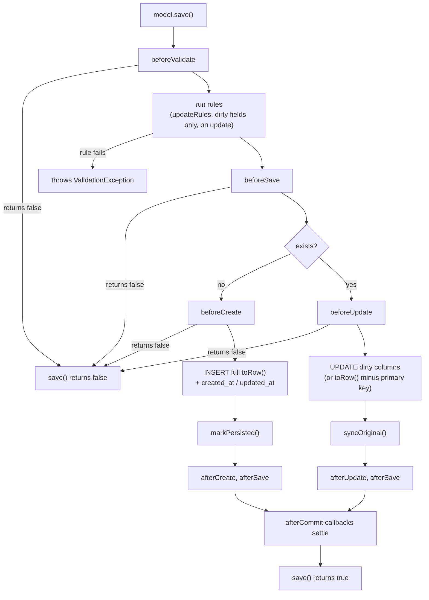

This page covers everything that happens when you persist a model: how `save()` decides between INSERT and UPDATE, what dirty tracking sends over the wire, and how refresh, delete, and replicate behave. It builds on [defining models](./defining-models.md).

## save(): insert or update

`save()` looks at one flag: `exists`. A model that has never been persisted inserts; a persisted one updates.

```dart
final user = User(id: 'u-1', name: 'Alice', age: 34);
await user.save();                 // INSERT (exists was false)

user.setAttribute('name', 'Bob');
await user.save();                 // UPDATE, sends only {name: 'Bob'}
```

`save()` returns a `bool`. It returns `false` when any `before*` lifecycle hook cancels by returning `false`; nothing is written and no exception is thrown. Failing validation rules are different: they throw `ValidationException` out of the save. See [lifecycle hooks and observers](./lifecycle-hooks-and-observers.md) and [validation](./validation.md).



## What a save writes

- **Insert.** The full `toRow()` map, plus `created_at` and `updated_at` when timestamps are on. Values pass through the model's `castManager` before reaching the adapter. Afterwards `markPersisted()` runs, so the instance flips to `exists == true`.
- **Update.** When the attribute store is in use and at least one attribute is dirty, only the dirty subset is sent. That is the minimal-UPDATE guarantee. When the store is untouched (a model that manages its own fields and never called `setAttribute`), worm falls back to the full `toRow()` minus the primary key column. After the write, `syncOriginal()` clears the dirty set.

Worm never generates primary key values. Assign `id` before the first save, or use a database auto-increment column.

## Dirty tracking

Every `setAttribute` call updates the dirty set:

```dart
user.setAttribute('name', 'Bob');

user.isDirty();               // true: anything dirty?
user.isDirty('name');         // true: this field dirty?
user.dirtyFields;             // {'name'} (unmodifiable)
user.getOriginal('name');     // 'Alice'
user.getOriginalValue(User$.name); // 'Alice', typed via the companion field
```

The rules:

- Writing a **different** value to an existing key marks it dirty.
- Writing an **equal** value to an existing key does not.
- Writing any value to a **previously absent** key marks it dirty, even if the value equals what the database holds. Attribute initialization participates in the dirty set on purpose.
- A successful save clears the dirty set (`syncOriginal`). So does `refresh()`.

`getOriginalValue<T>` returns `null` both for untouched fields and when the stored original is not a `T`.

On the update path, validation runs `updateRules` (which defaults to `rules`) and only for fields that are dirty. An unchanged legacy column never blocks an unrelated edit.

## update(): fill and save in one call

`update(data)` is `fill(data)` followed by `save()`:

```dart
await user.update({'name': 'Carol', 'age': 35});
```

Because it goes through `fill`, [mass assignment](./mass-assignment.md) rules apply: guarded or non-fillable keys are silently skipped in the default mode and throw `MassAssignmentException` in strict mode. The return value is the `save()` result.

## Refreshing

`refresh()` re-reads the row by primary key and reseeds the instance:

```dart
await user.refresh();
```

- Throws `ModelNotFoundException` when the row no longer exists.
- Decodes values through the `castManager`, seeds them with `hydrateAttribute`, and calls `markPersisted()`, which clears all dirty state. Local unsaved changes are gone after a refresh.
- Fires the `afterHydrate` hook.

## Deleting

```dart
await user.delete();       // returns false if beforeDelete cancels
await user.forceDelete();  // identical to delete() on a plain model
```

`delete()` fires `beforeDelete` (cancelable), removes the row by primary key, sets `exists` to `false`, and fires `afterDelete`. On a plain model `forceDelete()` is the same operation; models mixing in [soft deletes](./soft-deletes.md) override both to trash and hard-delete respectively.

When the model declares `ormCascadeSpecs` (emitted for relations marked `OnDelete.ormCascade`), the dependent rows are loaded and deleted first, one at a time, firing every child's lifecycle hooks. Any child's `beforeDelete` returning `false` aborts the whole cascade, including the parent's delete. See [working with relations](../relations/working-with-relations.md).

## Timestamps and withoutTimestamps

With `usesTimestamps` on (the default), inserts set `created_at` and `updated_at` and updates refresh `updated_at`, always as `DateTime.now().toUtc()`. To perform writes without touching the stamps:

```dart
await user.withoutTimestamps(() async {
  user.setAttribute('name', 'migrated');
  await user.save();       // no updated_at change
});
```

The suspension is per instance and restored after the callback, even on error.

## afterCommit

`afterCommit(callback)` queues a callback that runs when the surrounding operation is safely through:

```dart
user.afterCommit(() => log.info('user persisted'));
await user.save();
```

- Outside a transaction, queued callbacks fire immediately after the save or delete completes.
- Inside a `Worm.transaction`, they defer until the transaction commits and are discarded on rollback.

See [transactions](../database/transactions.md).

## Hydration, exists, and markPersisted

`exists` only becomes `true` through `markPersisted()`. Worm calls it for you after a successful insert, in `refresh()`, and in [repository](./repository-pattern.md) lookups (`find`, `findOrFail`, `all`). When you hydrate rows yourself, do both steps:

```dart
final model = User(id: 'u-1', name: 'Alice', age: 34);
row.forEach(model.hydrateAttribute); // seed without dirtying
model.markPersisted();               // exists = true, originals snapshotted
```

:::caution[Loaded does not mean persisted]
The generated `fromRow` hydrator constructs a fresh instance and does not call `markPersisted()`. A model loaded through the generated query starter reports `exists == false`, so calling `save()` on it inserts a new row instead of updating. Call `markPersisted()` on query-loaded models before saving them, or load through a repository.
:::

## Replicating a model

`replicate()` builds an unsaved copy: every attribute except the primary key, the timestamp columns, and anything you pass in `except`. The clone has `exists == false`, so its next save inserts.

The base implementation throws `UnsupportedOperationException`. The current generator does not emit an override, so give your model one using the protected helper:

```dart
@override
Model replicate({List<String> except = const []}) {
  final copy = User(id: newId(), name: name, age: age);
  replicatedAttributes(except: except).forEach(copy.setAttribute);
  return copy;
}
```

## Explicit transactions

Every write method accepts a `transaction:` parameter to enlist in an explicit `TransactionContext`. Without it, writes automatically join any ambient `Worm.transaction` in scope:

```dart
await Worm.transaction(() async {
  await user.save();     // enlisted automatically
  await post.save();     // same transaction
});
```

See [transactions](../database/transactions.md) for nesting, savepoints, and rollback semantics.

## Gotchas

- `save()` returns `false` on hook cancellation. It does not throw. Check the return value when hooks can veto.
- Failed validation rules throw `ValidationException`; that is the one save failure that is an exception, not a `false`.
- Writing an equal value to a previously absent key still marks the key dirty.
- An update on a model whose attribute store is unused (or fully clean) sends the entire `toRow()` minus the primary key, not a minimal payload.
- `refresh()` discards unsaved local changes and clears the dirty set.
- Models loaded via the generated `fromRow` have `exists == false`; saving them inserts. Call `markPersisted()` first.
- `replicate()` throws `UnsupportedOperationException` unless you override it; no override is generated today.
- A child's `beforeDelete` returning `false` inside an ORM cascade aborts the parent's delete too.
- `forceDelete()` on a plain model is just `delete()`. The distinction only matters with [soft deletes](./soft-deletes.md).
- Timestamps are written in UTC. Compare accordingly.

## API summary

### Write and read-state API on Model

| Symbol | Signature | Description |
|---|---|---|
| `save` | `Future<bool> save({TransactionContext? transaction})` | Insert when `exists` is false, update otherwise. `false` on hook cancel. |
| `delete` | `Future<bool> delete({TransactionContext? transaction})` | Delete by primary key; walks `ormCascadeSpecs` children first. |
| `forceDelete` | `Future<bool> forceDelete({TransactionContext? transaction})` | Hard delete; same as `delete` on plain models. |
| `update` | `Future<bool> update(Map<String, Object?> data, {TransactionContext? transaction})` | `fill(data)` then `save()`. |
| `refresh` | `Future<void> refresh()` | Re-read by key. Throws `ModelNotFoundException` on a missing row. |
| `replicate` | `Model replicate({List<String> except = const []})` | Unsaved copy. Base throws `UnsupportedOperationException`. |
| `replicatedAttributes` | `@protected Map<String, Object?> replicatedAttributes({List<String> except = const []})` | Attributes minus key, timestamps, and `except`; for `replicate` overrides. |
| `fill` | `void fill(Map<String, Object?> data)` | Mass-assign honoring `fillable` / `guarded`. See [mass assignment](./mass-assignment.md). |
| `exists` | `bool get exists` | Persisted at least once. |
| `isDirty` | `bool isDirty([String? field])` | Any (or one) attribute dirty. |
| `dirtyFields` | `Set<String> get dirtyFields` | Unmodifiable dirty key set. |
| `setAttribute` | `void setAttribute(String name, Object? value)` | Write and mark dirty. |
| `getAttribute` | `Object? getAttribute(String name)` | Live value. |
| `getOriginal` | `Object? getOriginal(String name)` | Value at the last sync, or `null`. |
| `getOriginalValue` | `T? getOriginalValue<T>(Field<T> field)` | Typed original; `null` when untouched or not a `T`. |
| `hydrateAttribute` | `void hydrateAttribute(String name, Object? value)` | Seed without dirtying. |
| `markPersisted` | `void markPersisted()` | Snapshot originals; set `exists` to `true`. |
| `withoutTimestamps` | `Future<T> withoutTimestamps<T>(Future<T> Function() callback)` | Suspend timestamp maintenance for the callback. |
| `afterCommit` | `void afterCommit(void Function() callback)` | Queue a post-commit callback. |

### ModelState

`ModelState` is the per-instance container behind the methods above. It is exported but owned by its model; mutate it through the `Model` API.

| Symbol | Signature | Description |
|---|---|---|
| `attributes` | `Map<String, Object?> attributes` | Live values keyed by column name. |
| `original` | `Map<String, Object?> original` | Snapshot at the last persisted state. |
| `dirty` | `Set<String> dirty` | Keys mutated since the last sync. |
| `exists` | `bool exists` | Persisted flag. |
| `withoutTimestamps` | `bool withoutTimestamps` | Suspension flag. |
| `afterCommitCallbacks` | `List<void Function()> afterCommitCallbacks` | Pending callbacks. |
| `syncOriginal` | `void syncOriginal()` | Copy attributes to original; clear dirty. |
| `setAttribute` | `void setAttribute(String name, Object? value)` | Write with dirty tracking. |
| `seedAttribute` | `void seedAttribute(String name, Object? value)` | Write without dirty tracking. |

### ActiveRecord

The static orchestrator behind the model methods. You rarely call it directly.

| Symbol | Signature | Description |
|---|---|---|
| `ActiveRecord.save` | `static Future<bool> save(Model model, {TransactionContext? transaction})` | The engine behind `Model.save`. |
| `ActiveRecord.delete` | `static Future<bool> delete(Model model, {TransactionContext? transaction})` | The engine behind `Model.delete`, including ORM cascades. |
| `ActiveRecord.refresh` | `static Future<void> refresh(Model model)` | The engine behind `Model.refresh`. |
| `ActiveRecord.dispatcherFor` | `static EventDispatcher dispatcherFor(Model model)` | Builds the hook and observer dispatch chain for a model. |

## Continue reading

- [Lifecycle hooks and observers](./lifecycle-hooks-and-observers.md): the full event pipeline around every save and delete.
- [Validation](./validation.md): the rules that run inside `save()`.
- [Transactions](../database/transactions.md): ambient enlistment, nesting, and `afterCommit` in depth.
- [Advanced queries](../queries/advanced-queries.md): bulk `update` and `delete` that bypass this pipeline entirely.
