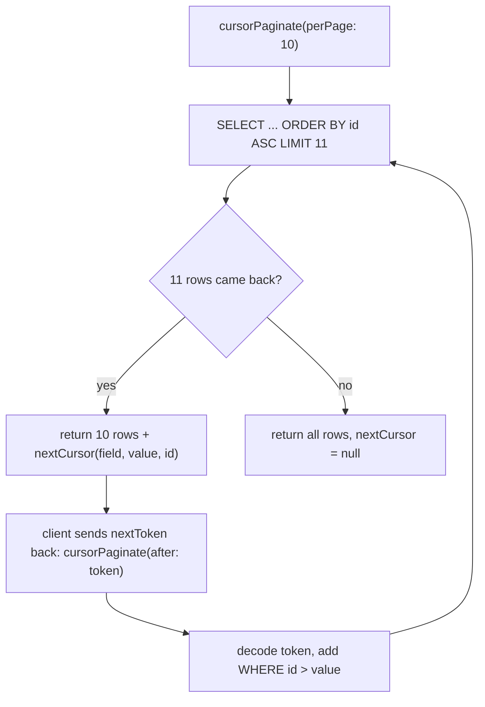

Worm ships two pagination strategies: offset pages with full metadata, and cursor pages with opaque continuation tokens. This page covers both and when each wins. It builds on [query basics](./query-basics.md).

## Offset pagination: paginate()

`paginate({page: 1, perPage: 15})` runs two queries: one SELECT with LIMIT and OFFSET for the page slice, and one COUNT for the total. Both share the same WHERE clause, including global scopes.

```dart
final page = await User.query()
    .where(User$.age.gte(18))
    .orderBy(User$.name)
    .paginate(page: 2, perPage: 10);

page.data;         // List<User>, up to 10 rows
page.currentPage;  // 2
page.perPage;      // 10
page.total;        // total matching rows across all pages
page.lastPage;     // total pages, always >= 1
page.hasMorePages; // currentPage < lastPage
page.from;         // 1-based index of the first row on this page
page.to;           // 1-based index of the last row on this page
```

Asking for a page past the end doesn't throw: `data` comes back empty, and `from` and `to` are both `0`. `lastPage` is `1` even for an empty result, so "page X of Y" UIs never render "page 1 of 0".

## Cursor pagination: cursorPaginate()

`cursorPaginate({perPage: 15, cursor, after})` runs a single SELECT that requests `perPage + 1` rows, ordered ascending by the cursor field (the primary key by default). The extra row is never returned; its presence just means another page exists.



The token round trip in code:

```dart
final first = await User.query().cursorPaginate(perPage: 10);
first.data;          // List<User>, up to 10 rows
first.hasMorePages;  // nextCursor != null
final token = first.nextToken; // opaque URL-safe string, null on the last page

final next = await User.query().cursorPaginate(perPage: 10, after: token);
```

Pass either a decoded `Cursor` object via `cursor:` or the encoded token string via `after:`; the two are equivalent. Passing both throws `ArgumentError`. The exact signature:

```dart
Future<CursorPage<T>> cursorPaginate({
  int perPage = 15,
  Cursor? cursor,
  String? after,
})
```

### How the cursor advances

A `Cursor` is a `(field, value, id)` triple taken from the last visible row: the ordered column's name, its value on that row, and the row's primary key as a stable tiebreaker. `encode()` serializes it as URL-safe base64 of JSON; `Cursor.decode(token)` reverses that and returns `null` (it never throws) for null, empty, or malformed tokens, so a garbled token behaves like "start from the beginning".

Each follow-up call appends `WHERE <field> > <value>` to your query's existing WHERE clause. The advance predicate is always `>` against an ascending order. If you supply your own `orderBy`, it is kept, but the advance predicate still moves forward by `field > value`, so descending cursor walks are not supported.

## Choosing between them

| | `paginate()` | `cursorPaginate()` |
| --- | --- | --- |
| Queries per page | 2 (SELECT + COUNT) | 1 (SELECT of `perPage + 1`) |
| Jump to page N | yes | no, forward-only |
| Total count / "page X of Y" | yes | no |
| Stable under concurrent inserts | no, rows can shift between pages | yes, the cursor pins your position |
| Cost of deep pages | grows with OFFSET | constant with an index on the cursor field |

Rule of beak: numbered page controls in an admin UI want `paginate()`; infinite scroll and API list endpoints want `cursorPaginate()`.

## Top-level functions

`paginate<T>()` and `cursorPaginate<T>()` also exist as top-level functions taking an explicit `QueryContext<T>` and `QueryDescriptor`, for callers that don't have a builder (custom tooling, hand-driven adapters). The builder methods are thin wrappers over them, with the same defaults and the same `ArgumentError` on `cursor` plus `after`.

## Gotchas

- Passing both `cursor:` and `after:` throws `ArgumentError`. Pick exactly one.
- Cursor pagination only advances ascending (`field > value`). A custom `orderBy` is kept in the SQL, but the walk still moves forward by the cursor field.
- If the cursor field's value on the last visible row is `null`, no `nextCursor` is emitted and iteration stops early. Cursor-paginate on non-nullable columns.
- `Cursor.decode()` returns `null` on malformed tokens instead of throwing; a bad token silently restarts from the first page.
- Tokens are base64-encoded JSON, readable by anyone. They are opaque, not secret: don't put sensitive values in a cursor field.
- `Page.from` and `Page.to` are `0` for empty pages; `Page.lastPage` is always at least `1`.
- `paginate()` issues a COUNT on every call. On very large tables that count can dominate; see [performance](../guides/performance.md).

## API summary

### Entry points

| Symbol | Signature sketch | One-liner |
| --- | --- | --- |
| `QueryBuilder.paginate` | `Future<Page<T>> paginate({page: 1, perPage: 15})` | Offset pagination: one SELECT plus one COUNT. |
| `QueryBuilder.cursorPaginate` | `Future<CursorPage<T>> cursorPaginate({perPage: 15, cursor, after})` | Cursor pagination; `ArgumentError` when both `cursor` and `after` are given. |
| `paginate<T>` (top-level) | `paginate<T>({context, descriptor, page, perPage, loads, aggregates})` | Canonical offset pagination over a raw descriptor. |
| `cursorPaginate<T>` (top-level) | `cursorPaginate<T>({context, descriptor, perPage, cursor, after, loads, aggregates})` | Canonical cursor pagination over a raw descriptor. |

### Result and cursor types

| Symbol | Signature sketch | One-liner |
| --- | --- | --- |
| `Page<T>` | `Page({data, currentPage, perPage, total})` | Immutable offset page with row range metadata. |
| `Page.data` | `List<T>` | Hydrated rows on this page. |
| `Page.currentPage` | `int` | 1-based page index. |
| `Page.perPage` | `int` | Page size used for the slice. |
| `Page.total` | `int` | Total rows matching the query. |
| `Page.lastPage` | `int get` | Total page count, always >= 1. |
| `Page.hasMorePages` | `bool get` | Whether pages follow this one. |
| `Page.from` | `int get` | 1-based index of the first row; `0` when empty. |
| `Page.to` | `int get` | 1-based index of the last row; `0` when empty. |
| `CursorPage<T>` | `CursorPage({data, perPage, nextCursor})` | Immutable cursor page. |
| `CursorPage.data` | `List<T>` | Hydrated rows on this page. |
| `CursorPage.perPage` | `int` | Page size used for the slice. |
| `CursorPage.nextCursor` | `Cursor?` | Cursor to the next page; `null` at the end. |
| `CursorPage.hasMorePages` | `bool get` | `nextCursor != null`. |
| `CursorPage.nextToken` | `String? get` | Encoded `nextCursor` token; `null` at the end. |
| `Cursor` | `Cursor({field, value, id})` | Immutable `(field, value, id)` anchor from the previous page. |
| `Cursor.encode` | `String encode()` | Serialize to a URL-safe base64 JSON token. |
| `Cursor.decode` | `static Cursor? decode(String? token)` | Parse a token; `null` on null, empty, or malformed input. |

## Continue reading

- [Query basics](./query-basics.md): the terminals that pagination builds on.
- [Performance](../guides/performance.md): COUNT costs, cursor-field indexes, and deep-page pitfalls.
- [Advanced queries](./advanced-queries.md): `stream()` and `chunk()` when you need every row, not a page.
