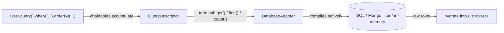

This page gives you the core of worm's query builder: how a query runs, the three `where()` shapes, the typed field classes that gate which operators compile, and the terminal methods that actually hit the database. It builds on [defining models](../models/defining-models.md) and the generated companions from [code generation](../models/code-generation.md).

## How a query runs

Every query moves through the same three stages. Chainable methods build an abstract `QueryDescriptor`. A terminal method hands that descriptor to the adapter. The adapter compiles it into its native dialect and returns raw rows, which worm hydrates into your models.



Nothing touches the database until you call a terminal. Until then a builder is just a description of a query, waiting on its branch.

## Starting a query

Every model exposes a static `query()` starter, so call sites read `User.query()`. `worm gen` generates the wiring, and a one-line `static query()` on the model exposes it as `User.query()`:

```dart
final users = await User.query().get();
```

Under the hood, `query()` calls `QueryBuilder<User>.from(...)` with a `QueryContext` that wires up the adapter from `Worm.adapter()`, the table name, the row hydrator, and any registered global scopes. You only build that by hand when you skip codegen:

```dart
final builder = QueryBuilder<User>.from(
  QueryContext<User>(
    adapter: Worm.adapter(),
    table: 'users',
    hydrate: User.fromRow,
  ),
);
```

`QueryContext.primaryKey` defaults to `'id'`.

## Builders are immutable

Every chainable method returns a fresh builder. The one you called it on is untouched:

```dart
final base = User.query().where(User$.age.gte(18));
final sorted = base.orderBy(User$.age, descending: true);
// base still has no ORDER BY; sorted is a new builder.
```

That makes builders safe to share, fork, and pass around. It also means you must use the return value. This does nothing:

```dart
final query = User.query();
query.where(User$.age.gte(18)); // result discarded!
final everyone = await query.get(); // no WHERE clause
```

## Filtering with where()

`where()` accepts three shapes. All three AND-combine with whatever WHERE tree the builder already has:

```dart
// 1. A composed predicate tree (the typed, recommended shape).
final adults = await User.query().where(User$.age.gte(18)).get();

// 2. (field, value): sugar for equality.
final alice = await User.query().where(User$.name, 'Alice').first();

// 3. (field, Operator, value): explicit operator.
final seniors = await User.query().where(User$.age, Operator.gte, 65).get();
```

`orWhere()` accepts the same three shapes and OR-combines instead:

```dart
final aliceOrBob = await User.query()
    .where(User$.name.eq('Alice'))
    .orWhere(User$.name.eq('Bob'))
    .get();
```

Invalid shapes fail fast: passing extra arguments after a predicate tree, or an unrecognized first argument, throws `ConfigurationException`. Passing a non-`Operator` in the operator slot, or a non-`Field` in the field slot, throws `ArgumentError`.

For parenthesized groups, subqueries, and column-to-column comparisons, see [advanced queries](./advanced-queries.md).

## Typed fields gate the operators

Codegen emits one `const` field companion per column, typed by what the column can do:

| Field class | Emitted for | Operators it unlocks |
| --- | --- | --- |
| `Field<T>` | any column | `eq`, `neq`, `isNull()`, `isNotNull()`, `inList`, `notInList` |
| `ComparableField<T>` | numeric and date columns | all of the above, plus `gt`, `gte`, `lt`, `lte`, `between`, `notBetween` |
| `StringField` | text columns | all `Field<String>` operators, plus `like`, `notLike`, `ilike`, `contains`, `startsWith`, `endsWith` |

The payoff: invalid combinations are compile errors, not runtime surprises.

```dart
User$.age.gte(18);        // OK: age is a ComparableField<int>
User$.name.gte('Alice');  // Compile error: gte is not defined for StringField
User$.age.gte('18');      // Compile error: String is not an int
```

The `Operator` enum uses short names: `Operator.eq`, `neq`, `gt`, `gte`, `lt`, `lte`, `like`, `notLike`, `ilike`, `isNull`, `isNotNull`, `inList`, `notInList`, `between`, `notBetween`. Long-form static aliases exist and are identical instances: `identical(Operator.equals, Operator.eq)` is true, so the two spellings are interchangeable everywhere. Likewise `field.whereIn(...)` and `field.whereNotIn(...)` are aliases of `field.inList(...)` and `field.notInList(...)`. The full operator matrix lives in [operators and fields](../reference/operators-and-fields.md).

## Shaping results

```dart
final page = await User.query()
    .where(User$.age.gte(18))
    .orderBy(User$.age, descending: true) // ascending is the default
    .limit(10)
    .offset(20)
    .get();
```

- `orderBy(field, {descending: false})` appends a sort clause. Call it repeatedly for multi-column sorts; clauses apply in call order.
- `limit(n)` and `offset(n)` set LIMIT and OFFSET. For real pagination, prefer [paginate and cursorPaginate](./pagination.md).
- `distinct()` returns only distinct rows.
- `select([...])` narrows the projected columns. An empty column list means `SELECT *`.

:::caution[select() and hydration]
`select()` narrows the row map that reaches your hydrator. Generated `fromRow` implementations expect the full column set, so only use `select()` when your hydrator tolerates missing keys. For single-column reads, use `pluck()` instead; it projects internally and never hydrates models.
:::

## Executing: terminal methods

```dart
final all = await User.query().get();                    // List<User>
final one = await User.query().where(User$.name, 'Alice').first(); // User?
final must = await User.query().firstOrFail();           // User, or throws
final byId = await User.query().find(42);                // User? by primary key
final mustId = await User.query().findOrFail(42);        // User, or throws
```

`firstOrFail()` and `findOrFail()` throw `ModelNotFoundException` when nothing matches.

### exists() vs count()

```dart
final hasAdults = await User.query().where(User$.age.gte(18)).exists(); // bool
final adultCount = await User.query().where(User$.age.gte(18)).count(); // int
```

`exists()` issues a LIMIT 1 probe through the adapter's `selectOne` and short-circuits at the first match. `count()` runs a real COUNT over every matching row. When you only need "is there at least one?", `exists()` is the cheaper question.

### pluck()

```dart
final names = await User.query().pluck(User$.name); // List<String>
```

`pluck<V>(field)` selects a single column and returns the raw values, no model hydration. Rows whose value is null or not a `V` are silently dropped from the result.

## Scalar aggregates

Aggregates push down to the adapter. Worm never fetches rows to compute them in Dart:

```dart
final total = await User.query().count();                        // int
final ageSum = await User.query().sum(User$.age);                // num?
final ageAvg = await User.query().avg(User$.age);                // double?
final youngest = await User.query().min<int>(User$.age);         // int?
final oldest = await User.query().max<int>(User$.age);           // int?
```

- `sum`, `avg`, `min`, and `max` return `null` when no rows match. `count()` returns `0`.
- `min<V>` and `max<V>` narrow the adapter's return value to `V`. If the adapter returns an incompatible runtime type, they throw `CastException` rather than silently coercing.
- To inject per-model relation aggregates like `withCount('posts')`, see [eager loading](../relations/eager-loading.md).

:::note[Strict mode]
Under strict mode, any query without a WHERE clause can throw `FullTableScanException`. See [strict mode](../guides/strict-mode.md) for the flags and the `Worm.unsafe` escape hatch.
:::

## Gotchas

- Builders are immutable. Calling `where()` without using the returned builder changes nothing.
- Nothing executes until a terminal method. Building a query has no side effects.
- `exists()` is a LIMIT 1 probe; `count()` scans every match. They answer different questions at different costs.
- `pluck<V>()` silently drops rows whose value is null or doesn't match `V`.
- `min<V>` / `max<V>` throw `CastException` when the adapter's runtime type doesn't match `V`.
- Global scopes (including soft deletes) apply at execution time, so `find()` won't return a soft-deleted row unless you add `withTrashed()`. See [scopes](./scopes.md).
- `orderBy` defaults to ascending; pass `descending: true` per clause.
- `select()` feeds narrowed rows to your hydrator; generated hydrators expect all columns.

## API summary

### Chainable methods

Every chainable returns a new `QueryBuilder<T>`.

| Symbol | Signature sketch | One-liner |
| --- | --- | --- |
| `where` | `where(Object first, [second, third])` | AND a predicate; accepts tree, `(field, value)`, or `(field, Operator, value)`. |
| `orWhere` | `orWhere(Object first, [second, third])` | OR a predicate; same three shapes as `where`. |
| `whereGroup` | `whereGroup((q) => q...)` | AND a parenthesized sub-tree built on an inner builder. |
| `whereExists` | `whereExists<X>(QueryBuilder<X> sub)` | AND an EXISTS subquery predicate. |
| `whereNotExists` | `whereNotExists<X>(QueryBuilder<X> sub)` | AND a NOT EXISTS subquery predicate. |
| `whereColumn` | `whereColumn(left, right, {operator: Operator.eq})` | AND a column-to-column comparison. |
| `whereRaw` | `whereRaw(String sql, {parameters, allowRaw: false})` | AND a raw SQL fragment; requires `allowRaw: true` or throws `ConfigurationException`. |
| `orderBy` | `orderBy(Field field, {descending: false})` | Append a sort clause. |
| `limit` | `limit(int value)` | Set LIMIT. |
| `offset` | `offset(int value)` | Set OFFSET. |
| `select` | `select(List<Field> fields)` | Restrict projected columns. |
| `distinct` | `distinct()` | Return only distinct rows. |
| `scope` | `scope(LocalScope<T> scope)` | Apply an opt-in local scope. |
| `withoutGlobalScope` | `withoutGlobalScope<X extends GlobalScope>()` | Bypass one global scope by type; no-op when unregistered. |
| `withoutGlobalScopes` | `withoutGlobalScopes()` | Bypass every global scope. |
| `withTrashed` | `withTrashed()` | Include soft-deleted rows. |
| `onlyTrashed` | `onlyTrashed({column: 'deleted_at'})` | Return only soft-deleted rows. |
| `withRelationPaths` | `withRelationPaths(List<String> paths)` | Eager-load relations by string path (dot notation for nesting). |
| `withRelations` | `withRelations(List<RelationField> relations)` | Eager-load typed relation companions. |
| `withRelation` | `withRelation(field, [PredicateTree? constraint])` | Eager-load one relation, optionally constrained. |
| `withPath` | `withPath(RelationPath path)` | Eager-load a nested path built via `RelationField.include`. |
| `withNested` | `withNested(RelationLoadSpec spec)` | Alias of `withPath`. |
| `withCount` | `withCount(String relation, {injectKey, filter})` | Inject a related-row count under `<relation>Count`. |
| `withSum` | `withSum(String relation, String column, {injectKey})` | Inject a related-column sum under `<relation>Sum`. |
| `withExists` | `withExists(String relation, {injectKey})` | Inject a related-row existence flag under `<relation>Exists`. |
| `debug` | `debug()` | Log a builder summary via `dart:developer`; returns `this`, never throws. |
| `sql` | `R sql<R>((SqlQueryContext<T>) => R)` | Enter the SQL dialect gate; throws `AdapterMismatchException` on non-SQL adapters. |
| `mongo` | `R mongo<R>((MongoQueryContext<T>) => R)` | Enter the Mongo dialect gate; throws `AdapterMismatchException` on non-Mongo adapters. |

### Terminal methods

| Symbol | Signature sketch | One-liner |
| --- | --- | --- |
| `get` | `Future<List<T>> get()` | Execute and hydrate all matching rows. |
| `first` | `Future<T?> first()` | First matching row or `null` (adds LIMIT 1). |
| `firstOrFail` | `Future<T> firstOrFail()` | First row or `ModelNotFoundException`. |
| `find` | `Future<T?> find(Object id)` | Look up by primary key, or `null`. |
| `findOrFail` | `Future<T> findOrFail(Object id)` | Look up by primary key or `ModelNotFoundException`. |
| `count` | `Future<int> count()` | COUNT of matching rows. |
| `sum` | `Future<num?> sum(Field<num> field)` | SUM pushed to the adapter; `null` when no rows match. |
| `avg` | `Future<double?> avg(Field<num> field)` | AVG pushed to the adapter; `null` when no rows match. |
| `min` | `Future<V?> min<V>(Field<V> field)` | MIN; `null` on empty, `CastException` on type mismatch. |
| `max` | `Future<V?> max<V>(Field<V> field)` | MAX; `null` on empty, `CastException` on type mismatch. |
| `exists` | `Future<bool> exists()` | LIMIT 1 probe, short-circuits at the first match. |
| `pluck` | `Future<List<V>> pluck<V>(Field<V> field)` | Single-column values, no hydration; drops null/mismatched values. |
| `update` | `Future<int> update(Map<String, Object?> values)` | Bulk UPDATE; returns affected count. No hooks, no validation. |
| `delete` | `Future<int> delete()` | Bulk DELETE; returns affected count. No hooks, no validation. |
| `insertMany` | `Future<List<T>> insertMany(List<Map<String, Object?>> rows)` | Bulk INSERT in one adapter call; returns hydrated models. |
| `paginate` | `Future<Page<T>> paginate({page: 1, perPage: 15})` | Offset pagination (one SELECT plus one COUNT). |
| `cursorPaginate` | `Future<CursorPage<T>> cursorPaginate({perPage: 15, cursor, after})` | Cursor pagination with opaque tokens. |
| `stream` | `Stream<T> stream()` | Stream hydrated models one at a time. |
| `chunk` | `Future<void> chunk(int size, callback)` | Invoke a callback per batch of at most `size` models. |
| `streamChunks` | `Stream<List<T>> streamChunks(int size)` | Stream batches of at most `size` models. |
| `toSql` | `String toSql()` | Compile to an inspection SQL string; never executes. |
| `toMongoFilter` | `String toMongoFilter()` | Compile the WHERE tree to canonical Mongo filter JSON. |
| `explain` | `Future<ExplainResult> explain()` | Adapter EXPLAIN plan; throws `UnsupportedOperationException` unless the adapter mixes in `ExplainCapable`. |

`Page`, `CursorPage`, and `Cursor` are documented on [pagination](./pagination.md). The full `Field`, `Operator`, and `PredicateTree` reference lives in [operators and fields](../reference/operators-and-fields.md).

## Continue reading

- [Advanced queries](./advanced-queries.md): grouped predicates, subqueries, bulk writes, streaming, and dialect escape hatches.
- [Pagination](./pagination.md): offset pages vs cursor tokens, and when each wins.
- [Eager loading](../relations/eager-loading.md): load related models and inject relation aggregates.
- [Operators and fields](../reference/operators-and-fields.md): the complete typed operator matrix.
