Every failure in worm surfaces as a typed exception rooted at `WormException`. This page is the complete catalog: the hierarchy, every class with its extends-chain and typed fields, when each is thrown, and which strictness flag (if any) controls it. All types are exported from `package:worm/worm.dart`.

## Hierarchy

```mermaid
graph TD
  EX["Exception (dart:core)"] -. implements .-> WE[WormException]
  WE --> AE[AdapterException]
  WE --> ME[ModelException]
  AE --> CE[ConnectionException] --> CTE[ConnectionTimeoutException]
  AE --> AUE[AuthenticationException]
  AE --> QE[QueryException] --> SE[SyntaxException]
  AE --> UCE[UniqueConstraintException]
  AE --> FKE[ForeignKeyException]
  AE --> CCE[CheckConstraintException]
  AE --> TE[TransactionException]
  AE --> MGE[MigrationException]
  AE --> AME[AdapterMismatchException]
  ME --> VE[ValidationException]
  ME --> MAE[MassAssignmentException]
  ME --> MNF[ModelNotFoundException]
  ME --> RNL[RelationNotLoadedException]
  ME --> LLE[LazyLoadingException]
  ME --> CAE[CastException]
  ME --> UFE[UninitializedFieldException]
  WE --> FTS[FullTableScanException]
  DQE[DangerousQueryException] -. typedef alias .-> FTS
  WE --> CFE[ConfigurationException]
  WE --> OCE[OperationCancelledException]
  WE --> UOE[UnsupportedOperationException]
  WE --> FE[FactoryException]
  WE --> IME[IrreversibleMigrationException]
  WE --> MLE[MigrationLockException]
```



Three catch levels exist: concrete types, the two abstract umbrellas (`AdapterException`, `ModelException`), and the abstract root `WormException`. Note that `WormException` implements `Exception` rather than extending it.

## Catching by umbrella

```dart
try {
  await user.save();
} on ValidationException catch (e) {
  // Field-level failures. e.errors is a Map<String, List<String>>
  // shaped for a JSON API response.
  final errors = e.errors;
} on ModelException {
  // Any other model-layer failure: mass assignment, missing model,
  // cast, relation access, uninitialized field.
} on AdapterException {
  // Database-layer failure: connection, authentication, constraint,
  // query, transaction, migration apply, adapter mismatch.
} on WormException {
  // Catch-all for the ORM. Also the only umbrella that sees
  // FullTableScanException, ConfigurationException, and the other
  // direct subtypes below.
}
```

Every concrete exception exposes typed fields plus a `context` map. `toString()` renders `TypeName: message (field: value, ...)` and omits entries whose value is `null`.

## Root: WormException

```dart
abstract class WormException implements Exception {
  const WormException(String message);
  final String message;
  Map<String, Object?> get context; // overridden by subtypes
}
```

Never thrown directly. Subclasses override `context` to expose their typed fields for `toString()`.

## Adapter-layer exceptions

`AdapterException` is the abstract umbrella for every failure raised at the database boundary. The shipped drivers (`worm_postgres`, `worm_sqlite`, `worm_mongodb`, `worm_mysql`) map native driver errors into these types in their error mappers.

| Exception | Extends | Typed fields | Thrown when |
| --- | --- | --- | --- |
| `ConnectionException` | `AdapterException` | `host: String`, `port: int` | A database connection cannot be established or is lost. |
| `ConnectionTimeoutException` | `ConnectionException` | plus `timeoutMs: int` | Establishing a connection exceeds the configured timeout. Catchable as a `ConnectionException`. |
| `AuthenticationException` | `AdapterException` | `host: String`, `username: String?` | The database refuses an authentication attempt (wrong user or password, missing role, expired credentials). |
| `QueryException` | `AdapterException` | `query: String`, `nativeError: String?`, `table: String?` | A query fails to execute for any reason the driver reports. |
| `SyntaxException` | `QueryException` | plus `position: int?` (byte offset in `query`) | The driver reports a syntax error. Catchable as a `QueryException`. |
| `UniqueConstraintException` | `AdapterException` | `table: String`, `column: String` | A UNIQUE constraint is violated. Convert to a user-facing shape via `ValidationException.fromUniqueConstraint`. |
| `ForeignKeyException` | `AdapterException` | `table: String`, `column: String` | A foreign key constraint is violated. |
| `CheckConstraintException` | `AdapterException` | `table: String`, `column: String?`, `constraintName: String?` | A CHECK constraint is violated. |
| `TransactionException` | `AdapterException` | `savepointName: String?` | A transaction or savepoint fails. The MongoDB adapter's `transaction()` throws it by design: multi-document transactions are unsupported with the current driver. |
| `MigrationException` | `AdapterException` | `migration: String` | A migration fails to apply. |
| `AdapterMismatchException` | `AdapterException` | `expectedAdapter: String`, `actualAdapter: String` | `QueryBuilder.sql(...)` runs against a non-SQL adapter, or `.mongo(...)` against a non-Mongo adapter. |

All constructors are `const` and take `message` as a required named parameter alongside the fields above.

## Model-layer exceptions

`ModelException` is the abstract umbrella for failures raised by the model layer: validation, mass assignment, lookups, hydration, casts, and relation access.

| Exception | Extends | Typed fields | Thrown when |
| --- | --- | --- | --- |
| `ValidationException` | `ModelException` | `field: String`, `rule: String`, `value: Object?`, `model: String?`, `errors` getter | One or more fields fail validation, either automatically during `save()` or via `Validator.validateOrThrow` / `validateModel`. See details below. |
| `MassAssignmentException` | `ModelException` | `model: String`, `field: String`, `extraFields: List<String>`, `fields` getter | `fill()` targets guarded or non-fillable keys while strict mass assignment is on (`StrictnessConfig.preventSilentMassAssignment` or the model's own strict flag). See details below. |
| `ModelNotFoundException` | `ModelException` | `model: String`, `id: Object` | `findOrFail` / `firstOrFail` style lookups find no row. |
| `RelationNotLoadedException` | `ModelException` | `model: String`, `relationName: String` | A relation is accessed before it was eagerly loaded, outside strict mode. Worm has no lazy loading by design; add the relation to your eager load instead. |
| `LazyLoadingException` | `ModelException` | `modelName: String`, `relationName: String` | The same access with `StrictnessConfig.preventLazyLoading: true`. Signals a deliberate policy violation rather than an accidental miss. |
| `CastException` | `ModelException` | `field: String`, `fromType: String`, `toType: String`, `model: String?` | An attribute cast between a Dart type and its stored form fails, or a typed aggregate like `min<V>` / `max<V>` receives a mismatching value. |
| `UninitializedFieldException` | `ModelException` | `model: String`, `field: String` | A model field is read before it was initialized or hydrated. |

### ValidationException

`ValidationException` is a `final class` with three construction paths:

| Constructor | Signature | Use |
| --- | --- | --- |
| default | `const ValidationException({required String field, required String rule, required String message, Object? value, String? model})` | A single failing field. |
| `fromMap` | `ValidationException.fromMap(Map<String, List<String>> errors, {String? model})` | Aggregates multiple field errors; `field` and `rule` become empty strings. |
| `fromUniqueConstraint` | `factory ValidationException.fromUniqueConstraint(UniqueConstraintException violation, {String? message, String? model})` | Converts a database UNIQUE violation into a field error keyed by the violated column. Default message: `'The <column> has already been taken.'` |

The `errors` getter always returns an unmodifiable `Map<String, List<String>>` (including the inner lists), so both construction paths expose one JSON-API friendly shape. The single-field form yields `{field: [message]}`.

### MassAssignmentException

Carries every offending key from a single `fill()` call. `field` holds only the first offending key (kept for backwards compatibility); `fields` returns the complete list (`field` followed by `extraFields`). The `MassAssignmentException.forFields({required String model, required List<String> fields, required String message})` factory builds one from a full list and asserts the list is non-empty.

## Direct WormException subtypes

These extend `WormException` directly. None of them is caught by `on AdapterException` or `on ModelException`.

| Exception | Extends | Typed fields | Thrown when |
| --- | --- | --- | --- |
| `FullTableScanException` | `WormException` | `table: String`, `queryHint: String?` | A guarded query would scan or mutate a whole table; see details below. |
| `DangerousQueryException` | typedef alias of `FullTableScanException` | same | Same class, second name; see details below. |
| `ConfigurationException` | `WormException` | `key: String` | The ORM configuration is invalid or incomplete; see the key table below. |
| `OperationCancelledException` | `WormException` | `operation: String`, `hook: String?` | Reserved for in-band hook-cancellation propagation. The current runtime does not throw it: when a `before*` hook cancels, `save()` and `delete()` return `false` instead. Do not build control flow on catching it. |
| `UnsupportedOperationException` | `WormException` | `operation: String`, `adapter: String?` | An operation is genuinely unavailable in the current backend: `Worm.transaction` on an adapter without `supportsTransactions`, `TransactionContext.savepoint` without `supportsSavepoints`, `rawQuery` / `rawExecute` / `alter` on `InMemoryAdapter`, `RawNode` in `PredicateEvaluator`. |
| `FactoryException` | `WormException` | `factoryState: String` | A model factory is misused, most commonly requesting a named state the factory never declared. `factoryState` is empty when the failure is unrelated to a specific state. |
| `IrreversibleMigrationException` | `WormException` | `migration: String`, `reason: String?` | A migration's `down` is invoked but the migration cannot be rolled back. Migration authors throw it from `down` for one-way changes. |
| `MigrationLockException` | `WormException` | `migration: String`, `lockHolder: String?` | The migration advisory lock is held by another process. |

### FullTableScanException and DangerousQueryException

`DangerousQueryException` is a `typedef` for `FullTableScanException`: one class, two names. A `catch` clause on either name catches throws of the other. It is the workhorse of three strictness gates:

- `preventFullTableScans` blocks reads with no `where` clause; the `QueryBuilder` throws before the adapter runs.
- `preventDestructiveWithoutWhere` blocks updates and deletes with no `where` clause, same mechanism.
- `throwOnN1Queries` escalates the N+1 detector inside `LoggingAdapter`: the query that trips the heuristic throws `DangerousQueryException` from within the `select` call.

Wrap a deliberate full-table operation in `Worm.unsafe(() async { ... })` to bypass these gates for that zone. See [strict mode](../guides/strict-mode.md).

### ConfigurationException

The `key` field identifies the misconfiguration precisely. Complete key catalog from the current source:

| Key | Thrown from | Meaning |
| --- | --- | --- |
| `initialization` | `Worm` statics, active record | The registry was accessed before `Worm.initialize` completed. |
| `initialization.duplicate` | `Worm.initialize` | `initialize` was called twice without `Worm.reset()`. |
| `adapter.missing` | `Worm.initialize` | No adapter was registered for `config.defaultConnection`. |
| `adapter.unknown` | `Worm.adapter`, `Worm.transaction` | The named connection has no registered adapter. |
| `model.unknown` | `Worm.registrationOf`, `Worm.registrationForType` | The model type was never registered. |
| `model.tableName.missing` | model lookup | No `tableName` override and no registration resolve a table name. |
| `test_transaction.duplicate` | `Worm.beginTestTransaction` | A test transaction is already active. |
| `morph.duplicate.type` | `MorphRegistry.register` | The morph type key is already registered. |
| `morph.duplicate.dart` | `MorphRegistry.register` | The Dart type is already registered under another morph key. |
| `morph.unknown` | `MorphRegistry` | Resolving a morph type that was never registered. |
| `relation.unknown` | eager loader | An eager-load path names a relation the model never declared. |
| `where.shape` | `QueryBuilder.where` | `where()` received an unsupported argument shape. |
| `relationQuery.where.shape` | relation subqueries | Same, inside `whereHas`-style relation queries. |
| `whereRaw.allowRaw` | `QueryBuilder.whereRaw` | `whereRaw` was called without `allowRaw: true`. |
| `chunk.size` | `QueryBuilder.chunk` | The chunk size was not greater than zero. |
| `streamChunks.size` | `QueryBuilder.streamChunks` | The chunk size was not greater than zero. |
| `scope.shim` | internal scope shim | Internal invariant; should never surface in user code. |

## Strictness guardrail map

Each guardrail flag on `StrictnessConfig` maps to exactly one exception:

| Flag | Exception thrown | Thrown by |
| --- | --- | --- |
| `preventSilentMassAssignment` | `MassAssignmentException` | `Model.fill` |
| `preventLazyLoading` | `LazyLoadingException` | relation accessors |
| `preventFullTableScans` | `FullTableScanException` | `QueryBuilder` (reads) |
| `preventDestructiveWithoutWhere` | `FullTableScanException` | `QueryBuilder` (updates, deletes) |
| `throwOnN1Queries` | `DangerousQueryException` | `LoggingAdapter` |

All flags default to `false`. Without `preventLazyLoading`, unloaded relation access throws `RelationNotLoadedException` instead. `warnOnN1Queries` and `warnOnMissingIndex` log warnings and never throw.

## Gotchas

- `DangerousQueryException` and `FullTableScanException` are the same class via `typedef`; catching either catches both.
- `IrreversibleMigrationException` and `MigrationLockException` extend `WormException` directly. A `catch` on `AdapterException` will not see them, even though `MigrationException` (a failed apply) is under `AdapterException`.
- `OperationCancelledException` exists in the catalog but the current runtime never throws it; hook cancellation surfaces as `save()` / `delete()` returning `false`.
- `MassAssignmentException.field` holds only the first offending key. Use `fields` for the complete list.
- `ValidationException.errors` is unmodifiable all the way down, including the inner lists.
- `UnsupportedOperationException` is worm's own type; it is unrelated to `UnsupportedError` from `dart:core`.
- `context` entries with `null` values are omitted from `toString()`, so optional fields only appear when set.

## Continue reading

- [Strict mode](../guides/strict-mode.md): the flags that turn several of these exceptions on.
- [Validation](../models/validation.md): the rules that produce `ValidationException` and its `errors` shape.
- [Mass assignment](../models/mass-assignment.md): `fillable`, `guarded`, and when `MassAssignmentException` fires.
- [Adapter API](./adapter-api.md): the error-mapping expectations for adapters and drivers.
