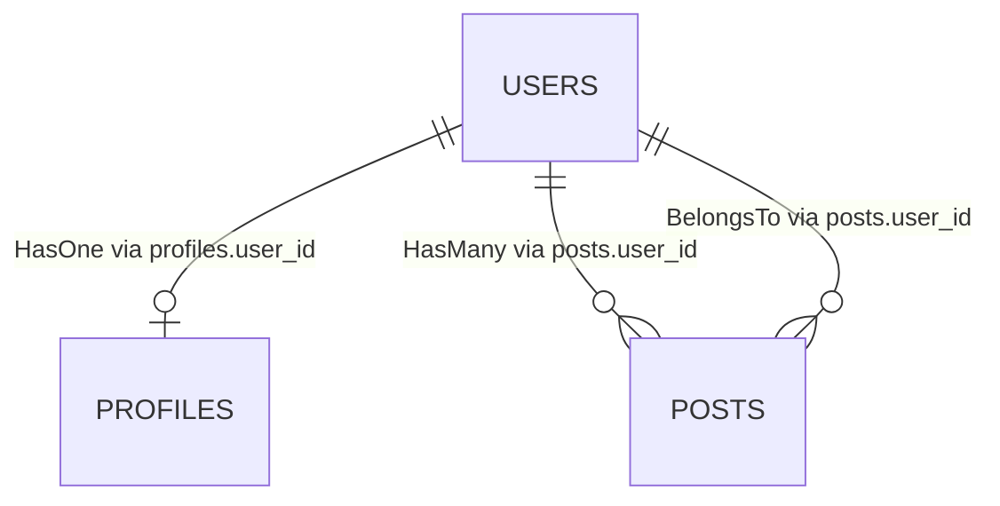
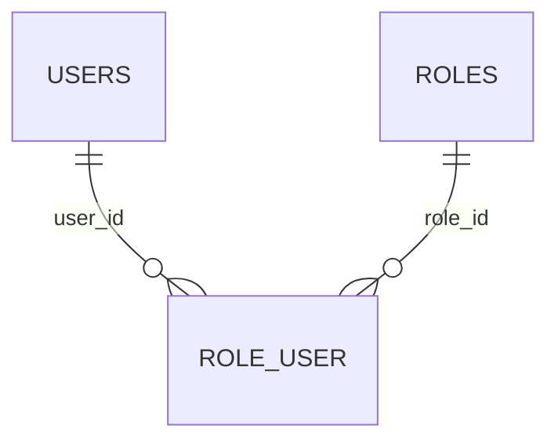
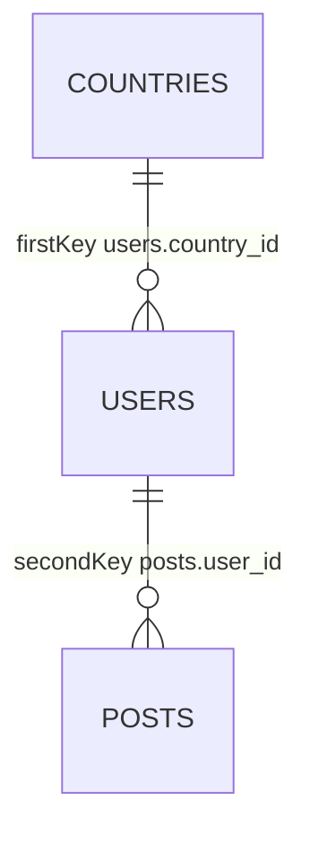
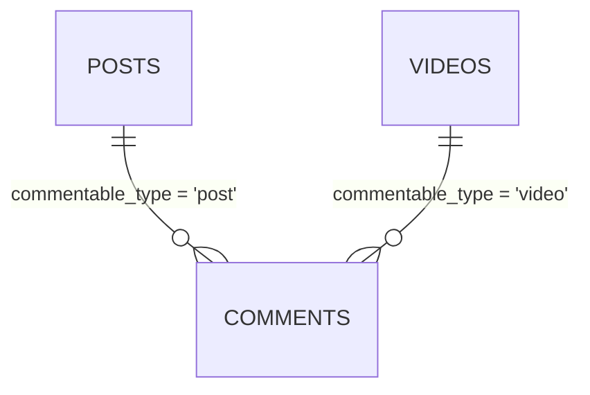

This page is the hub for worm's relation system: the ten shapes, when to pick which, the naming defaults that fill in the blanks, and the delete behavior matrix. It builds on [defining models](../models/defining-models.md).

## The mental model

A relation in worm is metadata plus a batched loader, not a live collection. Each relation object records table names, key columns, and a hydrator function. When a query eager-loads a relation, worm takes all parent rows at once, issues one IN-clause SELECT against the related table, and installs the results into each parent's relations map.

Two rules follow from this design:

- **No lazy loading, by design.** Accessing a relation you never loaded throws. There is no hidden query behind a property access. [Eager loading](./eager-loading.md) covers the loading API and the exceptions.
- **A fixed query budget.** One query per relation path. Pivot and through shapes need two. `MorphTo` needs one per distinct morph type. Nothing else is allowed to hit the database.

## Choosing a shape

| You need | Use |
| --- | --- |
| One child row that holds a foreign key back to this model | `@HasOne` |
| Many child rows that hold a foreign key back to this model | `@HasMany` |
| The inverse: this row holds the foreign key to its parent | `@BelongsTo` |
| Many-to-many through a pivot table | `@BelongsToMany` |
| One distant row reached through an intermediate table | `@HasOneThrough` |
| Many distant rows reached through an intermediate table | `@HasManyThrough` |
| One child that can belong to several different parent types | `@MorphOne` |
| Many children that can belong to several different parent types | `@MorphMany` |
| The inverse: a child pointing at one of several parent types | `@MorphTo` |
| Many-to-many where the owning side is polymorphic | `@MorphToMany` |

## Declaring relations

Relations are declared as annotations on model fields. The generator reads them when you run `worm gen`:

```dart title="lib/models/user.dart"
import 'package:worm/annotations.dart';
import 'package:worm/worm.dart';

part 'user.g.dart';

@Table()
class User extends Model {
  // Columns, constructor, and toRow() elided. See defining models.

  @HasMany(Post, onDelete: OnDelete.ormCascade)
  final List<Post> posts;

  @HasOne(Profile)
  final Profile? profile;

  @BelongsToMany(Role)
  final List<Role> roles;
}
```

```dart title="lib/models/post.dart"
@Table()
class Post extends Model {
  // Columns elided.

  @BelongsTo(User)
  final User? user;
}
```

From these annotations, `worm gen` emits three things per model:

- **Typed relation references** on the companion class: `User$.posts` and `User$.profile` are `RelationField` constants you pass to `withRelations` and friends.
- **Runtime accessors** for `@HasOne`, `@HasMany`, and `@BelongsToMany` fields: `user.posts$` and `user.roles$` expose `add`, `attach`, `sync`, and the other write operations. See [working with relations](./working-with-relations.md).
- **Cascade specs** when a relation declares `onDelete: OnDelete.ormCascade`, wired into `Model.ormCascadeSpecs`.

## The relation gallery

### One-to-one and one-to-many

The foreign key always lives on the child table. `@HasOne` and `@HasMany` sit on the parent; `@BelongsTo` is the inverse on the child.



### Many-to-many

`@BelongsToMany` joins two tables through a pivot table that carries one foreign key per side. Neither model table changes.



### Through relations

`@HasOneThrough` and `@HasManyThrough` hop across an intermediate table with two foreign keys: `firstKey` on the through table points at the parent, `secondKey` on the final table points at the through row.



With this schema, `@HasManyThrough(Post, through: User)` on `Country` reaches every post written from that country.

### Polymorphic relations

Morph shapes replace a single foreign key with a column pair: `<morphName>_type` holds a type string, `<morphName>_id` holds the parent id. One child table can point at many parent tables.



Morph shapes have their own expert page: [polymorphic relations](./polymorphic-relations.md).

## Naming defaults

Every key parameter is optional. When you omit one, worm fills it from convention:

| Convention | Default | Example |
| --- | --- | --- |
| Local, owner, parent, related, and through keys | `'id'` | `users.id` |
| Foreign key column | snake_case parent class plus `_id` | `User.posts` uses `posts.user_id` |
| Pivot table | singular snake_case of both class names, alphabetical, joined with `_` | `User` and `Role` share `role_user` |
| Pivot key columns | snake_case class plus `_id` | `user_id`, `role_id` |
| Morph columns | `<morphName>_type` and `<morphName>_id` | `commentable_type`, `commentable_id` |
| `onDelete` | `OnDelete.restrict` | |

Override any of them through the annotation parameters (`foreignKey:`, `pivotTable:`, `morphName:`, and so on). The full ruleset lives in [naming conventions](../reference/naming-conventions.md).

## The batching invariant

Eager loading executes a fixed number of queries per relation path, no matter how many parents you load:

| Shape | Queries per load |
| --- | --- |
| HasOne, HasMany, BelongsTo, MorphOne, MorphMany | 1 |
| BelongsToMany, HasOneThrough, HasManyThrough, MorphToMany | 2 |
| MorphTo | 1 per distinct morph type observed |

An empty parent list short-circuits with zero queries. Missing rows are quiet, never errors: list-valued relations get an empty list, single-valued relations get `null`.

## No lazy loading, no whereHas

Worm never runs a query behind a property access. `user.getRelation<List<Post>>('posts')` throws `RelationNotLoadedException` when the relation wasn't eager-loaded (or `LazyLoadingException` under strict mode). The error ladder is documented on [eager loading](./eager-loading.md#reading-what-you-loaded).

There is also no `whereHas`. To filter parents by relation existence, inject an existence flag and filter in Dart:

```dart
final users = await User.query().withExists('posts').get();
final authors =
    users.where((u) => u.getInjected<bool>('postsExists')).toList();
```

For filtering inside the database, drop to SQL joins via the `.sql()` dialect gate. See [advanced queries](../queries/advanced-queries.md).

## Delete behavior: OnDelete

Each `@HasOne`, `@HasMany`, and `@BelongsToMany` annotation carries an `onDelete` value from the six-value `OnDelete` enum:

| Value | Who acts | What happens to dependents | Hooks fire on children |
| --- | --- | --- | --- |
| `cascade` | Database engine | Deleted by the engine's FK cascade | No |
| `ormCascade` | Worm, at `delete()` time | Each child is deleted through the ORM, one at a time | Yes, `beforeDelete` and `afterDelete` |
| `restrict` (default) | Database engine | Delete fails while dependents exist | No |
| `setNull` | Database engine | Foreign key set to `NULL` | No |
| `setDefault` | Database engine | Foreign key set to its column default | No |
| `noAction` | Nobody | Engine default behavior | No |

`cascade` and `ormCascade` differ in one thing only: who does the walking. `cascade` is silent and fast; the engine removes children and no Dart code runs. `ormCascade` walks every dependent row through the ORM so observers and lifecycle hooks run, and any child's `beforeDelete` returning `false` aborts the whole delete. In generated SQL, an `ormCascade` foreign key renders as `ON DELETE NO ACTION`, because the ORM handles the cascade before the parent row is deleted. The runtime walk is covered in [working with relations](./working-with-relations.md#cascade-deletes-through-the-orm).

## Manual wiring

Codegen produces the relation map for you, but nothing stops you from wiring relations by hand on a `QueryContext`. Each relation class is const-constructible:

```dart
final context = QueryContext<User>(
  adapter: Worm.adapter(),
  table: 'users',
  hydrate: UserHydration.fromRow,
  relations: {
    'posts': const HasManyRelation<Model, Model>(
      name: 'posts',
      childTable: 'posts',
      foreignKey: 'user_id',
      hydrateChild: PostHydration.fromRow,
    ),
  },
);

final users = await QueryBuilder<User>.from(context)
    .withRelationPaths(['posts'])
    .get();
```

The map key is the relation name every `with*` call resolves against. An unknown name throws `ConfigurationException` (key `relation.unknown`) when the query executes.

## Gotchas

- Relation names resolve at query execution, not at compile time. A typo in `withRelationPaths(['post'])` throws `ConfigurationException` with key `relation.unknown` when the query runs.
- Constraints passed to `withRelation` are honored only by HasOne, HasMany, and BelongsToMany. Every other shape silently ignores the filter and loads everything.
- `OnDelete.ormCascade` renders as `NO ACTION` in SQL. Bulk `QueryBuilder.delete()` skips model hydration and hooks, so it also skips the ORM cascade. Only `model.delete()` walks `ormCascadeSpecs`.
- Only `@HasOne`, `@HasMany`, and `@BelongsToMany` fields get generated runtime accessors. Through and morph relations are read through eager loading only.
- Missing related rows never throw during a load: you get an empty list or `null`, and dangling pivot or morph references are skipped.

## API summary

### Relation classes

| Class | Constructor sketch | Queries | Sets on parent |
| --- | --- | --- | --- |
| `HasOneRelation<Parent, Child>` | `(name:, childTable:, foreignKey:, hydrateChild:, localKey: 'id')` | 1 | `Child?` |
| `HasManyRelation<Parent, Child>` | `(name:, childTable:, foreignKey:, hydrateChild:, localKey: 'id')` | 1 | `List<Child>` |
| `BelongsToRelation<Child, Parent>` | `(name:, parentTable:, foreignKey:, hydrateParent:, ownerKey: 'id')` | 1 | `Parent?` |
| `BelongsToManyRelation<Parent, Related>` | `(name:, relatedTable:, pivotTable:, parentPivotKey:, relatedPivotKey:, hydrateRelated:, parentKey: 'id', relatedKey: 'id')` | 2 | `List<Related>` |
| `HasOneThroughRelation<Parent, Child>` | `(name:, throughTable:, childTable:, firstKey:, secondKey:, hydrateChild:, localKey: 'id', throughKey: 'id')` | 2 | `Child?` |
| `HasManyThroughRelation<Parent, Child>` | `(name:, throughTable:, childTable:, firstKey:, secondKey:, hydrateChild:, localKey: 'id', throughKey: 'id')` | 2 | `List<Child>` |
| `MorphOneRelation<Parent, Child>` | `(name:, childTable:, morphType:, parentMorphName:, hydrateChild:, localKey: 'id')` | 1 | `Child?` |
| `MorphManyRelation<Parent, Child>` | `(name:, childTable:, morphType:, parentMorphName:, hydrateChild:, localKey: 'id')` | 1 | `List<Child>` |
| `MorphToRelation<Child, Target>` | `(name:, morphTypeColumn:, morphIdColumn:, types: Map<String, MorphTypeMapping<Target>>)` | 1 per morph type | `Target?` |
| `MorphToManyRelation<Parent, Related>` | `(name:, relatedTable:, pivotTable:, parentMorphName:, morphType:, relatedPivotKey:, hydrateRelated:, parentKey: 'id', relatedKey: 'id')` | 2 | `List<Related>` |

### Annotations

| Annotation | Parameters | One-liner |
| --- | --- | --- |
| `@HasOne(Type)` | `foreignKey`, `localKey`, `onDelete: OnDelete.restrict` | Parent owns one child |
| `@HasMany(Type)` | `foreignKey`, `localKey`, `onDelete: OnDelete.restrict` | Parent owns many children |
| `@BelongsTo(Type)` | `foreignKey`, `ownerKey` | Child points at its parent |
| `@BelongsToMany(Type)` | `pivotTable`, `foreignPivotKey`, `relatedPivotKey`, `onDelete: OnDelete.restrict` | Many-to-many via pivot |
| `@HasOneThrough(Type, through: Type)` | `firstKey`, `secondKey` | One distant row via intermediate |
| `@HasManyThrough(Type, through: Type)` | `firstKey`, `secondKey` | Many distant rows via intermediate |
| `@MorphOne(Type)` | `morphName` | One polymorphic child |
| `@MorphMany(Type)` | `morphName` | Many polymorphic children |
| `@MorphTo()` | `types: Map<String, Type>` | Inverse polymorphic pointer |
| `@MorphToMany(Type)` | `morphName`, `pivotTable` | Polymorphic many-to-many |

### Support types

| Symbol | Signature sketch | One-liner |
| --- | --- | --- |
| `Relation<Parent, Child>` | `load(adapter, parents)`, `loadWithFilter(..., {extraFilter})` | Abstract base of every shape |
| `RelationLoadResult<Parent>` | `setOnParent(parent)`, `stats` | Batched load output |
| `LoadStats` | `queriesExecuted` | Query count diagnostics |
| `RelationField<Parent, Related>` | `(name, foreignKey:, localKey: 'id')`, `include(children)` | Typed compile-time relation reference |
| `RelationPath` | `(path)` | Dot-joined nested path |
| `RelationLoadSpec` | typedef of `RelationPath` | Spec-vocabulary alias |
| `OrmCascadeSpec` | `(childTable:, foreignKey:, hydrate:)` | ORM-side cascade entry |
| `OnDelete` | `cascade, ormCascade, restrict, setNull, setDefault, noAction` | Referential delete actions |

## Continue reading

- [Eager loading](./eager-loading.md): the loading API, nested paths, constraints, and aggregates.
- [Working with relations](./working-with-relations.md): the write side, from `add` to `sync` to ORM cascades.
- [Polymorphic relations](./polymorphic-relations.md): morph shapes, sealed unions, and the morph registry.
- [Schema builder](../database/schema-builder.md): declaring the foreign keys and pivot tables these shapes expect.
