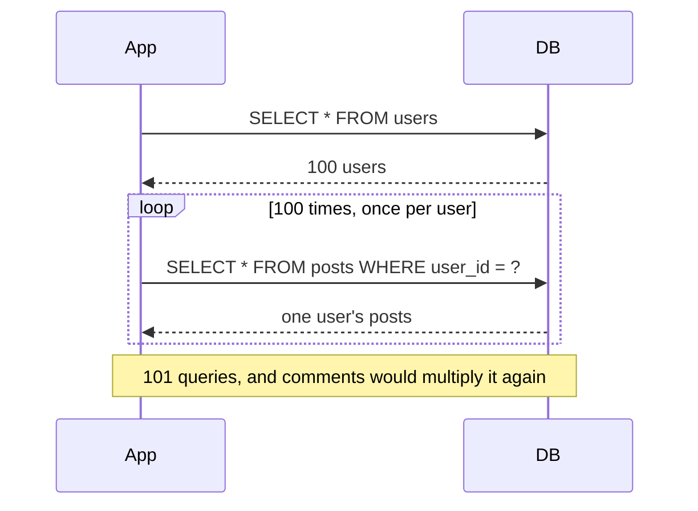
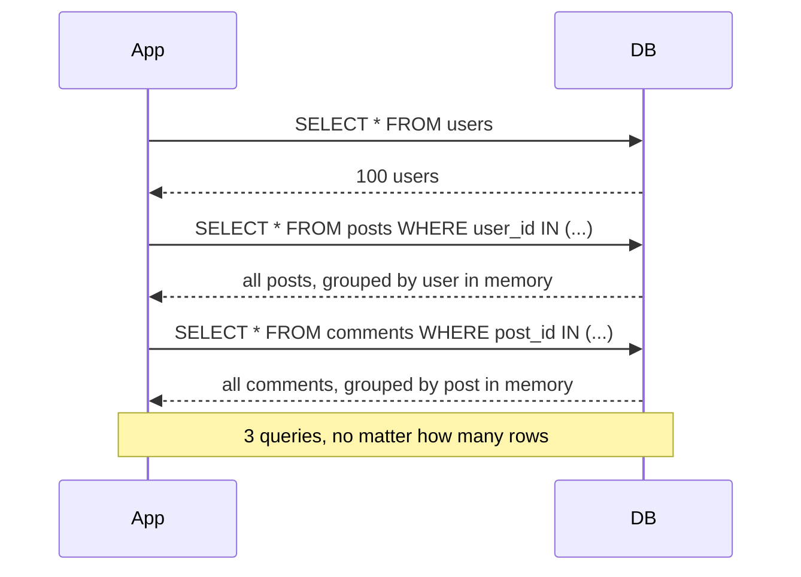

This page is worm's loading doctrine: how relations get into memory, what it costs, and what happens when you read one you never loaded. It builds on [defining relations](./defining-relations.md).

## One swoop, not many flights

Worm has exactly one way to load relations: eagerly, in batch, declared on the query. There is no lazy loading. A polite bird does not fly back for every single worm. It gathers the whole batch in one swoop.

The payoff is a hard invariant: one query per relation path, regardless of row count. Load 3 users or 3,000, `posts` still costs a single SELECT.

## N+1 versus eager loading

The classic ORM failure mode is the N+1 explosion: fetch 100 users, then run one query per user to fetch posts, then one per post for comments. Query count scales with your data.



Worm batches instead. Loading users with posts and comments is always three SELECTs:



## Loading relations

Declare loads on the builder before the terminal runs. The typed form uses generated `RelationField` companions; the string form uses raw relation names:

```dart
// Typed companions (preferred): compile-checked references.
final users = await User.query()
    .withRelations([User$.posts, User$.profile])
    .get();

// Raw string paths: same load, no compile-time check.
final same = await User.query()
    .withRelationPaths(['posts', 'profile'])
    .get();
```

Each name must be registered on the model's relation map (codegen does this). An unknown name throws `ConfigurationException` with key `relation.unknown` when the query executes.

## Nested paths

Dot notation descends through relations. Each segment is one more query:

```dart
// users -> posts -> comments: three SELECTs total.
final users = await User.query()
    .withNested(User$.posts.include([Post$.comments]))
    .get();

// Identical load with a raw string path.
final same = await User.query()
    .withRelationPaths(['posts.comments'])
    .get();
```

`RelationField.include` builds a `RelationPath`; `withPath` and `withNested` are the same method under two names. After the head segment loads, the loader recurses with the loaded children as the new parents.

## Constrained loads

`withRelation` accepts an optional `PredicateTree` that is AND-merged into the child SELECT:

```dart
// Load only published posts; drafts are absent from the result.
final users = await User.query()
    .withRelation(User$.posts, Post$.published.eq(true))
    .get();
```

Omitting the constraint makes `withRelation(User$.posts)` identical to an unconstrained load.

:::caution[Only three shapes filter]
Constraints are honored by HasOne, HasMany, and BelongsToMany. BelongsTo, through, and every morph shape silently ignore the filter and load everything. There is also no way to constrain the tail of a nested path; constraints attach to a single relation via `withRelation`.
:::

## Reading what you loaded

Loaded values land in the model's `relations` map. The safe accessor is `getRelation<T>`:

```dart
final posts = user.getRelation<List<Post>>('posts');
final profile = user.getRelation<Profile>('profile');
```

Its behavior forms a ladder:

| State | Result |
| --- | --- |
| Loaded, value matches `T` | The value |
| Loaded, value does not match `T` | `null`, silently |
| Not loaded | Throws `RelationNotLoadedException` |
| Not loaded, strict mode (`preventLazyLoading: true`) | Throws `LazyLoadingException` |
| Not loaded, inside `Worm.unsafe(() async { ... })` | `null` |

Raw access via `user.relations['posts']` returns `Object?` with none of these protections. Prefer `getRelation`.

## Relation aggregates

Sometimes you need a number, not the rows. `withCount`, `withSum`, and `withExists` push the rollup into the database as one `GROUP BY` query per aggregate and inject the result as a virtual field on each model:

```dart
final users = await User.query()
    .withCount('posts')
    .withSum('posts', 'views')
    .withExists('posts')
    .get();

final count = users.first.getInjected<int>('postsCount');
final views = users.first.getInjected<num>('postsSum');
final active = users.first.getInjected<bool>('postsExists');
```

Injection keys default to `<relation>Count`, `<relation>Sum`, and `<relation>Exists`; override with `injectKey:`. `withCount` also takes a `filter:` predicate:

```dart
final users = await User.query()
    .withCount('posts', filter: Post$.published.eq(true))
    .get();
```

Rules that bite:

- Aggregates support HasMany and HasOne only. Any other shape throws `UnsupportedOperationException` (operation `aggregate.<injectKey>`).
- `getInjected<T>` throws `UninitializedFieldException` when the key was never populated, and also when the stored value doesn't match `T`. It never returns a silent `null`.
- Parents with no matching children get `0` from `withCount`, `0` (not `null`) from `withSum`, and `false` from `withExists`.

## Query counts and concurrency

The invariant per terminal: one parent query, plus per relation path the count from the [batching table](./defining-relations.md#the-batching-invariant), plus one query per aggregate.

When a query declares more than one top-level load or aggregate, worm runs them concurrently with `Future.wait`, since each reads its own table and writes its own key. Inside a transaction they run serially instead, because a transaction owns a single connection that can't service overlapping queries.

## Gotchas

- `getRelation<T>` with the wrong `T` on a loaded relation returns `null` silently. `getRelation<List<Post>>` and `getRelation<Post>` are not interchangeable.
- Aggregate methods take the relation name as a `String` (`withCount('posts')`), not a `RelationField`. Use `User$.posts.name` if you want to stay typed.
- `withSum` injects `num`. Read it with `getInjected<num>`; `getInjected<int>` can throw depending on the adapter's return type.
- Constraints don't cascade: `withRelation(User$.posts, ...)` filters posts only, never a nested `posts.comments` tail.
- Eager loads run in parallel outside transactions. If your adapter wrapper assumes serial queries, wrap the read in a transaction.
- An eager load mutates the returned models in place; there is no partial projection of related columns. Every related row comes back whole.

## API summary

### QueryBuilder methods

| Symbol | Signature sketch | One-liner |
| --- | --- | --- |
| `withRelationPaths` | `(List<String> paths)` | String paths, dot notation for nesting |
| `withRelations` | `(List<RelationField> relations)` | Typed top-level loads |
| `withRelation` | `(RelationField field, [PredicateTree? constraint])` | One relation, optionally filtered |
| `withPath` | `(RelationPath path)` | Nested typed path |
| `withNested` | `(RelationLoadSpec spec)` | Alias of `withPath` |
| `withCount` | `(String relation, {String? injectKey, PredicateTree? filter})` | Inject child count |
| `withSum` | `(String relation, String column, {String? injectKey})` | Inject child column sum |
| `withExists` | `(String relation, {String? injectKey})` | Inject existence boolean |

### Model accessors

| Symbol | Signature sketch | One-liner |
| --- | --- | --- |
| `Model.relations` | `Map<String, Object?>` | Raw loaded-relation storage |
| `Model.getRelation<T>` | `(String name) -> T?` | Typed read; throws when not loaded |
| `Model.injectedFields` | `Map<String, Object?>` | Raw aggregate storage |
| `Model.getInjected<T>` | `(String name) -> T` | Typed read; throws when missing or mistyped |

### Support types

| Symbol | Signature sketch | One-liner |
| --- | --- | --- |
| `EagerLoader.run` | `({context, parents, loads, aggregates}) -> Future<int>` | Executes loads, returns query count |
| `EagerLoad` | `(path, {constrain})` | One declared load |
| `AggregateInjection` | `(relationName:, kind:, injectionKey:, ...)` | One declared aggregate |
| `AggregateKind` | `count, sum, exists` | Aggregate flavors |
| `RelationField.include` | `(List<RelationField>) -> RelationPath` | Builds a nested path |

## Continue reading

- [Defining relations](./defining-relations.md): the shapes behind every path you load.
- [Strict mode](../guides/strict-mode.md): make unloaded access a `LazyLoadingException` everywhere.
- [Performance](../guides/performance.md): query budgets, streaming, and when to reach for aggregates.
- [Working with relations](./working-with-relations.md): mutating what you loaded.
