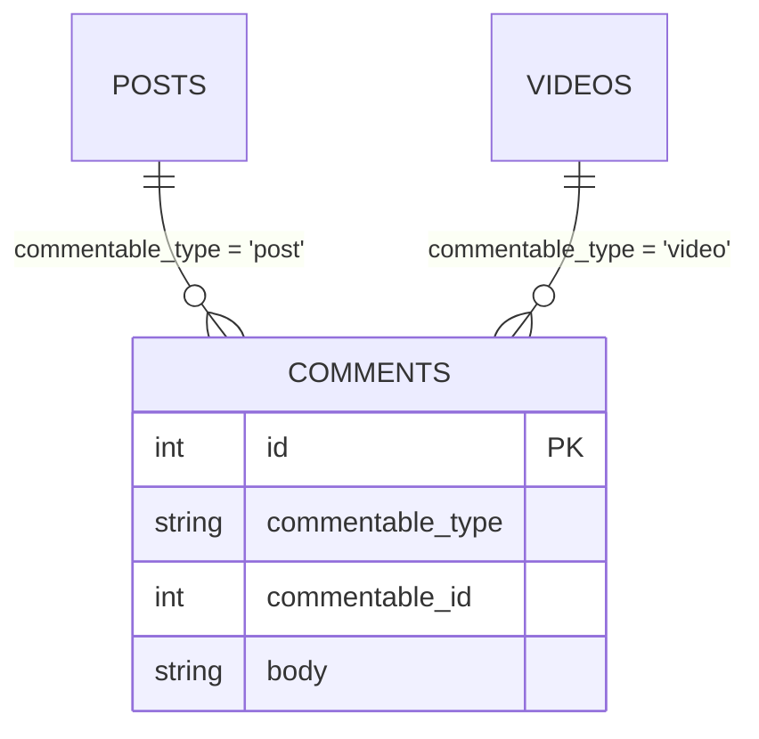

This page covers worm's four polymorphic shapes and the machinery that keeps them typed: sealed unions, `wrap` functions, `MorphTarget`, and the `MorphRegistry`. It builds on [defining relations](./defining-relations.md) and assumes you know [eager loading](./eager-loading.md).

## The morph table shape

A polymorphic child replaces a single foreign key with a column pair derived from the morph name: `<morphName>_type` stores a type string, `<morphName>_id` stores the parent's id. One `comments` table can point at `posts` and `videos` at once:



The type string (`'post'`, `'video'`) is data, stored in every row. It is decoupled from Dart class names on purpose: renaming a class must never corrupt stored associations. The [MorphRegistry](#the-morphregistry) owns that mapping.

## MorphOne and MorphMany

The owning side. `MorphOneRelation` and `MorphManyRelation` load children whose morph columns match the parent's ids AND the parent's type string, in a single query:

```dart
const images = MorphManyRelation<Model, Model>(
  name: 'images',
  childTable: 'images',
  morphType: 'post',           // this parent's type string
  parentMorphName: 'imageable', // derives imageable_type / imageable_id
  hydrateChild: ImageHydration.fromRow,
);
```

`morphTypeColumn` and `morphIdColumn` are derived getters: `imageable_type` and `imageable_id` here. Declaratively, these are `@MorphOne(Image)` and `@MorphMany(Image)` with an optional `morphName:` override. `MorphOne` sets a `Child?` on the parent; `MorphMany` sets a `List<Child>`.

## MorphToMany

Polymorphic many-to-many: the pivot table carries the morph pair plus a related key. Think tags attached to posts and videos through one `taggables` pivot. `MorphToManyRelation` loads in exactly two queries (pivot rows filtered by ids and type string, then related rows by id) and sets a `List<Related>` on each parent. Declaratively: `@MorphToMany(Tag, morphName: 'taggable', pivotTable: 'taggables')`.

## MorphTo without dynamic

`MorphTo` is the inverse: a comment points at one of several parent types. Most ORMs hand you `dynamic` here. Worm refuses. You supply a sealed class hierarchy with one case per parent type, plus a `wrap` function per type, and get back a value you can pattern-match exhaustively:

```dart
sealed class Commentable {
  const Commentable();
}

final class PostCommentable extends Commentable {
  const PostCommentable(this.post);
  final Post post;
}

final class VideoCommentable extends Commentable {
  const VideoCommentable(this.video);
  final Video video;
}
```

## The two MorphTo APIs

Worm ships two parallel surfaces for MorphTo. Prefer the definition flavor; it is the shape codegen targets.

### MorphToDefinition and EagerLoader.loadMorphTo

`MorphToDefinition` is pure metadata with one `MorphBinding` per type string. `EagerLoader.loadMorphTo` batches the load: it groups children by their type string and issues one SELECT per distinct type observed:

```dart
final commentable = MorphToDefinition<Comment, Commentable>(
  name: 'commentable',
  morphTypeColumn: 'commentable_type',
  morphIdColumn: 'commentable_id',
  hydrateMap: {
    'post': MorphBinding<Commentable>(
      table: 'posts',
      hydrate: PostHydration.fromRow,
      wrap: (model) {
        if (model case final Post post) return PostCommentable(post);
        throw StateError('Expected Post');
      },
    ),
    'video': MorphBinding<Commentable>(
      table: 'videos',
      hydrate: VideoHydration.fromRow,
      wrap: (model) {
        if (model case final Video video) return VideoCommentable(video);
        throw StateError('Expected Video');
      },
    ),
  },
);

final queries = await EagerLoader.loadMorphTo(
  adapter: Worm.adapter(),
  children: comments,
  definition: commentable,
);
```

After the load, every child's relation slot is set, and the value pattern-matches without a cast or a default arm:

```dart
for (final comment in comments) {
  final target = comment.getRelation<Commentable>('commentable');
  final label = switch (target) {
    PostCommentable(:final post) => 'on post ${post.id}',
    VideoCommentable(:final video) => 'on video ${video.id}',
    null => 'orphaned',
  };
  print(label);
}
```

The definition also supports a per-child load when you hold a single model:

```dart
final Commentable? target = await commentable.load(Worm.adapter(), comment);
```

`load` returns `null` in four cases: the type column is null or absent, the type string is not in `hydrateMap`, the id column is null, or the referenced parent row does not exist.

### MorphToRelation

`MorphToRelation` is the same idea packaged as a `Relation`, so it can sit in a `QueryContext.relations` map and load through the standard `with*` pipeline. Its per-type entries are `MorphTypeMapping` objects, structurally identical to `MorphBinding` (`table`, `hydrate`, `wrap`, `ownerKey: 'id'`):

```dart
final relation = MorphToRelation<Model, Commentable>(
  name: 'commentable',
  morphTypeColumn: 'commentable_type',
  morphIdColumn: 'commentable_id',
  types: {
    'post': MorphTypeMapping<Commentable>(
      table: 'posts',
      hydrate: PostHydration.fromRow,
      wrap: (model) {
        if (model case final Post post) return PostCommentable(post);
        throw StateError('Expected Post');
      },
    ),
  },
);
```

Both flavors share the query budget: one SELECT per distinct morph type observed across the loaded children. This is the documented exception to worm's one-query-per-path baseline.

## Typed raw rows: MorphTarget

When you work below the model layer, the `toMorphTarget` extension gives raw rows the same sealed treatment. It reads the canonical row keys `morphTypeKey` (`'_morphType'`) and `morphIdKey` (`'_morphId'`) and discriminates against an allowed-types map:

```dart
final target = row.toMorphTarget({'post': 'posts', 'video': 'videos'});
switch (target) {
  case GenericMorph(:final table, :final id):
    // Resolved: the row points at `table`, primary key `id`.
  case UnresolvedMorph(:final rawType):
    // Missing type, unknown type, or missing id.
    // rawType is the observed string, or null when absent.
}
```

`toMorphTarget` never returns `null` and never throws; every failure mode collapses into `UnresolvedMorph`. The allowed-types argument has the same shape as `Worm.morphRegistry.tableMap`, so the registry can feed it directly.

## The MorphRegistry

Multiple polymorphic relations (say `commentable` and `taggable`) share the same type strings. Instead of repeating the mapping in every definition, register each participating model once in the process-wide registry at `Worm.morphRegistry`:

```dart
Worm.morphRegistry.register<Post>(
  const MorphRegistration<Post>(
    morphType: 'post',
    type: Post,
    table: 'posts',
    hydrate: PostHydration.fromRow, // optional
  ),
);
```

Lookups run in both directions:

```dart
Worm.morphRegistry.typeFor('post');       // Post, or null when unknown
Worm.morphRegistry.morphTypeFor(Post);    // 'post', or null when unknown
Worm.morphRegistry.morphNameFor(Post);    // 'post', throws when unknown
Worm.morphRegistry.registrationFor('post');  // full binding, or null
Worm.morphRegistry.tableMap;              // {'post': 'posts', ...}
```

The registry is strict about duplicates. Registering an already-taken morph string throws `ConfigurationException` with key `morph.duplicate.type`; registering an already-registered Dart type throws with key `morph.duplicate.dart`. Silently shadowing an entry would mask a real misconfiguration, so it is loud instead.

Accessing `Worm.morphRegistry` before `Worm.initialize` throws `ConfigurationException` with key `initialization`. `Worm.reset()` clears the registry along with the rest of the runtime; see [Worm runtime](../reference/worm-runtime.md).

## Gotchas

- Unresolvable children end up with `null` under the relation name, not an exception. Both MorphTo flavors set the relation key on every child, so `getRelation<Commentable>('commentable')` returns `null` for orphans instead of throwing.
- Unknown type strings are skipped quietly during batch loads. A typo in a `hydrateMap` key means those children silently load as `null`.
- `withRelation` constraints are ignored by every morph shape; the filter never reaches the child query.
- Relation aggregates (`withCount`, `withSum`, `withExists`) do not support morph relations and throw `UnsupportedOperationException`.
- Column names derive from the morph name (`commentable_type`, `commentable_id`), but `toMorphTarget` reads the canonical `_morphType` / `_morphId` row keys. Map your columns onto those keys before calling it.
- `morphTypeFor` and `typeFor` return `null` for unknowns; `morphNameFor` throws `ConfigurationException` with key `morph.unknown`. Pick the accessor that matches how fatal an unknown is at that call site.
- MorphTo runs one query per distinct morph type observed. Ten types in one result set means ten SELECTs.

## API summary

### Relations and definitions

| Symbol | Signature sketch | One-liner |
| --- | --- | --- |
| `MorphOneRelation<Parent, Child>` | `(name:, childTable:, morphType:, parentMorphName:, hydrateChild:, localKey: 'id')` | One polymorphic child, 1 query |
| `MorphManyRelation<Parent, Child>` | same as MorphOne | Many polymorphic children, 1 query |
| `MorphToRelation<Child, Target>` | `(name:, morphTypeColumn:, morphIdColumn:, types:)` | Relation-flavored MorphTo |
| `MorphToManyRelation<Parent, Related>` | `(name:, relatedTable:, pivotTable:, parentMorphName:, morphType:, relatedPivotKey:, hydrateRelated:, parentKey: 'id', relatedKey: 'id')` | Polymorphic pivot, 2 queries |
| `MorphOneDefinition<Parent, Child>` | mirrors `MorphOneRelation`, no load logic | Declarative descriptor |
| `MorphManyDefinition<Parent, Child>` | mirrors `MorphManyRelation`, no load logic | Declarative descriptor |
| `MorphToDefinition<Child, S>` | `(name:, morphTypeColumn:, morphIdColumn:, hydrateMap:)` plus `load(adapter, child) -> Future<S?>` | Descriptor-first MorphTo |
| `MorphToManyDefinition<Parent, Related>` | mirrors `MorphToManyRelation`, no load logic | Declarative descriptor |
| `RelationDefinition` | sealed base, `name` | Exhaustive matching over morph shapes |
| `EagerLoader.loadMorphTo` | `({adapter:, children:, definition:}) -> Future<int>` | Batched MorphTo dispatch |

### Bindings and targets

| Symbol | Signature sketch | One-liner |
| --- | --- | --- |
| `MorphTypeMapping<Target>` | `(table:, hydrate:, wrap:, ownerKey: 'id')` | Per-type entry for `MorphToRelation` |
| `MorphBinding<S>` | `(table:, hydrate:, wrap:, ownerKey: 'id')` | Per-type entry for `MorphToDefinition` |
| `MorphTarget` | sealed: `GenericMorph` or `UnresolvedMorph` | Typed morph reference |
| `GenericMorph` | `(type:, table:, id:)` | Resolved reference |
| `UnresolvedMorph` | `(rawType?)` | Missing or unknown type |
| `toMorphTarget` | `Map<String, Object?>.toMorphTarget(Map<String, String>) -> MorphTarget` | Discriminate a raw row |
| `morphTypeKey` / `morphIdKey` | `'_morphType'` / `'_morphId'` | Canonical row keys |

### Registry

| Symbol | Signature sketch | One-liner |
| --- | --- | --- |
| `Worm.morphRegistry` | `MorphRegistry` (requires `Worm.initialize`) | Process-wide registry |
| `MorphRegistration<M>` | `(morphType:, type:, table:, hydrate?)` | One type binding |
| `MorphRegistry.register<M>` | `(MorphRegistration<M>)` | Add binding, throws on duplicates |
| `MorphRegistry.morphTypeFor` | `(Type) -> String?` | Dart type to morph string |
| `MorphRegistry.morphNameFor` | `(Type) -> String` | Same, throws on unknown |
| `MorphRegistry.typeFor` | `(String) -> Type?` | Morph string to Dart type |
| `MorphRegistry.registrationFor` | `(String) -> MorphRegistration<Model>?` | Binding by morph string |
| `MorphRegistry.registrationForType` | `(Type) -> MorphRegistration<Model>?` | Binding by Dart type |
| `MorphRegistry.registrations` | `List<MorphRegistration<Model>>` | All bindings, registration order |
| `MorphRegistry.tableMap` | `Map<String, String>` | morph string to table, feeds `toMorphTarget` |
| `MorphRegistry.clear` | `() -> void` | Drop all bindings (tests) |

## Continue reading

- [Defining relations](./defining-relations.md): where morph shapes sit among the other six.
- [Eager loading](./eager-loading.md): the loading pipeline these shapes plug into.
- [Worm runtime](../reference/worm-runtime.md): `Worm.morphRegistry`, `Worm.initialize`, and `Worm.reset`.
