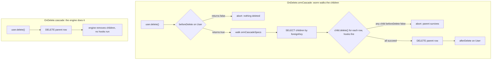

Eager loading is the read side; this page is the write side. It covers the generated accessors, pivot operations, and how `OnDelete.ormCascade` walks children at delete time. It builds on [defining relations](./defining-relations.md).

## Generated accessors

For every `@HasMany`, `@HasOne`, and `@BelongsToMany` field, `worm gen` emits a getter on the model named after the field plus `$`:

```dart
final postsAccessor = user.posts$;  // HasManyAccessor<User, Post>
final profileAccessor = user.profile$; // HasOneAccessor<User, Profile>
final rolesAccessor = user.roles$;  // BelongsToManyAccessor<User, Role>
```

Through and morph relations get no accessor; they are read via eager loading only. The accessor classes are plain public API, so you can also construct them by hand around any relation instance:

```dart
final accessor = HasManyAccessor<User, Post>(
  parent: user,
  relation: const HasManyRelation<User, Post>(
    name: 'posts',
    childTable: 'posts',
    foreignKey: 'user_id',
    hydrateChild: PostHydration.fromRow,
  ),
);
```

## Adding and detaching children

`HasManyAccessor` operates on the child-side foreign key:

```dart
await user.posts$.add(post);          // sets post.user_id, saves post
await user.posts$.addAll([a, b, c]);  // same, one save per child
final posts = await user.posts$.get(); // reloads from the database
await user.posts$.dissociate(post);   // nulls post.user_id, keeps the row
```

`add` and `addAll` persist each child through `Model.save()`, so validation and lifecycle hooks run per row. `get()` (alias `list()`) refetches the children and refreshes the cached relation. `dissociate` nulls the foreign key and re-saves; the child row stays in the database.

`HasOneAccessor` mirrors this for a single child:

```dart
await user.profile$.associate(profile); // sets profile.user_id, saves
final current = await user.profile$.get(); // Profile? from the database
await user.profile$.clear();            // nulls the FK on the current child
```

`set` is an alias of `associate`. `clear` loads the current child first, so the save that nulls the foreign key runs that child's `beforeSave` and `afterSave` hooks. When no child is associated, `clear` is a no-op.

## Pivot operations

`BelongsToManyAccessor` manipulates the pivot table directly:

```dart
await user.roles$.attach(adminRoleId);
await user.roles$.attach(
  editorRoleId,
  pivotData: {'assigned_at': '2026-07-02'},
);
await user.roles$.attachAll([1, 2, 4]);

final removed = await user.roles$.detach(4);   // pivot rows removed: 1
final removedAll = await user.roles$.detachAll([1, 2]);

final result = await user.roles$.sync([2, 3]);
print(result.attached); // [3]
print(result.detached); // [1]  (assuming 1 and 2 were attached)
```

:::caution[attach never deduplicates]
`attach` is a plain INSERT into the pivot table with no existence check. Attaching the same id twice creates two pivot rows. If you need "attach unless present" semantics, use `sync`, which diffs the current pivot state and leaves already-attached ids untouched.
:::

`sync` replaces the parent's pivot rows so they reference exactly the given ids. It reads the current pivot rows once, then issues one DELETE per id to detach and one INSERT per id to attach. It is correct but not batched: syncing a large diff costs one query per change. `PivotSyncResult` reports what changed via `attached` and `detached`.

`attachAll` has no `pivotData` parameter; attach rows one by one when each needs pivot columns.

## Cache invalidation

Every accessor mutation (`add`, `addAll`, `associate`, `dissociate`, `clear`, `attach`, `attachAll`, `detach`, `detachAll`, `sync`) removes the cached entry from `parent.relations`. After a mutation, `getRelation` throws `RelationNotLoadedException` until you reload, either with `accessor.get()` or a fresh eager-loaded query. This is deliberate: a stale cached list that silently disagrees with the database would be worse than a loud reload.

## Manual pivot wiring

`PivotManager` is the primitive underneath `BelongsToManyAccessor`. Use it when you have no accessor at hand:

```dart
final manager = PivotManager(
  adapter: Worm.adapter(),
  pivotTable: 'role_user',
  parentPivotKey: 'user_id',
  relatedPivotKey: 'role_id',
  parentId: user.id,
);

await manager.attach(3, pivotData: {'assigned_at': '2026-07-02'});
final removed = await manager.detach(3);
final result = await manager.sync([1, 2]);
```

The conventional pivot table name is the singular snake_case of both class names, alphabetically ordered and joined with `_`: `User` and `Role` share `role_user`. `PivotManager` does not touch the relation cache; that layer belongs to the accessor.

## Cascade deletes through the ORM

When a relation is declared with `onDelete: OnDelete.ormCascade`, the generator wires an `OrmCascadeSpec` into the parent's `Model.ormCascadeSpecs`. Calling `parent.delete()` then walks the specs before deleting the parent row:



Each child is hydrated and deleted through the ORM, so every child's `beforeDelete` and `afterDelete` hooks fire, observers run, and nested cascades recurse. If any child's `beforeDelete` returns `false`, the whole delete aborts and the parent survives.

Compare `OnDelete.cascade`: a database-engine foreign key cascade. One DELETE statement, the engine removes dependents, and no Dart code runs for any child.

You can also declare specs by hand on any model:

```dart
@override
List<OrmCascadeSpec> get ormCascadeSpecs => const [
  OrmCascadeSpec(
    childTable: 'posts',
    foreignKey: 'user_id',
    hydrate: PostHydration.fromRow,
  ),
];
```

:::caution[Aborts are not rollbacks]
Worth repeating: a child's `beforeDelete` returning `false` aborts the cascade and the parent's delete. But children deleted earlier in that same walk stay deleted unless the whole operation runs inside a [transaction](../database/transactions.md). Wrap cascading deletes in a transaction when partial deletion is unacceptable.
:::

## Gotchas

- `attach` never deduplicates; two `attach(3)` calls mean two pivot rows. Use `sync` for idempotent attachment.
- `sync` is not batched: one read plus one query per attached or detached id.
- `attachAll` cannot write `pivotData`; loop over `attach` instead.
- Every mutation drops the cached relation. Read again via `accessor.get()` or a new eager-loaded query, or `getRelation` will throw.
- `dissociate` and `clear` null the foreign key but never delete the child row.
- Bulk `QueryBuilder.delete()` skips hydration, hooks, and `ormCascadeSpecs` entirely. Only `model.delete()` cascades through the ORM.
- `HasManyAccessor` and `HasOneAccessor` accept an optional `resolveAdapter` callback; `BelongsToManyAccessor` always resolves through `Worm.adapter(parent.connectionName)`.

## API summary

### HasManyAccessor&lt;Parent, Child&gt;

| Symbol | Signature sketch | One-liner |
| --- | --- | --- |
| constructor | `({parent:, relation:, resolveAdapter?})` | Wraps a `HasManyRelation` |
| `add` | `(Child child) -> Future<void>` | Set FK, save child, drop cache |
| `addAll` | `(Iterable<Child>) -> Future<void>` | `add` for each, one cache drop |
| `get` | `() -> Future<List<Child>>` | Reload from database, refresh cache |
| `list` | `() -> Future<List<Child>>` | Alias of `get` |
| `dissociate` | `(Child child) -> Future<void>` | Null FK, keep row |

### HasOneAccessor&lt;Parent, Child&gt;

| Symbol | Signature sketch | One-liner |
| --- | --- | --- |
| constructor | `({parent:, relation:, resolveAdapter?})` | Wraps a `HasOneRelation` |
| `associate` | `(Child child) -> Future<void>` | Set FK, save child |
| `set` | `(Child child) -> Future<void>` | Alias of `associate` |
| `get` | `() -> Future<Child?>` | Reload from database, refresh cache |
| `clear` | `() -> Future<void>` | Null FK on current child via its save hooks |

### BelongsToManyAccessor&lt;Parent, Related&gt;

| Symbol | Signature sketch | One-liner |
| --- | --- | --- |
| constructor | `({parent:, relation:})` | Wraps a `BelongsToManyRelation` |
| `attach` | `(Object relatedId, {Map pivotData}) -> Future<void>` | Insert pivot row, no dedup |
| `attachAll` | `(Iterable<Object> ids) -> Future<void>` | `attach` per id, no pivotData |
| `detach` | `(Object relatedId) -> Future<int>` | Delete pivot rows, return count |
| `detachAll` | `(Iterable<Object> ids) -> Future<int>` | `detach` per id, summed count |
| `sync` | `(List<Object> ids) -> Future<PivotSyncResult>` | Diff to exactly these ids |

### Pivot and cascade primitives

| Symbol | Signature sketch | One-liner |
| --- | --- | --- |
| `PivotManager` | `({adapter:, pivotTable:, parentPivotKey:, relatedPivotKey:, parentId:})` | Raw pivot operations |
| `PivotManager.attach` | `(Object relatedId, {Map pivotData})` | INSERT pivot row |
| `PivotManager.detach` | `(Object relatedId) -> Future<int>` | DELETE matching pivot rows |
| `PivotManager.sync` | `(List<Object> ids) -> Future<PivotSyncResult>` | Set-diff attach and detach |
| `PivotSyncResult` | `attached: List<Object>`, `detached: List<Object>` | What `sync` changed |
| `OrmCascadeSpec` | `(childTable:, foreignKey:, hydrate:)` | One cascade entry |
| `Model.ormCascadeSpecs` | `List<OrmCascadeSpec>` (default `const []`) | Specs walked by `delete()` |

## Continue reading

- [Defining relations](./defining-relations.md): the shapes and the `OnDelete` matrix behind the cascade.
- [Lifecycle hooks and observers](../models/lifecycle-hooks-and-observers.md): the hooks that fire on every cascaded child.
- [Transactions](../database/transactions.md): making cascade aborts atomic.
- [Eager loading](./eager-loading.md): reloading what your mutations invalidated.
