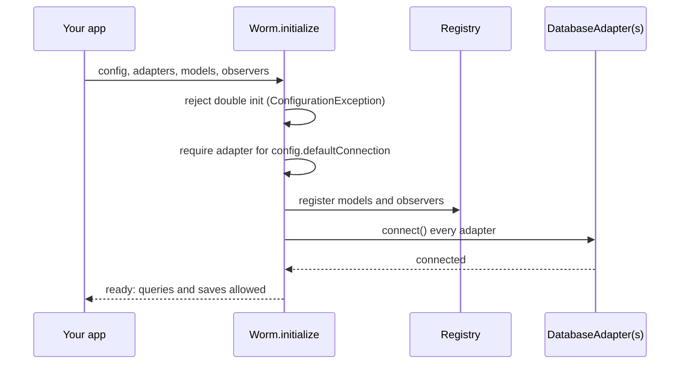

Everything worm knows about your project passes through one call: `Worm.initialize`. This page walks through that call and the objects you hand it. It builds on the [quickstart](./quickstart.md); the exhaustive field tables live in [configuration options](../reference/configuration-options.md).

## The one call

Configuration is Dart code, not YAML. You pass typed objects and your editor autocompletes them:

```dart
await Worm.initialize(
  config: const WormConfig(
    strictness: StrictnessConfig(preventSilentMassAssignment: true),
  ),
  adapters: {
    'default': InMemoryAdapter(), // swap for your driver's adapter
    'analytics': InMemoryAdapter(),
  },
  models: const [
    ModelRegistration(type: User, tableName: 'users'),
    ModelRegistration(type: Post, tableName: 'posts', connection: 'analytics'),
  ],
  observers: [UserObserver()],
);
```

Initialization must complete before any model is saved or queried. Touching the registry earlier throws a `ConfigurationException` with key `initialization`.



## Adapters and connections

The `adapters` map is keyed by connection name. There must be an entry for `config.defaultConnection` (default: `'default'`), or initialize throws `ConfigurationException` with key `adapter.missing`. Extra entries become named connections; a model targets one via `ModelRegistration(connection:)`, and [multiple connections](../database/multiple-connections.md) covers the rest.

`WormConfig.connections` holds `ConnectionConfig` entries: host, port, database, credentials, pool settings. Two things surprise people:

- **It is metadata only.** Worm core never opens a socket from it. Driver packages read the subset they need when you construct their adapter.
- **`port: 0` means "unset".** Adapters substitute their protocol default (5432 for PostgreSQL, 3306 for MySQL) when the port is 0.

## WormConfig essentials

The defaults are deliberate; you can ship `const WormConfig()` unchanged:

- Primary keys default to UUIDs (`primaryKeyType: PrimaryKeyType.uuid`).
- Timestamps are on: `created_at` and `updated_at` are written automatically (in UTC).
- `strictness` starts with every guardrail off; [strict mode](../guides/strict-mode.md) explains each flag.
- `environment` defaults to `Environment.development`.

## Models and observers

`ModelRegistration` tells the runtime about each model type: its table, primary-key column (default `'id'`), connection (default `'default'`), and morph name for polymorphic relations (defaults to the table name). A model that overrides `tableName` itself works without a registration, but registering is the norm; an unregistered model with no override throws `ConfigurationException` with key `model.tableName.missing` on first use.

The `observers` list registers `Observer<T>` instances globally. They fire on lifecycle events for their exact model type; see [lifecycle hooks and observers](../models/lifecycle-hooks-and-observers.md).

## Environments

`Worm.environment` resolves in a fixed order:

1. The `WORM_ENV` process environment variable, if it parses (case-insensitive) to `development`, `staging`, `production`, or `testing`.
2. Otherwise `WormConfig.environment`.
3. Otherwise `Environment.development`.

So `WORM_ENV=production` silently overrides whatever the config says, and an unparseable value falls through to the config. Seeders and the CLI's production force gates both key off this value. A fifth enum value, `Environment.all`, exists for seeder filtering only.

## Resetting (tests)

`Worm.reset()` rolls back any active test transaction, disconnects every adapter, clears all registries, and returns the runtime to uninitialized. Put it in `tearDown`:

```dart
tearDown(Worm.reset);
```

Calling `Worm.initialize` twice without a reset throws `ConfigurationException` with key `initialization.duplicate`.

## Gotchas

- Initialize once per process. Double init throws; use `Worm.reset()` between tests.
- The adapters map must contain the default connection name, even if you only use named connections.
- `ConnectionConfig` configures nothing by itself; the adapter you construct is what actually connects.
- `WORM_ENV` wins over `WormConfig.environment`. Check `Worm.environment` when behavior differs between machines.
- Safe before init: `Worm.strictness` (falls back to all-off defaults), `Worm.environment`, and the event-muting getters. Everything else on `Worm` throws.

## Continue reading

- [Configuration options](../reference/configuration-options.md) Every field of `WormConfig`, `ConnectionConfig`, `StrictnessConfig`, and `LogConfig`.
- [Strict mode](../guides/strict-mode.md) What each strictness flag prevents and what it throws.
- [Multiple connections](../database/multiple-connections.md) Named connections and per-model routing.
