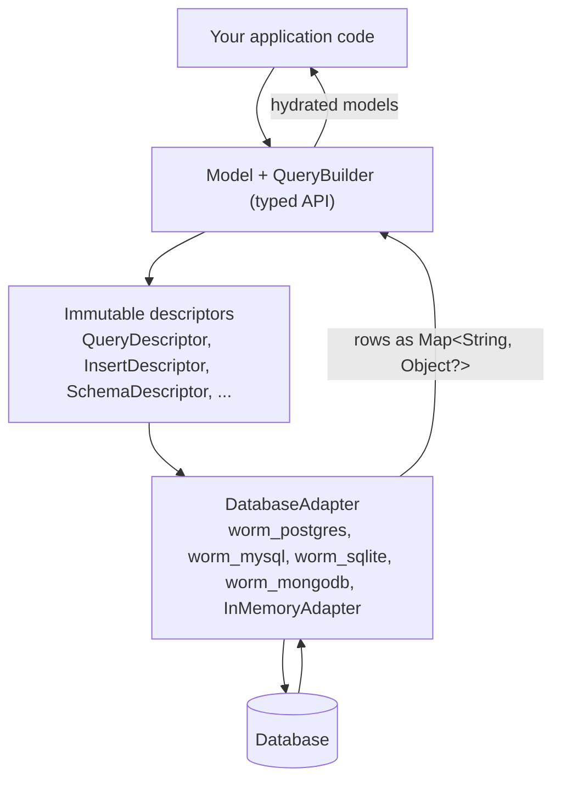

This page gives you the big picture: what worm is, the architecture every other page assumes, and which packages you actually install.

## A data layer for server-side Dart

Worm is an ORM for server-side Dart: Shelf handlers, Dart Frog routes, custom `dart:io` servers, background workers. It borrows its vocabulary from Laravel's Eloquent (models, scopes, observers, factories, seeders, soft deletes) and rebuilds it on Dart's static type system.

The headline is typed queries. Each model gets a companion class (`User$`) holding typed field constants. You write `User$.age.gte(18)`, not `"age >= 18"`. Misspell a field and the compiler catches it. Compare an `int` column to a `String` and the compiler catches that too.

Worm speaks to five backends through one API: PostgreSQL, MySQL, SQLite, MongoDB, and an in-memory adapter for tests. The `worm_sqlite` driver can also run in-process on Flutter native platforms, but that is untested territory; treat worm as a server-side tool. None of the database drivers run on the web.

## How a query travels

Worm is descriptor-first. Your typed query never turns into SQL inside the core. It compiles into an immutable, database-agnostic descriptor, and the adapter you registered translates that descriptor into its native query form.

This is the site's one big-picture drawing. Every layer has its own pages: the typed API in [query basics](../queries/query-basics.md), descriptors and adapters in [how drivers work](../drivers/how-drivers-work.md), and the full contributor deep dive in [architecture](../contributing/architecture.md).

The split buys you two things. Queries are testable as data: worm's own test suite snapshots descriptors as JSON without touching a database. And backends are swappable: the same query runs against PostgreSQL in production and the in-memory adapter in your unit tests.

## Six design principles

1. **Type safety everywhere.** No string-based field references. Columns, relations, and scopes are statically typed and IDE-completable.
2. **Expressive and declarative.** You describe what you want; models, relations, and scopes are one-line declarations.
3. **Dart-native.** camelCase, null safety, async/await, extensions. No PHP patterns forced into Dart.
4. **Performance by default.** Batched eager loading instead of N+1 queries, dirty tracking for minimal updates, streaming for large result sets.
5. **Safety and control.** Migrations are human-reviewed and never auto-applied. Seeders are environment-typed. [Strict mode](../guides/strict-mode.md) turns silent hazards into exceptions.
6. **Two persistence styles.** Active Record (`user.save()`) is the default. The data-mapper [`Repository<T>`](../models/repository-pattern.md) is opt-in.

One deliberate omission is worth knowing early: worm has no lazy loading. Reading a relation you never loaded throws instead of silently firing a query. [Eager loading](../relations/eager-loading.md) explains why.

## The package family

Seven packages live in the beak monorepo. You install two or three of them.

| Package | What it is | Install it when |
| --- | --- | --- |
| `worm` | The ORM core: models, queries, migrations, seeders, CLI, in-memory adapter | Always (regular dependency) |
| `worm_generator` | build_runner codegen emitting typed companions from annotations | You use annotation-driven codegen (dev dependency) |
| `worm_lints` | A `custom_lint` plugin with worm's coding-convention rules | You want the repo's lint rules (dev dependency) |
| `worm_sqlite` | SQLite driver (`SqliteAdapter`) | Your data lives in SQLite |
| `worm_postgres` | PostgreSQL driver (`PostgresAdapter`) with connection pooling | Your data lives in PostgreSQL |
| `worm_mysql` | MySQL driver (`MysqlAdapter`) | Your data lives in MySQL |
| `worm_mongodb` | MongoDB driver (`MongoAdapter`) | Your data lives in MongoDB |

The in-memory adapter ships inside `worm` itself, so tests need no extra package. [Choosing a database](../drivers/choosing-a-database.mdx) compares the drivers feature by feature.

## Continue reading

- [Why worm?](./why-worm.md) The naming story and what worm takes from Eloquent.
- [Installation](./installation.md) Pubspec blocks, CLI wiring, and lints.
- [Quickstart](./quickstart.md) A passing typed query in one file.
- [Choosing a database](../drivers/choosing-a-database.mdx) The driver comparison matrix.
