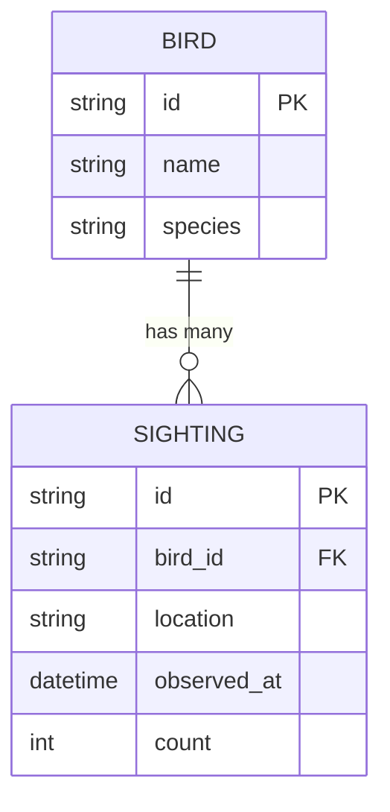

A journal of birds with no sightings is just a list. This part adds a `Sighting` model, links each sighting to a bird, and loads the two together in a single trip.

## Goal

A `sightings` table with a foreign key to `birds`, and a script that eager-loads a bird's sightings after meeting worm's rule against lazy loading.

## The shape

One bird has many sightings. One sighting belongs to one bird. The foreign key `bird_id` lives on the sighting.



## The Sighting model

Create the model. It follows the same attribute-store shape as `Bird`, and its companion adds a `ComparableField` for the date and count so you can filter on ranges later.

```dart title="lib/models/sighting.dart"
import 'package:worm/worm.dart';

import '../ids.dart';
import 'bird.dart';

/// One entry in the field journal: a bird seen somewhere, sometime.
@Table(name: 'sightings')
final class Sighting extends Model {
  /// Records a fresh sighting of [birdId] at [location].
  Sighting({
    required String birdId,
    required String location,
    required DateTime observedAt,
    required int count,
  }) {
    setAttribute('id', newId());
    setAttribute('bird_id', birdId);
    setAttribute('location', location);
    setAttribute('observed_at', observedAt.toUtc().toIso8601String());
    setAttribute('count', count);
  }

  Sighting._();

  /// Hydrates a [Sighting] from a database row.
  factory Sighting.fromRow(Map<String, Object?> row) {
    final sighting = Sighting._();
    row.forEach(sighting.hydrateAttribute);
    return sighting..markPersisted();
  }

  @override
  String get tableName => Sighting$.tableName;

  @override
  Object get id => getAttribute('id') ?? '';

  /// Foreign key back to the [Bird] that was seen.
  String get birdId => switch (getAttribute('bird_id')) {
    final String value => value,
    _ => '',
  };

  /// Where you spotted it.
  String get location => switch (getAttribute('location')) {
    final String value => value,
    _ => '',
  };

  /// When you spotted it (stored as ISO-8601 UTC text).
  DateTime get observedAt => switch (getAttribute('observed_at')) {
    final String value => DateTime.parse(value),
    final DateTime value => value,
    _ => DateTime.fromMillisecondsSinceEpoch(0),
  };

  /// How many birds were in the group.
  int get count => switch (getAttribute('count')) {
    final int value => value,
    _ => 0,
  };

  @override
  Map<String, Object?> toRow() => <String, Object?>{
    'id': id,
    'bird_id': birdId,
    'location': location,
    'observed_at': getAttribute('observed_at'),
    'count': count,
  };

  /// Starts a typed query against the `sightings` table.
  static QueryBuilder<Sighting> query() => QueryBuilder<Sighting>.from(
    QueryContext<Sighting>(
      adapter: Worm.adapter(),
      table: Sighting$.tableName,
      hydrate: Sighting.fromRow,
      relations: <String, Relation<Model, Model>>{
        'bird': BelongsToRelation<Model, Model>(
          name: 'bird',
          parentTable: Bird$.tableName,
          foreignKey: 'bird_id',
          hydrateParent: Bird.fromRow,
        ),
      },
    ),
  );
}

/// Typed column references for [Sighting] queries.
abstract final class Sighting$ {
  /// The table backing [Sighting].
  static const String tableName = 'sightings';

  /// The `bird_id` foreign-key column.
  static const StringField birdId = StringField('bird_id');

  /// The `location` column.
  static const StringField location = StringField('location');

  /// The `observed_at` column.
  static const ComparableField<DateTime> observedAt =
      ComparableField<DateTime>('observed_at');

  /// The `count` column.
  static const ComparableField<int> count = ComparableField<int>('count');

  /// The `bird` relation (`Sighting` belongs to one `Bird`).
  static const RelationField<Sighting, Bird> bird =
      RelationField<Sighting, Bird>('bird', foreignKey: 'bird_id');
}
```

## Teach Bird about its sightings

Add the inverse `HasMany` relation to `Bird`. In `lib/models/bird.dart`, add an import for the sighting model at the top:

```dart title="lib/models/bird.dart"
import 'package:worm/worm.dart';

import '../ids.dart';
import 'sighting.dart';
```

Then register the relation on the query context:

```dart title="lib/models/bird.dart"
  static QueryBuilder<Bird> query() => QueryBuilder<Bird>.from(
    QueryContext<Bird>(
      adapter: Worm.adapter(),
      table: Bird$.tableName,
      hydrate: Bird.fromRow,
      relations: <String, Relation<Model, Model>>{
        'sightings': HasManyRelation<Model, Model>(
          name: 'sightings',
          childTable: Sighting$.tableName,
          foreignKey: 'bird_id',
          hydrateChild: Sighting.fromRow,
        ),
      },
    ),
  );
```

Then add a typed reference to the companion so you can name the relation without a raw string:

```dart title="lib/models/bird.dart"
  /// The `sightings` relation (`Bird` has many `Sighting`s).
  static const RelationField<Bird, Sighting> sightings =
      RelationField<Bird, Sighting>('sightings', foreignKey: 'bird_id');
```

:::note
When you register relations by hand, the loader works with `Relation<Model, Model>`, so a loaded relation comes back as a `List<Model>`. You read it with `getRelation<List<Model>>('sightings')`. Code generation emits fully typed accessors that skip this step; see [Defining relations](../relations/defining-relations.md).
:::

## The sightings migration

Scaffold and edit the second migration. It adds the columns and a foreign key that cascades: delete a bird and its sightings go with it.

```dart title="migrations/20260702_095231_create_sightings_table.dart"
import 'package:worm/worm.dart';

/// Generated by `worm make:migration`.
final class CreateSightingsTable extends Migration {
  /// Default constructor.
  const CreateSightingsTable();

  @override
  String get name => '20260702_095231_create_sightings_table';

  @override
  Future<void> upSchema(Schema schema) async {
    await schema.create('sightings', (table) {
      table.idUuid();
      table.string('bird_id');
      table.string('location');
      table.dateTime('observed_at');
      table.integer('count');
      table.timestamps();
      table.foreign(
        column: 'bird_id',
        references: 'id',
        onTable: 'birds',
        onDelete: OnDelete.cascade,
      );
    });
  }

  @override
  Future<void> downSchema(Schema schema) async {
    await schema.drop('sightings', ifExists: true);
  }
}
```

Register it after the birds migration in `bin/nestwatch.dart`:

```dart title="bin/nestwatch.dart"
    migrations: const <Migration>[
      CreateBirdsTable(),
      CreateSightingsTable(),
    ],
```

Add the matching import at the top, then apply it:

```bash
dart run nestwatch migrate
```

```text
migrated  20260702_095231_create_sightings_table
```

## Eager-load the relationship

Worm never lazy-loads a relation. Read one before you load it and it throws, so an accidental N+1 query is impossible to write by mistake. Prove it, then do it right:

```dart title="bin/log_sighting.dart"
import 'package:nestwatch/models/bird.dart';
import 'package:nestwatch/models/sighting.dart';
import 'package:nestwatch/nestwatch.dart';
import 'package:worm/worm.dart';

Future<void> main() async {
  await bootNestwatch();

  // Grab any bird already on file.
  final bird = await Bird.query().firstOrFail();

  // Record a sighting for it.
  await Sighting(
    birdId: bird.id.toString(),
    location: 'Oak by the pond',
    observedAt: DateTime.utc(2026, 6, 14, 7, 30),
    count: 2,
  ).save();

  // Reading the relation before loading it throws.
  final unloaded = await Bird.query().findOrFail(bird.id);
  try {
    unloaded.getRelation<List<Model>>('sightings');
  } on RelationNotLoadedException {
    print('As expected: sightings were not eagerly loaded.');
  }

  // Ask for the relation up front, then read it.
  final loaded = await Bird.query()
      .withRelations(<RelationField<Model, Model>>[Bird$.sightings])
      .findOrFail(bird.id);
  final sightings = loaded.getRelation<List<Model>>('sightings') ?? const [];
  print(
    '${loaded.name} the ${loaded.species} has '
    '${sightings.length} sighting(s).',
  );
}
```

## Checkpoint

```bash
dart run bin/log_sighting.dart
```

```text
As expected: sightings were not eagerly loaded.
Rosie the Robin has 1 sighting(s).
```

## What just happened

The first read threw `RelationNotLoadedException` because you never asked for the sightings. The second read passed `withRelations([Bird$.sightings])`, so worm ran one extra query with a `WHERE bird_id IN (...)` clause and attached the results to the bird. One bird, one relation, two queries total, no matter how many birds you load.

## Continue reading

- [Part 4: Seeding a fake flock](./04-seeding-a-fake-flock.md)
- [Defining relations](../relations/defining-relations.md)
- [Eager loading](../relations/eager-loading.md)
